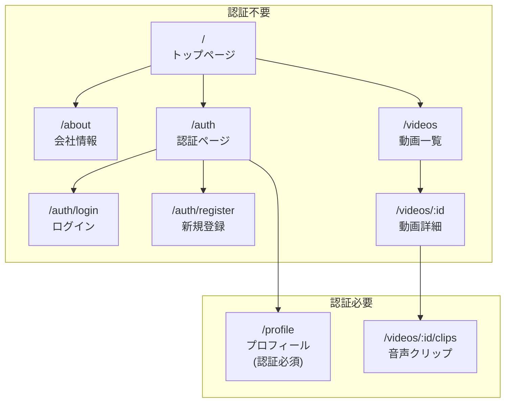

# Webアプリケーション

このディレクトリには、suzumina.clickのフロントエンドアプリケーションが含まれています。Next.jsを使用したフロントエンドで、App Routerパターンを採用しています。

## ディレクトリ構成

```
apps/web/
├── public/              # 静的ファイル
├── src/                 # ソースコード
│   ├── actions/         # サーバーアクション
│   ├── app/             # ページコンポーネント (App Router)
│   │   ├── (authenticated)/ # 認証が必要なルート
│   │   ├── _components/ # ページ専用共通コンポーネント
│   │   ├── about/       # 会社情報ページ
│   │   ├── auth/        # 認証関連ページ
│   │   ├── profile/     # ユーザープロフィールページ
│   │   ├── videos/      # 動画関連ページ
│   │   ├── favicon.ico  # ファビコン
│   │   ├── globals.css  # グローバルスタイル
│   │   ├── layout.tsx   # ルートレイアウト
│   │   └── page.tsx     # トップページ
│   ├── components/      # 再利用可能なコンポーネント
│   │   ├── audioclips/  # 音声クリップ関連コンポーネント
│   │   ├── layout/      # レイアウト関連コンポーネント
│   │   ├── ui/          # UI汎用コンポーネント
│   │   └── videos/      # 動画関連コンポーネント
│   ├── hooks/           # カスタムReactフック
│   ├── lib/             # ライブラリ・設定
│   └── utils/           # ユーティリティ関数
├── Dockerfile           # コンテナ設定
├── cloud-run-service.yaml # Cloud Run設定
├── next.config.ts       # Next.js設定
├── package.json         # 依存関係
├── tsconfig.json        # TypeScript設定
└── vitest.config.ts     # テスト設定
```

## 画面遷移図



## 主要な機能

- **ユーザー認証**: Discord認証を使用したログイン/登録機能
- **動画一覧表示**: 投稿された動画の一覧表示と検索
- **動画詳細表示**: 個別動画の詳細情報と再生
- **音声クリップ**: 動画から音声セグメントの切り出し機能
- **プロフィール管理**: ユーザー情報の閲覧と編集

## 開発手順

1. 依存パッケージのインストール:
   ```
   pnpm install
   ```

2. ローカル開発サーバーの起動:
   ```
   pnpm dev
   ```

3. ビルド:
   ```
   pnpm build
   ```

4. テスト実行:
   ```
   pnpm test
   ```

## デプロイメント

Cloud Runへのデプロイはterraformディレクトリ内の設定を使用して行われます。
詳細は `/docs/DEPLOYMENT.md` を参照してください。