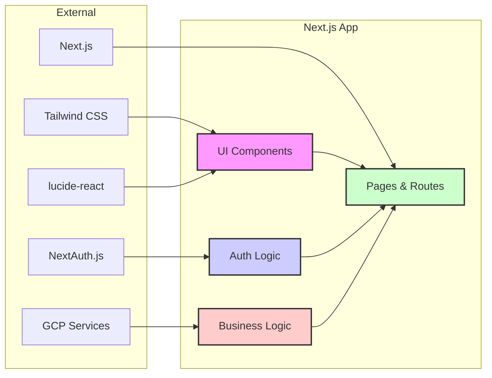

# アーキテクチャ設計: Next.js アプリケーション構造

## 目的

コンポーネントとビジネスロジックの分離を通じて、保守性、再利用性、スケーラビリティを向上させる。

## 現状の構成要素

* **`apps/web`**: Next.js ウェブアプリケーション
  * `src/components`: 再利用可能なUIコンポーネント
  * `src/app`: ページとルーティング
  * `src/auth`: 認証関連のロジック

## 分離すべき関心事

1. **プレゼンテーション vs アプリケーションロジック:**
    * `src/components` は UI 要素の見た目と基本的な振る舞いに責任を持つ（プレゼンテーション層）。
    * `src/app` と `src/auth` はアプリケーション固有の機能、データフロー、状態、ビジネスロジックに責任を持つ（アプリケーション層）。
2. **汎用性 vs アプリケーション固有性:**
    * 基本的なUIコンポーネントは可能な限り汎用的で再利用可能に設計。
    * アプリケーションロジックは `suzumina.click` 固有の要件を扱う。
3. **スタイリング:**
    * Tailwind CSS をベースとしたスタイリング。
    * コンポーネントごとにスタイルをカプセル化。
4. **依存関係:**
    * UIコンポーネントは最小限の依存関係を持つ。
    * アプリケーションロジックは必要な依存関係を持つ。

## 設計方針

1. **UIコンポーネント (`src/components`):**
    * **責務:**
        * シンプルな標準HTMLベースのコンポーネントの提供。
        * UI関連のカスタムフック、ユーティリティの提供。
        * Tailwind CSSを利用したスタイリング。
    * **原則:** アプリケーションの状態やビジネスロジックに依存しない。Props 経由でデータを受け取り、コールバックを実行する。
    * **依存関係:** React, スタイリング関連 (clsx, tailwind-merge) に限定。

2. **アプリケーション層 (`src/app`, `src/auth`):**
    * **責務:**
        * アプリケーション固有の機能、ビジネスロジック、データフロー、状態管理。
        * ページルーティング、データフェッチ、認証 (NextAuth, GCP)。
        * UIコンポーネントを組み合わせてページを構築。
        * アイコンのレンダリング (`lucide-react` を直接利用)。
    * **原則:** アプリケーションの文脈に沿った実装を行う。
    * **依存関係:** Next.js, NextAuth, GCP クライアント, `lucide-react` など。

3. **アイコンの扱い:**
    * `lucide-react` を直接利用。

4. **状態管理:**
    * UI固有の状態はコンポーネント内で管理。
    * アプリケーション全体の状態は適切なコンテキストで管理。

## 構成図

## テスト戦略

1. **UIコンポーネント:**
    * 単体テスト: コンポーネントの振る舞いとレンダリング
    * スナップショットテスト: 視覚的な変更の検知

2. **アプリケーションロジック:**
    * 単体テスト: ビジネスロジックとユーティリティ
    * 統合テスト: 認証フローとデータフロー

## デプロイメント

* Vercel プラットフォームを使用
* 本番環境とプレビュー環境の自動デプロイ
* GitHub Actions による CI/CD パイプライン

最終更新日: 2025年4月9日
