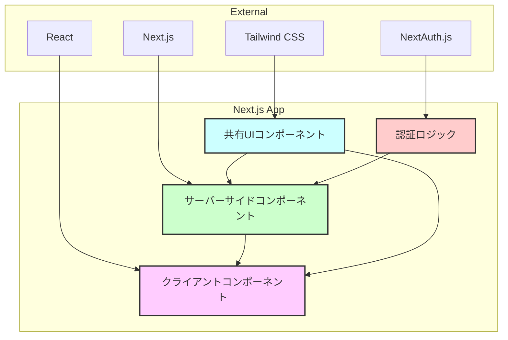

# アーキテクチャ設計: Next.js アプリケーション構造

## 目的

コードの保守性、再利用性、パフォーマンスを最大化するため、以下の原則に従う：

- サーバーサイドレンダリングの活用
- コロケーションによる関連コードの近接配置
- 明確な責務の分離

## 現状の構成要素

- **`apps/web`**: Next.js ウェブアプリケーション
  - `src/app`: ページ、ルーティング、およびページ固有のコンポーネント
  - `src/components`: 共有UIコンポーネント
  - `src/auth`: 認証関連のロジック

## コアとなる設計原則

1. **サーバーサイドファースト:**
    - `page.tsx`と`layout.tsx`は原則としてサーバーサイドコンポーネント
    - クライアントコンポーネントは対話性が必要な部分のみに限定
    - データフェッチはサーバーサイドで実行

2. **コロケーション:**
    - 関連するコードは物理的に近接して配置
    - ページ固有のコンポーネントは該当ページのディレクトリ内に配置
    - 共有コンポーネントのみ`components`ディレクトリに配置

3. **インサイドアウトアプローチ:**
    - 最小単位のコンポーネントから構築を開始
    - 必要に応じて段階的に複雑性を追加
    - コンポーネントの責務を明確に定義

## 実装の指針

1. **ページとレイアウト (`src/app`):**
    - **責務:**
        - ルーティング構造の定義
        - データフェッチとサーバーサイドレンダリング
        - ページ固有のコンポーネントの配置
    - **原則:**
        - サーバーサイドコンポーネントをデフォルトとする
        - データフェッチは該当ページのディレクトリ内で実行
        - クライアントコンポーネントは'use client'ディレクティブで明示

2. **共有コンポーネント (`src/components`):**
    - **責務:**
        - 複数のページで使用される再利用可能なUI要素の提供
        - アプリケーション全体で共通のUIパターンの実装
    - **原則:**
        - 最小限の依存関係
        - 明確なインターフェース定義
        - サーバー/クライアントの適切な使い分け

3. **認証システム (`src/auth`):**
    - **責務:**
        - 認証フローの管理
        - ユーザーセッションの処理
        - 権限チェックとアクセス制御
    - **原則:**
        - セキュリティを最優先
        - エラーハンドリングの徹底
        - サーバーサイドでの処理を優先

## ディレクトリ構造の例

```
src/
├── app/
│   ├── layout.tsx              # ルートレイアウト (サーバー)
│   ├── page.tsx               # トップページ (サーバー)
│   └── dashboard/
│       ├── layout.tsx         # ダッシュボードレイアウト (サーバー)
│       ├── page.tsx          # ダッシュボードページ (サーバー)
│       └── components/       # ページ固有のコンポーネント
│           ├── UserStats.tsx
│           └── ActivityLog.tsx
├── components/               # 共有コンポーネント
│   ├── ui/                  # 基本UIコンポーネント
│   └── shared/             # 複合的な共有コンポーネント
└── auth/                   # 認証関連のコード
```

## 構成図



## テスト戦略

1. **サーバーサイドコンポーネント:**
    - 単体テスト: レンダリング結果とデータフェッチ
    - 統合テスト: データフローとレンダリングパイプライン

2. **クライアントコンポーネント:**
    - 単体テスト: インタラクションとステート管理
    - E2Eテスト: ユーザーフロー

3. **共有コンポーネント:**
    - 単体テスト: レンダリングとプロップス検証
    - スナップショットテスト: 視覚的一貫性

## デプロイメント

- Vercel プラットフォームを使用
- エッジランタイムの活用
- 自動デプロイとプレビュー環境
- GitHub Actions による CI/CD

最終更新日: 2025年4月12日
