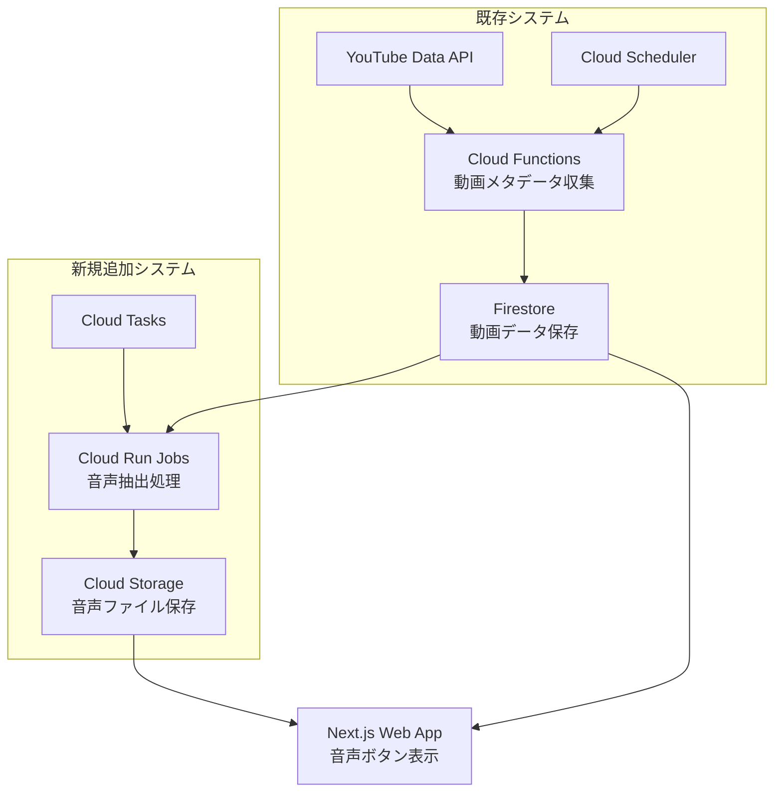

# 音声ボタン機能 設計ドキュメント

## 概要

suzumina.clickプロジェクトに音声ボタン機能を追加するための設計ドキュメントです。許諾済みYouTube動画から音声を抽出し、Google Cloud Storageに保存してWeb上で再生可能にします。

## 目次

1. [技術要件分析](#技術要件分析)
2. [アーキテクチャ設計](#アーキテクチャ設計)
3. [データ構造設計](#データ構造設計)
4. [ワークフロー設計](#ワークフロー設計)
5. [実装フェーズ](#実装フェーズ)
6. [セキュリティ・コンプライアンス](#セキュリティコンプライアンス)

## 技術要件分析

### Cloud Functions制約と代替案

#### 現在のCloud Functions制約
- **メモリ**: 最大32GB
- **実行時間**: 30分（長時間動画処理には不十分）
- **アップロードサイズ**: 10MBデプロイパッケージ制限
- **FFmpeg**: 依存関係管理が複雑

#### 推奨代替サービス比較

| サービス | メモリ | 実行時間 | 依存関係 | 適用度 |
|---------|--------|----------|----------|--------|
| **Cloud Run Jobs** | 32GB | 24時間 | Docker対応 | ✅ **最推奨** |
| App Engine Flex | カスタム | 制限なし | カスタム | ✅ 推奨 |
| Cloud Run Services | 32GB | 60分 | Docker対応 | △ 条件付き |

**結論**: Cloud Run Jobsを採用

### 音声処理技術スタック

#### 選定技術
- **音声抽出**: `yt-dlp` + `FFmpeg`
- **コンテナ**: Docker（依存関係を含む環境）
- **プログラミング言語**: Python（yt-dlp最適化）

#### 音声フォーマット戦略

| フォーマット | ビットレート | 用途 | ブラウザサポート |
|-------------|-------------|------|------------------|
| **Opus** | 128kbps | プライマリ | 現代ブラウザ全般 |
| **AAC** | 128kbps | フォールバック | 全ブラウザ対応 |
| OGG Vorbis | 128kbps | 代替案 | Chrome/Firefox |

**採用方針**: Opus優先、AAC代替の2フォーマット体制

## アーキテクチャ設計

### システム全体構成



### データフロー詳細

#### 1. 動画メタデータ収集（既存）
```
Cloud Scheduler → Cloud Functions → YouTube API → Firestore
```

#### 2. 音声抽出処理（新規）
```
Firestore → Cloud Tasks → Cloud Run Jobs → yt-dlp/FFmpeg → Cloud Storage → Firestore更新
```

#### 3. フロントエンド表示（拡張）
```
Next.js → Firestore（音声ボタンメタデータ）→ Cloud Storage（音声ファイル）→ HTML Audio Element
```

### インフラ構成

#### Cloud Storage バケット設計
```
bucket: suzumina-click-audio-files
├── videos/
│   ├── {videoId}/
│   │   ├── buttons/
│   │   │   ├── {buttonId}.opus
│   │   │   ├── {buttonId}.aac
│   │   │   └── metadata.json
│   │   └── raw/
│   │       └── full_audio.opus
```

#### Cloud Run Jobs設定
- **CPU**: 4 vCPU
- **メモリ**: 16GB
- **実行時間**: 6時間
- **同時実行数**: 3（リソース管理）
- **環境変数**: 
  - `GOOGLE_CLOUD_PROJECT`
  - `AUDIO_BUCKET_NAME`
  - `FIRESTORE_COLLECTION`

## データ構造設計

### 音声ボタンデータ型

#### Zodスキーマ定義
```typescript
// packages/shared-types/src/audio.ts (新規作成)

export const AudioButtonSchema = z.object({
  id: z.string().min(1),
  title: z.string().min(1),
  startTime: z.number().min(0), // 秒
  endTime: z.number().min(0),   // 秒
  audioFiles: z.object({
    opus: z.object({
      url: z.string().url(),
      fileSize: z.number().positive(),
      bitrate: z.number().positive(),
    }),
    aac: z.object({
      url: z.string().url(), 
      fileSize: z.number().positive(),
      bitrate: z.number().positive(),
    }),
  }),
  createdAt: z.string().datetime(),
  updatedAt: z.string().datetime(),
});

export type AudioButton = z.infer<typeof AudioButtonSchema>;
```

#### 既存VideoSchema拡張
```typescript
// packages/shared-types/src/video.ts への追加

export const FirestoreVideoSchemaExtended = FirestoreVideoSchema.extend({
  // 音声ボタン関連フィールド
  audioButtons: z.array(AudioButtonSchema).optional(),
  audioProcessingStatus: z.enum([
    'pending',      // 処理待ち
    'processing',   // 処理中
    'completed',    // 完了
    'failed',       // 失敗
    'skipped'       // スキップ（音声抽出対象外）
  ]).optional(),
  audioProcessingUpdatedAt: z.string().datetime().optional(),
});
```

### Firestore コレクション構造

#### 音声ボタンメタデータ
```
collection: audioButtons
document: {videoId}_{buttonId}
{
  videoId: string,
  buttonId: string,
  title: string,
  startTime: number,
  endTime: number,
  audioFiles: {
    opus: { url, fileSize, bitrate },
    aac: { url, fileSize, bitrate }
  },
  createdAt: Timestamp,
  updatedAt: Timestamp
}
```

#### 音声処理ジョブ
```
collection: audioProcessingJobs
document: {jobId}
{
  videoId: string,
  status: 'queued' | 'running' | 'completed' | 'failed',
  createdAt: Timestamp,
  startedAt?: Timestamp,
  completedAt?: Timestamp,
  errorMessage?: string,
  buttonsCreated: number,
  cloudRunJobName?: string
}
```

## ワークフロー設計

### Phase 1: 音声抽出基盤構築

#### 1.1 Cloud Run Jobs実装
```python
# Cloud Run Jobs: audio-processor
# ファイル: /apps/audio-processor/main.py

import os
import json
from google.cloud import firestore, storage
import yt_dlp
import subprocess

class AudioProcessor:
    def __init__(self):
        self.firestore_client = firestore.Client()
        self.storage_client = storage.Client()
        self.bucket = self.storage_client.bucket(os.environ['AUDIO_BUCKET_NAME'])
    
    def process_video(self, video_id: str):
        """動画から音声を抽出して音声ボタンを作成"""
        # 1. Firestoreから動画メタデータ取得
        # 2. yt-dlpで音声ダウンロード
        # 3. FFmpegでセグメント切り出し
        # 4. Opus/AAC形式で変換
        # 5. Cloud Storageにアップロード
        # 6. Firestoreメタデータ更新
        pass
```

#### 1.2 Cloud Tasks統合
```typescript
// apps/functions/src/audio-queue.ts (新規)

import { CloudTasksClient } from '@google-cloud/tasks';

export async function queueAudioProcessing(videoId: string) {
  const client = new CloudTasksClient();
  const project = process.env.GOOGLE_CLOUD_PROJECT;
  const queue = 'audio-processing-queue';
  const location = 'us-central1';
  
  const task = {
    httpRequest: {
      httpMethod: 'POST' as const,
      url: `https://audio-processor-${project}.a.run.app/process`,
      body: Buffer.from(JSON.stringify({ videoId })),
      headers: {
        'Content-Type': 'application/json',
      },
    },
  };
  
  await client.createTask({
    parent: client.queuePath(project, location, queue),
    task,
  });
}
```

### Phase 2: フロントエンド統合

#### 2.1 音声ボタンUIコンポーネント
```tsx
// packages/ui/src/components/audio-button.tsx (新規)

import { AudioButton } from '@suzumina.click/shared-types';

interface AudioButtonProps {
  button: AudioButton;
  className?: string;
}

export function AudioButtonComponent({ button, className }: AudioButtonProps) {
  const [isPlaying, setIsPlaying] = useState(false);
  const audioRef = useRef<HTMLAudioElement>(null);

  const handlePlay = async () => {
    if (!audioRef.current) return;
    
    try {
      if (isPlaying) {
        audioRef.current.pause();
      } else {
        await audioRef.current.play();
      }
    } catch (error) {
      console.error('音声再生エラー:', error);
    }
  };

  return (
    <div className={`audio-button ${className}`}>
      <audio
        ref={audioRef}
        onPlay={() => setIsPlaying(true)}
        onPause={() => setIsPlaying(false)}
        onEnded={() => setIsPlaying(false)}
      >
        <source src={button.audioFiles.opus.url} type="audio/opus" />
        <source src={button.audioFiles.aac.url} type="audio/aac" />
      </audio>
      
      <button
        onClick={handlePlay}
        className="btn btn-primary"
        disabled={!button.audioFiles}
      >
        {isPlaying ? '⏸️' : '▶️'} {button.title}
      </button>
    </div>
  );
}
```

#### 2.2 動画詳細ページ拡張
```tsx
// apps/web/src/app/videos/[videoId]/page.tsx (新規)

import { AudioButtonComponent } from '@suzumina.click/ui';

export default async function VideoDetailPage({ 
  params 
}: { 
  params: { videoId: string } 
}) {
  const video = await getVideoWithAudioButtons(params.videoId);
  
  return (
    <div className="video-detail">
      <VideoInfo video={video} />
      
      {video.audioButtons && video.audioButtons.length > 0 && (
        <section className="audio-buttons">
          <h2>音声ボタン</h2>
          <div className="audio-buttons-grid">
            {video.audioButtons.map((button) => (
              <AudioButtonComponent
                key={button.id}
                button={button}
                className="audio-button-card"
              />
            ))}
          </div>
        </section>
      )}
    </div>
  );
}
```

### Phase 3: 自動処理パイプライン

#### 3.1 既存YouTube Data収集との統合
```typescript
// apps/functions/src/youtube.ts への追加

import { queueAudioProcessing } from './audio-queue';

export async function processNewVideos() {
  // 既存のYouTube API処理
  const newVideos = await fetchLatestVideos();
  
  for (const video of newVideos) {
    // Firestoreに保存（既存処理）
    await saveVideoToFirestore(video);
    
    // 音声処理キューに追加（新規）
    await queueAudioProcessing(video.videoId);
  }
}
```

#### 3.2 音声ボタン自動生成ロジック
```python
# Cloud Run Jobs内の音声ボタン生成ロジック

def generate_audio_buttons(video_id: str, audio_file_path: str):
    """動画の音声から自動的に音声ボタンを生成"""
    
    # 1. 音声解析（音量・無音区間検出）
    silence_segments = detect_silence(audio_file_path)
    
    # 2. 発話区間の抽出
    speech_segments = extract_speech_segments(audio_file_path, silence_segments)
    
    # 3. 短時間セグメント（1-10秒）をボタン候補として抽出
    button_candidates = filter_button_candidates(speech_segments)
    
    # 4. 各候補に対してボタンを生成
    buttons = []
    for i, segment in enumerate(button_candidates[:20]):  # 最大20個
        button = create_audio_button(
            video_id=video_id,
            segment=segment,
            title=f"音声ボタン{i+1}",
            start_time=segment.start,
            end_time=segment.end
        )
        buttons.append(button)
    
    return buttons
```

## 実装フェーズ

### Phase 1: 基盤構築（4週間）
- [ ] Cloud Run Jobs環境構築
- [ ] yt-dlp + FFmpeg Dockerイメージ作成
- [ ] Cloud Storage バケット設定
- [ ] 音声処理基本機能実装
- [ ] Cloud Tasks キュー設定

### Phase 2: データ統合（3週間）
- [ ] 音声ボタンスキーマをshared-typesに追加
- [ ] Firestore コレクション設計実装
- [ ] 既存動画データとの統合テスト
- [ ] エラーハンドリング・リトライ機能

### Phase 3: フロントエンド実装（3週間）
- [ ] 音声ボタンUIコンポーネント作成
- [ ] 動画詳細ページ実装
- [ ] 音声再生機能とブラウザ互換性対応
- [ ] レスポンシブデザイン対応

### Phase 4: 統合・最適化（2週間）
- [ ] 自動処理パイプライン統合
- [ ] パフォーマンス最適化
- [ ] 総合テスト
- [ ] 本番デプロイ準備

## セキュリティ・コンプライアンス

### YouTube利用規約への対応
- **個人使用範囲**: ファンサイトとしての非商用利用
- **音声抽出制限**: 短時間セグメント（1-10秒）のみ
- **著作権配慮**: 許諾済み動画のみ対象

### アクセス制御
- **Cloud Storage**: 署名付きURL（1時間有効期限）
- **Firestore**: Security Rulesによるアクセス制限
- **IAM**: 最小権限の原則

### プライバシー保護
- **データ保持期間**: 音声ファイル1年間（自動削除）
- **個人情報**: 不使用
- **利用統計**: 匿名化

## 運用・監視

### モニタリング指標
- 音声処理成功率
- 処理時間（動画あたり）
- Cloud Storage使用容量
- 音声ボタン再生回数

### アラート設定
- 処理失敗率 > 10%
- キュー滞留時間 > 6時間
- ストレージ使用量 > 80%

### コスト最適化
- **Cloud Run Jobs**: 処理完了後の自動スケールダウン
- **Cloud Storage**: Nearline/Coldlineへの自動移行
- **音声品質**: ビットレート調整による容量最適化

---

このドキュメントは音声ボタン機能の基本設計を示しています。実装開始前に詳細な技術検証と承認プロセスを経て、段階的に開発を進めることを推奨します。