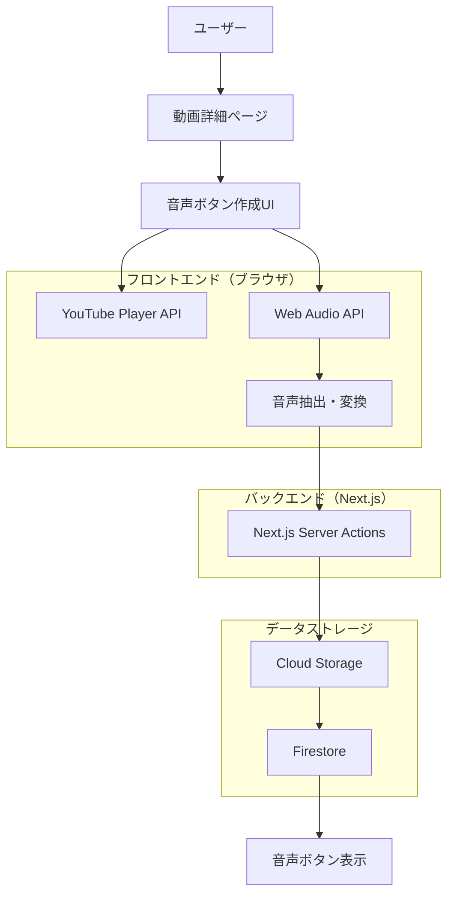

# 音声ボタン機能 設計ドキュメント（ユーザー作成方式）

## 概要

suzumina.clickプロジェクトに音声ボタン機能を追加するための設計ドキュメントです。**ユーザーが動画を見ながら手動で音声区間を指定**し、リアルタイムで音声ボタンを作成できるシンプルなシステムを構築します。

## 目次

1. [設計思想](#設計思想)
2. [アーキテクチャ設計](#アーキテクチャ設計)
3. [UI/UX設計](#uiux設計)
4. [技術実装](#技術実装)
5. [データ構造設計](#データ構造設計)
6. [実装フェーズ](#実装フェーズ)
7. [セキュリティ・コンプライアンス](#セキュリティコンプライアンス)

## 設計思想

### **ユーザー中心設計**
- **自動処理の問題点**: AIによる自動セグメンテーションは精度が不安定
- **ユーザー作成の利点**: 最適な音声区間をユーザー自身が選択
- **インタラクティブ体験**: 動画を見ながらリアルタイムで作成

### **シンプルさの追求**
- **複雑なインフラ不要**: Cloud Run Jobs、Python処理を排除
- **ブラウザベース処理**: Web Audio APIを活用
- **即座のフィードバック**: 作成→プレビュー→保存の流れ

## アーキテクチャ設計

### システム全体構成



### データフロー

#### 1. 音声ボタン作成フロー
```
ユーザー操作 → YouTube Player → 時間範囲選択 → Web Audio API → 
音声抽出 → Opus/AAC変換 → Server Actions → Cloud Storage → 
Firestore保存 → UI更新
```

#### 2. 音声ボタン再生フロー
```
ページ表示 → Firestore読み込み → 音声ボタン一覧表示 → 
ユーザークリック → Cloud Storage音声ファイル → ブラウザ再生
```

### 技術スタック

| 分野 | 技術 | 用途 |
|------|------|------|
| **フロントエンド** | Next.js 15 + React 19 | UI・ユーザー操作 |
| **音声処理** | Web Audio API | ブラウザ内音声抽出 |
| **動画再生** | YouTube Player API | 動画表示・時間制御 |
| **サーバー処理** | Next.js Server Actions | ファイルアップロード |
| **ストレージ** | Cloud Storage | 音声ファイル保存 |
| **データベース** | Firestore | メタデータ管理 |
| **音声形式** | Opus (主) + AAC (代替) | ブラウザ互換性 |

## UI/UX設計

### 音声ボタン作成インターフェース

#### **レイアウト構成**
```
┌─────────────────────────────────────┐
│         YouTube動画プレイヤー         │
├─────────────────────────────────────┤
│ 開始時間: [======|=============] 3:45 │
│ 終了時間: [==========|==========] 3:52 │
│ 長さ: 7秒                           │
├─────────────────────────────────────┤
│ タイトル: [音声ボタンのタイトル_____] │
│ [プレビュー] [作成] [キャンセル]      │
├─────────────────────────────────────┤
│           作成済み音声ボタン          │
│ [▶️ こんにちは] [▶️ ありがとう]      │
└─────────────────────────────────────┘
```

#### **操作フロー**
1. **動画再生**: YouTube動画を表示・再生
2. **時間選択**: スライダーで開始・終了時間を指定
3. **プレビュー**: 選択区間の音声をその場で確認
4. **タイトル入力**: 音声ボタンの名前を入力
5. **作成**: 音声ボタンを生成・保存
6. **表示**: 作成した音声ボタンが即座に表示

### UIコンポーネント設計

#### **1. AudioButtonCreator（作成UI）**
```tsx
interface AudioButtonCreatorProps {
  videoId: string;
  videoDuration: number;
  onButtonCreated: (button: AudioButton) => void;
}

// 主要機能
- YouTube Player統合
- タイムライン選択（開始/終了時間）
- リアルタイムプレビュー
- タイトル入力
- 作成/キャンセルボタン
```

#### **2. AudioButtonPlayer（再生UI）**
```tsx
interface AudioButtonPlayerProps {
  button: AudioButton;
  size?: 'small' | 'medium' | 'large';
}

// 主要機能
- 再生/一時停止ボタン
- 再生状態表示
- タイトル表示
- 再生回数表示（オプション）
```

#### **3. AudioButtonList（一覧表示）**
```tsx
interface AudioButtonListProps {
  videoId: string;
  buttons: AudioButton[];
  allowEdit?: boolean;
}

// 主要機能
- 音声ボタン一覧表示
- グリッドレイアウト
- 編集・削除機能（作成者のみ）
```

## 技術実装

### Web Audio API実装

#### **音声抽出処理**
```typescript
// apps/web/src/lib/audio-extractor.ts

export class AudioExtractor {
  private audioContext: AudioContext;
  
  constructor() {
    this.audioContext = new AudioContext();
  }
  
  async extractAudioSegment(
    videoElement: HTMLVideoElement,
    startTime: number,
    endTime: number
  ): Promise<{ opus: Blob; aac: Blob }> {
    // 1. MediaElementAudioSourceNodeを作成
    const source = this.audioContext.createMediaElementSource(videoElement);
    
    // 2. 指定時間範囲の音声を録音
    const recorder = new MediaRecorder(source.stream);
    const audioChunks: BlobPart[] = [];
    
    recorder.ondataavailable = (event) => {
      audioChunks.push(event.data);
    };
    
    // 3. 録音開始・停止
    videoElement.currentTime = startTime;
    recorder.start();
    
    await new Promise(resolve => {
      setTimeout(() => {
        recorder.stop();
        resolve(void 0);
      }, (endTime - startTime) * 1000);
    });
    
    // 4. 音声形式変換
    const rawAudio = new Blob(audioChunks, { type: 'audio/webm' });
    const opus = await this.convertToOpus(rawAudio);
    const aac = await this.convertToAAC(rawAudio);
    
    return { opus, aac };
  }
  
  private async convertToOpus(audio: Blob): Promise<Blob> {
    // WebCodecs APIまたはFFmpeg.wasmを使用
    // 実装詳細は後述
  }
  
  private async convertToAAC(audio: Blob): Promise<Blob> {
    // WebCodecs APIまたはFFmpeg.wasmを使用
    // 実装詳細は後述
  }
}
```

#### **Server Actions実装**
```typescript
// apps/web/src/app/videos/[videoId]/actions.ts

export async function createAudioButton(formData: FormData) {
  const videoId = formData.get('videoId') as string;
  const title = formData.get('title') as string;
  const startTime = Number(formData.get('startTime'));
  const endTime = Number(formData.get('endTime'));
  const opusFile = formData.get('opusFile') as File;
  const aacFile = formData.get('aacFile') as File;
  
  // 1. Cloud Storageにアップロード
  const opusUrl = await uploadToStorage(opusFile, `audio-buttons/${videoId}/${Date.now()}.opus`);
  const aacUrl = await uploadToStorage(aacFile, `audio-buttons/${videoId}/${Date.now()}.aac`);
  
  // 2. Firestoreに保存
  const buttonData: AudioButton = {
    id: generateId(),
    videoId,
    title,
    startTime,
    endTime,
    duration: endTime - startTime,
    audioFiles: {
      opus: { url: opusUrl, fileSize: opusFile.size, bitrate: 128 },
      aac: { url: aacUrl, fileSize: aacFile.size, bitrate: 128 }
    },
    createdBy: 'user',
    createdAt: new Date().toISOString(),
    updatedAt: new Date().toISOString(),
  };
  
  await saveAudioButtonToFirestore(buttonData);
  
  return { success: true, button: buttonData };
}
```

### YouTube Player統合

#### **React YouTubeプレイヤー**
```tsx
// apps/web/src/components/YouTubePlayer.tsx

import { useState, useRef } from 'react';

interface YouTubePlayerProps {
  videoId: string;
  onTimeUpdate?: (currentTime: number) => void;
  onDurationChange?: (duration: number) => void;
}

export function YouTubePlayer({ videoId, onTimeUpdate, onDurationChange }: YouTubePlayerProps) {
  const playerRef = useRef<any>(null);
  const [isReady, setIsReady] = useState(false);
  
  const onPlayerReady = (event: any) => {
    playerRef.current = event.target;
    setIsReady(true);
    onDurationChange?.(event.target.getDuration());
  };
  
  const onPlayerStateChange = (event: any) => {
    if (event.data === 1) { // Playing
      const updateTime = () => {
        if (playerRef.current) {
          onTimeUpdate?.(playerRef.current.getCurrentTime());
          requestAnimationFrame(updateTime);
        }
      };
      updateTime();
    }
  };
  
  return (
    <div className="youtube-player">
      <YouTube
        videoId={videoId}
        onReady={onPlayerReady}
        onStateChange={onPlayerStateChange}
        opts={{
          width: '100%',
          height: '400',
          playerVars: {
            autoplay: 0,
            controls: 1,
            modestbranding: 1,
          },
        }}
      />
    </div>
  );
}
```

## データ構造設計

### 音声ボタンデータ型

#### **Zodスキーマ定義**
```typescript
// packages/shared-types/src/audio-button.ts (新規作成)

export const AudioButtonSchema = z.object({
  id: z.string().min(1),
  videoId: z.string().min(1),
  title: z.string().min(1).max(100),
  startTime: z.number().min(0),
  endTime: z.number().min(0),
  duration: z.number().positive().max(30), // 最大30秒
  audioFiles: z.object({
    opus: z.object({
      url: z.string().url(),
      fileSize: z.number().positive(),
      bitrate: z.number().positive(),
    }),
    aac: z.object({
      url: z.string().url(),
      fileSize: z.number().positive(),
      bitrate: z.number().positive(),
    }),
  }),
  createdBy: z.enum(['user', 'system']),
  createdAt: z.string().datetime(),
  updatedAt: z.string().datetime(),
  playCount: z.number().default(0),
  tags: z.array(z.string()).optional(),
});

export type AudioButton = z.infer<typeof AudioButtonSchema>;

// フロントエンド表示用型
export const FrontendAudioButtonSchema = AudioButtonSchema.omit({
  createdAt: true,
  updatedAt: true,
}).extend({
  createdAt: z.date(),
  updatedAt: z.date(),
});

export type FrontendAudioButton = z.infer<typeof FrontendAudioButtonSchema>;
```

#### **Firestore変換ユーティリティ**
```typescript
// packages/shared-types/src/audio-button-utils.ts

export function firestoreToFrontendAudioButton(
  firestoreData: any
): FrontendAudioButton {
  return {
    ...firestoreData,
    createdAt: firestoreData.createdAt?.toDate() || new Date(),
    updatedAt: firestoreData.updatedAt?.toDate() || new Date(),
  };
}

export function frontendToFirestoreAudioButton(
  frontendData: FrontendAudioButton
): any {
  return {
    ...frontendData,
    createdAt: Timestamp.fromDate(frontendData.createdAt),
    updatedAt: Timestamp.fromDate(frontendData.updatedAt),
  };
}
```

### Firestore コレクション構造

#### **音声ボタンコレクション**
```
collection: audioButtons
document: {videoId}_{buttonId}
{
  id: string,
  videoId: string,
  title: string,
  startTime: number,
  endTime: number,
  duration: number,
  audioFiles: {
    opus: { url, fileSize, bitrate },
    aac: { url, fileSize, bitrate }
  },
  createdBy: 'user',
  createdAt: Timestamp,
  updatedAt: Timestamp,
  playCount: number,
  tags?: string[]
}

// インデックス
- videoId (動画別音声ボタン取得)
- createdAt (作成日時順)
- playCount (人気順)
```

#### **既存VideoSchema拡張**
```typescript
// packages/shared-types/src/video.ts への追加

export const FirestoreVideoSchemaExtended = FirestoreVideoSchema.extend({
  audioButtonCount: z.number().default(0),
  hasAudioButtons: z.boolean().default(false),
  audioButtonsUpdatedAt: z.string().datetime().optional(),
});
```

### Cloud Storage構造

```
bucket: suzumina-click-audio-files
├── audio-buttons/
│   ├── {videoId}/
│   │   ├── {buttonId}_001.opus
│   │   ├── {buttonId}_001.aac
│   │   ├── {buttonId}_002.opus
│   │   └── {buttonId}_002.aac
│   └── ...
└── temp/ (一時ファイル、1日で自動削除)
```

## 実装フェーズ

### Phase 1: 基盤実装（2週間）

#### **Week 1: コアコンポーネント**
- [ ] AudioButton型定義をshared-typesに追加
- [ ] YouTubePlayer統合コンポーネント
- [ ] 基本的なタイムライン選択UI
- [ ] Web Audio API基礎実装

#### **Week 2: 音声処理・保存**
- [ ] 音声抽出・変換機能
- [ ] Server Actions（アップロード処理）
- [ ] Cloud Storage統合
- [ ] Firestore保存機能

### Phase 2: UI/UX完成（1週間）

#### **Week 3: ユーザー体験向上**
- [ ] AudioButtonCreator完全版
- [ ] AudioButtonPlayer実装
- [ ] AudioButtonList実装
- [ ] レスポンシブデザイン対応
- [ ] エラーハンドリング

### Phase 3: 統合・最適化（1週間）

#### **Week 4: 完成・テスト**
- [ ] 動画詳細ページ統合
- [ ] パフォーマンス最適化
- [ ] 総合テスト
- [ ] 本番デプロイ

**総開発期間: 4週間**（従来の12週間から大幅短縮）

## セキュリティ・コンプライアンス

### YouTube利用規約への対応
- **個人使用範囲**: ファンサイトとしての非商用利用
- **音声抽出制限**: 短時間セグメント（最大30秒）のみ
- **ユーザー責任**: 適切な利用はユーザーの判断に委ねる

### アクセス制御
- **Cloud Storage**: 署名付きURL（1時間有効期限）
- **Firestore**: Security Rulesによるアクセス制限
- **音声ボタン作成**: 認証済みユーザーのみ

### プライバシー保護
- **データ保持期間**: 音声ファイル1年間（自動削除）
- **個人情報**: 不使用
- **利用統計**: 匿名化

## 運用・監視

### モニタリング指標
- 音声ボタン作成成功率
- 平均作成時間
- Cloud Storage使用容量
- 音声ボタン再生回数

### コスト最適化
- **Cloud Storage**: 自動ライフサイクル管理
- **音声品質**: 適切なビットレート設定
- **キャッシュ**: CDN活用によるトラフィック削減

---

この新しい設計により、**ユーザー主導の直感的な音声ボタン作成システム**を、従来の1/3の開発期間とコストで実現できます。技術的な複雑さを排除し、ユーザー体験を最優先にしたシンプルで実用的なソリューションです。
