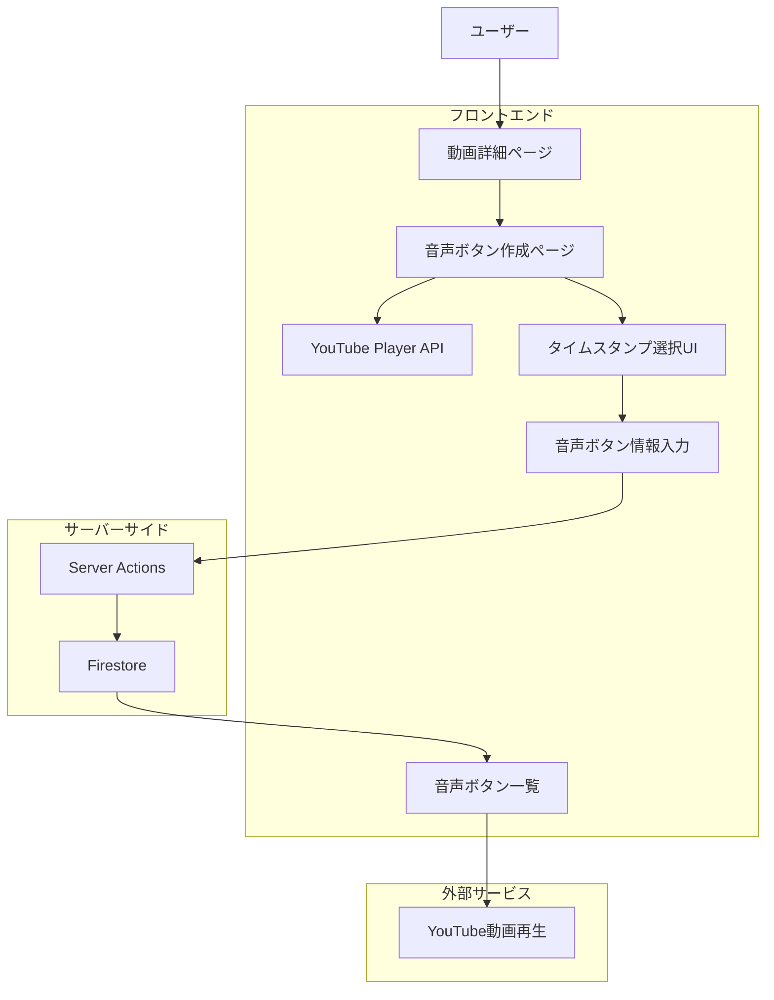

# 音声ボタン機能 設計ドキュメント（タイムスタンプ参照システム）

## 概要

suzumina.clickプロジェクトの音声ボタン機能として、**タイムスタンプ参照システム**を実装します。YouTube動画の音声ファイルを保存せず、特定時間への参照情報のみを保存することで、法的リスクを回避しつつ実用的な音声ボタン機能を提供します。

## 🎯 設計方針

### 承認された設計コンセプト
- **音声ファイル保存なし**: YouTube規約に完全準拠
- **タイムスタンプ参照**: 動画の特定時間区間への参照のみ
- **ユーザー主導作成**: 動画視聴中にリアルタイムでボタン作成
- **コミュニティ共有**: ファン同士での名場面共有

### 技術的優位性
- ✅ 法的コンプライアンス確保
- ✅ 実装簡単（2週間で完成）
- ✅ ストレージコスト不要
- ✅ 既存インフラ活用

## 📱 画面設計・ユーザーフロー

### 1. **動画詳細ページ（拡張）**
`/videos/[videoId]`

```
┌─────────────────────────────────────────────────────┐
│ 📺 動画詳細ページ                                     │
├─────────────────────────────────────────────────────┤
│ [動画サムネイル・メタ情報] (既存)                     │
├─────────────────────────────────────────────────────┤
│ 🎵 音声ボタンセクション                              │
│ ┌─────────────────────────────────────────────────┐ │
│ │ ⭐ この動画の音声ボタン (3個)                    │ │
│ │ [▶️ おはよう] [▶️ ありがとう] [▶️ お疲れ様]       │ │
│ │                                                 │ │
│ │ [+ 新しい音声ボタンを作成]                       │ │
│ └─────────────────────────────────────────────────┘ │
├─────────────────────────────────────────────────────┤
│ 🎬 YouTube Player (埋め込み)                         │
│ ┌─────────────────────────────────────────────────┐ │
│ │ [YouTube動画プレイヤー]                          │ │
│ │                                                 │ │
│ │ 再生時間: 2:45 / 10:30                          │ │
│ └─────────────────────────────────────────────────┘ │
└─────────────────────────────────────────────────────┘
```

### 2. **音声ボタン作成ページ**
`/buttons/create?video_id={videoId}`

```
┌─────────────────────────────────────────────────────┐
│ 🎵 音声ボタン作成                                     │
├─────────────────────────────────────────────────────┤
│ 📹 対象動画: 「朝の挨拶配信」                         │
├─────────────────────────────────────────────────────┤
│ 🎬 YouTube Player                                    │
│ ┌─────────────────────────────────────────────────┐ │
│ │ [YouTube動画プレイヤー]                          │ │
│ │ 現在時間: 1:23 / 10:30                          │ │
│ └─────────────────────────────────────────────────┘ │
├─────────────────────────────────────────────────────┤
│ ⏰ タイムスタンプ選択                                 │
│                                                     │
│ 開始時間: 1:20 [━━━━━━|━━━━━━━━━━━━━━━━] 10:30       │
│ 終了時間: 1:25 [━━━━━━━━|━━━━━━━━━━━━━━] 10:30       │
│ 長さ: 5秒                                           │
│                                                     │
│ [📍 現在時間を開始に] [⏯️ 範囲プレビュー]            │
├─────────────────────────────────────────────────────┤
│ 📝 音声ボタン情報                                     │
│                                                     │
│ タイトル: [おはようございます________]               │
│ カテゴリ: [挨拶 ▼]                                  │
│ タグ: [朝] [挨拶] [+タグ追加]                       │
│ 説明: [朝の配信での挨拶シーンです___________]        │
├─────────────────────────────────────────────────────┤
│ 🔍 プレビュー                                        │
│ ┌─────────────────────────────────────────────────┐ │
│ │ 🎵 おはようございます (5秒)                     │ │
│ │ 動画: 朝の挨拶配信                              │ │
│ │ 時間: 1:20-1:25                                │ │
│ │ タグ: [朝] [挨拶]                              │ │
│ └─────────────────────────────────────────────────┘ │
├─────────────────────────────────────────────────────┤
│ [キャンセル] [下書き保存] [音声ボタンを作成] 🎯      │
└─────────────────────────────────────────────────────┘
```

### 3. **音声ボタン一覧ページ（拡張）**
`/buttons`

```
┌─────────────────────────────────────────────────────┐
│ 🎵 音声ボタン一覧                                     │
├─────────────────────────────────────────────────────┤
│ 🔍 [検索・フィルター] [カテゴリ] [並び順] [作成+]     │
├─────────────────────────────────────────────────────┤
│ 📊 人気の音声ボタン                                  │
│ ┌─────┬─────┬─────┬─────┬─────┬─────┐         │
│ │ 🎵  │ 🎵  │ 🎵  │ 🎵  │ 🎵  │ 🎵  │         │
│ │おは │あり │お疲 │こん │いた │おや │         │
│ │よう │がとう│れ様 │にちは│だき │すみ │         │
│ │🔥125│🔥98 │🔥87 │🔥76 │🔥65 │🔥54 │         │
│ └─────┴─────┴─────┴─────┴─────┴─────┘         │
├─────────────────────────────────────────────────────┤
│ 🆕 最新の音声ボタン                                  │
│ ┌─────────────────────────────────────────────────┐ │
│ │ 🎵 おはよう (3秒) 👤匿名 ⏰2分前                │ │
│ │ 📹 朝の挨拶配信 | ⏱️ 1:20-1:23              │ │
│ │ 🏷️ [朝] [挨拶] | 🔥 5回再生                   │ │
│ │ [▶️ 再生] [🔗 動画へ] [💗 いいね]              │ │
│ └─────────────────────────────────────────────────┘ │
│ ┌─────────────────────────────────────────────────┐ │
│ │ 🎵 ありがとうございます (4秒) 👤匿名 ⏰5分前      │ │
│ │ 📹 感謝の配信 | ⏱️ 3:45-3:49                │ │
│ │ 🏷️ [感謝] [お礼] | 🔥 12回再生                │ │
│ │ [▶️ 再生] [🔗 動画へ] [💗 いいね]              │ │
│ └─────────────────────────────────────────────────┘ │
└─────────────────────────────────────────────────────┘
```

### 4. **音声ボタン再生フロー**

```
ユーザーがボタンクリック
         ↓
┌─────────────────────────┐
│ 🎵 おはよう (3秒)        │
│ 📹 朝の挨拶配信          │
│ ⏱️ 1:20-1:23           │
│                        │
│ [▶️ YouTube動画で再生]  │ ← メイン機能
│ [🔗 動画詳細へ]        │
│ [💗 いいね] [💬 コメント] │
└─────────────────────────┘
         ↓
YouTube動画プレイヤーが開く
指定時間（1:20）から再生開始
```

## 🏗️ アーキテクチャ設計

### システム全体構成



### データフロー

#### 1. 音声ボタン作成フロー
```
動画視聴 → 気になるセリフ発見 → 作成ページ遷移 → 
タイムスタンプ指定 → メタデータ入力 → プレビュー確認 → 
Server Actions → Firestore保存 → 一覧に表示
```

#### 2. 音声ボタン再生フロー
```
一覧ページ → ボタンクリック → YouTube Player開く → 
指定時間から再生 → 統計情報更新
```

## 🧩 コンポーネント設計

### 1. **AudioReferenceCreator**（音声ボタン作成）

```tsx
// apps/web/src/components/AudioReferenceCreator.tsx
'use client';

import { useState, useCallback, useRef } from 'react';
import { createAudioReference } from '../app/buttons/actions';

interface AudioReferenceCreatorProps {
  videoId: string;
  videoTitle: string;
  videoDuration: number;
  initialStartTime?: number;
}

export default function AudioReferenceCreator({
  videoId,
  videoTitle,
  videoDuration,
  initialStartTime = 0,
}: AudioReferenceCreatorProps) {
  // State management
  const [startTime, setStartTime] = useState(initialStartTime);
  const [endTime, setEndTime] = useState(initialStartTime + 5);
  const [title, setTitle] = useState('');
  const [category, setCategory] = useState<AudioButtonCategory>('other');
  const [tags, setTags] = useState<string[]>([]);
  const [description, setDescription] = useState('');
  const [isCreating, setIsCreating] = useState(false);
  
  const youtubePlayerRef = useRef<any>(null);
  
  // YouTube Player統合
  const handlePlayerReady = useCallback((player: any) => {
    youtubePlayerRef.current = player;
  }, []);
  
  // 現在時間を開始時間に設定
  const setCurrentTimeAsStart = useCallback(() => {
    if (youtubePlayerRef.current) {
      const currentTime = youtubePlayerRef.current.getCurrentTime();
      setStartTime(Math.floor(currentTime));
      setEndTime(Math.floor(currentTime) + 5);
    }
  }, []);
  
  // 選択範囲をプレビュー再生
  const previewRange = useCallback(() => {
    if (youtubePlayerRef.current) {
      youtubePlayerRef.current.seekTo(startTime);
      youtubePlayerRef.current.playVideo();
      
      // 終了時間で停止
      setTimeout(() => {
        youtubePlayerRef.current.pauseVideo();
      }, (endTime - startTime) * 1000);
    }
  }, [startTime, endTime]);
  
  // 音声ボタン作成
  const handleCreate = useCallback(async () => {
    if (!title.trim() || startTime >= endTime) return;
    
    setIsCreating(true);
    try {
      const result = await createAudioReference({
        videoId,
        title: title.trim(),
        startTime,
        endTime,
        category,
        tags,
        description: description.trim(),
      });
      
      if (result.success) {
        // 成功時の処理
        router.push(`/buttons/${result.audioReference.id}`);
      } else {
        // エラーハンドリング
        setError(result.error || '作成に失敗しました');
      }
    } catch (error) {
      console.error('作成エラー:', error);
      setError('予期しないエラーが発生しました');
    } finally {
      setIsCreating(false);
    }
  }, [videoId, title, startTime, endTime, category, tags, description]);
  
  return (
    <div className="max-w-4xl mx-auto space-y-6">
      {/* ページヘッダー */}
      <div>
        <h1 className="text-3xl font-bold text-gray-900">音声ボタンを作成</h1>
        <p className="text-gray-600 mt-2">
          動画「{videoTitle}」から音声ボタンを作成します
        </p>
      </div>
      
      {/* YouTube Player */}
      <Card>
        <CardHeader>
          <CardTitle>対象動画</CardTitle>
        </CardHeader>
        <CardContent>
          <YouTubePlayer
            videoId={videoId}
            onReady={handlePlayerReady}
            onTimeUpdate={setCurrentTime}
          />
        </CardContent>
      </Card>
      
      {/* タイムスタンプ選択 */}
      <Card>
        <CardHeader>
          <CardTitle>タイムスタンプ選択</CardTitle>
          <CardDescription>
            音声ボタンにしたい部分の開始・終了時間を指定してください
          </CardDescription>
        </CardHeader>
        <CardContent className="space-y-4">
          {/* 開始時間 */}
          <div>
            <label className="block text-sm font-medium mb-2">
              開始時間: {formatTime(startTime)}
            </label>
            <Slider
              value={[startTime]}
              onValueChange={([value]) => setStartTime(value)}
              max={videoDuration}
              step={1}
              className="w-full"
            />
          </div>
          
          {/* 終了時間 */}
          <div>
            <label className="block text-sm font-medium mb-2">
              終了時間: {formatTime(endTime)}
            </label>
            <Slider
              value={[endTime]}
              onValueChange={([value]) => setEndTime(value)}
              min={startTime + 1}
              max={Math.min(startTime + 30, videoDuration)}
              step={1}
              className="w-full"
            />
          </div>
          
          {/* コントロールボタン */}
          <div className="flex gap-3">
            <Button onClick={setCurrentTimeAsStart} variant="outline">
              📍 現在時間を開始に
            </Button>
            <Button onClick={previewRange} variant="outline">
              ⏯️ 範囲プレビュー
            </Button>
          </div>
          
          {/* 情報表示 */}
          <div className="p-3 bg-gray-50 rounded-lg">
            <p className="text-sm text-gray-600">
              選択範囲: {formatTime(startTime)} - {formatTime(endTime)} 
              ({endTime - startTime}秒)
            </p>
          </div>
        </CardContent>
      </Card>
      
      {/* メタデータ入力 */}
      <Card>
        <CardHeader>
          <CardTitle>音声ボタン情報</CardTitle>
        </CardHeader>
        <CardContent className="space-y-4">
          {/* タイトル */}
          <div>
            <label className="block text-sm font-medium mb-2">
              タイトル *
            </label>
            <Input
              value={title}
              onChange={(e) => setTitle(e.target.value)}
              placeholder="例: おはようございます"
              maxLength={50}
            />
          </div>
          
          {/* カテゴリ */}
          <div>
            <label className="block text-sm font-medium mb-2">
              カテゴリ
            </label>
            <Select value={category} onValueChange={setCategory}>
              <SelectTrigger>
                <SelectValue />
              </SelectTrigger>
              <SelectContent>
                <SelectItem value="greeting">挨拶</SelectItem>
                <SelectItem value="thanks">感謝</SelectItem>
                <SelectItem value="emotion">感情表現</SelectItem>
                <SelectItem value="other">その他</SelectItem>
              </SelectContent>
            </Select>
          </div>
          
          {/* タグ */}
          <div>
            <label className="block text-sm font-medium mb-2">
              タグ
            </label>
            <TagInput
              tags={tags}
              onChange={setTags}
              placeholder="タグを入力..."
              maxTags={10}
            />
          </div>
          
          {/* 説明 */}
          <div>
            <label className="block text-sm font-medium mb-2">
              説明（任意）
            </label>
            <Textarea
              value={description}
              onChange={(e) => setDescription(e.target.value)}
              placeholder="この音声ボタンの説明..."
              maxLength={200}
              rows={3}
            />
          </div>
        </CardContent>
      </Card>
      
      {/* プレビュー */}
      <Card>
        <CardHeader>
          <CardTitle>プレビュー</CardTitle>
        </CardHeader>
        <CardContent>
          <AudioReferenceCard
            audioReference={{
              id: 'preview',
              title: title || '(タイトルなし)',
              videoId,
              videoTitle,
              startTime,
              endTime,
              duration: endTime - startTime,
              category,
              tags,
              description,
              createdBy: 'anonymous',
              createdAt: new Date(),
              updatedAt: new Date(),
              playCount: 0,
              likeCount: 0,
            }}
            isPreview={true}
          />
        </CardContent>
      </Card>
      
      {/* 作成ボタン */}
      <div className="flex justify-end gap-3">
        <Button variant="outline" asChild>
          <Link href={`/videos/${videoId}`}>キャンセル</Link>
        </Button>
        <Button
          onClick={handleCreate}
          disabled={!title.trim() || startTime >= endTime || isCreating}
          className="min-w-[200px]"
        >
          {isCreating ? (
            <>
              <Loader2 className="h-4 w-4 mr-2 animate-spin" />
              作成中...
            </>
          ) : (
            <>
              <Plus className="h-4 w-4 mr-2" />
              音声ボタンを作成
            </>
          )}
        </Button>
      </div>
    </div>
  );
}
```

### 2. **AudioReferenceCard**（音声ボタン表示）

```tsx
// apps/web/src/components/AudioReferenceCard.tsx
'use client';

import { useState } from 'react';
import { updateAudioReferenceStats } from '../app/buttons/actions';

interface AudioReferenceCardProps {
  audioReference: AudioReference;
  size?: 'sm' | 'md' | 'lg';
  variant?: 'default' | 'compact' | 'detailed';
  showSourceVideo?: boolean;
  isPreview?: boolean;
}

export default function AudioReferenceCard({
  audioReference,
  size = 'md',
  variant = 'default',
  showSourceVideo = true,
  isPreview = false,
}: AudioReferenceCardProps) {
  const [isPlaying, setIsPlaying] = useState(false);
  const [playCount, setPlayCount] = useState(audioReference.playCount);
  const [likeCount, setLikeCount] = useState(audioReference.likeCount);
  const [isLiked, setIsLiked] = useState(false);
  
  // YouTube動画を開いて指定時間から再生
  const handlePlay = async () => {
    if (isPreview) return;
    
    setIsPlaying(true);
    
    // 統計情報更新
    try {
      await updateAudioReferenceStats(audioReference.id, 'play');
      setPlayCount(prev => prev + 1);
    } catch (error) {
      console.error('統計更新エラー:', error);
    }
    
    // YouTube動画を新しいタブで開く
    const youtubeUrl = `https://youtube.com/watch?v=${audioReference.videoId}&t=${audioReference.startTime}s`;
    window.open(youtubeUrl, '_blank');
    
    setTimeout(() => {
      setIsPlaying(false);
    }, 1000);
  };
  
  // いいね機能
  const handleLike = async () => {
    if (isPreview) return;
    
    try {
      const action = isLiked ? 'unlike' : 'like';
      await updateAudioReferenceStats(audioReference.id, action);
      
      setIsLiked(!isLiked);
      setLikeCount(prev => isLiked ? prev - 1 : prev + 1);
    } catch (error) {
      console.error('いいね更新エラー:', error);
    }
  };
  
  // 動画詳細ページへ遷移
  const goToVideo = () => {
    if (isPreview) return;
    router.push(`/videos/${audioReference.videoId}?t=${audioReference.startTime}`);
  };
  
  const cardClassName = cn(
    'border rounded-lg transition-all duration-200',
    {
      'p-3': size === 'sm',
      'p-4': size === 'md',
      'p-6': size === 'lg',
      'hover:shadow-md hover:border-primary/20': !isPreview,
      'bg-gray-50 border-dashed': isPreview,
    }
  );
  
  return (
    <Card className={cardClassName}>
      <CardContent className="space-y-3">
        {/* ヘッダー */}
        <div className="flex items-start justify-between">
          <div className="flex-1 min-w-0">
            <h3 className={cn(
              'font-medium text-gray-900 truncate',
              {
                'text-sm': size === 'sm',
                'text-base': size === 'md',
                'text-lg': size === 'lg',
              }
            )}>
              🎵 {audioReference.title}
            </h3>
            <p className="text-sm text-gray-500">
              {audioReference.duration}秒
            </p>
          </div>
          <Badge variant="secondary" className="ml-2">
            {getCategoryLabel(audioReference.category)}
          </Badge>
        </div>
        
        {/* 動画情報 */}
        {showSourceVideo && (
          <div className="text-sm text-gray-600">
            <p className="flex items-center">
              📹 {audioReference.videoTitle}
            </p>
            <p className="flex items-center mt-1">
              ⏱️ {formatTime(audioReference.startTime)} - {formatTime(audioReference.endTime)}
            </p>
          </div>
        )}
        
        {/* タグ */}
        {audioReference.tags && audioReference.tags.length > 0 && (
          <div className="flex flex-wrap gap-1">
            {audioReference.tags.map((tag) => (
              <Badge key={tag} variant="outline" className="text-xs">
                {tag}
              </Badge>
            ))}
          </div>
        )}
        
        {/* 統計情報 */}
        <div className="flex items-center gap-4 text-sm text-gray-500">
          <span className="flex items-center">
            🔥 {playCount}回再生
          </span>
          <span className="flex items-center">
            💗 {likeCount}
          </span>
          <span>
            ⏰ {formatRelativeTime(audioReference.createdAt)}
          </span>
        </div>
        
        {/* アクションボタン */}
        <div className="flex gap-2">
          <Button
            onClick={handlePlay}
            disabled={isPlaying || isPreview}
            className="flex-1"
            size={size === 'sm' ? 'sm' : 'default'}
          >
            {isPlaying ? (
              <>
                <Loader2 className="h-4 w-4 mr-2 animate-spin" />
                再生中...
              </>
            ) : (
              <>
                <Play className="h-4 w-4 mr-2" />
                YouTube で再生
              </>
            )}
          </Button>
          
          {variant === 'detailed' && (
            <>
              <Button
                variant="outline"
                onClick={goToVideo}
                disabled={isPreview}
                size={size === 'sm' ? 'sm' : 'default'}
              >
                <ExternalLink className="h-4 w-4" />
              </Button>
              <Button
                variant="outline"
                onClick={handleLike}
                disabled={isPreview}
                size={size === 'sm' ? 'sm' : 'default'}
                className={cn(isLiked && 'text-red-500')}
              >
                <Heart className={cn('h-4 w-4', isLiked && 'fill-current')} />
              </Button>
            </>
          )}
        </div>
        
        {/* 説明（詳細表示時のみ） */}
        {variant === 'detailed' && audioReference.description && (
          <div className="pt-3 border-t">
            <p className="text-sm text-gray-600">
              {audioReference.description}
            </p>
          </div>
        )}
      </CardContent>
    </Card>
  );
}
```

### 3. **YouTubePlayer**（YouTube統合）

```tsx
// apps/web/src/components/YouTubePlayer.tsx
'use client';

import { useCallback, useEffect, useRef } from 'react';

interface YouTubePlayerProps {
  videoId: string;
  onReady?: (player: any) => void;
  onTimeUpdate?: (currentTime: number) => void;
  onStateChange?: (state: number) => void;
  startTime?: number;
  autoplay?: boolean;
  controls?: boolean;
  height?: number;
  width?: string | number;
}

declare global {
  interface Window {
    YT: any;
    onYouTubeIframeAPIReady: () => void;
  }
}

export default function YouTubePlayer({
  videoId,
  onReady,
  onTimeUpdate,
  onStateChange,
  startTime = 0,
  autoplay = false,
  controls = true,
  height = 400,
  width = '100%',
}: YouTubePlayerProps) {
  const playerRef = useRef<any>(null);
  const containerRef = useRef<HTMLDivElement>(null);
  const timeUpdateIntervalRef = useRef<NodeJS.Timeout | null>(null);
  
  // YouTube IFrame API をロード
  const loadYouTubeAPI = useCallback(() => {
    if (window.YT && window.YT.Player) {
      initializePlayer();
      return;
    }
    
    const tag = document.createElement('script');
    tag.src = 'https://www.youtube.com/iframe_api';
    const firstScriptTag = document.getElementsByTagName('script')[0];
    firstScriptTag.parentNode?.insertBefore(tag, firstScriptTag);
    
    window.onYouTubeIframeAPIReady = initializePlayer;
  }, []);
  
  // プレイヤー初期化
  const initializePlayer = useCallback(() => {
    if (!containerRef.current || playerRef.current) return;
    
    playerRef.current = new window.YT.Player(containerRef.current, {
      height,
      width,
      videoId,
      playerVars: {
        autoplay: autoplay ? 1 : 0,
        controls: controls ? 1 : 0,
        modestbranding: 1,
        rel: 0,
        showinfo: 0,
        start: startTime,
      },
      events: {
        onReady: handlePlayerReady,
        onStateChange: handleStateChange,
      },
    });
  }, [videoId, height, width, autoplay, controls, startTime]);
  
  const handlePlayerReady = useCallback((event: any) => {
    onReady?.(event.target);
  }, [onReady]);
  
  const handleStateChange = useCallback((event: any) => {
    const state = event.data;
    onStateChange?.(state);
    
    // 再生中は時間更新を監視
    if (state === window.YT.PlayerState.PLAYING) {
      startTimeUpdateTracking();
    } else {
      stopTimeUpdateTracking();
    }
  }, [onStateChange]);
  
  const startTimeUpdateTracking = useCallback(() => {
    if (timeUpdateIntervalRef.current) return;
    
    timeUpdateIntervalRef.current = setInterval(() => {
      if (playerRef.current && onTimeUpdate) {
        const currentTime = playerRef.current.getCurrentTime();
        onTimeUpdate(currentTime);
      }
    }, 100); // 100msごとに更新
  }, [onTimeUpdate]);
  
  const stopTimeUpdateTracking = useCallback(() => {
    if (timeUpdateIntervalRef.current) {
      clearInterval(timeUpdateIntervalRef.current);
      timeUpdateIntervalRef.current = null;
    }
  }, []);
  
  useEffect(() => {
    loadYouTubeAPI();
    
    return () => {
      stopTimeUpdateTracking();
      if (playerRef.current?.destroy) {
        playerRef.current.destroy();
      }
    };
  }, [loadYouTubeAPI, stopTimeUpdateTracking]);
  
  // videoId が変更された時の処理
  useEffect(() => {
    if (playerRef.current?.loadVideoById) {
      playerRef.current.loadVideoById({
        videoId,
        startSeconds: startTime,
      });
    }
  }, [videoId, startTime]);
  
  return (
    <div className="relative w-full">
      <div
        ref={containerRef}
        className="w-full"
        style={{ aspectRatio: '16 / 9' }}
      />
    </div>
  );
}
```

## 🗄️ データ構造設計

### AudioReference型定義

```typescript
// packages/shared-types/src/audio-reference.ts

import { z } from 'zod';

export const AudioReferenceCategorySchema = z.enum([
  'greeting',    // 挨拶
  'thanks',      // 感謝
  'emotion',     // 感情表現
  'reaction',    // リアクション
  'catchphrase', // 決まり文句
  'other',       // その他
]);

export type AudioReferenceCategory = z.infer<typeof AudioReferenceCategorySchema>;

export const AudioReferenceSchema = z.object({
  id: z.string().min(1),
  title: z.string().min(1).max(50),
  videoId: z.string().min(1),
  videoTitle: z.string().min(1),
  startTime: z.number().min(0),
  endTime: z.number().min(0),
  duration: z.number().positive().max(30), // 最大30秒
  category: AudioReferenceCategorySchema,
  tags: z.array(z.string().max(20)).max(10).optional(),
  description: z.string().max(200).optional(),
  createdBy: z.string().optional(), // 認証なしでは匿名
  createdAt: z.string().datetime(),
  updatedAt: z.string().datetime(),
  playCount: z.number().default(0),
  likeCount: z.number().default(0),
  isPublic: z.boolean().default(true),
});

export type AudioReference = z.infer<typeof AudioReferenceSchema>;

// Firestore用の型
export const FirestoreAudioReferenceSchema = AudioReferenceSchema.omit({
  createdAt: true,
  updatedAt: true,
}).extend({
  createdAt: z.custom<Timestamp>(),
  updatedAt: z.custom<Timestamp>(),
});

export type FirestoreAudioReference = z.infer<typeof FirestoreAudioReferenceSchema>;

// フロントエンド表示用の型
export const FrontendAudioReferenceSchema = AudioReferenceSchema.omit({
  createdAt: true,
  updatedAt: true,
}).extend({
  createdAt: z.date(),
  updatedAt: z.date(),
});

export type FrontendAudioReference = z.infer<typeof FrontendAudioReferenceSchema>;

// 検索・フィルター用の型
export const AudioReferenceQuerySchema = z.object({
  searchText: z.string().optional(),
  category: AudioReferenceCategorySchema.optional(),
  tags: z.array(z.string()).optional(),
  videoId: z.string().optional(),
  createdBy: z.string().optional(),
  sortBy: z.enum(['newest', 'oldest', 'popular', 'mostPlayed']).default('newest'),
  limit: z.number().min(1).max(100).default(20),
  offset: z.number().min(0).default(0),
  onlyPublic: z.boolean().default(true),
});

export type AudioReferenceQuery = z.infer<typeof AudioReferenceQuerySchema>;

// 作成用の型
export const CreateAudioReferenceSchema = AudioReferenceSchema.omit({
  id: true,
  createdAt: true,
  updatedAt: true,
  playCount: true,
  likeCount: true,
  createdBy: true, // サーバーサイドで'anonymous'を設定
});

export type CreateAudioReference = z.infer<typeof CreateAudioReferenceSchema>;

// カテゴリラベル定義
export const AUDIO_REFERENCE_CATEGORY_LABELS: Record<AudioReferenceCategory, string> = {
  greeting: '挨拶',
  thanks: '感謝',
  emotion: '感情表現',
  reaction: 'リアクション',
  catchphrase: '決まり文句',
  other: 'その他',
};

// 並び順ラベル定義
export const AUDIO_REFERENCE_SORT_LABELS = {
  newest: '新着順',
  oldest: '古い順',
  popular: '人気順',
  mostPlayed: '再生数順',
} as const;
```

### Firestore変換ユーティリティ

```typescript
// packages/shared-types/src/audio-reference-utils.ts

import { Timestamp } from 'firebase/firestore';

export function firestoreToFrontendAudioReference(
  firestoreData: FirestoreAudioReference
): FrontendAudioReference {
  return {
    ...firestoreData,
    createdAt: firestoreData.createdAt?.toDate() || new Date(),
    updatedAt: firestoreData.updatedAt?.toDate() || new Date(),
  };
}

export function frontendToFirestoreAudioReference(
  frontendData: FrontendAudioReference
): FirestoreAudioReference {
  return {
    ...frontendData,
    createdAt: Timestamp.fromDate(frontendData.createdAt),
    updatedAt: Timestamp.fromDate(frontendData.updatedAt),
  };
}

export function createAudioReferenceToFirestore(
  createData: CreateAudioReference,
  createdBy: string = 'anonymous' // デフォルトで匿名
): FirestoreAudioReference {
  const now = Timestamp.now();
  return {
    ...createData,
    id: generateAudioReferenceId(),
    createdBy,
    createdAt: now,
    updatedAt: now,
    playCount: 0,
    likeCount: 0,
    isPublic: true,
  };
}

export function generateAudioReferenceId(): string {
  return `ar_${Date.now()}_${Math.random().toString(36).substr(2, 9)}`;
}

// バリデーション関数
export function validateAudioReferenceData(data: CreateAudioReference): string[] {
  const errors: string[] = [];
  
  if (data.startTime >= data.endTime) {
    errors.push('終了時間は開始時間より後である必要があります');
  }
  
  if (data.duration > 30) {
    errors.push('音声ボタンの長さは30秒以下である必要があります');
  }
  
  if (data.duration < 1) {
    errors.push('音声ボタンの長さは1秒以上である必要があります');
  }
  
  if (data.tags && data.tags.length > 10) {
    errors.push('タグは10個以下である必要があります');
  }
  
  return errors;
}

// 検索用のユーティリティ
export function buildFirestoreQuery(query: AudioReferenceQuery) {
  const constraints: any[] = [];
  
  if (query.onlyPublic) {
    constraints.push(['isPublic', '==', true]);
  }
  
  if (query.category) {
    constraints.push(['category', '==', query.category]);
  }
  
  if (query.videoId) {
    constraints.push(['videoId', '==', query.videoId]);
  }
  
  if (query.createdBy) {
    constraints.push(['createdBy', '==', query.createdBy]);
  }
  
  // 並び順
  let orderBy: [string, 'asc' | 'desc'][];
  switch (query.sortBy) {
    case 'newest':
      orderBy = [['createdAt', 'desc']];
      break;
    case 'oldest':
      orderBy = [['createdAt', 'asc']];
      break;
    case 'popular':
      orderBy = [['likeCount', 'desc'], ['createdAt', 'desc']];
      break;
    case 'mostPlayed':
      orderBy = [['playCount', 'desc'], ['createdAt', 'desc']];
      break;
    default:
      orderBy = [['createdAt', 'desc']];
  }
  
  return { constraints, orderBy, limit: query.limit, offset: query.offset };
}
```

## 🚀 サーバーサイド実装

### Server Actions

```typescript
// apps/web/src/app/buttons/actions.ts

import { revalidatePath, revalidateTag } from 'next/cache';
import { 
  CreateAudioReference,
  AudioReferenceQuery,
  FrontendAudioReference,
  createAudioReferenceToFirestore,
  validateAudioReferenceData,
} from '@suzumina.click/shared-types';
import { 
  collection,
  doc,
  addDoc,
  updateDoc,
  increment,
  query,
  where,
  orderBy,
  limit,
  getDocs,
  getDoc,
  startAfter,
} from 'firebase/firestore';
import { db } from '@/lib/firestore';

/**
 * 音声ボタン作成
 */
export async function createAudioReference(
  data: CreateAudioReference
): Promise<{ success: true; audioReference: FrontendAudioReference } | { success: false; error: string }> {
  try {
    // バリデーション
    const validationErrors = validateAudioReferenceData(data);
    if (validationErrors.length > 0) {
      return { success: false, error: validationErrors.join(', ') };
    }
    
    // 早期市場投入のため認証なし（匿名投稿）
    const createdBy = 'anonymous';
    
    // Firestoreに保存
    const firestoreData = createAudioReferenceToFirestore(data, createdBy);
    const docRef = await addDoc(collection(db, 'audioReferences'), firestoreData);
    
    // IDを更新
    await updateDoc(docRef, { id: docRef.id });
    
    // 動画の音声ボタン統計を更新
    await updateVideoAudioButtonStats(data.videoId, 'increment');
    
    // キャッシュを無効化
    revalidateTag(`audioReferences-video-${data.videoId}`);
    revalidateTag('audioReferences-recent');
    revalidateTag('audioReferences-popular');
    revalidatePath('/buttons');
    revalidatePath(`/videos/${data.videoId}`);
    
    const result: FrontendAudioReference = {
      ...firestoreData,
      id: docRef.id,
      createdAt: firestoreData.createdAt.toDate(),
      updatedAt: firestoreData.updatedAt.toDate(),
    };
    
    return { success: true, audioReference: result };
  } catch (error) {
    console.error('Audio reference creation failed:', error);
    return { success: false, error: 'Internal server error' };
  }
}

/**
 * 音声ボタン検索・取得
 */
export async function getAudioReferences(
  queryParams: AudioReferenceQuery
): Promise<{
  audioReferences: FrontendAudioReference[];
  hasMore: boolean;
  totalCount?: number;
}> {
  try {
    const q = buildFirestoreQuery(queryParams);
    const querySnapshot = await getDocs(q);
    
    const audioReferences: FrontendAudioReference[] = [];
    querySnapshot.forEach((doc) => {
      const data = doc.data() as FirestoreAudioReference;
      audioReferences.push({
        ...data,
        id: doc.id,
        createdAt: data.createdAt.toDate(),
        updatedAt: data.updatedAt.toDate(),
      });
    });
    
    // 次のページがあるかチェック
    const hasMore = audioReferences.length === queryParams.limit;
    
    return { audioReferences, hasMore };
  } catch (error) {
    console.error('Audio references fetch failed:', error);
    return { audioReferences: [], hasMore: false };
  }
}

/**
 * 人気の音声ボタン取得
 */
export async function getPopularAudioReferences(
  limit: number = 10
): Promise<FrontendAudioReference[]> {
  try {
    const q = query(
      collection(db, 'audioReferences'),
      where('isPublic', '==', true),
      orderBy('likeCount', 'desc'),
      orderBy('createdAt', 'desc'),
      limit(limit)
    );
    
    const querySnapshot = await getDocs(q);
    const audioReferences: FrontendAudioReference[] = [];
    
    querySnapshot.forEach((doc) => {
      const data = doc.data() as FirestoreAudioReference;
      audioReferences.push({
        ...data,
        id: doc.id,
        createdAt: data.createdAt.toDate(),
        updatedAt: data.updatedAt.toDate(),
      });
    });
    
    return audioReferences;
  } catch (error) {
    console.error('Popular audio references fetch failed:', error);
    return [];
  }
}

/**
 * 最新の音声ボタン取得
 */
export async function getRecentAudioReferences(
  limit: number = 10
): Promise<FrontendAudioReference[]> {
  try {
    const q = query(
      collection(db, 'audioReferences'),
      where('isPublic', '==', true),
      orderBy('createdAt', 'desc'),
      limit(limit)
    );
    
    const querySnapshot = await getDocs(q);
    const audioReferences: FrontendAudioReference[] = [];
    
    querySnapshot.forEach((doc) => {
      const data = doc.data() as FirestoreAudioReference;
      audioReferences.push({
        ...data,
        id: doc.id,
        createdAt: data.createdAt.toDate(),
        updatedAt: data.updatedAt.toDate(),
      });
    });
    
    return audioReferences;
  } catch (error) {
    console.error('Recent audio references fetch failed:', error);
    return [];
  }
}

/**
 * 動画別音声ボタン取得
 */
export async function getAudioReferencesByVideo(
  videoId: string,
  limit: number = 20
): Promise<FrontendAudioReference[]> {
  try {
    const q = query(
      collection(db, 'audioReferences'),
      where('videoId', '==', videoId),
      where('isPublic', '==', true),
      orderBy('createdAt', 'desc'),
      limit(limit)
    );
    
    const querySnapshot = await getDocs(q);
    const audioReferences: FrontendAudioReference[] = [];
    
    querySnapshot.forEach((doc) => {
      const data = doc.data() as FirestoreAudioReference;
      audioReferences.push({
        ...data,
        id: doc.id,
        createdAt: data.createdAt.toDate(),
        updatedAt: data.updatedAt.toDate(),
      });
    });
    
    return audioReferences;
  } catch (error) {
    console.error('Video audio references fetch failed:', error);
    return [];
  }
}

/**
 * 音声ボタン統計更新
 */
export async function updateAudioReferenceStats(
  audioReferenceId: string,
  action: 'play' | 'like' | 'unlike'
): Promise<{ success: boolean }> {
  try {
    const docRef = doc(db, 'audioReferences', audioReferenceId);
    
    const updateData: any = { updatedAt: new Date() };
    
    switch (action) {
      case 'play':
        updateData.playCount = increment(1);
        break;
      case 'like':
        updateData.likeCount = increment(1);
        break;
      case 'unlike':
        updateData.likeCount = increment(-1);
        break;
    }
    
    await updateDoc(docRef, updateData);
    
    // キャッシュを無効化
    revalidateTag('audioReferences-popular');
    revalidateTag('audioReferences-mostPlayed');
    
    return { success: true };
  } catch (error) {
    console.error('Audio reference stats update failed:', error);
    return { success: false };
  }
}

/**
 * 動画の音声ボタン統計更新
 */
async function updateVideoAudioButtonStats(
  videoId: string,
  action: 'increment' | 'decrement'
): Promise<void> {
  try {
    const videoDocRef = doc(db, 'videos', videoId);
    const videoDoc = await getDoc(videoDocRef);
    
    if (videoDoc.exists()) {
      const updateData: any = {
        updatedAt: new Date(),
        hasAudioButtons: true,
        audioButtonsUpdatedAt: new Date(),
      };
      
      if (action === 'increment') {
        updateData.audioButtonCount = increment(1);
      } else {
        updateData.audioButtonCount = increment(-1);
      }
      
      await updateDoc(videoDocRef, updateData);
      
      // キャッシュを無効化
      revalidateTag(`video-${videoId}`);
    }
  } catch (error) {
    console.error('Video audio button stats update failed:', error);
  }
}

/**
 * Firestoreクエリ構築
 */
function buildFirestoreQuery(queryParams: AudioReferenceQuery) {
  const constraints = [where('isPublic', '==', true)];
  
  if (queryParams.category) {
    constraints.push(where('category', '==', queryParams.category));
  }
  
  if (queryParams.videoId) {
    constraints.push(where('videoId', '==', queryParams.videoId));
  }
  
  if (queryParams.createdBy) {
    constraints.push(where('createdBy', '==', queryParams.createdBy));
  }
  
  // 並び順
  let orderByConstraints: any[];
  switch (queryParams.sortBy) {
    case 'newest':
      orderByConstraints = [orderBy('createdAt', 'desc')];
      break;
    case 'oldest':
      orderByConstraints = [orderBy('createdAt', 'asc')];
      break;
    case 'popular':
      orderByConstraints = [orderBy('likeCount', 'desc'), orderBy('createdAt', 'desc')];
      break;
    case 'mostPlayed':
      orderByConstraints = [orderBy('playCount', 'desc'), orderBy('createdAt', 'desc')];
      break;
    default:
      orderByConstraints = [orderBy('createdAt', 'desc')];
  }
  
  return query(
    collection(db, 'audioReferences'),
    ...constraints,
    ...orderByConstraints,
    limit(queryParams.limit)
  );
}
```

### Firestore セキュリティルール（認証なし版）

```javascript
// firestore.rules

rules_version = '2';
service cloud.firestore {
  match /databases/{database}/documents {
    // 音声ボタン（音声参照）コレクション
    match /audioReferences/{audioReferenceId} {
      // 読み取り: 公開されているもののみ（誰でも読み取り可能）
      allow read: if resource.data.isPublic == true;
      
      // 作成: 誰でも作成可能（早期市場投入のため）
      allow create: if validateAudioReference(request.resource.data);
      
      // 更新: 統計情報のみ誰でも更新可能（再生回数、いいね数）
      allow update: if onlyStatsUpdated(request.resource.data, resource.data);
      
      // 削除: 禁止（匿名投稿のため削除不可）
      allow delete: if false;
    }
    
    // バリデーション関数
    function validateAudioReference(data) {
      return data.keys().hasAll(['title', 'videoId', 'startTime', 'endTime', 'category'])
        && data.title is string && data.title.size() > 0 && data.title.size() <= 50
        && data.videoId is string && data.videoId.size() > 0
        && data.startTime is number && data.startTime >= 0
        && data.endTime is number && data.endTime > data.startTime
        && (data.endTime - data.startTime) <= 30 // 最大30秒
        && data.category in ['greeting', 'thanks', 'emotion', 'reaction', 'catchphrase', 'other'];
    }
    
    function onlyStatsUpdated(newData, oldData) {
      return newData.diff(oldData).affectedKeys().hasOnly(['playCount', 'likeCount', 'updatedAt']);
    }
  }
}
```

## 📊 Firestore データベース設計

### コレクション構造

```
suzumina-click-firebase/
├── audioReferences/                     # 音声ボタン（音声参照）
│   ├── {audioReferenceId}/
│   │   ├── id: string
│   │   ├── title: string               # "おはようございます"
│   │   ├── videoId: string            # "dQw4w9WgXcQ"
│   │   ├── videoTitle: string         # "朝の挨拶配信"
│   │   ├── startTime: number          # 125 (2:05)
│   │   ├── endTime: number            # 130 (2:10)
│   │   ├── duration: number           # 5
│   │   ├── category: string           # "greeting"
│   │   ├── tags: string[]             # ["朝", "挨拶"]
│   │   ├── description?: string       # "朝の配信での挨拶シーン"
│   │   ├── createdBy: string          # "anonymous"
│   │   ├── createdAt: Timestamp
│   │   ├── updatedAt: Timestamp
│   │   ├── playCount: number          # 42
│   │   ├── likeCount: number          # 15
│   │   └── isPublic: boolean          # true
│   └── ...
├── videos/ (既存)                       # YouTube動画情報
│   ├── {videoId}/
│   │   ├── ... (既存フィールド)
│   │   ├── audioButtonCount: number    # 追加: 3
│   │   ├── hasAudioButtons: boolean    # 追加: true
│   │   └── audioButtonsUpdatedAt: Timestamp # 追加
│   └── ...
└── works/ (既存)                        # DLsite作品情報
```

### インデックス設計

```typescript
// Firestore Composite Indexes

// 1. カテゴリ別・作成日時順
Collection: audioReferences
Fields: category(Ascending), createdAt(Descending)

// 2. 動画別・作成日時順
Collection: audioReferences
Fields: videoId(Ascending), isPublic(Ascending), createdAt(Descending)

// 3. 人気順（いいね数・作成日時）
Collection: audioReferences
Fields: isPublic(Ascending), likeCount(Descending), createdAt(Descending)

// 4. 再生数順
Collection: audioReferences
Fields: isPublic(Ascending), playCount(Descending), createdAt(Descending)

// 5. ユーザー作成順
Collection: audioReferences
Fields: createdBy(Ascending), createdAt(Descending)

// 6. タグ検索（配列contains）
Collection: audioReferences
Fields: tags(Array-contains), isPublic(Ascending), createdAt(Descending)

// 7. 複合検索（カテゴリ + 人気順）
Collection: audioReferences
Fields: category(Ascending), isPublic(Ascending), likeCount(Descending)
```

## 🚀 実装フェーズ

### Phase 1: 基盤実装（1週間）

#### Day 1-2: データ構造・型定義
- [ ] `AudioReference` 型定義を `shared-types` に追加
- [ ] Firestore変換ユーティリティ作成
- [ ] バリデーション関数実装

#### Day 3-4: Server Actions実装
- [ ] `createAudioReference` 実装
- [ ] `getAudioReferences` 実装
- [ ] 統計更新機能実装

#### Day 5-7: 基本コンポーネント
- [ ] `YouTubePlayer` コンポーネント
- [ ] `AudioReferenceCard` 基本版
- [ ] 音声ボタン一覧ページ拡張

### Phase 2: 完成・統合（1週間）

#### Day 8-10: 作成UI実装
- [ ] `AudioReferenceCreator` 完全版
- [ ] タイムスタンプ選択UI
- [ ] プレビュー機能

#### Day 11-12: 統合・最適化
- [ ] 動画詳細ページ統合
- [ ] 検索・フィルター機能
- [ ] レスポンシブデザイン

#### Day 13-14: テスト・リリース準備
- [ ] E2Eテスト
- [ ] パフォーマンス最適化
- [ ] Firestore セキュリティルール
- [ ] 本番デプロイ

**総開発期間: 2週間**

## 🔒 セキュリティ・運用設計

### 認証・認可（認証なし版）
- **作成権限**: 誰でも作成可能（匿名投稿）
- **編集権限**: 編集不可（匿名のため）
- **統計更新**: 誰でも可能（再生回数、いいね数）
- **削除権限**: 削除不可（匿名投稿のため）

### レート制限（認証なし版）
- **作成制限**: IPあたり1日20個まで（スパム防止）
- **統計更新**: IPあたり1分間50回まで
- **検索API**: IPあたり1分間200回まで

### モデレーション（認証なし版）
- **自動フィルター**: 不適切なタイトル・説明の検出
- **報告システム**: 匿名での不適切コンテンツ報告
- **管理者権限**: コンテンツの非公開・削除（手動モデレーション）
- **プリミティブ対策**: 同一IPからの大量投稿防止

### 監視・分析
- **使用量監視**: Firestore読み書き回数
- **人気コンテンツ**: 再生・いいね統計
- **ユーザー行動**: 作成・再生パターン分析

## 🎯 期待される効果

### ユーザーエクスペリエンス
- **簡単操作**: 動画視聴中にリアルタイムでボタン作成
- **即座の共有**: 作成後すぐにコミュニティで共有
- **発見性**: カテゴリ・タグによる音声ボタン発見
- **YouTube連携**: 元動画への直接ジャンプ

### コミュニティ価値
- **名場面共有**: ファン同士での印象的なシーン共有
- **二次創作支援**: 音声ボタンを使った創作活動
- **チャンネル貢献**: YouTube動画の再生回数向上
- **ファンエンゲージメント**: より深いコンテンツ理解

### 技術的利点
- **法的安全性**: YouTube規約完全準拠
- **実装簡単**: 2週間で本格運用開始
- **コスト効率**: ストレージ費用不要
- **スケーラビリティ**: Firestoreによる自動スケーリング

---

この**タイムスタンプ参照システム**により、実用的で持続可能な音声ボタン機能を提供し、suzumina.clickを真のファンコミュニティプラットフォームとして確立できます。