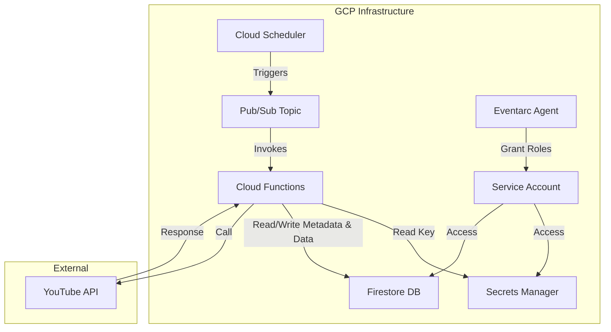

# 音声ボタンサービス計画: YouTube動画情報取得バッチ (実装完了)

## 1. 設計概要

### 1.1. 全体アーキテクチャ

以下の図は、実装された機能の主要なコンポーネントとデータの流れを示しています。

**主要コンポーネント:**

- **Cloud Scheduler:** 1時間に1回、定期的にジョブを実行します。
- **Pub/Sub:** Schedulerからのトリガーを受け取り、Cloud Functionsを起動します。
- **Cloud Functions (`fetchYouTubeVideos`):** Pub/Subトリガー (Eventarc経由) で起動し、YouTube Data APIを呼び出して動画情報を取得し、Firestoreに保存します。状態管理のためにFirestoreのメタデータも読み書きします。
  - **実装注記:** `@google-cloud/functions-framework` を使用し、標準的な CloudEvent ハンドラ (`async (event: CloudEvent<...>) => ...`) 形式で実装されています。イベントデータ (`event.data`) は必要に応じて Base64 デコードされます。
- **Secrets Manager:** YouTube Data APIキーを安全に保管・管理します。
- **Firestore:**
    - `videos` コレクション: 取得したYouTube動画情報を格納します。
    - `youtubeMetadata` コレクション: 動画取得処理の状態（次のページトークン、処理中フラグなど）を管理します。
- **Service Account:** `fetchYouTubeVideos` 関数がGCPリソース（Secrets Manager, Firestore）にアクセスするための専用IDと権限です。
- **YouTube Data API:** Googleが提供するAPIで、YouTubeチャンネルの動画情報を取得します。

### 1.2. Cloud Functions (`fetchYouTubeVideos`) の詳細

- **トリガー:** Pub/Sub トピック (`youtube-video-fetch-trigger`) via Eventarc
- **ランタイム:** Node.js 20
- **主な処理:**
    1.  起動時に Firestore から `youtubeMetadata` ドキュメントを読み込み、前回の処理状態（次のページトークン、処理中フラグなど）を確認します。処理中の場合は二重実行を防ぐため終了します。
    2.  処理開始フラグを `youtubeMetadata` に書き込みます。
    3.  Secrets Managerから `YOUTUBE_API_KEY` を取得します (環境変数経由)。
    4.  取得したAPIキーを使用して `googleapis` ライブラリでYouTube Data APIクライアントを初期化します。
    5.  指定されたチャンネルID (`UChiMMOhl6FpzjoRqvZ5rcaA`) の動画一覧を取得します。
        -   **状態管理とクォータ節約:** `youtubeMetadata` に保存された `nextPageToken` を使用して、前回の続きから取得を開始します。1回の実行で取得するページ数を制限 (`MAX_PAGES_PER_EXECUTION = 3`) し、APIクォータの消費を抑えます。
        -   `search.list` APIでチャンネル内の動画IDを取得します。取得した `nextPageToken` は `youtubeMetadata` に保存します。
        -   **リトライ処理:** API呼び出し時にエラーが発生した場合、自動的に数回リトライします。クォータ超過エラーの場合は処理を中断し、メタデータにエラー情報を記録します。
    6.  取得した動画IDリストに基づき、動画の詳細情報を取得します。
        -   `videos.list` APIをバッチ（最大50件ずつ）で呼び出し、詳細情報（`snippet`, `contentDetails`, `statistics`）を取得します。
        -   ここでもリトライ処理とクォータ超過エラーハンドリングが行われます。
    7.  取得した動画情報をFirestoreの `videos` コレクションに保存します。
        -   **バッチ書き込み:** パフォーマンス向上のため、Firestore のバッチ書き込み機能を使用します (最大500件ごと)。
        -   ドキュメントIDにはYouTubeの動画IDを使用します。
        -   既存の動画情報があれば更新し (`merge: true`)、なければ新規作成します。
        -   `lastFetchedAt` タイムスタンプも記録します。
    8.  処理完了フラグと最終実行時刻を `youtubeMetadata` に書き込みます。エラーが発生した場合はエラー情報も記録します。
    9.  適切なロギング (`firebase-functions/logger`) を行います。

### 1.3. Firestore データモデル

#### 1.3.1. `videos` コレクション

YouTubeの動画情報を格納します。

- **ドキュメントID:** `{youtubeVideoId}` (例: `dQw4w9WgXcQ`)
- **フィールド:**
  - `videoId`: string (YouTube Video ID)
  - `title`: string (動画タイトル)
  - `description`: string (動画説明文)
  - `publishedAt`: timestamp (Firebase Timestamp - 公開日時)
  - `thumbnailUrl`: string (デフォルトサムネイルURL)
  - `channelId`: string (チャンネルID - `UChiMMOhl6FpzjoRqvZ5rcaA`)
  - `channelTitle`: string (チャンネルタイトル - "涼花みなせ / Suzuka Minase")
  - `lastFetchedAt`: timestamp (Firebase Timestamp - このFunctionで最後に取得/更新した日時)

#### 1.3.2. `youtubeMetadata` コレクション

YouTube動画取得プロセスの状態を管理します。このコレクションには `fetch_metadata` というIDのドキュメントが1つだけ存在します。

- **ドキュメントID:** `fetch_metadata`
- **フィールド:**
  - `lastFetchedAt`: timestamp (最後にこのFunctionが実行された日時)
  - `nextPageToken`: string | null (次回 `search.list` API呼び出し時に使用するページトークン。全件取得完了時は null)
  - `isInProgress`: boolean (現在、動画取得処理が実行中かどうかを示すフラグ)
  - `lastError`: string | null (最後に発生したエラーメッセージ。正常完了時は null)
  - `lastSuccessfulCompleteFetch`: timestamp | null (最後に全ページの動画取得が正常に完了した日時)

### 1.4. インフラストラクチャ (Terraform管理)

以下のリソースをTerraformで定義・管理しました。

- **Firestore Database:** `google_firestore_database` (暗黙的に `google_project` リソース等で有効化)
- **Secrets Manager Secret:** `YOUTUBE_API_KEY` 用の `google_secret_manager_secret`
- **Service Account:** `fetchYouTubeVideos` 関数用の `google_service_account`
- **IAM Bindings:**
  - 関数SAへの `roles/datastore.user`, `roles/secretmanager.secretAccessor`, `roles/logging.logWriter`, `roles/run.invoker` 権限付与。
  - Scheduler SAへの `roles/pubsub.publisher` 権限付与。
  - Pub/Sub SAへの `roles/iam.serviceAccountTokenCreator` 権限付与 (対関数SA)。
  - Eventarc SAへの `roles/eventarc.eventReceiver`, `roles/run.invoker` 権限付与 (プロジェクトレベル)。
- **Pub/Sub Topic:** `youtube-video-fetch-trigger` 用の `google_pubsub_topic`
- **Cloud Functions Function:** `fetchYouTubeVideos` 用の `google_cloudfunctions2_function` (Pub/Subトリガー設定、シークレット参照設定を含む)
- **Cloud Scheduler Job:** 1時間に1回 `youtube-video-fetch-trigger` トピックにメッセージを発行する `google_cloud_scheduler_job`
