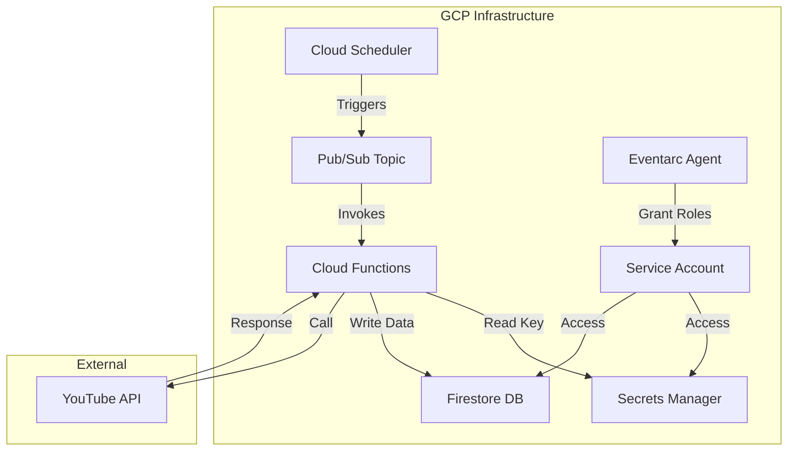

# 音声ボタンサービス計画: YouTube動画情報取得バッチ (実装完了)

## 1. 設計概要

### 1.1. 全体アーキテクチャ

以下の図は、実装された機能の主要なコンポーネントとデータの流れを示しています。

**主要コンポーネント:**

- **Cloud Scheduler:** 1時間に1回、定期的にジョブを実行します。
- **Pub/Sub:** Schedulerからのトリガーを受け取り、Cloud Functionsを起動します。
- **Cloud Functions (`fetchYouTubeVideos`):** Pub/Subトリガー (Eventarc経由) で起動し、YouTube Data APIを呼び出して動画情報を取得し、Firestoreに保存します。
  - **実装注記:** 当初 `firebase-functions` の `onMessagePublished` ラッパーを使用予定でしたが、イベント形式の互換性問題が発生したため、最終的に標準的な CloudEvent ハンドラ (`async (event: CloudEvent<...>) => ...`) を使用し、イベントデータを手動で解析する形式で実装しました。
- **Secrets Manager:** YouTube Data APIキーを安全に保管・管理します。
- **Firestore:** 取得したYouTube動画情報を格納するデータベースです。
- **Service Account:** `fetchYouTubeVideos` 関数がGCPリソース（Secrets Manager, Firestore）にアクセスするための専用IDと権限です。
- **YouTube Data API:** Googleが提供するAPIで、YouTubeチャンネルの動画情報を取得します。

### 1.2. Cloud Functions (`fetchYouTubeVideos`) の詳細

- **トリガー:** Pub/Sub トピック (`youtube-video-fetch-trigger`) via Eventarc
- **ランタイム:** Node.js 20
- **主な処理:**
    1. 起動時にSecrets Managerから `YOUTUBE_API_KEY` を取得します (環境変数経由)。
    2. 取得したAPIキーを使用して `googleapis` ライブラリでYouTube Data APIクライアントを初期化します。
    3. 指定されたチャンネルID (`UChiMMOhl6FpzjoRqvZ5rcaA`) の動画一覧を取得します。
        - `search.list` APIでチャンネル内の動画IDを取得します (ページネーション対応)。
        - `videos.list` APIで各動画の詳細情報（タイトル、公開日時、サムネイルURL、チャンネル情報など）を取得します。
    4. 取得した動画情報をFirestoreの `videos` コレクションに保存します。
        - ドキュメントIDにはYouTubeの動画IDを使用します。
        - 既存の動画情報があれば更新し (`merge: true`)、なければ新規作成します。
        - `lastFetchedAt` タイムスタンプも記録します。
    5. エラーハンドリングと適切なロギングを行います。

### 1.3. Firestore データモデル

- **コレクション:** `videos`
- **ドキュメントID:** `{youtubeVideoId}` (例: `dQw4w9WgXcQ`)
- **フィールド:**
  - `videoId`: string (YouTube Video ID)
  - `title`: string (動画タイトル)
  - `description`: string (動画説明文)
  - `publishedAt`: timestamp (Firebase Timestamp - 公開日時)
  - `thumbnailUrl`: string (デフォルトサムネイルURL)
  - `channelId`: string (チャンネルID - `UChiMMOhl6FpzjoRqvZ5rcaA`)
  - `channelTitle`: string (チャンネルタイトル - "涼花みなせ / Suzuka Minase")
  - `lastFetchedAt`: timestamp (Firebase Timestamp - このFunctionで最後に取得/更新した日時)

### 1.4. インフラストラクチャ (Terraform管理)

以下のリソースをTerraformで定義・管理しました。

- **Firestore Database:** `google_firestore_database`
- **Secrets Manager Secret:** `YOUTUBE_API_KEY` 用の `google_secret_manager_secret`
- **Service Account:** `fetchYouTubeVideos` 関数用の `google_service_account`
- **IAM Bindings:**
  - 関数SAへの `roles/datastore.user`, `roles/secretmanager.secretAccessor`, `roles/logging.logWriter`, `roles/run.invoker` 権限付与。
  - Scheduler SAへの `roles/pubsub.publisher` 権限付与。
  - Pub/Sub SAへの `roles/iam.serviceAccountTokenCreator` 権限付与 (対関数SA)。
  - Eventarc SAへの `roles/eventarc.eventReceiver`, `roles/run.invoker` 権限付与 (プロジェクトレベル)。
- **Pub/Sub Topic:** `youtube-video-fetch-trigger` 用の `google_pubsub_topic`
- **Cloud Functions Function:** `fetchYouTubeVideos` 用の `google_cloudfunctions2_function` (Pub/Subトリガー設定を含む)
- **Cloud Scheduler Job:** 1時間に1回 `youtube-video-fetch-trigger` トピックにメッセージを発行する `google_cloud_scheduler_job`
