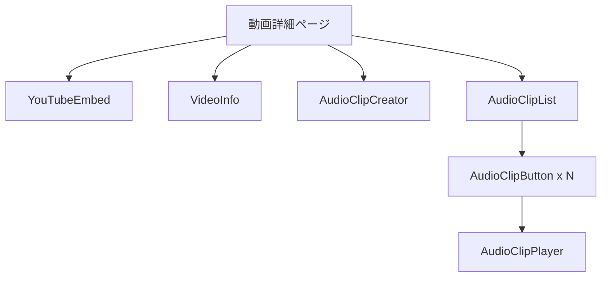

# 音声クリップ機能設計書

このドキュメントでは、suzumina.click プロジェクトにおける音声クリップ機能の設計について詳細に記述します。

## 1. 概要

動画から特定の音声部分を切り出し、ボタンとして再生できる「音声クリップ機能」を実装します。具体的には以下の機能を提供します：

1. 動画視聴中に特定の区間（開始時間と終了時間）を指定して音声クリップを作成
2. 作成したクリップにタイトルやフレーズテキストを付与
3. 動画詳細ページに音声クリップボタンを表示
4. ボタンをクリックすると対応する音声を再生
5. ログインユーザーと紐づけ、クリップの作成者情報を表示

## 2. データモデル

### 2.1 音声クリップのデータモデル


### 2.2 型定義

```typescript
// apps/web/src/lib/audioclips/types.ts

import type { Timestamp } from "firebase/firestore";

/**
 * Firestoreから取得した音声クリップデータの型
 */
export interface AudioClipData {
  clipId: string;           // クリップID（自動生成）
  videoId: string;          // 関連動画ID
  title: string;            // クリップタイトル
  phrase: string;           // フレーズテキスト
  startTime: number;        // 開始時間（秒）
  endTime: number;          // 終了時間（秒）
  audioUrl?: string;        // 音声ファイルURL（オプション）
  createdAt: Timestamp;     // 作成日時
  updatedAt: Timestamp;     // 更新日時
  
  // ユーザー関連情報
  userId: string;           // 作成者のユーザーID
  userName: string;         // 作成者の表示名
  userPhotoURL?: string;    // 作成者のプロフィール画像URL
  isPublic: boolean;        // 公開設定（true: 全体公開, false: 作成者のみ）
  
  // 追加情報
  tags?: string[];          // タグ（検索用）
  playCount: number;        // 再生回数
  favoriteCount: number;    // お気に入り数
}

/**
 * アプリケーション内で使用する音声クリップの型
 */
export interface AudioClip {
  id: string;               // クリップID
  videoId: string;          // 関連動画ID
  title: string;            // クリップタイトル
  phrase: string;           // フレーズテキスト
  startTime: number;        // 開始時間（秒）
  endTime: number;          // 終了時間（秒）
  audioUrl?: string;        // 音声ファイルURL（オプション）
  createdAt: Date;          // 作成日時
  updatedAt: Date;          // 更新日時
  
  // ユーザー関連情報
  userId: string;           // 作成者のユーザーID
  userName: string;         // 作成者の表示名
  userPhotoURL?: string;    // 作成者のプロフィール画像URL
  isPublic: boolean;        // 公開設定
  
  // 追加情報
  tags?: string[];          // タグ（検索用）
  playCount: number;        // 再生回数
  favoriteCount: number;    // お気に入り数
  
  // UI表示用の追加情報
  duration: number;         // 再生時間（秒）
  formattedDuration: string; // フォーマット済み再生時間（例: "0:15"）
}

/**
 * お気に入り登録データの型
 */
export interface AudioClipFavorite {
  userId: string;           // ユーザーID
  clipId: string;           // クリップID
  createdAt: Timestamp;     // 登録日時
}

/**
 * 音声クリップ検索パラメータ
 */
export interface AudioClipSearchParams {
  videoId?: string;         // 特定の動画のクリップのみ取得
  userId?: string;          // 特定のユーザーのクリップのみ取得
  tags?: string[];          // 特定のタグを持つクリップのみ取得
  query?: string;           // フレーズやタイトルで検索
  limit: number;            // 取得件数
  startAfter?: Date;        // ページネーション用
  includePrivate?: boolean; // 非公開クリップも含めるか（自分のクリップ取得時のみtrue）
}

/**
 * 音声クリップ一覧の取得結果
 */
export interface AudioClipListResult {
  clips: AudioClip[];       // クリップ一覧
  hasMore: boolean;         // さらにデータがあるか
  lastClip?: AudioClip;     // 最後のクリップ（ページネーション用）
}
```

### 2.3 Firestore セキュリティルール

```javascript
// firestore.rules に追加

// audioClips コレクション
match /audioClips/{clipId} {
  // 読み取り権限: 公開クリップは全員、非公開クリップは作成者のみ
  allow read: if resource.data.isPublic == true || 
              (request.auth != null && resource.data.userId == request.auth.uid);
  
  // 作成権限: 認証済みユーザーのみ、自分のユーザー情報のみ設定可能
  allow create: if request.auth != null && 
                request.resource.data.userId == request.auth.uid;
  
  // 更新権限: 作成者のみ、特定フィールドのみ更新可能
  allow update: if request.auth != null && 
                resource.data.userId == request.auth.uid &&
                request.resource.data.userId == request.auth.uid &&
                request.resource.data.videoId == resource.data.videoId;
  
  // 削除権限: 作成者のみ
  allow delete: if request.auth != null && 
                resource.data.userId == request.auth.uid;
}

// audioClipFavorites コレクション
match /audioClipFavorites/{favoriteId} {
  // 読み取り権限: 関連ユーザーのみ
  allow read: if request.auth != null && 
              resource.data.userId == request.auth.uid;
  
  // 作成権限: 認証済みユーザーのみ、自分のIDのみ設定可能
  allow create: if request.auth != null && 
                request.resource.data.userId == request.auth.uid;
  
  // 削除権限: 作成者のみ
  allow delete: if request.auth != null && 
                resource.data.userId == request.auth.uid;
}
```

## 3. コンポーネント設計

### 3.1 ファイル構造

```
apps/web/
├── src/
│   ├── app/
│   │   ├── videos/
│   │   │   └── [videoId]/
│   │   │       └── page.tsx            # 動画詳細ページ（音声クリップ一覧を含む）
│   │   └── api/
│   │       └── audioclips/
│   │           ├── route.ts            # 音声クリップAPI
│   │           └── [clipId]/
│   │               └── route.ts        # 個別クリップAPI
│   ├── components/
│   │   └── audioclips/                 # 音声クリップ関連コンポーネント
│   │       ├── AudioClipButton.tsx     # 音声クリップボタン
│   │       ├── AudioClipCreator.tsx    # 音声クリップ作成フォーム
│   │       ├── AudioClipList.tsx       # 音声クリップ一覧
│   │       └── AudioClipPlayer.tsx     # 音声クリップ再生コンポーネント
│   └── lib/
│       └── audioclips/                 # 音声クリップ関連ロジック
│           ├── types.ts                # 型定義
│           ├── api.ts                  # クライアントAPI
│           └── utils.ts                # ユーティリティ関数
```

### 3.2 コンポーネント構成



### 3.3 主要コンポーネントの役割

#### AudioClipButton
- 音声クリップを表すボタンコンポーネント
- クリップのタイトル、作成者、再生時間を表示
- クリック時に音声を再生
- お気に入り登録/解除機能

#### AudioClipCreator
- 音声クリップを作成するフォームコンポーネント
- 開始時間・終了時間の設定（現在の再生位置から取得）
- タイトル、フレーズテキスト、公開設定の入力
- プレビュー機能
- 作成ボタン

#### AudioClipList
- 特定の動画に関連する音声クリップ一覧を表示
- ページネーション機能
- フィルタリング機能（人気順、新着順など）

#### AudioClipPlayer
- 音声クリップを再生するコンポーネント
- 再生/一時停止ボタン
- 再生位置表示
- 音量調整

## 4. API設計

### 4.1 クライアントAPI

```typescript
// apps/web/src/lib/audioclips/api.ts

// 主要な関数
export async function getAudioClipsByVideo(params: AudioClipSearchParams): Promise<AudioClipListResult>;
export async function getAudioClipsByUser(params: AudioClipSearchParams): Promise<AudioClipListResult>;
export async function createAudioClip(data: AudioClipCreateData): Promise<AudioClip>;
export async function updateAudioClip(clipId: string, data: Partial<AudioClipUpdateData>): Promise<void>;
export async function deleteAudioClip(clipId: string): Promise<void>;
export async function incrementPlayCount(clipId: string): Promise<void>;
export async function toggleFavorite(clipId: string, userId: string, isFavorite: boolean): Promise<void>;
```

### 4.2 サーバーサイドAPI

```typescript
// apps/web/src/app/api/audioclips/route.ts

// GET: 音声クリップ一覧取得
// パラメータ: videoId, userId, limit, startAfter, includePrivate

// POST: 音声クリップ作成
// ボディ: videoId, title, phrase, startTime, endTime, isPublic, tags

// apps/web/src/app/api/audioclips/[clipId]/route.ts

// GET: 特定の音声クリップ取得

// PATCH: 音声クリップ更新
// ボディ: title, phrase, isPublic, tags

// DELETE: 音声クリップ削除

// POST /play: 再生回数インクリメント

// POST /favorite: お気に入り登録/解除
```

## 5. 実装フェーズ

### フェーズ1: データモデルとAPI実装
- 型定義の作成 (`src/lib/audioclips/types.ts`)
- Firestoreセキュリティルールの更新
- クライアントAPIの実装 (`src/lib/audioclips/api.ts`)
- サーバーサイドAPIの実装 (`src/app/api/audioclips/route.ts`)

### フェーズ2: 基本UIコンポーネント実装
- AudioClipButtonコンポーネントの実装
- AudioClipPlayerコンポーネントの実装
- AudioClipListコンポーネントの実装
- 動画詳細ページへの統合

### フェーズ3: 音声クリップ作成機能実装
- AudioClipCreatorコンポーネントの実装
- YouTubeプレーヤーとの連携
- プレビュー機能の実装

### フェーズ4: 拡張機能実装
- お気に入り機能の実装
- タグ機能の実装
- 検索・フィルタリング機能の実装

## 6. 技術的考慮事項

### 6.1 音声再生方法

音声クリップの再生には、以下の2つの方法を検討します：

1. **YouTube Player APIを利用する方法**
   - YouTubeプレーヤーの特定の時間から再生を開始し、指定時間で停止
   - メリット: 追加のストレージが不要、YouTubeの著作権ポリシーに準拠
   - デメリット: プレーヤーの読み込みが必要、UIが制限される

2. **音声ファイルを抽出して保存する方法**
   - Cloud Functionsで動画から音声を抽出し、Cloud Storageに保存
   - メリット: 高速な再生、カスタムUIの実装が容易
   - デメリット: ストレージコストの増加、著作権の問題

初期実装では、シンプルさと著作権の観点から**YouTube Player APIを利用する方法**を採用します。

### 6.2 パフォーマンス最適化

- 音声クリップデータのキャッシング
- ページネーションによるデータ量の制限
- 遅延読み込み（Lazy Loading）の実装

### 6.3 セキュリティ考慮事項

- ユーザー認証の確認
- Firestoreセキュリティルールの適切な設定
- APIエンドポイントでの入力バリデーション

## 7. 将来的な拡張性

- 音声クリップのエクスポート機能
- 共有機能（SNSへの投稿）
- 高度な検索機能（音声認識による検索など）
- ユーザープロフィールページでの作成クリップ一覧表示