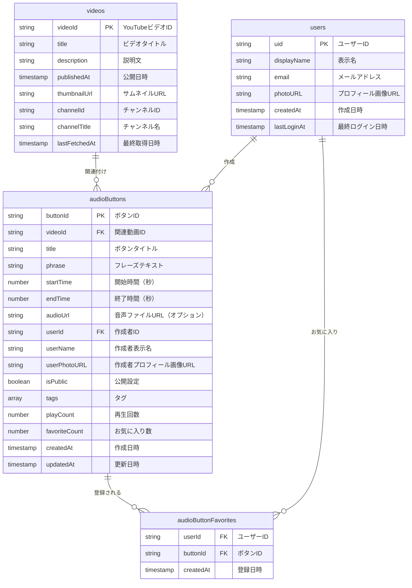
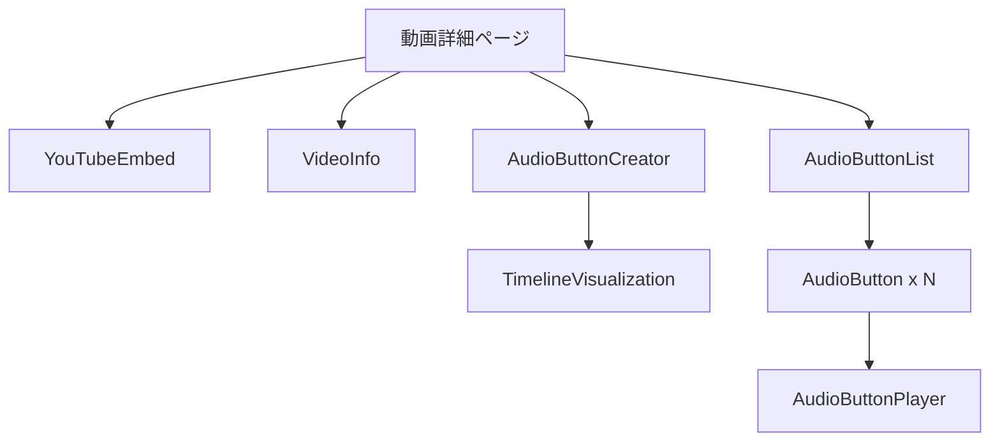

# 音声ボタン機能設計書

このドキュメントでは、suzumina.click プロジェクトにおける音声ボタン機能の設計について詳細に記述します。

## 1. 概要

動画から特定の音声部分を切り出し、ボタンとして再生できる「音声ボタン機能」を実装します。具体的には以下の機能を提供します：

1. 動画視聴中に特定の区間（開始時間と終了時間）を指定して音声ボタンを作成
2. 作成したボタンにタイトルやフレーズテキストを付与
3. 動画詳細ページに音声ボタンを表示
4. ボタンをクリックすると対応する音声を再生
5. ログインユーザーと紐づけ、ボタンの作成者情報を表示
6. 同一動画内で時間帯が重複する音声ボタンの作成を防止
7. 動画タイムライン上の既存音声ボタンの範囲を可視化

## 2. データモデル

### 2.1 音声ボタンのデータモデル



### 2.2 型定義

```typescript
// apps/web/src/lib/audiobuttons/types.ts

import type { Timestamp } from "firebase/firestore";

/**
 * Firestoreから取得した音声ボタンデータの型
 */
export interface AudioButtonData {
  buttonId: string;        // ボタンID（自動生成）
  videoId: string;         // 関連動画ID
  title: string;           // ボタンタイトル
  phrase: string;          // フレーズテキスト
  startTime: number;       // 開始時間（秒）
  endTime: number;         // 終了時間（秒）
  audioUrl?: string;       // 音声ファイルURL（オプション）
  createdAt: Timestamp;    // 作成日時
  updatedAt: Timestamp;    // 更新日時
  
  // ユーザー関連情報
  userId: string;          // 作成者のユーザーID
  userName: string;        // 作成者の表示名
  userPhotoURL?: string;   // 作成者のプロフィール画像URL
  isPublic: boolean;       // 公開設定（true: 全体公開, false: 作成者のみ）
  
  // 追加情報
  tags?: string[];         // タグ（検索用）
  playCount: number;       // 再生回数
  favoriteCount: number;   // お気に入り数
}

/**
 * アプリケーション内で使用する音声ボタンの型
 */
export interface AudioButton {
  id: string;              // ボタンID
  videoId: string;         // 関連動画ID
  title: string;           // ボタンタイトル
  phrase: string;          // フレーズテキスト
  startTime: number;       // 開始時間（秒）
  endTime: number;         // 終了時間（秒）
  audioUrl?: string;       // 音声ファイルURL（オプション）
  createdAt: Date;         // 作成日時
  updatedAt: Date;         // 更新日時
  
  // ユーザー関連情報
  userId: string;          // 作成者のユーザーID
  userName: string;        // 作成者の表示名
  userPhotoURL?: string;   // 作成者のプロフィール画像URL
  isPublic: boolean;       // 公開設定
  
  // 追加情報
  tags?: string[];         // タグ（検索用）
  playCount: number;       // 再生回数
  favoriteCount: number;   // お気に入り数
  
  // UI表示用の追加情報
  duration: number;        // 再生時間（秒）
  formattedDuration: string; // フォーマット済み再生時間（例: "0:15"）
}

/**
 * お気に入り登録データの型
 */
export interface AudioButtonFavorite {
  userId: string;          // ユーザーID
  buttonId: string;        // ボタンID
  createdAt: Timestamp;    // 登録日時
}

/**
 * 音声ボタン検索パラメータ
 */
export interface AudioButtonSearchParams {
  videoId?: string;        // 特定の動画のボタンのみ取得
  userId?: string;         // 特定のユーザーのボタンのみ取得
  tags?: string[];         // 特定のタグを持つボタンのみ取得
  query?: string;          // フレーズやタイトルで検索
  limit: number;           // 取得件数
  startAfter?: Date;       // ページネーション用
  includePrivate?: boolean; // 非公開ボタンも含めるか（自分のボタン取得時のみtrue）
}

/**
 * 音声ボタン一覧の取得結果
 */
export interface AudioButtonListResult {
  buttons: AudioButton[];  // ボタン一覧
  hasMore: boolean;        // さらにデータがあるか
  lastButton?: AudioButton; // 最後のボタン（ページネーション用）
}

/**
 * タイムライン上の時間範囲の型
 * 作成済み音声ボタンの範囲を表示するために使用
 */
export interface TimeRange {
  start: number;           // 開始時間（秒）
  end: number;             // 終了時間（秒）
  buttonId: string;        // 関連するボタンID
  title: string;           // ボタンのタイトル
  color?: string;          // 表示色（オプション）
}

/**
 * 重複チェック結果の型
 */
export interface OverlapCheckResult {
  isOverlapping: boolean;  // 重複しているかどうか
  overlappingButtons: AudioButton[]; // 重複しているボタンのリスト
}
```

### 2.3 Firestore セキュリティルール

```javascript
// firestore.rules に追加

// audioButtons コレクション
match /audioButtons/{buttonId} {
  // 読み取り権限: 公開ボタンは全員、非公開ボタンは作成者のみ
  allow read: if resource.data.isPublic == true || 
              (request.auth != null && resource.data.userId == request.auth.uid);
  
  // 作成権限: 認証済みユーザーのみ、自分のユーザー情報のみ設定可能
  allow create: if request.auth != null && 
                request.resource.data.userId == request.auth.uid;
  
  // 更新権限: 作成者のみ、特定フィールドのみ更新可能
  allow update: if request.auth != null && 
                resource.data.userId == request.auth.uid &&
                request.resource.data.userId == request.auth.uid &&
                request.resource.data.videoId == resource.data.videoId;
  
  // 削除権限: 作成者のみ
  allow delete: if request.auth != null && 
                resource.data.userId == request.auth.uid;
}

// audioButtonFavorites コレクション
match /audioButtonFavorites/{favoriteId} {
  // 読み取り権限: 関連ユーザーのみ
  allow read: if request.auth != null && 
              resource.data.userId == request.auth.uid;
  
  // 作成権限: 認証済みユーザーのみ、自分のIDのみ設定可能
  allow create: if request.auth != null && 
                request.resource.data.userId == request.auth.uid;
  
  // 削除権限: 作成者のみ
  allow delete: if request.auth != null && 
                resource.data.userId == request.auth.uid;
}
```

## 3. コンポーネント設計

### 3.1 ファイル構造

```
apps/web/
├── src/
│   ├── app/
│   │   ├── videos/
│   │   │   └── [videoId]/
│   │   │       └── page.tsx            # 動画詳細ページ（音声ボタン一覧を含む）
│   │   └── api/
│   │       └── audiobuttons/
│   │           ├── route.ts            # 音声ボタンAPI
│   │           └── [buttonId]/
│   │               └── route.ts        # 個別ボタンAPI
│   ├── components/
│   │   └── audiobuttons/               # 音声ボタン関連コンポーネント
│   │       ├── AudioButton.tsx         # 音声ボタン
│   │       ├── AudioButtonCreator.tsx  # 音声ボタン作成フォーム
│   │       ├── AudioButtonList.tsx     # 音声ボタン一覧
│   │       ├── AudioButtonPlayer.tsx   # 音声ボタン再生コンポーネント
│   │       └── TimelineVisualization.tsx # タイムライン可視化コンポーネント
│   └── lib/
│       └── audiobuttons/               # 音声ボタン関連ロジック
│           ├── types.ts                # 型定義
│           ├── api.ts                  # クライアントAPI
│           ├── utils.ts                # ユーティリティ関数
│           └── validation.ts           # 重複チェックなどのバリデーション
```

### 3.2 コンポーネント構成



### 3.3 主要コンポーネントの役割

#### AudioButton
- 音声ボタンを表すボタンコンポーネント
- ボタンのタイトル、作成者、再生時間を表示
- クリック時に音声を再生
- お気に入り登録/解除機能

#### AudioButtonCreator
- 音声ボタンを作成するフォームコンポーネント
- 開始時間・終了時間の設定（現在の再生位置から取得）
- タイトル、フレーズテキスト、公開設定の入力
- プレビュー機能
- 作成ボタン
- **重複チェック機能**（新規追加）
- **タイムライン可視化との連携**（新規追加）

#### AudioButtonList
- 特定の動画に関連する音声ボタン一覧を表示
- ページネーション機能
- フィルタリング機能（人気順、新着順など）

#### AudioButtonPlayer
- 音声ボタンを再生するコンポーネント
- 再生/一時停止ボタン
- 再生位置表示
- 音量調整

#### TimelineVisualization（新規コンポーネント）
- 動画のタイムライン上に既存の音声ボタンの範囲を可視化
- 異なる色で各ボタンの範囲を表示
- マウスオーバーで詳細表示
- クリックで対応する音声ボタンにジャンプ
- ドラッグ操作による時間範囲の選択をサポート

## 4. 重複防止機能の設計

### 4.1 重複チェックロジック

```typescript
// apps/web/src/lib/audiobuttons/validation.ts

/**
 * 音声ボタンの時間範囲が既存のボタンと重複するかチェックする関数
 * @param videoId 動画ID
 * @param startTime 開始時間（秒）
 * @param endTime 終了時間（秒）
 * @param excludeButtonId 除外するボタンID（更新時に自分自身を除外）
 * @returns 重複チェック結果
 */
export async function checkTimeRangeOverlap(
  videoId: string,
  startTime: number,
  endTime: number,
  excludeButtonId?: string
): Promise<OverlapCheckResult> {
  // 同じ動画の全ての音声ボタンを取得
  const existingButtons = await getAudioButtonsByVideo({ videoId, limit: 1000 });
  
  // 重複チェック
  const overlappingButtons = existingButtons.buttons.filter(button => {
    // 更新時は自分自身を除外
    if (excludeButtonId && button.id === excludeButtonId) {
      return false;
    }
    
    // 以下の条件で重複と判定
    // 1. 新規範囲が既存範囲に完全に含まれる
    // 2. 新規範囲が既存範囲を完全に含む
    // 3. 新規範囲の開始点が既存範囲内にある
    // 4. 新規範囲の終了点が既存範囲内にある
    return (
      (startTime >= button.startTime && startTime < button.endTime) || 
      (endTime > button.startTime && endTime <= button.endTime) ||
      (startTime <= button.startTime && endTime >= button.endTime)
    );
  });
  
  return {
    isOverlapping: overlappingButtons.length > 0,
    overlappingButtons
  };
}

/**
 * 指定された動画の全ての音声ボタンの時間範囲を取得する関数
 * @param videoId 動画ID
 * @returns 時間範囲の配列
 */
export async function getVideoTimeRanges(videoId: string): Promise<TimeRange[]> {
  // 同じ動画の全ての音声ボタンを取得
  const buttonList = await getAudioButtonsByVideo({ videoId, limit: 1000 });
  
  // TimeRange形式に変換
  return buttonList.buttons.map(button => ({
    start: button.startTime,
    end: button.endTime,
    buttonId: button.id,
    title: button.title
  }));
}
```

### 4.2 サーバーサイドバリデーション

```typescript
// apps/web/src/app/api/audiobuttons/route.ts (POST部分)

// POST: 音声ボタン作成
export async function POST(request: Request) {
  // ユーザー認証チェック
  const user = await getCurrentUser();
  if (!user) {
    return Response.json({ error: "認証が必要です" }, { status: 401 });
  }
  
  // リクエストボディの解析
  const data = await request.json();
  
  // バリデーション
  if (!data.videoId || !data.title || data.startTime === undefined || data.endTime === undefined) {
    return Response.json({ error: "必須項目が不足しています" }, { status: 400 });
  }
  
  if (data.endTime <= data.startTime) {
    return Response.json({ error: "終了時間は開始時間よりも後である必要があります" }, { status: 400 });
  }
  
  // 重複チェック
  const overlapCheck = await checkTimeRangeOverlap(
    data.videoId,
    data.startTime,
    data.endTime
  );
  
  if (overlapCheck.isOverlapping) {
    return Response.json({
      error: "指定した時間範囲が既存のボタンと重複しています",
      overlappingButtons: overlapCheck.overlappingButtons
    }, { status: 409 });  // 409 Conflictを返す
  }
  
  // ボタン作成処理
  // ...（以降は既存の処理）
}
```

## 5. タイムライン可視化コンポーネントの設計

### 5.1 TimelineVisualization コンポーネント

```typescript
// apps/web/src/components/audiobuttons/TimelineVisualization.tsx

import { useState, useEffect, useRef } from 'react';
import { TimeRange } from '@/lib/audiobuttons/types';
import { getVideoTimeRanges } from '@/lib/audiobuttons/validation';

interface TimelineVisualizationProps {
  videoId: string;
  videoDuration: number; // 動画の総再生時間（秒）
  currentTime?: number;  // 現在の再生位置（秒）
  onRangeSelect?: (start: number, end: number) => void;
  onButtonClick?: (buttonId: string) => void;
}

export default function TimelineVisualization({
  videoId,
  videoDuration,
  currentTime,
  onRangeSelect,
  onButtonClick
}: TimelineVisualizationProps) {
  const [timeRanges, setTimeRanges] = useState<TimeRange[]>([]);
  const [isLoading, setIsLoading] = useState(true);
  const [selectedRange, setSelectedRange] = useState<{start: number, end: number} | null>(null);
  const timelineRef = useRef<HTMLDivElement>(null);

  // 時間範囲データの取得
  useEffect(() => {
    async function fetchTimeRanges() {
      setIsLoading(true);
      try {
        const ranges = await getVideoTimeRanges(videoId);
        setTimeRanges(ranges);
      } catch (error) {
        console.error("時間範囲の取得に失敗しました:", error);
      } finally {
        setIsLoading(false);
      }
    }
    
    fetchTimeRanges();
  }, [videoId]);
  
  // 秒数をタイムライン上の位置（パーセント）に変換
  const secondsToPercent = (seconds: number) => {
    return (seconds / videoDuration) * 100;
  };
  
  // 選択範囲のスタイル
  const getSelectedRangeStyle = () => {
    if (!selectedRange) return {};
    
    return {
      left: `${secondsToPercent(selectedRange.start)}%`,
      width: `${secondsToPercent(selectedRange.end - selectedRange.start)}%`,
      backgroundColor: 'rgba(255, 255, 0, 0.3)'
    };
  };
  
  // タイムライン上でのドラッグ操作処理
  const handleTimelineInteraction = () => {
    // マウスイベントによる範囲選択の実装
    // ...
  };
  
  // レンダリング
  return (
    <div className="w-full mt-4 mb-2">
      <h3 className="text-sm font-medium mb-1">タイムライン</h3>
      
      <div 
        ref={timelineRef}
        className="relative h-8 bg-gray-200 rounded w-full cursor-pointer"
        onClick={handleTimelineInteraction}
      >
        {/* 現在再生位置マーカー */}
        {currentTime !== undefined && (
          <div 
            className="absolute top-0 h-full w-0.5 bg-red-500 z-20"
            style={{ left: `${secondsToPercent(currentTime)}%` }}
          />
        )}
        
        {/* 既存の音声ボタン範囲の表示 */}
        {timeRanges.map(range => (
          <div
            key={range.buttonId}
            className="absolute h-full rounded"
            style={{
              left: `${secondsToPercent(range.start)}%`,
              width: `${secondsToPercent(range.end - range.start)}%`,
              backgroundColor: range.color || 'rgba(59, 130, 246, 0.5)',
              zIndex: 10
            }}
            title={`${range.title} (${formatTime(range.start)} - ${formatTime(range.end)})`}
            onClick={(e) => {
              e.stopPropagation();
              onButtonClick?.(range.buttonId);
            }}
          />
        ))}
        
        {/* 選択中の範囲 */}
        {selectedRange && (
          <div
            className="absolute h-full z-15"
            style={getSelectedRangeStyle()}
          />
        )}
        
        {/* 時間マーカー（10秒ごと） */}
        {Array.from({ length: Math.floor(videoDuration / 10) }).map((_, i) => (
          <div
            key={`marker-${i}`}
            className="absolute h-2 w-px bg-gray-400 bottom-0"
            style={{ left: `${secondsToPercent((i + 1) * 10)}%` }}
          />
        ))}
      </div>
      
      {/* 時間表示（開始・中間・終了） */}
      <div className="flex justify-between text-xs mt-1 text-gray-600">
        <span>0:00</span>
        <span>{formatTime(videoDuration / 2)}</span>
        <span>{formatTime(videoDuration)}</span>
      </div>
      
      {isLoading && <p className="text-sm text-gray-500">タイムラインデータを読み込み中...</p>}
    </div>
  );
}

// 秒数を MM:SS 形式にフォーマットする関数
function formatTime(seconds: number): string {
  const mins = Math.floor(seconds / 60);
  const secs = Math.floor(seconds % 60);
  return `${mins}:${secs.toString().padStart(2, '0')}`;
}
```

### 5.2 AudioButtonCreator との連携

```typescript
// apps/web/src/components/audiobuttons/AudioButtonCreator.tsx（一部抜粋）

export default function AudioButtonCreator({ videoId, playerRef }) {
  // 状態管理
  const [startTime, setStartTime] = useState(0);
  const [endTime, setEndTime] = useState(0);
  const [title, setTitle] = useState('');
  const [phrase, setPhrase] = useState('');
  const [isPublic, setIsPublic] = useState(true);
  const [isCreating, setIsCreating] = useState(false);
  const [error, setError] = useState<string | null>(null);
  const [overlapError, setOverlapError] = useState<OverlapCheckResult | null>(null);
  
  // タイムライン上での範囲選択ハンドラ
  const handleRangeSelect = (start: number, end: number) => {
    setStartTime(start);
    setEndTime(end);
    
    // 範囲選択時に重複チェックを行う
    checkOverlap(start, end);
  };
  
  // 重複チェック関数
  const checkOverlap = async (start: number, end: number) => {
    try {
      const result = await checkTimeRangeOverlap(videoId, start, end);
      if (result.isOverlapping) {
        setOverlapError(result);
      } else {
        setOverlapError(null);
      }
    } catch (error) {
      console.error("重複チェックに失敗しました:", error);
    }
  };
  
  // 作成ボタン押下時の処理
  const handleCreate = async () => {
    // バリデーション
    if (!title) {
      setError("タイトルを入力してください");
      return;
    }
    
    if (endTime <= startTime) {
      setError("終了時間は開始時間よりも後である必要があります");
      return;
    }
    
    // 最終重複チェック
    const overlapCheck = await checkTimeRangeOverlap(videoId, startTime, endTime);
    if (overlapCheck.isOverlapping) {
      setOverlapError(overlapCheck);
      setError("指定した時間範囲が既存のボタンと重複しています");
      return;
    }
    
    setIsCreating(true);
    setError(null);
    
    try {
      // ボタン作成処理
      // ...（以降は既存の処理）
    } catch (error) {
      // エラー処理
    } finally {
      setIsCreating(false);
    }
  };
  
  return (
    <div className="mb-8 p-4 border rounded-lg bg-gray-50">
      <h2 className="text-lg font-bold mb-4">音声ボタンを作成</h2>
      
      {/* タイムライン可視化コンポーネント */}
      <TimelineVisualization
        videoId={videoId}
        videoDuration={playerRef?.current?.getDuration() || 0}
        currentTime={playerRef?.current?.getCurrentTime() || 0}
        onRangeSelect={handleRangeSelect}
      />
      
      {/* 重複エラー表示 */}
      {overlapError && overlapError.isOverlapping && (
        <div className="mt-2 p-2 bg-red-100 border border-red-300 rounded text-sm text-red-700">
          <p className="font-bold">選択した時間範囲が既存のボタンと重複しています：</p>
          <ul className="list-disc list-inside mt-1">
            {overlapError.overlappingButtons.map(button => (
              <li key={button.id}>
                "{button.title}" ({formatTime(button.startTime)} - {formatTime(button.endTime)})
              </li>
            ))}
          </ul>
        </div>
      )}
      
      {/* 以下、既存のフォーム要素 */}
      {/* ... */}
    </div>
  );
}
```

## 6. API設計

### 6.1 クライアントAPI

```typescript
// apps/web/src/lib/audiobuttons/api.ts

// 主要な関数
export async function getAudioButtonsByVideo(params: AudioButtonSearchParams): Promise<AudioButtonListResult>;
export async function getAudioButtonsByUser(params: AudioButtonSearchParams): Promise<AudioButtonListResult>;
export async function createAudioButton(data: AudioButtonCreateData): Promise<AudioButton>;
export async function updateAudioButton(buttonId: string, data: Partial<AudioButtonUpdateData>): Promise<void>;
export async function deleteAudioButton(buttonId: string): Promise<void>;
export async function incrementPlayCount(buttonId: string): Promise<void>;
export async function toggleFavorite(buttonId: string, userId: string, isFavorite: boolean): Promise<void>;
```

### 6.2 サーバーサイドAPI

```typescript
// apps/web/src/app/api/audiobuttons/route.ts

// GET: 音声ボタン一覧取得
// パラメータ: videoId, userId, limit, startAfter, includePrivate

// POST: 音声ボタン作成（重複チェック機能追加）
// ボディ: videoId, title, phrase, startTime, endTime, isPublic, tags

// apps/web/src/app/api/audiobuttons/[buttonId]/route.ts

// GET: 特定の音声ボタン取得

// PATCH: 音声ボタン更新（重複チェック機能追加）
// ボディ: title, phrase, isPublic, tags

// DELETE: 音声ボタン削除

// POST /play: 再生回数インクリメント

// POST /favorite: お気に入り登録/解除
```

## 7. 実装フェーズ

### フェーズ1: データモデルとAPI更新
- 型定義の更新 (`src/lib/audiobuttons/types.ts`)
- Firestoreセキュリティルールの更新
- クライアントAPIの更新 (`src/lib/audiobuttons/api.ts`)
- サーバーサイドAPIの更新 (`src/app/api/audiobuttons/route.ts`)

### フェーズ2: 重複チェック機能の実装
- バリデーションロジックの実装 (`src/lib/audiobuttons/validation.ts`)
- サーバーサイドAPIに重複チェック追加
- 重複エラー表示UIの実装

### フェーズ3: タイムライン可視化の実装
- TimelineVisualizationコンポーネントの実装
- AudioButtonCreatorとの連携
- ドラッグによる範囲選択機能の実装

### フェーズ4: 既存コンポーネントの更新
- AudioButtonコンポーネントのリネームと更新
- AudioButtonListコンポーネントの更新
- 動画詳細ページへの統合

## 8. 技術的考慮事項

### 8.1 音声再生方法

音声ボタンの再生には、以下の2つの方法を検討します：

1. **YouTube Player APIを利用する方法**
   - YouTubeプレーヤーの特定の時間から再生を開始し、指定時間で停止
   - メリット: 追加のストレージが不要、YouTubeの著作権ポリシーに準拠
   - デメリット: プレーヤーの読み込みが必要、UIが制限される

2. **音声ファイルを抽出して保存する方法**
   - Cloud Functionsで動画から音声を抽出し、Cloud Storageに保存
   - メリット: 高速な再生、カスタムUIの実装が容易
   - デメリット: ストレージコストの増加、著作権の問題

初期実装では、シンプルさと著作権の観点から**YouTube Player APIを利用する方法**を採用します。

### 8.2 パフォーマンス最適化

- 音声ボタンデータのキャッシング
- ページネーションによるデータ量の制限
- タイムライン可視化のレンダリング最適化
- 遅延読み込み（Lazy Loading）の実装

### 8.3 セキュリティ考慮事項

- ユーザー認証の確認
- Firestoreセキュリティルールの適切な設定
- APIエンドポイントでの入力バリデーション
- 重複チェックの二重実装（クライアント・サーバー両方）

## 9. 将来的な拡張性

- 音声ボタンのエクスポート機能
- 共有機能（SNSへの投稿）
- 高度な検索機能（音声認識による検索など）
- ユーザープロフィールページでの作成ボタン一覧表示
- タイムラインのカスタマイズ機能（色分けなど）