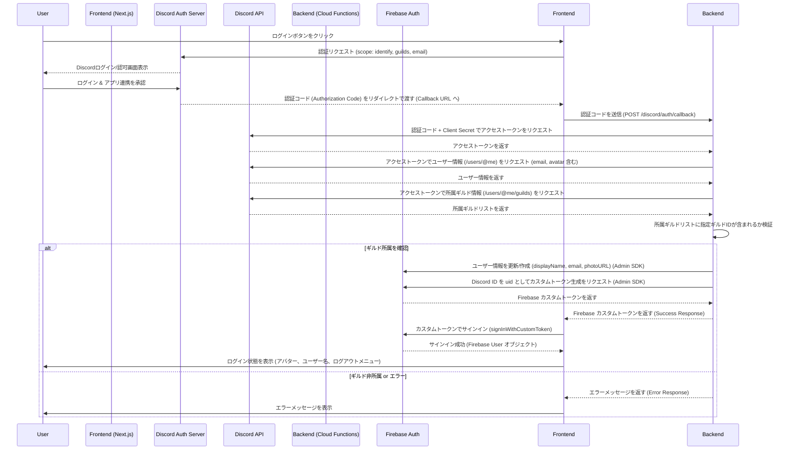

# Discord ギルドメンバー限定 認証設計 (概要)

## 1. 目標

- Web サイト右上にログインボタンを設置する。
- Discord アカウントで認証を行う。
- 指定された Discord ギルド ID (`959095494456537158`) に所属しているユーザーのみログインを許可する。
- Firebase Authentication, Firebase Hosting, Firebase Cloud Functions (v2) を使用して実装する。

## 2. アーキテクチャ概要

1.  **フロントエンド (Next.js on Firebase Hosting):** UI 提供、Discord 認証フロー開始、Firebase Auth サインイン。
2.  **バックエンド (Firebase Cloud Functions v2):** Discord OAuth2 通信、ギルド所属検証、Firebase カスタムトークン生成。環境変数は Secret Manager 経由で `process.env` から取得。
3.  **Firebase Authentication:** ユーザーセッション管理、カスタムトークン認証。Discord から取得したユーザー情報 (表示名、メール、アバターURL) も保存。
4.  **Discord API:** ユーザー認証、ユーザー情報取得 (identify, email スコープ)、所属ギルド情報取得 (guilds スコープ)。

## 3. 認証フロー

## 4. 主要コンポーネント/エンドポイント

- **フロントエンド:**
    - `/auth/discord/callback`: Discord からのリダイレクトを受け付け、Cloud Functions を呼び出すページ (クライアントコンポーネント + Suspense)。
    - `src/components/ui/AuthButton.tsx`: ログイン/ログアウト状態を表示・処理するボタン (クライアントコンポーネント)。
    - `src/lib/firebase/AuthProvider.tsx`: Firebase 認証状態を提供する Context Provider (クライアントコンポーネント)。
- **バックエンド:**
    - Cloud Functions HTTP トリガー: `discordAuthCallback` (POST `/discord/auth/callback`)。

## 5. 環境変数/シークレット管理

- **フロントエンド:** `.env.local` で `NEXT_PUBLIC_...` 変数を管理 (Firebase 設定、Discord Client ID、リダイレクト URI、Functions URL)。
- **バックエンド:** Firebase Secret Manager で Discord Client ID, Client Secret, Redirect URI, Target Guild ID を管理し、`process.env` 経由でアクセス。

詳細は `docs/ENVIRONMENT_VARIABLES.md` を参照。