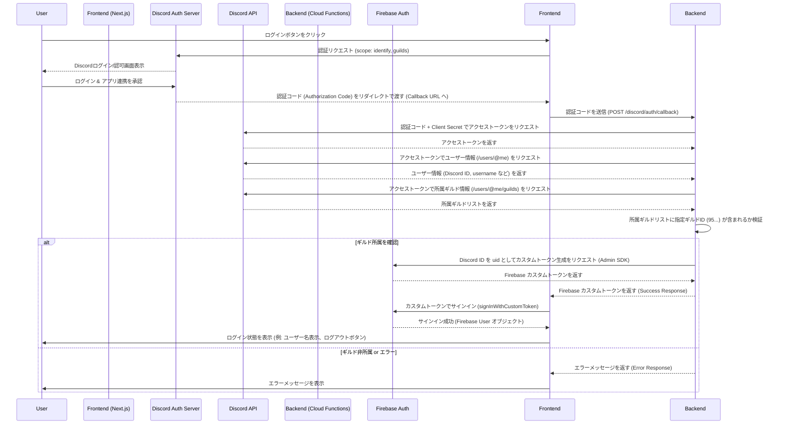

# Discord ギルドメンバー限定 認証設計

**注意:** このドキュメントは認証機能の実装計画を記したものです。実装完了後、**「詳細ステップ」以降のセクションは削除または大幅に簡略化**し、概要設計（アーキテクチャ、認証フロー）のみを残すようにしてください。これにより、ドキュメントの肥大化を防ぎます。

## 1. 目標

- Web サイト右上にログインボタンを設置する。
- Discord アカウントで認証を行う。
- 指定された Discord ギルド ID (`959095494456537158`) に所属しているユーザーのみログインを許可する。
- Firebase Authentication, Firebase Hosting, Firebase Cloud Functions を使用して実装する。

## 2. アーキテクチャ概要

1.  **フロントエンド (Next.js on Firebase Hosting):** UI 提供、Discord 認証フロー開始、Firebase Auth サインイン。
2.  **バックエンド (Firebase Cloud Functions):** Discord OAuth2 通信、ギルド所属検証、Firebase カスタムトークン生成。
3.  **Firebase Authentication:** ユーザーセッション管理、カスタムトークン認証。
4.  **Discord API:** ユーザー認証、ユーザー情報取得、所属ギルド情報取得。

## 3. 認証フロー

## 4. 詳細ステップ (実装完了後に削除/簡略化)

### 4.1. フロントエンド (ログインボタン - 例: `AuthButton.tsx`)

- クライアントコンポーネント (`"use client"`) として作成。
- Firebase Auth の認証状態を監視 (`onAuthStateChanged` または Context 経由)。
- 状態に応じて「Discord でログイン」ボタンまたは「ユーザー名/ログアウト」ボタンを表示。
- ログインボタンクリック時:
    - Discord 認証 URL を生成 (Client ID, Redirect URI, Scope を含む)。
    - `window.location.href` などで Discord 認証 URL へ遷移。
- ログアウトボタンクリック時:
    - `signOut(auth)` を呼び出し Firebase からログアウト。

### 4.2. フロントエンド (コールバック処理 - 例: `/auth/discord/callback` ページ or API Route)

- Discord からのリダイレクトを受け付けるページまたは API Route を作成。
- URL パラメータから `code` を取得。
- `code` を Cloud Functions の `/discord/auth/callback` エンドポイントに POST リクエストで送信。
- Cloud Functions からのレスポンス (カスタムトークン or エラー) を受け取る。
- カスタムトークンを受け取った場合:
    - `signInWithCustomToken(customToken)` を呼び出して Firebase にサインイン。
    - サインイン成功後、ホームページなどにリダイレクト。
- エラーを受け取った場合:
    - ユーザーにエラーメッセージを表示。

### 4.3. バックエンド (Cloud Functions - HTTP トリガー `discordAuthCallback`)

- エンドポイント: `POST /discord/auth/callback`
- **入力:** リクエストボディに `code` (認証コード)。
- **処理:**
    1. 環境変数から `DISCORD_CLIENT_ID`, `DISCORD_CLIENT_SECRET`, `TARGET_GUILD_ID`, `DISCORD_REDIRECT_URI` を取得。
    2. Discord API (`/oauth2/token`) に POST リクエストを送り、アクセストークンを取得。
    3. アクセストークンを使い、Discord API (`/users/@me`) に GET リクエストを送り、ユーザー情報 (特に `id`) を取得。
    4. アクセストークンを使い、Discord API (`/users/@me/guilds`) に GET リクエストを送り、所属ギルドリストを取得。
    5. ギルドリストに `TARGET_GUILD_ID` が含まれるか検証。
    6. **含まれる場合:**
        - Firebase Admin SDK を初期化。
        - `admin.auth().createCustomToken(discordUserId)` でカスタムトークン生成。
        - `{ success: true, customToken: token }` のような JSON を返す。
    7. **含まれない場合:**
        - `{ success: false, error: 'Guild membership required' }` のような JSON を 403 ステータスで返す。
    8. **その他エラー:**
        - `{ success: false, error: 'Internal server error' }` のような JSON を 500 ステータスで返す。
- **依存ライブラリ:** `firebase-admin`, `axios` (または `node-fetch`)。

## 5. 必要な設定 (実装完了後に削除/簡略化)

- **Discord Developer Portal:**
    - アプリ作成、Client ID/Secret 取得。
    - Redirect URI に Cloud Functions の `/discord/auth/callback` URL (またはフロントエンドのコールバック URL) を登録。
    - Scope: `identify`, `guilds`。
- **Firebase Console:**
    - Authentication 有効化。
    - Cloud Functions 有効化 (Node.js)。
    - Cloud Functions 環境変数設定: `DISCORD_CLIENT_ID`, `DISCORD_CLIENT_SECRET`, `TARGET_GUILD_ID`, `DISCORD_REDIRECT_URI`。
- **プロジェクト:**
    - Cloud Functions: `firebase-admin`, `axios` 等を `package.json` に追加。
    - フロントエンド: `firebase` SDK (導入済みのはず)。

## 6. コンポーネント設計 (実装完了後に削除/簡略化)

- **`AuthButton.tsx` (Client Component):** ログイン/ログアウトボタン、状態管理。
- **`AuthProvider.tsx` (Client Component - オプション):** Context API で認証状態を提供。

## 7. セキュリティ考慮事項 (実装完了後に削除/簡略化)

- Discord Client Secret は環境変数で管理。
- Cloud Functions の CORS 設定。
- カスタムトークンの有効期限。