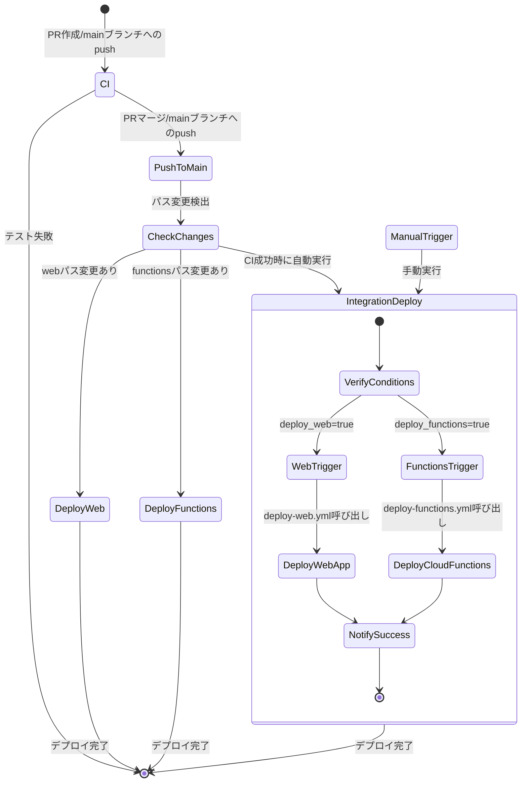

# CI/CD パイプライン

このドキュメントでは、プロジェクトのCI/CDパイプラインの概要と使用方法について説明します。

## CI/CDパイプラインの概要

suzumina.clickプロジェクトでは、GitHub Actionsを使用した自動テスト・ビルド・デプロイのパイプラインを採用しています。2025年5月2日のCI/CD改善により、すべてのビルド・デプロイ処理をGitHub Actionsで一元管理するようになりました。さらに、2025年4月26日のリファクタリングにより、ワークフローの構造が整理され、メンテナンス性が向上しました。

CI/CDパイプラインは以下の主要なワークフローで構成されています：

1. **CI（継続的インテグレーション）** - すべてのコードの検証とテスト
2. **Webアプリケーションデプロイ** - Next.jsアプリケーションのデプロイ
3. **Cloud Functionsデプロイ** - Cloud Functionsのデプロイ
4. **統合デプロイ** - 複数のコンポーネントを一括デプロイ

## CI/CDパイプラインのワークフロー状態遷移図

以下の図は、CI/CDパイプラインの状態遷移と各ワークフローの関係を示しています：

## モノレポ構造とワークフロー設計

本プロジェクトはモノレポ構造（`apps/web`と`apps/functions`）を採用しており、ワークフローはこの構造に最適化されています：

- 共通のリポジトリ全体の検証（Biomeによるコード検証）
- Webアプリケーション（Next.js）固有の検証とデプロイ
- Cloud Functions固有の検証とデプロイ

この構造により、変更があった部分のみを効率的に検証・デプロイすることが可能になっています。

## 各ワークフローの役割と使用方法

### 1. CI ワークフロー （ci.yml）

**目的**: コードの品質保証と基本的な検証

**トリガー**:
- mainブランチへのプッシュ
- mainブランチへのプルリクエスト

**ジョブ**:
1. **共通コード検証**: リポジトリ全体のBiomeによるコード検証
2. **Webアプリケーション検証**: `apps/web`のテストとビルド
3. **Cloud Functions検証**: `apps/functions`のテストとビルド

CIワークフローはコードの変更がある度に自動的に実行され、問題がないことを確認します。CI成功後、mainブランチへのプッシュ時には統合デプロイワークフローをトリガーします。

### 2. Webアプリケーションデプロイ （deploy-web.yml）

**目的**: Next.jsアプリケーションの効率的なデプロイ

**トリガー**:
- mainブランチへのプッシュ（`apps/web/**`に変更がある場合のみ）
- 手動実行（GitHub Actionsインターフェースから）
- 統合デプロイワークフローからの呼び出し

**主な機能**:
- Node.js環境のセットアップ
- アプリケーションのテストとビルド
- Dockerイメージのビルドとプッシュ
- Cloud Runへのデプロイ

このワークフローは、Webアプリケーションの変更を検出した場合に自動的に実行されるほか、手動でも実行できます。

### 3. Cloud Functionsデプロイ （deploy-functions.yml）

**目的**: Cloud Functionsの効率的なデプロイ

**トリガー**:
- mainブランチへのプッシュ（`apps/functions/**`に変更がある場合のみ）
- 手動実行（GitHub Actionsインターフェースから）
- 統合デプロイワークフローからの呼び出し

**主な機能**:
- 変更された関数の検出（pushイベント時）
- Node.js環境のセットアップ
- 関数のテストとビルド
- 関数のデプロイ（変更された関数のみ、または全関数）

このワークフローは、Cloud Functionsの変更を検出した場合に自動的に実行されるほか、手動でも実行できます。

### 4. 統合デプロイ （deploy.yml）

**目的**: 複数のコンポーネントを一括デプロイ

**トリガー**:
- 手動実行（GitHub Actionsインターフェースから）
- CIワークフロー成功後（mainブランチのみ）

**ジョブ**:
1. **デプロイ条件の確認**: デプロイ前の条件チェック
2. **Webアプリケーションデプロイ**: deploy-web.ymlワークフローの呼び出し
3. **Cloud Functionsデプロイ**: deploy-functions.ymlワークフローの呼び出し
4. **デプロイ完了通知**: デプロイ成功の通知

このワークフローは手動で実行することも、CI成功後に自動的に実行することもできます。デプロイするコンポーネントを選択することも可能です。

## デプロイの最小権限設計

セキュリティ強化のため、デプロイ用のサービスアカウントは最小権限原則に基づいて構成されています：

1. **cloud-run-deployer-sa**: Cloud Runサービスのデプロイのみに必要な権限を持つ
   - `roles/run.admin` - Cloud Runサービスの管理
   - `roles/artifactregistry.writer` - コンテナイメージのアップロード
   - `roles/logging.logWriter` - ログの書き込み
   - `roles/iam.serviceAccountUser` - サービスアカウントの利用

2. **cloud-functions-deployer-sa**: Cloud Functionsのデプロイのみに必要な権限を持つ
   - `roles/cloudfunctions.developer` - Cloud Functionsの管理
   - `roles/storage.objectAdmin` - ソースコードアップロード用
   - `roles/logging.logWriter` - ログの書き込み
   - `roles/iam.serviceAccountUser` - サービスアカウントの利用

これにより、万が一GitHubのシークレットが漏洩した場合でも、被害を最小限に抑えることができます。

## 共有ワークフローとアクション

効率的なワークフロー管理のため、以下の共有コンポーネントを使用しています：

### 共有ワークフロー

1. **build-and-test.yml**: アプリケーションのビルドとテストを行う再利用可能なワークフロー
2. **gcp-auth.yml**: Google Cloud認証を行う再利用可能なワークフロー

### カスタムアクション

1. **setup-node-env**: Node.jsとpnpmの環境をセットアップする複合アクション

これらの共有コンポーネントにより、コードの重複を減らし、メンテナンス性を向上させています。

## CI/CD改善の歴史

### 2025年5月2日 - Cloud Build廃止とGitHub Actions統合

以前使用していたCloud Buildを廃止し、すべてのビルドとデプロイプロセスをGitHub Actionsに統合しました。この変更により以下のメリットが得られました：

1. **シンプルなアーキテクチャ**
   - 単一のCI/CDシステムでビルドからデプロイまで一貫して管理
   - トラブルシューティングが容易に

2. **コスト最適化**
   - Cloud Build関連のリソースとコストを削減
   - 重複するインフラの最小化

3. **管理の簡素化**
   - `cloudbuild.yaml`の代わりにGitHub Workflowsのみでの管理
   - 履歴やログの一元的な管理

### 2025年4月26日 - ワークフローのリファクタリング

複雑化していたワークフローを整理し、メンテナンス性を向上させました：

1. **ワークフローの分割**
   - 巨大なワークフローを複数の小さなワークフローに分割
   - 責任の明確化と管理の容易さを実現

2. **共有コンポーネントの導入**
   - 再利用可能なワークフローとアクションの導入
   - コードの重複を削減

3. **トリガーの整理**
   - デプロイが2回走る問題を解決
   - 明確なトリガー条件の設定

## ワークフロー間の連携

各ワークフローは相互に連携して動作し、効率的なCIとCDを実現しています：

1. **本体コードへの変更時**:
   - CIワークフローが実行され、コードの品質を検証
   - 特定パスの変更では個別のデプロイワークフローが自動実行
   - CI成功時には統合デプロイワークフローを実行可能

2. **ワークフロー連携の仕組み**:
   - `workflow_dispatch`イベントによる他ワークフローの呼び出し
   - 条件付き実行による効率化（変更がある部分のみデプロイ）
   - ワークフロー間でのパラメータ受け渡し

3. **条件分岐の最適化**:
   - 変更検出ロジックによる効率的なデプロイ
   - パラメータによるデプロイコンポーネントの選択

## デプロイ履歴と確認

各デプロイの結果はGitHub Actionsの実行履歴で確認できます。デプロイされたURLはワークフローの出力に表示されます。

デプロイの詳細なログが必要な場合は、GitHub Actionsの実行結果またはGoogle Cloud Consoleで確認できます：

- GitHub Actionsログ: `Actions` タブ → ワークフローの実行 → ジョブ → ステップ
- Google Cloud Console: Cloud Run または Cloud Functions のサービス履歴

## デプロイエラーのトラブルシューティング

デプロイが失敗した場合は、以下の点を確認してください：

1. **ビルドエラー**: ビルドステップのログを確認
2. **認証エラー**: サービスアカウントの権限設定を確認
3. **リソースエラー**: Google Cloudのリソース制限やクォータを確認
4. **環境変数エラー**: 必要な環境変数やシークレットが設定されているか確認

それでも問題が解決しない場合は、CI/CD担当者に連絡してください。

## 今後の改善計画

CI/CDパイプラインは継続的に改善される予定です。今後計画されている改善点：

1. **ビルドキャッシュの最適化**: ビルド時間のさらなる短縮
2. **テストカバレッジレポート**: テストカバレッジの自動計測と報告
3. **パフォーマンスモニタリング**: デプロイ後のパフォーマンス自動測定
4. **E2Eテスト**: エンドツーエンドテストの追加
5. **デプロイ通知の強化**: Slackなどへの通知機能の追加

詳細な作業項目は[TODO.md](TODO.md)を参照してください。

---

最終更新: 2025年4月26日