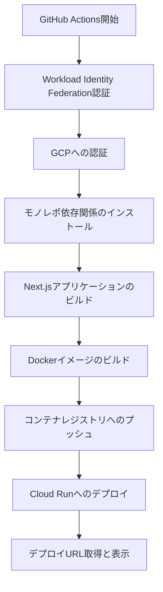

# デプロイ手順マニュアル

このドキュメントでは、suzumina.clickプロジェクトの現在のデプロイ手順と、インフラ管理方法について説明します。

## デプロイ環境の概要

**2025年4月22日の構成変更に伴い、現在はステージング環境のみを運用しています。**
**2025年5月2日にCI/CDパイプラインが改善され、GitHub Actionsに統合されました。**

- **ステージング環境**: 開発とテスト用の単一環境（Cloud Run）
- **旧環境**: Firebase Hosting（廃止済み）
- **GCPプロジェクト**: `suzumina-click-firebase`

## デプロイ方法

### 1. GitHub Actionsを使用した自動デプロイ

GitHub Actionsが提供する3つのワークフローを使用してデプロイを管理します：

#### 1.1 継続的インテグレーション（CI）

- **ワークフロー**: `ci.yml`
- **目的**: コードの品質保証と基本的な検証
- **トリガー**: 
  - mainブランチへのプッシュ
  - mainブランチへのプルリクエスト
- **処理内容**:
  - モノレポ共通のコード検証（Biome）
  - Webアプリケーションのテストとビルド検証
  - Cloud Functionsのテストとビルド検証

#### 1.2 変更検知による自動デプロイ

- **ワークフロー**: `auto-deploy.yml`
- **目的**: 効率的な継続的デプロイ
- **トリガー**: 
  - mainブランチへのプッシュ（`apps/web/**`または`apps/functions/**`に変更がある場合のみ）
- **処理内容**:
  - 変更されたコンポーネントのみをデプロイ
  - Webアプリケーションの変更時はCloud Runにデプロイ
  - Cloud Functionsの変更時は関連する関数のみをデプロイ

#### 1.3 本番環境デプロイ

- **ワークフロー**: `deploy-production.yml`
- **目的**: 完全な環境デプロイ
- **トリガー**:
  - 手動実行（GitHub Actionsインターフェースから）
  - CIワークフロー成功後（オプション）
- **処理内容**:
  - デプロイ条件の確認
  - Webアプリケーションのビルドとデプロイ
  - すべてのCloud Functionsのデプロイ
  - デプロイ完了通知



### 2. 手動デプロイの実行

手動でデプロイを実行する場合は、GitHub Actionsインターフェイスから行います:

1. リポジトリの「Actions」タブに移動します。
2. `deploy-production.yml`ワークフローを選択します。
3. 「Run workflow」ボタンをクリックします。
4. デプロイするブランチを選択し、「Run workflow」を実行します。
5. デプロイの進捗状況を確認します。

## デプロイ後の確認

デプロイが完了したら、以下の点を確認してください：

1. アプリケーションが正常に起動しているか
2. Discord認証機能が正常に動作するか
3. レスポンス時間に問題がないか
4. YouTube動画情報が正しく取得・表示されるか

## インフラストラクチャの管理

### Terraformを使用したリソース管理

プロジェクトのインフラは全てTerraformで管理されています。設定を変更する場合は以下の手順で行います：

1. Terraformファイルを編集します（`terraform/` ディレクトリ）
2. プランを実行して変更内容を確認します：

```bash
cd terraform
terraform plan
```

3. 問題がなければ適用します：

```bash
terraform apply
```

詳細な手順については、[TERRAFORM_LOCAL.md](./TERRAFORM_LOCAL.md)を参照してください。

### 主要なTerraformリソース

- **Cloud Run**: `terraform/cloudrun.tf` - Next.jsアプリケーションのホスティング
- **Firebase Auth**: `terraform/firebase.tf` - Discord OAuth認証（認証機能のみを利用）
- **Cloud Functions**: 
  - `terraform/function_discord_auth.tf` - DiscordAuthCallback関数
  - `terraform/function_youtube_videos.tf` - YouTube動画情報取得関数
  - `terraform/function_common.tf` - 関数共通設定
- **Secret Manager**: `terraform/secrets.tf` - 環境変数・シークレットの管理

詳細なインフラ構成については[INFRA_AUDIT.md](./INFRA_AUDIT.md)を参照してください。

## 環境変数の設定

### ステージング環境（Cloud Run）

環境変数はSecret Managerで管理され、Terraformで定義されています：

1. Secret Managerに必要なシークレットを作成：

```bash
# 必要なシークレットの一覧
SECRETS=(
  "NEXT_PUBLIC_DISCORD_CLIENT_ID"
  "NEXT_PUBLIC_DISCORD_REDIRECT_URI"
  "DISCORD_CLIENT_SECRET"
  "DISCORD_TARGET_GUILD_ID"
  "FIREBASE_SERVICE_ACCOUNT_KEY"
  "YOUTUBE_API_KEY"
)

# プロジェクトIDを設定
PROJECT_ID="suzumina-click-firebase"

# シークレットを作成
for SECRET_NAME in "${SECRETS[@]}"; do
  # シークレットが存在するかチェック
  if ! gcloud secrets describe "$SECRET_NAME" --project="$PROJECT_ID" &>/dev/null; then
    echo "シークレット「$SECRET_NAME」を作成します..."
    gcloud secrets create "$SECRET_NAME" --project="$PROJECT_ID"
    echo "シークレット「$SECRET_NAME」が作成されました。次に値を設定してください。"
  else
    echo "シークレット「$SECRET_NAME」は既に存在します。"
  fi
done
```

2. 作成したシークレットに値を設定（**重要: このステップは必ず実行してください**）：

```bash
# 各シークレットに値を設定する
# 方法1: コマンドラインで直接入力（安全ではないため本番環境では非推奨）
echo -n "実際の値" | gcloud secrets versions add シークレット名 --data-file=- --project="$PROJECT_ID"

# 方法2: ファイルから値を読み込む（推奨）
# 1. 値を含むファイルを作成（例: secret_value.txt）
# 2. ファイルから値を読み込んでシークレットに設定
gcloud secrets versions add シークレット名 --data-file=./secret_value.txt --project="$PROJECT_ID"

# 方法3: JSON形式のシークレット（FIREBASE_SERVICE_ACCOUNT_KEY等）の場合
gcloud secrets versions add FIREBASE_SERVICE_ACCOUNT_KEY --data-file=./service-account-key.json --project="$PROJECT_ID"
```

3. すべてのシークレットが正しく作成されていることを確認：

```bash
# すべてのシークレットを一覧表示
gcloud secrets list --project="$PROJECT_ID"

# 各シークレットの最新バージョンが存在するか確認
for SECRET_NAME in "${SECRETS[@]}"; do
  echo "シークレット「$SECRET_NAME」の確認:"
  gcloud secrets versions list "$SECRET_NAME" --project="$PROJECT_ID"
done
```

**重要**: シークレットを作成するだけでなく、必ず値を設定してください。値が設定されていないシークレットはデプロイ時にエラーの原因となります。

4. `terraform/secrets.tf`で参照設定を更新

### ローカル開発環境

ローカル開発用の環境変数は`.env.local`ファイルに設定してください。
必要な環境変数の詳細は[ENVIRONMENT_VARIABLES.md](./ENVIRONMENT_VARIABLES.md)を参照してください。

## モニタリングとログ確認

### Cloud Runログの確認

1. Google Cloud Consoleで「Cloud Run」を開きます
2. `suzumina-click-nextjs-app`サービスをクリックします
3. 「ログ」タブを選択して、アプリケーションログを確認します

### Cloud Functionsログの確認

1. Google Cloud Consoleで「Cloud Functions」を開きます
2. 対象の関数（例：`discordAuthCallback`）をクリックします
3. 「ログ」タブでログを確認します

## トラブルシューティング

### 1. デプロイに失敗する場合

- GitHub Actionsの実行ログでエラーを確認します
- IAM権限が適切に設定されているか確認します
- モノレポのビルド設定に問題がないか確認します

### 2. アプリケーションが正常に動作しない場合

- Cloud Runログを確認して、エラーを特定します
- 環境変数が正しく設定されているか確認します（Secret Manager）
- Cloud RunサービスアカウントにFirebase認証へのアクセス権限があるか確認します

### 3. 認証関連の問題

- Discord Developer Portalの設定を確認します（リダイレクトURL等）
- Firebase Authenticationの設定を確認します
- Cloud Functions（`discordAuthCallback`）のログでエラーを確認します

### 4. Terraform関連のエラー

#### 「Error: Error creating WorkloadIdentityPool: googleapi: Error 409: Requested entity already exists」

このエラーは、Terraformが作成しようとしているリソースが既にGCPプロジェクトに存在する場合に発生します。解決するには：

1. 既存のリソースをTerraformの状態にインポートします：

```bash
# Workload Identity Poolをインポートする例
terraform import google_iam_workload_identity_pool.github_pool "projects/${PROJECT_ID}/locations/global/workloadIdentityPools/github-pool"
```

2. インポート後に再度 `terraform plan` を実行し、差分が解消されたか確認します

3. 必要に応じて設定を調整したのち `terraform apply` を実行します

#### その他のTerraformリソース競合エラー

1. エラーメッセージから競合しているリソースを特定します
2. 以下の方法で対処します：
   - リソースをTerraformの状態にインポート（推奨）
   - 既存のリソースを手動で削除（**注意: 本番環境では危険です**）
   - Terraformコードを修正し、既存リソースと整合させる

```bash
# リソースインポートの一般的な形式
terraform import [リソースタイプ].[リソース名] [リソースID]

# 例: Cloud Runサービスのインポート
terraform import google_cloud_run_service.webapp "projects/${PROJECT_ID}/locations/asia-northeast1/services/suzumina-click-nextjs-app"
```

3. Terraform状態の確認:

```bash
# 現在Terraformで管理されているリソースを表示
terraform state list

# 特定リソースの状態を詳細表示
terraform state show [リソースタイプ].[リソース名]
```

#### 状態ファイルの競合

複数の開発者がTerraformを実行している場合、状態ファイルの競合が発生する可能性があります。この場合は：

1. リポジトリから最新の状態ファイルを取得します
2. ローカルの変更を破棄または統合します
3. チーム内で誰がいつTerraformを実行するか調整します

**重要**: 将来的にはリモート状態バックエンド（GCS等）の導入を検討してください。これにより状態ファイルの競合を防ぎ、ステート管理が改善されます。

#### Workload Identity Poolの削除

```bash
# 削除中のWorkload Identity Poolを含めて表示
gcloud iam workload-identity-pools list --location=global --project=suzumina-click-firebase --show-deleted

# 削除（すでに削除されたプールを完全に消去するには--show-deletedオプションと併用）
gcloud iam workload-identity-pools delete github-pool --location=global --project=suzumina-click-firebase

# 注：Workload Identity Poolが使用中の場合は、まず関連するプロバイダーや連携を削除する必要があります
# 例：Workload Identity Pool Providerの削除
# gcloud iam workload-identity-pool-providers delete github-provider --workload-identity-pool=github-pool --location=global --project=suzumina-click-firebase
```

## 今後の改善予定

今後の開発環境改善として以下を検討しています：

1. **Cloud Code（VS Code拡張）の導入**
   - ローカル開発環境でのGCPエミュレーション
   - リモートデバッグの設定
   - クラウドデプロイ連携

2. **モニタリング強化**
   - Cloud Runメトリクス監視ダッシュボードの作成
   - アラート設定の構築
   - コスト最適化の追跡

詳細な開発環境についての情報は、[DEVELOPMENT_SETUP.md](./DEVELOPMENT_SETUP.md)を参照してください。

## インフラ管理とアプリケーションデプロイの分離

suzumina.clickプロジェクトでは、2025年4月22日よりインフラ管理とアプリケーションコードデプロイの責任分離を実施しています。これにより、セキュリティ向上とデプロイプロセスの安定性を高めています。

### 責任分担

1. **インフラ管理（ローカル実行のみ）**:
   - 実施者: インフラ管理権限を持った開発者
   - 実行方法: ローカル環境でのTerraform実行
   - 対象リソース: 
     - GCPプロジェクト設定、IAM
     - Cloud RunサービスやCloud Functions基本設定
     - Firestore、Storage、Secret Manager等の設定
     - CI/CD連携の基礎設定

2. **アプリケーションデプロイ（GitHub Actions）**:
   - 実施者: GitHub Actions（自動化）
   - 実行方法: mainブランチへのプッシュ時に自動実行または手動トリガー
   - 対象リソース:
     - Cloud Functions（コード更新のみ）
     - Cloud Run（コンテナイメージ更新のみ）

### インフラ更新手順（ローカル）

インフラを変更する場合は、以下の手順に従ってください:

```bash
# 1. 適切なGCPアカウントでログイン
gcloud auth login

# 2. アプリケーションのデフォルト認証情報を設定
gcloud auth application-default login

# 3. プロジェクトをセット
gcloud config set project suzumina-click-firebase

# 4. Terraformディレクトリに移動
cd terraform

# 5. Terraformを初期化
terraform init

# 6. 変更内容を確認
terraform plan

# 7. 変更を適用
terraform apply

# 8. 変更を確認
terraform output
```

**注意**: Terraformの状態ファイル（terraform.tfstate）はリポジトリに含まれています。インフラ変更を行った場合は、このファイルをコミットして変更内容を共有してください。

## CI/CDパイプラインの概要

2025年5月2日のCI/CD改善により、以下の変更が実装されました：

1. **Cloud Buildの廃止とGitHub Actionsへの統合**
   - すべてのビルド・デプロイプロセスをGitHub Actions一元化
   - Cloud Build依存の排除によるアーキテクチャ簡素化

2. **モノレポ構造に最適化されたワークフロー**
   - アプリケーション、関数ごとに個別の検証とデプロイ
   - 変更されたコンポーネントのみを効率的にデプロイ

3. **最小権限原則に基づくサービスアカウント**
   - Cloud Run用とCloud Functions用に専用のデプロイサービスアカウント
   - 必要最小限の権限による安全なデプロイ

詳細なCI/CDパイプラインの情報は[CI_CD.md](./CI_CD.md)を参照してください。

## サービスアカウント権限

現在のデプロイには以下の専用サービスアカウントが使用されています：

### 最小権限サービスアカウント

**Cloud Run専用デプロイサービスアカウント**:
- `cloud-run-deployer-sa@${{ secrets.GCP_PROJECT_ID }}.iam.gserviceaccount.com`
- 権限:
  - `roles/run.admin` - Cloud Runサービスの管理
  - `roles/artifactregistry.writer` - コンテナイメージのアップロード
  - `roles/logging.logWriter` - ログの書き込み
  - `roles/iam.serviceAccountUser` - サービスアカウントの利用

**Cloud Functions専用デプロイサービスアカウント**:
- `cloud-functions-deployer-sa@${{ secrets.GCP_PROJECT_ID }}.iam.gserviceaccount.com`
- 権限:
  - `roles/cloudfunctions.developer` - Cloud Functionsの管理
  - `roles/storage.objectAdmin` - ソースコードアップロード用
  - `roles/logging.logWriter` - ログの書き込み
  - `roles/iam.serviceAccountUser` - サービスアカウントの利用

### Terraform実行用認証情報（インフラ管理用、ローカル実行のみ）

- GCPリソースを包括的に管理するための権限（IAMポリシーに従って設定）

## GitHub Actionsワークフロー

現在、以下の3つの主要ワークフローが実装されています：

1. **継続的インテグレーション（CI）ワークフロー**:
   - ファイル: `.github/workflows/ci.yml`
   - 目的: コードの品質検証とテスト
   
2. **変更検知による自動デプロイワークフロー**:
   - ファイル: `.github/workflows/auto-deploy.yml`
   - 目的: 特定のディレクトリ変更時の自動デプロイ
   
3. **本番環境デプロイワークフロー**:
   - ファイル: `.github/workflows/deploy-production.yml`
   - 目的: 手動トリガーまたはCI成功後の総合的なデプロイ

ワークフローの詳細な説明は[CI_CD.md](./CI_CD.md)を参照してください。

## トラブルシューティング

デプロイに失敗した場合は、以下を確認してください:

1. GitHub Actionsの実行ログでエラーを確認
2. サービスアカウントの権限が適切に設定されているか確認
3. 環境変数が正しく設定されているか確認

最小権限サービスアカウントに関する問題が発生した場合は、Terraformファイル `terraform/iam.tf` を確認し、必要に応じて権限を調整してください。

## 今後の改善計画

以下の改善を検討中です:

1. Terraform状態ファイルをリモートバックエンド（GCS）で管理
2. より詳細な権限管理による最小権限原則の徹底
3. デプロイパイプラインのテスト自動化と品質保証強化
4. GitHub Actionsワークフローの最適化と実行時間のさらなる短縮

詳細な作業項目は[TODO.md](TODO.md)を参照してください。