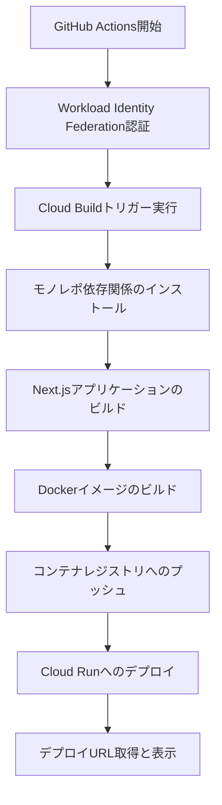

# デプロイ手順マニュアル

このドキュメントでは、suzumina.clickプロジェクトの現在のデプロイ手順と、インフラ管理方法について説明します。

## デプロイ環境の概要

**2025年4月22日の構成変更に伴い、現在はステージング環境のみを運用しています。**

- **ステージング環境**: 開発とテスト用の単一環境（Cloud Run）
- **旧環境**: Firebase Hosting（廃止済み）
- **GCPプロジェクト**: `suzumina-click-firebase`

## デプロイ方法

### 1. GitHub Actionsを使用したデプロイ（推奨）

特定の担当者のみがGitHub Actionsを使って手動でデプロイを実行できます。

1. リポジトリの「Actions」タブに移動します。
2. 「**ステージング環境へのデプロイトリガー**」ワークフローを選択します。
3. 「Run workflow」ボタンをクリックします。
4. デプロイするブランチを選択し、「Run workflow」を実行します。
5. デプロイの進捗状況を確認します。



### 2. 手動デプロイテスト（開発者用）

開発者は以下のスクリプトを使用して、ローカルから直接デプロイテストを実行できます：

```bash
# 環境変数を設定
export PROJECT_ID="suzumina-click-firebase"

# GCPにログイン
gcloud auth login

# プロジェクトの設定
gcloud config set project $PROJECT_ID

# デプロイスクリプトの実行
./scripts/deploy-test.sh
```

このスクリプトは以下の処理を実行します：
1. モノレポの依存関係をインストール
2. Next.jsアプリをビルド
3. Dockerイメージをビルド
4. GCRにイメージをプッシュ
5. Cloud Runにデプロイ

## デプロイ後の確認

デプロイが完了したら、以下の点を確認してください：

1. アプリケーションが正常に起動しているか
2. Discord認証機能が正常に動作するか
3. レスポンス時間に問題がないか
4. YouTube動画情報が正しく取得・表示されるか

## インフラストラクチャの管理

### Terraformを使用したリソース管理

プロジェクトのインフラは全てTerraformで管理されています。設定を変更する場合は以下の手順で行います：

1. Terraformファイルを編集します（`terraform/` ディレクトリ）
2. プランを実行して変更内容を確認します：

```bash
cd terraform
terraform plan
```

3. 問題がなければ適用します：

```bash
terraform apply
```

### 主要なTerraformリソース

- **Cloud Run**: `terraform/cloudrun.tf` - Next.jsアプリケーションのホスティング
- **Cloud Build**: `terraform/cloudbuild.tf` - コンテナビルド・デプロイパイプライン
- **Firebase Auth**: `terraform/firebase.tf` - Discord OAuth認証（認証機能のみを利用）
- **Cloud Functions**: `terraform/functions.tf` - DiscordAuthCallback関数など
- **Secret Manager**: `terraform/secrets.tf` - 環境変数・シークレットの管理

詳細なインフラ構成については[INFRA_AUDIT.md](./INFRA_AUDIT.md)を参照してください。

## 環境変数の設定

### ステージング環境（Cloud Run）

環境変数はSecret Managerで管理され、Terraformで定義されています：

1. Secret Managerに値を設定：

```bash
echo -n "実際の値" | gcloud secrets versions add シークレット名 --data-file=- --project=suzumina-click-firebase
```

2. `terraform/secrets.tf`で参照設定を更新

### ローカル開発環境

ローカル開発用の環境変数は`.env.local`ファイルに設定してください。
必要な環境変数の詳細は[ENVIRONMENT_VARIABLES.md](./ENVIRONMENT_VARIABLES.md)を参照してください。

## モニタリングとログ確認

### Cloud Runログの確認

1. Google Cloud Consoleで「Cloud Run」を開きます
2. `suzumina-click-nextjs-app`サービスをクリックします
3. 「ログ」タブを選択して、アプリケーションログを確認します

### Cloud Functionsログの確認

1. Google Cloud Consoleで「Cloud Functions」を開きます
2. 対象の関数（例：`discordAuthCallback`）をクリックします
3. 「ログ」タブでログを確認します

### Cloud Buildログの確認

1. Google Cloud Consoleで「Cloud Build」→「履歴」を開きます
2. 対象のビルドをクリックしてログを確認します

## トラブルシューティング

### 1. デプロイに失敗する場合

- Cloud Buildログを確認して、ビルドエラーを特定します
- IAM権限が適切に設定されているか確認します
- モノレポのビルド設定に問題がないか確認します

### 2. アプリケーションが正常に動作しない場合

- Cloud Runログを確認して、エラーを特定します
- 環境変数が正しく設定されているか確認します（Secret Manager）
- Cloud RunサービスアカウントにFirebase認証へのアクセス権限があるか確認します

### 3. 認証関連の問題

- Discord Developer Portalの設定を確認します（リダイレクトURL等）
- Firebase Authenticationの設定を確認します
- Cloud Functions（`discordAuthCallback`）のログでエラーを確認します

## 今後の改善予定

今後の開発環境改善として以下を検討しています：

1. **Cloud Code（VS Code拡張）の導入**
   - ローカル開発環境でのGCPエミュレーション
   - リモートデバッグの設定
   - クラウドデプロイ連携

2. **モニタリング強化**
   - Cloud Runメトリクス監視ダッシュボードの作成
   - アラート設定の構築
   - コスト最適化の追跡

詳細な開発環境についての情報は、[DEVELOPMENT_SETUP.md](./DEVELOPMENT_SETUP.md)を参照してください。