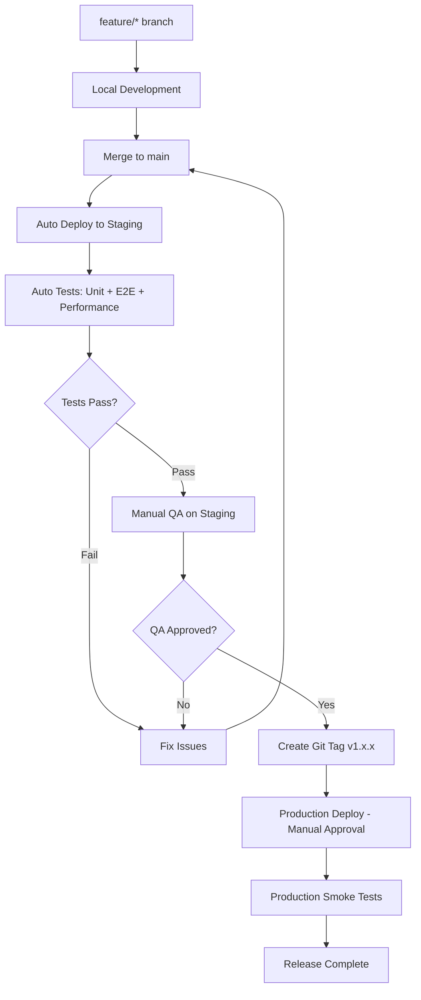

# suzumina.click デプロイ戦略

## 🎯 個人開発向け 2環境構成

個人開発・個人運用に最適化したシンプルなブランチ戦略とインフラ構成。

### 📊 環境構成

```
ローカル開発 → Staging環境 → Production環境
     ↓           ↓              ↓
   無料開発    月1000円       月4000円
  （Emulator） （軽量テスト）   （本番運用）
```

## 🌿 ブランチ戦略

### **メインブランチ**
- `main` - 開発統合・Staging自動デプロイ
- `production/*` - Productionリリース（タグベース）

### **開発ワークフロー**

```bash
# 1. 機能開発（ローカル）
git checkout -b feature/audio-buttons
# ローカル開発
pnpm dev  # Next.js + Firestore Emulator

# 2. main統合 → Staging自動デプロイ・テスト
git checkout main
git merge feature/audio-buttons
git push origin main
# → GitHub Actions で Staging環境に自動デプロイ + 自動テスト実行

# 3. Stagingでの品質確認
# - 自動テスト結果確認（Unit, E2E, Performance）
# - 手動QA（機能、UI/UX、データ整合性）
# - プレビュー環境での動作確認

# 4. Production リリース（タグベース）
git tag v1.0.0 -m "音声ボタン機能リリース"
git push origin v1.0.0
# → GitHub Actions で Production環境にデプロイ（手動承認）
```

## 💰 コスト最適化設定

### **Staging環境（月約1000円）**
- **目的**: 機能テスト・プレビュー・UI確認
- **構成**: 超軽量・最小コスト
```hcl
staging = {
  cloud_run_max_instances = 1      # 最小限
  cloud_run_memory       = "512Mi" # 最小メモリ
  functions_enabled      = false   # コスト削減
  enable_monitoring     = false    # 基本監視のみ
  enable_custom_domain  = false    # ドメイン不要
  budget_amount         = 1000     # 約1000円/月
}
```

### **Production環境（月約4000円）**
- **目的**: 本番サービス・安定運用
- **構成**: 個人利用レベル・安定性重視
```hcl
production = {
  cloud_run_max_instances = 2      # 個人利用レベル
  cloud_run_memory       = "1Gi"   # 1GB
  functions_enabled      = true    # フル機能
  enable_monitoring     = true     # 完全監視
  enable_custom_domain  = true     # カスタムドメイン
  budget_amount         = 4000     # 約4000円/月
}
```

## 🚀 CI/CDパイプライン

### **GitHub Actions設定**

**1. Staging自動デプロイ + テスト**
```yaml
# .github/workflows/staging-deploy.yml
name: Deploy to Staging & Run Tests
on:
  push:
    branches: [main]
jobs:
  deploy-and-test:
    runs-on: ubuntu-latest
    steps:
      - uses: actions/checkout@v4
      
      # Stagingデプロイ
      - name: Deploy to Staging
        run: |
          terraform apply -var="environment=staging" -auto-approve
      
      # 自動テスト実行
      - name: Run Unit Tests
        run: pnpm test
      
      - name: Run E2E Tests
        run: pnpm test:e2e
        
      - name: Performance Test
        run: pnpm lighthouse-ci
        
      # テスト結果通知
      - name: Notify Test Results
        if: failure()
        run: echo "Tests failed on staging"
```

**2. Production タグベースデプロイ**
```yaml
# .github/workflows/production-deploy.yml  
name: Deploy to Production
on:
  push:
    tags: ['v*']  # v1.0.0, v1.1.0等のタグ
  workflow_dispatch:  # 手動実行可能
jobs:
  deploy:
    runs-on: ubuntu-latest
    environment: production  # 手動承認必要
    steps:
      - uses: actions/checkout@v4
      
      # Production環境デプロイ
      - name: Deploy to Production
        run: |
          terraform apply -var="environment=production" -auto-approve
          
      # デプロイ後スモークテスト
      - name: Production Smoke Tests
        run: |
          curl -f https://suzumina.click/api/health
          
      # リリースノート作成
      - name: Create Release Notes
        run: |
          gh release create ${{ github.ref_name }} --auto-generate-notes
```

**3. 品質ゲート設定**
```yaml
# .github/workflows/quality-gate.yml
name: Quality Gate
on:
  pull_request:
    branches: [main]
jobs:
  quality-check:
    runs-on: ubuntu-latest
    steps:
      - uses: actions/checkout@v4
      - name: Lint & Format Check
        run: |
          pnpm lint
          pnpm format:check
      - name: Type Check
        run: pnpm type-check
      - name: Test Coverage
        run: pnpm test:coverage
```

### **新しいデプロイフロー**



## 🛠️ 運用コマンド

### **ローカル開発**
```bash
# 開発サーバー起動
pnpm dev

# Firestore Emulator起動（必要に応じて）
firebase emulators:start --only firestore

# テスト実行
pnpm test
```

### **インフラ管理**
```bash
# Staging環境デプロイ
terraform workspace select staging
terraform apply -var="environment=staging"

# Production環境デプロイ  
terraform workspace select production
terraform apply -var="environment=production"

# コスト確認
gcloud billing budgets list
```

### **監視・トラブルシューティング**
```bash
# ログ確認
gcloud logs read "resource.type=cloud_run_revision"

# Cloud Run状態確認
gcloud run services list --region=asia-northeast1

# 予算アラート確認
gcloud alpha billing budgets list
```

## 📋 リリースプロセス

### **1. Staging自動テスト（main push時）**
```bash
# main統合後、自動実行される項目
✅ Unit Tests          # Jest/Vitest
✅ E2E Tests           # Playwright  
✅ Performance Tests   # Lighthouse CI
✅ Security Scan       # Snyk/CodeQL
✅ Build Check         # Next.js build
✅ Type Check          # TypeScript
✅ Lint Check          # Biome
```

### **2. Staging手動QA**
```bash
# 自動テストパス後の手動確認項目
- [ ] 新機能の動作確認
- [ ] UI/UXの品質確認  
- [ ] レスポンシブデザイン確認
- [ ] データ整合性確認
- [ ] パフォーマンス体感確認
- [ ] ブラウザ間互換性確認
- [ ] アクセシビリティ確認
```

### **3. Production リリース手順**
```bash
# QA完了後のリリース実行
git checkout main
git pull origin main

# リリースタグ作成
git tag v1.1.0 -m "音声ボタン機能追加

- 音声ファイルアップロード機能
- 音声プレイヤー機能  
- 音声ボタン一覧表示
- メタデータ編集機能"

git push origin v1.1.0

# → GitHub ActionsでProduction環境デプロイ（手動承認待ち）
# → デプロイ完了後、スモークテスト自動実行
# → GitHub Releaseノート自動生成
```

### **4. リリース後確認**
```bash
# Production環境での確認項目
- [ ] ヘルスチェックAPI正常応答
- [ ] 主要機能の動作確認
- [ ] パフォーマンス監視確認
- [ ] エラーログ監視確認
- [ ] 予算アラート正常動作確認
```

## 🔧 環境別設定

### **terraform.tfvars設定例**

**Staging環境:**
```hcl
environment = "staging"
admin_email = "your-email@example.com"
enable_custom_domain = false
budget_amount = 10  # 約1000円/月
```

**Production環境:**
```hcl
environment = "production"
admin_email = "your-email@example.com"
enable_custom_domain = true
custom_domain = "suzumina.click"
budget_amount = 40  # 約4000円/月
```

## 📈 スケーリング戦略

### **トラフィック増加時**
1. **まずProduction設定調整**:
   ```hcl
   cloud_run_max_instances = 5  # 2→5に増加
   cloud_run_memory = "2Gi"     # 1GB→2GBに増加
   ```

2. **予算も調整**:
   ```hcl
   budget_amount = 100  # 4000円→10000円に増加
   ```

3. **段階的スケールアップ**:
   - 必要に応じてCloud SQL導入
   - CDN（Cloud CDN）導入
   - 複数リージョン展開

## 🎯 このアプローチの利点

1. **コスト効率**: 必要最小限のリソース使用
2. **シンプル運用**: 2環境で管理負荷軽減  
3. **安全デプロイ**: Stagingでの事前テスト
4. **個人最適**: 1人での運用を前提とした設計
5. **段階的成長**: 必要に応じてスケールアップ可能

この戦略により、個人開発・個人運用でも本格的なWebサービスを安全かつ経済的に運用できます。