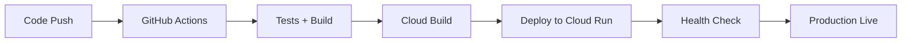

# 開発ガイド・ポリシー

suzumina.click プロジェクトの開発手順・設計原則・インフラ運用ガイド

## 🎯 設計原則

### 1. 型安全性の確保

**原則**: すべてのデータ構造は型安全であること

- **TypeScript strict mode**: `any` 型の使用禁止
- **Zod Schema**: 実行時型検証の実装
- **共有型定義**: packages/shared-types による一元管理

```typescript
// ✅ 良い例: Zodスキーマによる型定義
export const UserSessionSchema = z.object({
  discordId: z.string(),
  username: z.string(),
  displayName: z.string(),
  role: z.enum(["member", "moderator", "admin"]),
});

// ❌ 悪い例: any型の使用
function processData(data: any) { ... }
```

### 2. Discord認証・セキュリティ

**原則**: ギルドメンバーのみアクセス許可・最小権限の原則

- **NextAuth.js**: JWT セッション管理・CSRF保護
- **Discord Guild確認**: 「すずみなふぁみりー」メンバーシップ検証
- **権限ベース制御**: ユーザーロール (member/moderator/admin)
- **Secret Manager**: 認証情報の安全な管理

```typescript
// ✅ 良い例: Guild確認付き認証
export function isValidGuildMember(guildMembership: GuildMembership): boolean {
  return guildMembership.guildId === SUZUMINA_GUILD_ID && guildMembership.isMember;
}

// ❌ 悪い例: ハードコードされたプロジェクトID
const PROJECT_ID = "suzumina-click"; // セキュリティリスク
```

### 3. Next.js 15準拠設計

**原則**: Server Component/Client Component を適切に分離

- **Server Components**: データ取得・表示ロジック・SEO
- **Client Components**: インタラクション・ブラウザAPI・状態管理
- **Server Actions**: サーバーサイドデータ操作
- **コロケーション**: ページとActionsを同一ディレクトリに配置

```typescript
// ✅ 良い例: Server Component + Client Component分離
// VideoList.tsx (Server Component)
export default function VideoList({ data, user }) {
  return (
    <div>
      {data.videos.map(video => <VideoCard key={video.id} video={video} />)}
      <Pagination currentPage={currentPage} totalPages={totalPages} />
    </div>
  );
}

// Pagination.tsx (Client Component)
"use client";
export default function Pagination({ currentPage, totalPages }) {
  const router = useRouter();
  const handlePageChange = (page) => router.push(`?page=${page}`);
  // インタラクションロジック
}
```

## 🧪 テスト戦略

### ハイブリッドテストアプローチ

プロジェクトでは、コンポーネントの性質に応じて最適なテスト手法を使い分けています。

#### 1. Server Actions & ビジネスロジック → Vitest

**対象**: Cloud Functions, Server Actions, 共有ユーティリティ

```bash
# Server Actions & Functions テスト
pnpm test                           # 全体実行
pnpm test:coverage                  # カバレッジ付き
cd apps/functions && pnpm test      # Functions個別
```

#### 2. UIコンポーネント → Storybook

**対象**: 共有UIコンポーネント, レイアウト重要コンポーネント

```bash
# Storybook開発サーバー
cd packages/ui && pnpm storybook     # 共有UI
cd apps/web && pnpm storybook       # Web専用
```

#### 3. インタラクティブコンポーネント → React Testing Library

**対象**: ユーザーインタラクション, 条件分岐, エラーハンドリング

```bash
# React Testing Library セットアップ
cd apps/web
npm install -D @testing-library/react @testing-library/jest-dom happy-dom
```

### 現在のテストカバレッジ

- **テスト件数**: **226件** (高品質・包括的)
- **Server Actions**: 78件 ✅
- **重要UIコンポーネント**: 128件 ✅
- **統合テスト**: 20件 ✅

### テストファイル命名規則

```
src/
├── components/
│   ├── VideoList.tsx
│   ├── VideoList.test.tsx          # RTL テスト
│   └── VideoList.stories.tsx       # Storybook
├── app/
│   ├── actions.ts
│   └── actions.test.ts             # Vitest テスト
└── utils/
    ├── helpers.ts
    └── helpers.test.ts             # Vitest テスト
```

## 🔧 開発ワークフロー

### 1. ブランチ戦略

**Trunk-based Development + GitHub Flow**

```
main (production)
├── feature/add-user-profile
├── feature/improve-auth-flow
└── hotfix/fix-session-error
```

### 2. コミット規約

**Conventional Commits**

```bash
feat: 新機能の追加
fix: バグ修正
docs: ドキュメント更新
style: フォーマット変更
refactor: リファクタリング
test: テスト追加・修正
chore: その他の変更

# 例
feat: add user profile management
fix: resolve discord auth guild verification
docs: update authentication setup guide
```

### 3. 実装後チェックリスト

**必須項目**

```bash
# 品質チェック (一括実行)
pnpm check

# 個別実行
pnpm test              # テスト実行
pnpm lint              # Lint実行
pnpm format            # フォーマット
pnpm build             # ビルド確認
tsc --noEmit           # 型チェック
```

**推奨項目**

```bash
pnpm test:coverage     # カバレッジ確認
cd apps/web && pnpm storybook  # UIテスト
```

## 🏗️ インフラ・デプロイメント

### アーキテクチャ概要

```
GitHub Actions (CI/CD) → Cloud Build → Cloud Run
                     ↓
                Terraform (IaC)
                     ↓
Secret Manager ← → Cloud Run ← → Firestore
     ↓                ↑            ↑
Discord OAuth   Next.js App   Functions
```

### 環境分離

- **production**: 本番環境 (suzumina.click)
- **staging**: 開発・テスト環境 (Cloud Run URL)

### デプロイフロー



### 認証デプロイ

1. **Discord OAuth App作成**
   - [Discord Developer Portal](https://discord.com/developers/applications)
   - Client ID/Secret取得
   - Redirect URI設定

2. **terraform.tfvars設定**

```hcl
# 必須設定
discord_client_id = "your-client-id"
discord_client_secret = "your-secret"
nextauth_secret = "$(openssl rand -base64 32)"

# オプション
discord_bot_token = "bot-token"  # Guild詳細管理用
suzumina_guild_id = "959095494456537158"
```

3. **Terraform適用**

```bash
cd terraform
terraform plan      # 変更確認
terraform apply     # デプロイ実行
```

### 監視・運用

#### 重要メトリクス

- **認証成功率**: >95%
- **ページ表示速度**: <3秒
- **月次コスト**: <5000円
- **アップタイム**: >99.5%

#### ログ確認

```bash
# アプリケーションログ
gcloud logging read "resource.type=cloud_run_revision" --limit=50

# 認証エラー
gcloud logging read "resource.type=cloud_run_revision severity=ERROR" --limit=20

# Secret Manager確認
gcloud secrets versions access latest --secret="DISCORD_CLIENT_ID"
```

## 📦 依存関係管理

### パッケージ選定基準

1. **アクティブメンテナンス**: 定期的な更新
2. **型安全性**: TypeScript サポート
3. **軽量性**: バンドルサイズ影響を考慮
4. **セキュリティ**: 既知の脆弱性なし

### 更新手順

```bash
# 定期チェック (月1回)
pnpm outdated

# セキュリティ監査
pnpm audit

# 更新実行
pnpm update

# テスト確認
pnpm test && pnpm build
```

## 🔒 セキュリティガイドライン

### 1. 機密情報管理

- **環境変数**: すべての機密情報は環境変数で管理
- **Secret Manager**: Google Cloud Secret Manager使用
- **ログ出力**: 機密情報をログに出力しない

```typescript
// ✅ 良い例
const apiKey = process.env.DISCORD_CLIENT_SECRET;
if (!apiKey) {
  logger.error('Discord Client Secret が設定されていません');
  return;
}

// ❌ 悪い例
logger.info(`API Key: ${process.env.DISCORD_CLIENT_SECRET}`);
```

### 2. Discord認証セキュリティ

- **Guild ID固定**: 「すずみなふぁみりー」サーバー固定
- **スコープ制限**: `identify email guilds` のみ
- **CSRF保護**: NextAuth.js によるトークン検証

### 3. Firestore セキュリティ

- **Server Actions限定**: クライアントからの直接アクセス禁止
- **ユーザー認証確認**: 全データ操作でセッション検証
- **権限ベース制御**: ロールによる機能制限

## 📝 ドキュメンテーション

### 1. コメント規約

**JSDoc形式**

```typescript
/**
 * Discord Guild メンバーシップを確認する
 * 
 * @param accessToken - Discord OAuth access token
 * @param userId - Discord User ID
 * @returns Guild membership information or null
 * @throws {Error} Discord API error
 */
export async function fetchDiscordGuildMembership(
  accessToken: string,
  userId: string,
): Promise<GuildMembership | null> {
  // 実装...
}
```

### 2. README更新

- 新機能追加時はREADME更新
- 破壊的変更は移行ガイド作成
- API変更はCHANGELOG.md記録

## 🚀 パフォーマンス基準

### フロントエンド

- **Core Web Vitals**
  - LCP: < 2.5s
  - FID: < 100ms
  - CLS: < 0.1
- **バンドルサイズ**: 初期ロード 500KB以下

### バックエンド

- **Cloud Run**
  - コールドスタート: < 5秒
  - レスポンス時間: < 3秒
  - メモリ使用量: 512MB以下

- **Firestore**
  - クエリレスポンス: < 1秒
  - インデックス最適化実施

## 🔍 品質保証

### 自動化チェック

- **Pre-commit hooks**: Lefthook による自動チェック
- **CI/CD**: GitHub Actions による継続的テスト
- **依存関係**: Dependabot による自動更新

### コードレビュー

**必須チェック項目**:
- 設計原則への準拠
- テストカバレッジ
- セキュリティ考慮 (認証・権限確認)
- パフォーマンス影響

### 定期監査

- **月次**: 依存関係脆弱性チェック
- **四半期**: アーキテクチャレビュー
- **年次**: 技術スタック見直し

---

**最終更新**: 2025年6月22日  
**適用バージョン**: v0.2.1 (Discord認証対応)