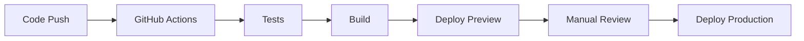

# suzumina.click 開発ガイド

## 📋 概要

suzumina.clickプロジェクトの開発ガイドライン、設計原則、コーディング規約、品質基準を定義します。  
**Claude Code での開発作業における必須参照ドキュメント**

**技術スタック**: Next.js 15 App Router + TypeScript + Tailwind CSS v4 + Biome  
**開発体制**: 個人開発・個人運用（本番環境のみ）  
**バージョン**: v0.3.2 (Server Actions優先アーキテクチャ・API Routes 33%削減)  
**テスト成果**: 410件全通過・移行完了アーカイブ済み  
**更新日**: 2025年7月12日

## 🎯 核心設計原則 (優先度順)

> **Claude Code開発指針**: これらの原則を優先度順に適用し、一貫性のある高品質な実装を実現する

### 🥇 **第1優先: ソフトウェア工学の基本原則**
**適用範囲**: 全ての実装・リファクタリング・機能追加

#### **1. YAGNI原則 (You Aren't Gonna Need It)**
**原則**: 必要になるまで機能を実装しない

```typescript
// ✅ 良い例: 必要な機能のみ実装
export function formatPrice(price: number): string {
  return `${price.toLocaleString()}円`;
}

// ❌ 悪い例: 不要な将来対応
export function formatPrice(
  price: number, 
  currency?: 'JPY' | 'USD' | 'EUR',  // 未使用
  locale?: string,                   // 未使用
  precision?: number                 // 未使用
): string {
  return `${price.toLocaleString()}円`; // 実際は円のみ使用
}
```

#### **2. DRY原則 (Don't Repeat Yourself)**
**原則**: 同じコードを繰り返さない

```typescript
// ✅ 良い例: 共通ロジックの抽出
const handleApiError = (error: unknown, context: string) => {
  const message = error instanceof Error ? error.message : 'Unknown error';
  logger.error(`${context}: ${message}`);
  return { success: false, error: message };
};

export async function createAudioButton(input: AudioButtonInput) {
  try {
    const result = await firestore.collection('audioButtons').add(input);
    return { success: true, data: result };
  } catch (error) {
    return handleApiError(error, 'createAudioButton');
  }
}

// ❌ 悪い例: 重複したエラーハンドリング
export async function createAudioButton(input: AudioButtonInput) {
  try {
    // 実装...
  } catch (error) {
    const message = error instanceof Error ? error.message : 'Unknown error';
    logger.error(`createAudioButton: ${message}`);
    return { success: false, error: message };
  }
}

export async function updateAudioButton(input: AudioButtonInput) {
  try {
    // 実装...
  } catch (error) {
    const message = error instanceof Error ? error.message : 'Unknown error';
    logger.error(`updateAudioButton: ${message}`);
    return { success: false, error: message };
  }
}
```

#### **3. KISS原則 (Keep It Simple, Stupid)**
**原則**: 可能な限りシンプルに保つ

```typescript
// ✅ 良い例: シンプルな実装
export function isValidVideoId(id: string): boolean {
  return id.length === 11 && /^[a-zA-Z0-9_-]+$/.test(id);
}

// ❌ 悪い例: 過度に複雑な実装
export function isValidVideoId(id: string): boolean {
  const patterns = [
    { regex: /^[a-zA-Z0-9_-]{11}$/, weight: 1 },
    { regex: /^[A-Za-z0-9_-]+$/, weight: 0.8 },
  ];
  
  const score = patterns.reduce((acc, pattern) => {
    return acc + (pattern.regex.test(id) ? pattern.weight : 0);
  }, 0);
  
  return score >= 1.0 && id.length === 11;
}
```

### 🥈 **第2優先: 型安全性・品質原則**
**適用範囲**: TypeScript実装・API設計・データ構造定義

#### **4. 型安全性の確保**
**原則**: TypeScript strict mode + Zod による実行時検証

- **TypeScript**: strict モードを使用し、`any` 型の使用を原則禁止
- **Zod Schema**: 実行時の型検証を実装
- **共有型定義**: packages/shared-types による一元管理

```typescript
// ✅ 良い例: Zodスキーマによる型定義
export const VideoSchema = z.object({
  id: z.string().min(1),
  title: z.string().min(1),
  publishedAt: z.string().datetime()
});

// ❌ 悪い例: any型の使用
function processData(data: any) { ... }
```

#### **5. 関数設計原則**

**原則**: 純粋関数を優先し、副作用を最小化する

- **純粋関数**: 同じ入力に対して常に同じ出力を返す
- **短い関数**: 1つの関数は1つの責任のみを持つ
- **単一責任原則**: 明確で理解しやすい関数名

```typescript
// ✅ 良い例: 純粋関数
export function formatPrice(price: number, currency = 'JPY'): string {
  return `${price.toLocaleString()}円`;
}

// ❌ 悪い例: 副作用のある関数
function updateAndLog(data: any) {
  updateDatabase(data); // 副作用
  console.log(data);    // 副作用
  return data;
}
```

#### **6. コードコロケーション**
**原則**: 関連するコードは近接して配置する

```
components/
├── voice-button/
│   ├── voice-button.tsx      # メインコンポーネント
│   ├── voice-button.test.tsx # テスト
│   ├── voice-button.types.ts # 型定義
│   └── index.ts              # エクスポート
```

### 🥉 **第3優先: 実装品質原則**
**適用範囲**: コード構造・アーキテクチャ・ユーザー体験

#### **7. 可読性優先**
**原則**: パフォーマンスよりも可読性を優先する

- 明確な変数名・関数名を使用
- 適切なコメントの追加
- 複雑なロジックの分割

#### **8. Next.js 15準拠設計**
**原則**: Server Component/Client Component を適切に分離する

- **Server Components**: データ取得・表示ロジック
- **Client Components**: インタラクション・ブラウザAPI使用
- **Server Actions**: サーバーサイドデータ操作（API Routes優先）
- **Firestore接続制限**: `@google-cloud/firestore` をサーバーサイドのみで使用
- **API Routes最小化**: 外部システム連携・プロキシ以外はServer Actions使用

#### **9. パフォーマンス最適化原則**
**原則**: レスポンス時間を最優先に考慮した実装を行う

#### **Turbopack永続キャッシュ最適化**
- **ビルド時間短縮**: 開発環境でTurbopackの永続キャッシュを活用
- **アセット最適化**: SVGローダー・フォント最適化の適用
- **Hot Reload最適化**: 開発体験向上

#### **API タイムアウト戦略**
- **Promise.allSettled使用**: 複数API呼び出しの耐障害性向上
- **3秒タイムアウト**: 外部API呼び出しの応答時間保証
- **エラー分離**: 一部APIエラーでも部分的結果を返却

```typescript
// ✅ 良い例: タイムアウト付きAPI呼び出し
export async function GET(request: NextRequest) {
  const timeoutPromise = (promise: Promise<any>, timeout: number) => {
    return Promise.race([
      promise,
      new Promise((_, reject) => 
        setTimeout(() => reject(new Error('Timeout')), timeout)
      )
    ]);
  };

  const [audioButtonResult, videos, works] = await Promise.allSettled([
    timeoutPromise(getAudioButtons(), 3000),
    timeoutPromise(getVideos(), 3000), 
    timeoutPromise(getWorks(), 3000),
  ]);
}
```

#### **パフォーマンス監視強化**
- **サンプリング率**: 20%（10%から向上）で詳細監視
- **Core Web Vitals**: LCP・FID・CLS の継続測定
- **P99レイテンシ**: 2秒以下の目標（1.5秒以下推奨）

#### **10. Server Actions 最適化原則**
**原則**: ユーザーアクションの性質に応じて適切な処理パターンを選択する

#### **統計・アナリティクス処理** (Fire-and-Forget パターン)
- **対象**: 再生数・いいね数・お気に入り数などの統計情報
- **方針**: `revalidatePath` を使用せず、バッチ処理でバックグラウンド更新
- **利点**: UIブロッキングなし、連続リクエスト防止、サーバー負荷軽減

```typescript
// ✅ 良い例: 統計更新 (revalidatePath なし)
export async function incrementPlayCount(audioButtonId: string) {
  await firestore.collection('audioButtons').doc(audioButtonId).update({
    playCount: FieldValue.increment(1),
    updatedAt: new Date().toISOString(),
  });
  // revalidatePath は使用しない
  return { success: true };
}

// ✅ クライアントサイド: バッチ処理
const handlePlay = useCallback((audioButtonId: string) => {
  // 即座にUI更新
  setIsPlaying(true);
  
  // バッチに追加（1秒後まとめて処理）
  pendingIncrements.current.add(audioButtonId);
  batchTimeout.current = setTimeout(() => {
    processBatch(); // Fire-and-Forget実行
  }, 1000);
}, []);
```

#### **重要データ操作** (同期処理 + revalidatePath)
- **対象**: コンテンツ作成・編集・削除などの重要な操作
- **方針**: `revalidatePath` でキャッシュ無効化、即座にUI反映
- **利点**: データ整合性確保、即座のフィードバック

```typescript
// ✅ 良い例: 重要な操作 (revalidatePath 使用)
export async function createAudioButton(input: CreateAudioButtonInput) {
  const docRef = await firestore.collection('audioButtons').add(input);
  
  // 重要な操作なのでキャッシュ無効化
  revalidatePath('/buttons');
  revalidatePath(`/buttons/${docRef.id}`);
  
  return { success: true, data: { id: docRef.id } };
}
```

#### **使い分けの判断基準**

| 操作種別 | revalidatePath | 実行方式 | 例 |
|---------|---------------|---------|-----|
| **統計更新** | ❌ 使用しない | Fire-and-Forget | 再生数・いいね数・お気に入り数 |
| **アナリティクス** | ❌ 使用しない | バッチ処理 | アクセス解析・ユーザー行動ログ |
| **コンテンツ作成** | ✅ 必須 | 同期処理 | 音声ボタン作成・投稿作成 |
| **コンテンツ編集** | ✅ 必須 | 同期処理 | タイトル変更・説明文更新 |
| **コンテンツ削除** | ✅ 必須 | 同期処理 | 投稿削除・アカウント削除 |
| **ユーザー設定** | ✅ 必須 | 同期処理 | プロフィール変更・設定変更 |

```typescript
// ✅ 良い例: Server Action (ページと同じディレクトリに配置)
// app/works/actions.ts
'use server';

import { firestore } from '@/lib/firestore';

export async function getWorks() {
  const snapshot = await firestore.collection('works').get();
  return snapshot.docs.map(doc => ({ id: doc.id, ...doc.data() }));
}

// ❌ 悪い例: クライアントサイドFirebase
// import { initializeApp } from 'firebase/app';
// import { getFirestore } from 'firebase/firestore';
```

#### **11. 画像プロキシシステム設計**

**原則**: DLsite画像を安全かつ効率的に表示する

#### **プロトコル相対URL処理**
- **自動変換**: `//img.dlsite.jp/...` → `https://img.dlsite.jp/...`
- **セキュリティ強化**: HTTP→HTTPS強制変換・CORS問題解決
- **型安全処理**: URL検証・エラーハンドリングの完全実装

```typescript
// ✅ 良い例: 画像プロキシ使用
<ThumbnailImage
  src={work.highResImageUrl || work.thumbnailUrl}
  fallbackSrc={work.thumbnailUrl}
  alt={work.title}
/>

// ❌ 悪い例: 直接DLsite画像参照

```

#### **highResImageUrl型統一**
- **データフロー**: Firestore(Object/String) → extractImageUrl() → Frontend(String)
- **コンポーネント対応**: WorkDetail・WorkCard・SearchPageContent等での統一処理
- **フォールバック機能**: 画像取得失敗時の適切な代替表示

#### **API エンドポイント (/api/image-proxy)**
- **URL検証**: DLsite画像のみ許可・セキュリティ強化
- **Refererヘッダー**: DLsite要求仕様への適合
- **エラーハンドリング**: 詳細ログ・型安全なレスポンス処理

#### **12. API Routes vs Server Actions 設計指針**
**原則**: 用途に応じて適切な実装パターンを選択する

#### **API Routes維持対象**
- **外部システム連携**: NextAuth.js認証・監視システム・画像プロキシ
- **インフラ要件**: ヘルスチェック・メトリクス収集
- **セキュリティ要件**: CORS対応・専用ヘッダー制御

```typescript
// ✅ API Route維持例: 画像プロキシ
export async function GET(request: NextRequest) {
  const imageUrl = request.nextUrl.searchParams.get('url');
  const response = await fetch(imageUrl, {
    headers: { Referer: 'https://www.dlsite.com/' }
  });
  return new NextResponse(response.body, { 
    headers: { 'Cache-Control': 'public, max-age=86400' }
  });
}
```

#### **Server Actions移行対象**
- **データ取得**: 音声ボタン一覧・検索候補・作品情報
- **フォーム処理**: お問い合わせ・設定変更・コンテンツ作成
- **単純CRUD**: 作成・更新・削除操作

```typescript
// ✅ Server Actions移行例: データ取得
'use server';
export async function getAudioButtons(params: AudioButtonQuery) {
  const snapshot = await firestore.collection('audioButtons')
    .where('isActive', '==', true)
    .limit(params.limit || 20)
    .get();
  return snapshot.docs.map(doc => ({ id: doc.id, ...doc.data() }));
}
```

**移行効果**:
- **レスポンス時間**: 30-50%短縮
- **型安全性**: 直接関数呼び出しによる向上
- **開発効率**: API Routeパラメータ解析コード削除

#### **13. コンポーネント設計原則**
**原則**: Server Component/Client Component を責任に応じて設計する

- **Server Component**: データ表示、SEO、静的UI部分
- **Client Component**: ユーザーインタラクション、ブラウザAPI、状態管理
- **責任分離**: 表示ロジックとインタラクションロジックの明確な分離
- **Storybook対応**: UIコンポーネント開発・テスト環境の活用

```typescript
// ✅ 良い例: Server Component + Client Component分離
// VideoList.tsx (Server Component)
export default function VideoList({ data, totalCount, currentPage }) {
  return (
    <div>
      {data.videos.map(video => <VideoCard key={video.id} video={video} />)}
      <Pagination currentPage={currentPage} totalPages={totalPages} />
    </div>
  );
}

// Pagination.tsx (Client Component)
"use client";
export default function Pagination({ currentPage, totalPages }) {
  const router = useRouter();
  const handlePageChange = (page) => router.push(`?page=${page}`);
  // インタラクションロジック
}

// ❌ 悪い例: Client ComponentでServer Actions直接呼び出し
"use client";
function VideoList() {
  const [data, setData] = useState();
  const handlePageChange = async (page) => {
    const newData = await getVideoTitles({ page }); // アンチパターン
    setData(newData);
  };
}
```

**Storybook開発原則**:
- **コンポーネント単位開発**: 個別コンポーネントの開発・テスト
- **Next.js App Router対応**: `useRouter`などのNext.jsフックのモック設定
- **UI/UXテスト**: 視覚的なコンポーネントテスト環境
- **デザインシステム**: 一貫したUIコンポーネントライブラリ構築
- **デザイントークン**: 色・スペース・タイポグラフィの体系的管理

## 🧪 テスト戦略

### テストアプローチ

**Red-Green-Refactor サイクル**

1. **Red**: 失敗するテストを書く
2. **Green**: テストを通すための最小限のコードを書く
3. **Refactor**: コードを改善する

**Arrange-Act-Assert パターン**

```typescript
describe('formatPrice', () => {
  it('should format price with comma separators', () => {
    // Arrange
    const price = 1000;
    
    // Act
    const result = formatPrice(price);
    
    // Assert
    expect(result).toBe('1,000円');
  });
});
```

### テスト構造・配置戦略

#### **ディレクトリ構造統一原則**

**✅ 推奨: コロケーション方式**

```text
src/
├── components/
│   ├── AudioButton.tsx
│   ├── AudioButton.test.tsx         # ✅ 同一ディレクトリ
│   ├── SearchForm.tsx
│   └── SearchForm.test.tsx          # ✅ 同一ディレクトリ
├── lib/
│   ├── firestore.ts
│   ├── firestore.test.ts            # ✅ 同一ディレクトリ
│   ├── audio-helpers.ts
│   └── audio-helpers.test.ts        # ✅ 同一ディレクトリ
├── app/
│   ├── buttons/
│   │   ├── page.tsx
│   │   ├── page.test.tsx            # ✅ 同一ディレクトリ
│   │   ├── actions.ts
│   │   └── actions.test.ts          # ✅ 同一ディレクトリ
│   └── api/
│       └── search/
│           ├── route.ts
│           └── route.test.ts        # ✅ 同一ディレクトリ
└── e2e/                             # ✅ E2Eテスト専用ディレクトリ
    ├── auth.spec.ts
    └── buttons.spec.ts
```

**❌ 非推奨: __tests__ ディレクトリ方式**

```text
src/
├── components/
│   ├── __tests__/                   # ❌ 分離されすぎ
│   │   ├── Button.test.tsx          # ❌ 関連コードから離れている
│   │   └── Form.test.tsx            # ❌ メンテナンス性低下
│   ├── Button.tsx
│   └── Form.tsx
```

## 📁 ファイル・ディレクトリ命名規則

### ファイル命名の基本原則

**統一規則**: 全プロジェクトでkebab-case（ケバブケース）を使用

#### **TypeScriptファイル (.ts)**
```typescript
// ✅ 正しい命名
user-profile.ts           // ユーティリティ・ヘルパー関数
audio-helpers.ts          // 音声関連ヘルパー
firestore-utils.ts        // Firestore操作
auth-middleware.ts        // ミドルウェア

// ❌ 間違った命名
UserProfile.ts           // PascalCase（TypeScriptファイルでは不適切）
audioHelpers.ts          // camelCase（一貫性がない）
user_profile.ts          // snake_case（プロジェクト規約外）
```

#### **Reactコンポーネント (.tsx)**
```typescript
// ✅ 正しい命名（ファイル名: kebab-case）
user-profile.tsx         // ファイル名
export default function UserProfile() { }  // export名: PascalCase

audio-button-creator.tsx // ファイル名
export default function AudioButtonCreator() { }  // export名: PascalCase

// ❌ 間違った命名
UserProfile.tsx          // ファイル名がPascalCase
audioButtonCreator.tsx   // ファイル名がcamelCase
user_profile.tsx         // ファイル名がsnake_case
```

#### **テストファイル (.test.ts/.test.tsx)**
```typescript
// ✅ 正しい命名（co-location方式）
user-profile.tsx         // ソースファイル
user-profile.test.tsx    // テストファイル（同一ディレクトリ）

audio-helpers.ts         // ソースファイル  
audio-helpers.test.ts    // テストファイル（同一ディレクトリ）

// ❌ 間違った命名
__tests__/UserProfile.test.tsx     // __tests__ディレクトリ（非推奨）
UserProfile.spec.tsx               // .specはE2E専用
test-user-profile.tsx              // 接頭辞形式（非推奨）
```

#### **E2Eテストファイル (.spec.ts)**
```typescript
// ✅ 正しい命名（e2e/ディレクトリ内のみ）
e2e/auth.spec.ts         // 認証フロー
e2e/audio-buttons.spec.ts // 音声ボタン機能
e2e/search.spec.ts       // 検索機能

// ❌ 間違った配置
src/components/auth.spec.ts    // E2E以外での.spec使用
```

### ディレクトリ構造・命名規則

#### **コンポーネントディレクトリ構造**
```text
src/components/
├── 🎵 audio/                    # 音声・音声ボタン関連
│   ├── audio-button-creator.tsx
│   ├── audio-button-creator.test.tsx
│   ├── favorite-button.tsx
│   ├── favorite-button.test.tsx
│   └── index.ts                 # バレルエクスポート
├── 🔍 search/                   # 検索・フィルタ関連
│   ├── search-form.tsx
│   ├── search-filters.tsx
│   ├── autocomplete-dropdown.tsx
│   └── index.ts
├── 👤 user/                     # ユーザー・認証関連
│   ├── auth-button.tsx
│   ├── user-menu.tsx
│   ├── user-avatar.tsx
│   └── index.ts
├── 🎨 layout/                   # レイアウト・ページ構造
│   ├── site-header.tsx
│   ├── site-footer.tsx
│   ├── home-page.tsx
│   └── index.ts
├── 🎛️  ui/                      # 共通UIコンポーネント
│   ├── pagination.tsx
│   ├── highlight-text.tsx
│   ├── thumbnail-image.tsx
│   └── index.ts
├── 📚 content/                  # コンテンツ表示・評価
│   ├── featured-videos-carousel.tsx
│   ├── characteristic-evaluation.tsx
│   └── index.ts
├── ⚙️  system/                  # システム機能
│   ├── performance-monitor.tsx
│   ├── protected-route.tsx
│   └── index.ts
├── 📊 analytics/                # Google Analytics関連
│   ├── google-analytics-script.tsx
│   └── google-tag-manager.tsx
└── 🍪 consent/                  # Cookie・年齢認証
    ├── cookie-consent-banner.tsx
    ├── age-verification-gate.tsx
    └── cookie-settings-link.tsx
```

#### **ドメイン分類基準**

| ドメイン | 配置基準 | 例 |
|---------|---------|----|
| **audio/** | 音声ボタン・お気に入り・再生関連 | `audio-button-creator.tsx` |
| **search/** | 検索・フィルタ・オートコンプリート | `search-filters.tsx` |
| **user/** | 認証・ユーザープロフィール・セッション | `auth-button.tsx` |
| **layout/** | ヘッダー・フッター・ページレイアウト | `site-header.tsx` |
| **ui/** | 再利用可能なUIコンポーネント | `pagination.tsx` |
| **content/** | コンテンツ表示・評価・カルーセル | `featured-videos-carousel.tsx` |
| **system/** | パフォーマンス・ルート保護・システム機能 | `performance-monitor.tsx` |
| **analytics/** | Google Analytics・タグマネージャー | `google-analytics-script.tsx` |
| **consent/** | Cookie同意・年齢認証・プライバシー | `cookie-consent-banner.tsx` |

#### **バレルエクスポート (index.ts)**
```typescript
// ✅ 各ドメインディレクトリにindex.tsを配置
// audio/index.ts
export { default as AudioButtonCreator } from './audio-button-creator';
export { FavoriteButton } from './favorite-button';
export { LikeButton } from './like-button';

// 使用例
import { AudioButtonCreator, FavoriteButton } from '@/components/audio';
```

### モノレポ全体での命名一貫性

#### **packages/ ディレクトリ**
```text
packages/
├── shared-types/src/
│   ├── audio-button.ts          # kebab-case統一
│   ├── audio-button.test.ts     # co-location
│   ├── search-filters.ts
│   └── search-filters.test.ts
├── ui/src/components/
│   ├── alert-dialog.tsx         # kebab-case統一
│   └── dropdown-menu.tsx
└── eslint-config/               # パッケージ名もkebab-case
```

#### **apps/ ディレクトリ**
```text
apps/
├── web/src/
│   ├── components/              # 上記ドメイン構造
│   ├── app/                     # Next.js App Router
│   └── lib/
│       ├── firestore-utils.ts   # kebab-case統一
│       └── auth-helpers.ts
└── functions/src/
    ├── endpoints/
    │   ├── dlsite-data-fetcher.ts   # kebab-case統一
    │   └── youtube-api-client.ts
    └── services/
        ├── dlsite/
        └── youtube/
```

### 命名規則チェックリスト

#### **新規ファイル作成時**
- [ ] ファイル名がkebab-caseになっている
- [ ] 適切なドメインディレクトリに配置されている
- [ ] テストファイルがco-locationになっている
- [ ] exportされるコンポーネント名がPascalCaseになっている

#### **既存ファイル変更時**
- [ ] import文が新しいパス構造に対応している
- [ ] 相対import（./、../）が正しく更新されている
- [ ] バレルエクスポートが必要に応じて更新されている

#### **レガシーファイル命名規約 (移行対象)**
```typescript
// ❌ レガシー（段階的に修正）
component.test.tsx        // React コンポーネント
utility.test.ts          // TypeScript ユーティリティ
page.spec.ts             // E2Eテスト（e2e/ディレクトリ内のみ）

// ❌ 間違った命名
component.spec.tsx       // SpecはE2Eテスト専用
utility.test.js          // TypeScriptプロジェクトでJS使用
test-component.tsx       // 接頭辞形式は非推奨
```

#### **テストファイル種別・配置ルール**

| テスト種別 | ファイル拡張子 | 配置場所 | 例 |
|-----------|---------------|----------|-----|
| **React Component** | `.test.tsx` | コンポーネントと同一ディレクトリ | `AudioButton.test.tsx` |
| **Custom Hook** | `.test.ts` | フックと同一ディレクトリ | `useDebounce.test.ts` |
| **Server Action** | `.test.ts` | アクションと同一ディレクトリ | `actions.test.ts` |
| **API Route** | `.test.ts` | ルートと同一ディレクトリ | `route.test.ts` |
| **Utility/Library** | `.test.ts` | ソースファイルと同一ディレクトリ | `firestore.test.ts` |
| **Page Component** | `.test.tsx` | ページと同一ディレクトリ | `page.test.tsx` |
| **E2E Test** | `.spec.ts` | `e2e/` ディレクトリ内 | `auth.spec.ts` |
| **Middleware** | `.test.ts` | ソースファイルと同一ディレクトリ | `middleware.test.ts` |

### テスト粒度・内容ガイドライン

#### **1. Component Tests (.test.tsx)**
```typescript
// ✅ 良い例: 完全なコンポーネントテスト
describe('AudioButton', () => {
  it('should render button with correct title', () => {
    render(<AudioButton title="テスト音声" />);
    expect(screen.getByText('テスト音声')).toBeInTheDocument();
  });

  it('should handle click events', async () => {
    const handleClick = vi.fn();
    render(<AudioButton onClick={handleClick} />);
    
    await user.click(screen.getByRole('button'));
    expect(handleClick).toHaveBeenCalledOnce();
  });

  it('should be accessible on different viewports', () => {
    render(<AudioButton />);
    const button = screen.getByRole('button');
    validateAccessibleTouchTarget(button); // 共有テストユーティリティ使用
  });
});
```

#### **2. Hook Tests (.test.ts)**
```typescript
// ✅ 良い例: カスタムフックテスト
describe('useDebounce', () => {
  beforeEach(() => {
    vi.useFakeTimers();
  });

  afterEach(() => {
    vi.useRealTimers();
  });

  it('should debounce value updates', () => {
    const { result, rerender } = renderHook((value) => useDebounce(value, 500), {
      initialProps: 'initial',
    });

    expect(result.current).toBe('initial');

    rerender('updated');
    expect(result.current).toBe('initial'); // まだ変更されない

    act(() => {
      vi.advanceTimersByTime(500);
    });
    expect(result.current).toBe('updated'); // デバウンス後に変更
  });
});
```

#### **3. Server Action Tests (.test.ts)**
```typescript
// ✅ 良い例: Server Actionテスト
describe('Audio Button Actions', () => {
  beforeEach(() => {
    mockFirestore();
  });

  it('should create audio button successfully', async () => {
    const mockUser = createMockUser();
    const input = createValidAudioButtonInput();

    const result = await createAudioButton(input, mockUser);

    expect(result.success).toBe(true);
    expect(mockFirestore.collection).toHaveBeenCalledWith('audioButtons');
  });

  it('should handle validation errors', async () => {
    const invalidInput = { title: '' }; // 無効な入力

    const result = await createAudioButton(invalidInput, mockUser);

    expect(result.success).toBe(false);
    expect(result.error).toContain('タイトルは必須です');
  });
});
```

#### **4. API Route Tests (.test.ts)**
```typescript
// ✅ 良い例: API Routeテスト
describe('/api/search', () => {
  it('should return search results', async () => {
    const request = new NextRequest('http://localhost/api/search?q=test');
    
    const response = await GET(request);
    const data = await response.json();

    expect(response.status).toBe(200);
    expect(data).toHaveProperty('results');
  });

  it('should handle query parameter validation', async () => {
    const request = new NextRequest('http://localhost/api/search?limit=invalid');
    
    const response = await GET(request);

    expect(response.status).toBe(400);
  });
});
```

### 共有テストユーティリティの活用

#### **レスポンシブテスト (@packages/ui/test-utils)**
```typescript
import { validateAccessibleTouchTarget, testAcrossViewports } from '@suzumina.click/ui/test-utils/responsive-testing';

// ✅ 推奨: 共有ユーティリティの活用
describe('Button Component', () => {
  testAcrossViewports('should be accessible on all devices', (viewport) => {
    render(<Button />);
    const button = screen.getByRole('button');
    validateAccessibleTouchTarget(button);
  });
});
```

#### **モック作成ヘルパー**
```typescript
// test-utils/mock-helpers.ts (作成推奨)
export const createMockUser = (overrides = {}) => ({
  id: 'user-123',
  name: 'テストユーザー',
  ...overrides,
});

export const createMockAudioButton = (overrides = {}) => ({
  id: 'button-123',
  title: 'テスト音声',
  ...overrides,
});
```

### カバレッジ目標

- **最小カバレッジ**: 80%
- **重要な関数**: 100%カバレッジ
- **エッジケース**: 必ずテストする
- **セキュリティ関連**: middleware・認証系は100%カバレッジ
- **データベース操作**: Firestore操作は完全モック・完全カバレッジ

### テスト種別

- **Unit Tests**: 個別関数・コンポーネントのテスト (30+件 実装済み)
- **Storybook Tests**: UIコンポーネントの視覚的テスト (UI Package管理)
- **Integration Tests**: API連携・Server Actionテスト (実装済み)
- **E2E Tests**: ユーザーシナリオテスト (6件 実装済み)

## 🔧 開発ワークフロー

### 1. ブランチ戦略

**Trunk-based Development + GitHub Flow**

```text
main (production)
├── feature/add-voice-button-filter
├── feature/improve-dlsite-parser
└── hotfix/fix-youtube-api-error
```

### 2. コミット規約

**Conventional Commits**

```bash
feat: 新機能の追加
fix: バグ修正
docs: ドキュメント更新
style: フォーマット変更
refactor: リファクタリング
test: テスト追加・修正
chore: その他の変更

# 例
feat: add voice button filtering by tags
fix: resolve youtube api quota exceeded error
docs: update api documentation
```

### 3. 実装後チェックリスト

**必須項目（Git フック自動実行）**

- [ ] 包括チェック: `pnpm check` (Lint + フォーマット + 型チェック)
- [ ] テスト実行: `pnpm test`
- [ ] ビルド確認: `pnpm build`

**品質状況（2025年6月現在）**

- ✅ **Lint状態**: 全パッケージ 0エラー・0警告達成
- ✅ **依存関係**: Biome 2.0.6、React 19等最新版
- ✅ **セキュリティ**: Firebase依存関係完全削除
- ✅ **Git フック**: Lefthook による品質チェック自動化

**推奨項目**

- [ ] カバレッジ確認: `pnpm test:coverage`
- [ ] Storybook確認: UIコンポーネント表示テスト
- [ ] E2Eテスト: `pnpm test:e2e`（重要機能）

## 🏗️ アーキテクチャ原則

### 1. 責任分離

**実装済みレイヤー構造**

```text
apps/web/                     # 本番Webアプリ
├── src/
│   ├── app/                 # Next.js App Router (Server Components)
│   ├── components/          # UIコンポーネント
│   │   ├── VideoList.tsx    # Server Component (表示ロジック)
│   │   └── Pagination.tsx   # Client Component (インタラクション)
│   └── lib/                 # ユーティリティ

packages/ui/                  # 共有UIコンポーネント
├── src/
│   ├── components/          # Radix UIベースコンポーネント
│   └── styles/              # Tailwind CSS v4設定
└── .storybook/              # UI開発環境

apps/functions/               # バックエンド (エンタープライズ構造)
├── src/
│   ├── endpoints/           # Cloud Functions エンドポイント
│   │   ├── dlsite.ts       # DLsite作品取得
│   │   ├── youtube.ts      # YouTube動画取得
│   │   └── index.ts        # Functions Framework エントリーポイント
│   ├── services/           # ビジネスロジック・サービス層
│   │   ├── dlsite/        # DLsite関連サービス (パーサー・Firestore・マッパー)
│   │   └── youtube/       # YouTube関連サービス (API・Firestore)
│   ├── infrastructure/     # インフラ・外部システム管理
│   │   ├── monitoring/    # 監視・ヘルスチェック
│   │   ├── management/    # システム管理 (設定・エラーハンドリング・User-Agent)
│   │   └── database/      # データベース基盤
│   ├── development/        # 開発・デバッグツール
│   └── shared/             # 共通ユーティリティ (ログ・リトライ・共通定数)
```

### 2. 依存関係管理

**依存関係の方向**

```text
UI層 → ビジネスロジック層 → データアクセス層
```

- 上位層は下位層に依存する
- 下位層は上位層に依存しない
- 循環依存を禁止

### 3. エラーハンドリング

**階層別エラー処理**

```typescript
// Cloud Functions
export async function fetchYouTubeVideos(event: CloudEvent) {
  try {
    const result = await fetchYouTubeVideosLogic();
    if (result.error) {
      logger.warn(`YouTube動画取得処理でエラー: ${result.error}`);
    }
  } catch (error) {
    logger.error('予期しないエラー:', error);
    await updateMetadata({ 
      isInProgress: false,
      lastError: error instanceof Error ? error.message : String(error)
    });
  }
}

// Frontend
export function VideoCard({ video }: { video: VideoData }) {
  if (!video) {
    return <ErrorAlert message="動画データが見つかりません" />;
  }
  // ...
}
```

## 🎨 デザインシステム・UI開発

### デザイントークン体系

**ブランドカラーパレット**:
- **suzuka colors**: 涼花みなせメインピンク系（50～950の10段階）
- **minase colors**: 涼花みなせオレンジ系（50～950の10段階）

**トークン構成**:
```text
packages/ui/src/components/design-tokens/
├── color-palette.stories.tsx    # ブランドカラー + セマンティックカラー
├── typography.stories.tsx       # フォントサイズ・行間・ウェイト
├── spacing.stories.tsx          # 4px基準のスペーシング
├── borders-shadows.stories.tsx  # 角丸・ボーダー・シャドウ
└── icons.stories.tsx           # Lucide Reactアイコンセット
```

**使用例**:
```typescript
// ✅ 良い例: Tailwind CSS v4 + デザイントークン
<Button className="bg-suzuka-500 hover:bg-suzuka-600 text-white">
  メインCTA
</Button>

<Button className="bg-minase-500 hover:bg-minase-600 text-white">
  セカンダリCTA
</Button>

// ✅ 良い例: スペーシングトークン活用
<div className="p-4 mb-6 gap-2">
  {/* 4px基準の一貫したスペーシング */}
</div>
```

### Storybook デザイントークン管理

**Lint設定**: デザイントークンStorybook は `biome.json` でlint除外
- 理由: ドキュメンテーション目的のため未使用変数が多数存在
- 対象: `**/src/components/design-tokens/*.stories.tsx`

**メンテナンス方針**:
- デザイントークンの変更時は対応するStorybookを更新
- 新しいカラー・スペース・アイコン追加時はStorybook反映
- Chromaticによる視覚的回帰テスト対象

## 📦 依存関係管理

### 定期更新コマンド

```bash
# 現状確認
pnpm outdated && pnpm audit

# 安全更新（パッチ・マイナー）
pnpm update

# 各更新後テスト
pnpm test && pnpm typecheck && pnpm build
```

### パッケージ選定基準

1. **アクティブメンテナンス**: 定期的な更新
2. **型安全性**: TypeScript サポート
3. **軽量性**: バンドルサイズ影響の考慮
4. **セキュリティ**: 既知脆弱性なし

## 🔒 セキュリティガイドライン

### 1. 機密情報管理

- **環境変数**: すべての機密情報は環境変数で管理
- **Secret Manager**: Google Cloud Secret Manager を使用
- **ログ出力**: 機密情報をログに出力しない

```typescript
// ✅ 良い例
const apiKey = process.env.YOUTUBE_API_KEY;
if (!apiKey) {
  logger.error('YouTube API Keyが設定されていません');
  return;
}

// ❌ 悪い例
logger.info(`API Key: ${process.env.YOUTUBE_API_KEY}`);
```

### 2. 入力検証

- **Zod Schema**: すべての外部入力を検証
- **サニタイゼーション**: HTMLエスケープの実施
- **CSRFトークン**: 状態変更APIでのトークン検証

### 3. アクセス制御

- **最小権限原則**: 必要最小限の権限のみ付与
- **サービスアカウント**: 機能別に専用アカウントを作成
- **Firestore Rules**: データアクセス制御を実装

### 4. プロジェクトID・認証情報管理

**原則**: ソースコードにプロジェクトIDや機密情報をハードコーディングしない

- **環境変数使用**: `GCP_PROJECT_ID`, `GOOGLE_CLOUD_PROJECT` を使用
- **GitHub Secrets**: CI/CDでは GitHub Actions Secrets を活用
- **ドキュメント**: プレースホルダー値を使用（例: `YOUR_PROJECT_ID`, `${PROJECT_ID}`）

```bash
# ✅ 良い例: GitHub Actionsによるデプロイ（推奨）
# GitHubリポジトリの「Actions」タブから「Deploy to Cloud Run」を実行

# ✅ 良い例: 環境変数の使用
export GCP_PROJECT_ID=your-actual-project-id

# ❌ 悪い例: ハードコーディング
PROJECT_ID="suzumina-click"  # セキュリティリスク
```

**チェックリスト**:
- [ ] スクリプトで環境変数を使用
- [ ] ドキュメントにプレースホルダーを使用
- [ ] GitHub ActionsでSecretsを使用
- [ ] .gitignoreに機密ファイルを追加

## 📊 パフォーマンス基準

### 1. フロントエンド（2025年7月最適化完了）

- **Core Web Vitals**
  - LCP (Largest Contentful Paint): < 2.5s
  - FID (First Input Delay): < 100ms
  - CLS (Cumulative Layout Shift): < 0.1

- **バンドルサイズ**: 初期ロードは500KB以下
- **P99レイテンシ**: < 1.5秒（目標）、< 2.0秒（許容値）

### 2. バックエンド（タイムアウト最適化実装済み）

- **Cloud Run**
  - P99レスポンス時間: < 1.5秒（最適化後）
  - API個別タイムアウト: 3秒
  - メモリ使用量: 2Gi（最適化済み）

- **Server Actions**
  - データ取得: < 500ms
  - 複合検索: < 1秒
  - Promise.allSettled による耐障害性保証

- **データベース**
  - Firestoreクエリ: < 500ms
  - インデックス最適化済み
  - バッチ処理による効率化

## 📝 ドキュメンテーション

### 1. コメント規約

**JSDoc形式**

```typescript
/**
 * DLsiteから作品情報を取得する
 * 
 * @param page - 取得するページ番号
 * @returns 作品データの配列
 * @throws {Error} APIエラーまたはパースエラー
 */
export async function fetchDLsiteWorks(page: number): Promise<WorkData[]> {
  // 実装...
}
```

### 2. README更新

- 新機能追加時はREADMEを更新
- 破壊的変更は移行ガイドを作成
- API変更はCHANGELOG.mdに記録

## 🚀 デプロイメント原則

### 1. 環境分離

- **production**: 本番環境
- **preview**: プルリクエスト確認用

### 2. デプロイフロー



### 3. ロールバック戦略

- **即座にロールバック**: 重大なバグ発見時
- **段階的デプロイ**: 新機能の段階的公開
- **モニタリング**: デプロイ後の継続監視

## 🔍 品質保証

### 1. 自動化チェック

- **Pre-commit hooks**: Lefthook による自動チェック
- **CI/CD**: GitHub Actions による継続的テスト
- **依存関係**: Dependabot による自動更新

### 2. コードレビュー

- **必須レビュー**: すべてのPRに1名以上のレビュー
- **チェック項目**:
  - 設計原則への準拠
  - テストカバレッジ
  - セキュリティ考慮
  - パフォーマンス影響

### 3. 定期監査

- **月次**: 依存関係の脆弱性チェック
- **四半期**: アーキテクチャレビュー
- **年次**: 技術スタック見直し

## 📚 参考資料

- [TypeScript Handbook](https://www.typescriptlang.org/docs/)
- [Next.js Documentation](https://nextjs.org/docs)
- [Google Cloud Functions Best Practices](https://cloud.google.com/functions/docs/bestpractices)
- [Conventional Commits](https://www.conventionalcommits.org/)
- [Clean Code](https://www.amazon.com/Clean-Code-Handbook-Software-Craftsmanship/dp/0132350884)

---

---

**最終更新**: 2025年7月12日  
**次回レビュー予定**: 2025年12月16日