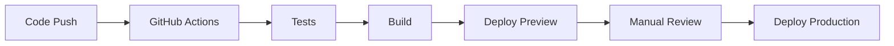

# 開発ガイド

## 📋 概要

本ドキュメントでは、suzumina.clickプロジェクトの開発ガイド、設計原則、コーディング規約、および品質基準を定義します。

**技術スタック**: Next.js 15 App Router、TypeScript 5.8、Tailwind CSS v4、Storybook 9.0  
**開発体制**: 個人開発・個人運用（2環境構成: Staging + Production）  
**更新日**: 2025年6月24日

## 🎯 設計原則

### 1. 型安全性の確保

**原則**: すべてのデータ構造は型安全であること

- **TypeScript**: strict モードを使用し、`any` 型の使用を原則禁止
- **Zod Schema**: 実行時の型検証を実装
- **共有型定義**: packages/shared-types による一元管理

```typescript
// ✅ 良い例: Zodスキーマによる型定義
export const VideoSchema = z.object({
  id: z.string().min(1),
  title: z.string().min(1),
  publishedAt: z.string().datetime()
});

// ❌ 悪い例: any型の使用
function processData(data: any) { ... }
```

### 2. 関数設計原則

**原則**: 純粋関数を優先し、副作用を最小化する

- **純粋関数**: 同じ入力に対して常に同じ出力を返す
- **短い関数**: 1つの関数は1つの責任のみを持つ
- **単一責任原則**: 明確で理解しやすい関数名

```typescript
// ✅ 良い例: 純粋関数
export function formatPrice(price: number, currency = 'JPY'): string {
  return `${price.toLocaleString()}円`;
}

// ❌ 悪い例: 副作用のある関数
function updateAndLog(data: any) {
  updateDatabase(data); // 副作用
  console.log(data);    // 副作用
  return data;
}
```

### 3. コードコロケーション

**原則**: 関連するコードは近接して配置する

```
components/
├── voice-button/
│   ├── voice-button.tsx      # メインコンポーネント
│   ├── voice-button.test.tsx # テスト
│   ├── voice-button.types.ts # 型定義
│   └── index.ts              # エクスポート
```

### 4. 可読性優先

**原則**: パフォーマンスよりも可読性を優先する

- 明確な変数名・関数名を使用
- 適切なコメントの追加
- 複雑なロジックの分割

### 5. Next.js 15準拠設計

**原則**: Server Component/Client Component を適切に分離する

- **Server Components**: データ取得・表示ロジック
- **Client Components**: インタラクション・ブラウザAPI使用
- **Server Actions**: サーバーサイドデータ操作
- **Firestore接続制限**: `@google-cloud/firestore` をサーバーサイドのみで使用

```typescript
// ✅ 良い例: Server Action (ページと同じディレクトリに配置)
// app/works/actions.ts
'use server';

import { firestore } from '@/lib/firestore';

export async function getWorks() {
  const snapshot = await firestore.collection('works').get();
  return snapshot.docs.map(doc => ({ id: doc.id, ...doc.data() }));
}

// ❌ 悪い例: クライアントサイドFirebase
// import { initializeApp } from 'firebase/app';
// import { getFirestore } from 'firebase/firestore';
```

### 6. コンポーネント設計原則

**原則**: Server Component/Client Component を責任に応じて設計する

- **Server Component**: データ表示、SEO、静的UI部分
- **Client Component**: ユーザーインタラクション、ブラウザAPI、状態管理
- **責任分離**: 表示ロジックとインタラクションロジックの明確な分離
- **Storybook対応**: UIコンポーネント開発・テスト環境の活用

```typescript
// ✅ 良い例: Server Component + Client Component分離
// VideoList.tsx (Server Component)
export default function VideoList({ data, totalCount, currentPage }) {
  return (
    <div>
      {data.videos.map(video => <VideoCard key={video.id} video={video} />)}
      <Pagination currentPage={currentPage} totalPages={totalPages} />
    </div>
  );
}

// Pagination.tsx (Client Component)
"use client";
export default function Pagination({ currentPage, totalPages }) {
  const router = useRouter();
  const handlePageChange = (page) => router.push(`?page=${page}`);
  // インタラクションロジック
}

// ❌ 悪い例: Client ComponentでServer Actions直接呼び出し
"use client";
function VideoList() {
  const [data, setData] = useState();
  const handlePageChange = async (page) => {
    const newData = await getVideoTitles({ page }); // アンチパターン
    setData(newData);
  };
}
```

**Storybook開発原則**:
- **コンポーネント単位開発**: 個別コンポーネントの開発・テスト
- **Next.js App Router対応**: `useRouter`などのNext.jsフックのモック設定
- **UI/UXテスト**: 視覚的なコンポーネントテスト環境
- **デザインシステム**: 一貫したUIコンポーネントライブラリ構築
- **デザイントークン**: 色・スペース・タイポグラフィの体系的管理

## 🧪 テスト戦略

### テストアプローチ

**Red-Green-Refactor サイクル**

1. **Red**: 失敗するテストを書く
2. **Green**: テストを通すための最小限のコードを書く
3. **Refactor**: コードを改善する

**Arrange-Act-Assert パターン**

```typescript
describe('formatPrice', () => {
  it('should format price with comma separators', () => {
    // Arrange
    const price = 1000;
    
    // Act
    const result = formatPrice(price);
    
    // Assert
    expect(result).toBe('1,000円');
  });
});
```

### カバレッジ目標

- **最小カバレッジ**: 80%
- **重要な関数**: 100%カバレッジ
- **エッジケース**: 必ずテストする

### テスト種別

- **Unit Tests**: 個別関数のテスト
- **Storybook Tests**: UIコンポーネントの視覚的テスト
- **Integration Tests**: API連携テスト
- **E2E Tests**: ユーザーシナリオテスト (将来実装)

## 🔧 開発ワークフロー

### 1. ブランチ戦略

**Trunk-based Development + GitHub Flow**

```
main (production)
├── feature/add-voice-button-filter
├── feature/improve-dlsite-parser
└── hotfix/fix-youtube-api-error
```

### 2. コミット規約

**Conventional Commits**

```bash
feat: 新機能の追加
fix: バグ修正
docs: ドキュメント更新
style: フォーマット変更
refactor: リファクタリング
test: テスト追加・修正
chore: その他の変更

# 例
feat: add voice button filtering by tags
fix: resolve youtube api quota exceeded error
docs: update api documentation
```

### 3. 実装後チェックリスト

**必須項目（Git フック自動実行）**

- [ ] 包括チェック: `pnpm check` (Lint + フォーマット + 型チェック)
- [ ] テスト実行: `pnpm test`
- [ ] ビルド確認: `pnpm build`

**品質状況（2025年6月現在）**

- ✅ **Lint状態**: 全パッケージ 0エラー・0警告達成
- ✅ **依存関係**: Biome 2.0.6、React 19等最新版
- ✅ **セキュリティ**: Firebase依存関係完全削除
- ✅ **Git フック**: Lefthook による品質チェック自動化

**推奨項目**

- [ ] カバレッジ確認: `pnpm test:coverage`
- [ ] Storybook確認: UIコンポーネント表示テスト
- [ ] E2Eテスト: `pnpm test:e2e`（重要機能）

## 🏗️ アーキテクチャ原則

### 1. 責任分離

**実装済みレイヤー構造**

```
apps/web/                     # 本番Webアプリ
├── src/
│   ├── app/                 # Next.js App Router (Server Components)
│   ├── components/          # UIコンポーネント
│   │   ├── VideoList.tsx    # Server Component (表示ロジック)
│   │   └── Pagination.tsx   # Client Component (インタラクション)
│   └── lib/                 # ユーティリティ

packages/ui/                  # 共有UIコンポーネント
├── src/
│   ├── components/          # Radix UIベースコンポーネント
│   └── styles/              # Tailwind CSS v4設定
└── .storybook/              # UI開発環境

apps/functions/               # バックエンド
├── src/
│   ├── dlsite.ts            # DLsite作品取得
│   ├── youtube.ts           # YouTube動画取得
│   └── utils/               # ドメインロジック
```

### 2. 依存関係管理

**依存関係の方向**

```
UI層 → ビジネスロジック層 → データアクセス層
```

- 上位層は下位層に依存する
- 下位層は上位層に依存しない
- 循環依存を禁止

### 3. エラーハンドリング

**階層別エラー処理**

```typescript
// Cloud Functions
export async function fetchYouTubeVideos(event: CloudEvent) {
  try {
    const result = await fetchYouTubeVideosLogic();
    if (result.error) {
      logger.warn(`YouTube動画取得処理でエラー: ${result.error}`);
    }
  } catch (error) {
    logger.error('予期しないエラー:', error);
    await updateMetadata({ 
      isInProgress: false,
      lastError: error instanceof Error ? error.message : String(error)
    });
  }
}

// Frontend
export function VideoCard({ video }: { video: VideoData }) {
  if (!video) {
    return <ErrorAlert message="動画データが見つかりません" />;
  }
  // ...
}
```

## 🎨 デザインシステム・UI開発

### デザイントークン体系

**ブランドカラーパレット**:
- **suzuka colors**: 涼花みなせメインピンク系（50～950の10段階）
- **minase colors**: 涼花みなせオレンジ系（50～950の10段階）

**トークン構成**:
```text
packages/ui/src/components/design-tokens/
├── color-palette.stories.tsx    # ブランドカラー + セマンティックカラー
├── typography.stories.tsx       # フォントサイズ・行間・ウェイト
├── spacing.stories.tsx          # 4px基準のスペーシング
├── borders-shadows.stories.tsx  # 角丸・ボーダー・シャドウ
└── icons.stories.tsx           # Lucide Reactアイコンセット
```

**使用例**:
```typescript
// ✅ 良い例: Tailwind CSS v4 + デザイントークン
<Button className="bg-suzuka-500 hover:bg-suzuka-600 text-white">
  メインCTA
</Button>

<Button className="bg-minase-500 hover:bg-minase-600 text-white">
  セカンダリCTA
</Button>

// ✅ 良い例: スペーシングトークン活用
<div className="p-4 mb-6 gap-2">
  {/* 4px基準の一貫したスペーシング */}
</div>
```

### Storybook デザイントークン管理

**Lint設定**: デザイントークンStorybook は `biome.json` でlint除外
- 理由: ドキュメンテーション目的のため未使用変数が多数存在
- 対象: `**/src/components/design-tokens/*.stories.tsx`

**メンテナンス方針**:
- デザイントークンの変更時は対応するStorybookを更新
- 新しいカラー・スペース・アイコン追加時はStorybook反映
- Chromaticによる視覚的回帰テスト対象

## 📦 依存関係管理

### 定期更新コマンド

```bash
# 現状確認
pnpm outdated && pnpm audit

# 安全更新（パッチ・マイナー）
pnpm update

# 各更新後テスト
pnpm test && pnpm typecheck && pnpm build
```

### パッケージ選定基準

1. **アクティブメンテナンス**: 定期的な更新
2. **型安全性**: TypeScript サポート
3. **軽量性**: バンドルサイズ影響の考慮
4. **セキュリティ**: 既知脆弱性なし

## 🔒 セキュリティガイドライン

### 1. 機密情報管理

- **環境変数**: すべての機密情報は環境変数で管理
- **Secret Manager**: Google Cloud Secret Manager を使用
- **ログ出力**: 機密情報をログに出力しない

```typescript
// ✅ 良い例
const apiKey = process.env.YOUTUBE_API_KEY;
if (!apiKey) {
  logger.error('YouTube API Keyが設定されていません');
  return;
}

// ❌ 悪い例
logger.info(`API Key: ${process.env.YOUTUBE_API_KEY}`);
```

### 2. 入力検証

- **Zod Schema**: すべての外部入力を検証
- **サニタイゼーション**: HTMLエスケープの実施
- **CSRFトークン**: 状態変更APIでのトークン検証

### 3. アクセス制御

- **最小権限原則**: 必要最小限の権限のみ付与
- **サービスアカウント**: 機能別に専用アカウントを作成
- **Firestore Rules**: データアクセス制御を実装

### 4. プロジェクトID・認証情報管理

**原則**: ソースコードにプロジェクトIDや機密情報をハードコーディングしない

- **環境変数使用**: `GCP_PROJECT_ID`, `GOOGLE_CLOUD_PROJECT` を使用
- **GitHub Secrets**: CI/CDでは GitHub Actions Secrets を活用
- **ドキュメント**: プレースホルダー値を使用（例: `YOUR_PROJECT_ID`, `${PROJECT_ID}`）

```bash
# ✅ 良い例: GitHub Actionsによるデプロイ（推奨）
# GitHubリポジトリの「Actions」タブから「Deploy to Cloud Run」を実行

# ✅ 良い例: 環境変数の使用
export GCP_PROJECT_ID=your-actual-project-id

# ❌ 悪い例: ハードコーディング
PROJECT_ID="suzumina-click"  # セキュリティリスク
```

**チェックリスト**:
- [ ] スクリプトで環境変数を使用
- [ ] ドキュメントにプレースホルダーを使用
- [ ] GitHub ActionsでSecretsを使用
- [ ] .gitignoreに機密ファイルを追加

## 📊 パフォーマンス基準

### 1. フロントエンド

- **Core Web Vitals**
  - LCP (Largest Contentful Paint): < 2.5s
  - FID (First Input Delay): < 100ms
  - CLS (Cumulative Layout Shift): < 0.1

- **バンドルサイズ**: 初期ロードは500KB以下

### 2. バックエンド

- **Cloud Functions**
  - コールドスタート: < 5秒
  - レスポンス時間: < 3秒
  - メモリ使用量: 512MB以下

- **データベース**
  - クエリレスポンス: < 1秒
  - インデックス最適化の実施

## 📝 ドキュメンテーション

### 1. コメント規約

**JSDoc形式**

```typescript
/**
 * DLsiteから作品情報を取得する
 * 
 * @param page - 取得するページ番号
 * @returns 作品データの配列
 * @throws {Error} APIエラーまたはパースエラー
 */
export async function fetchDLsiteWorks(page: number): Promise<WorkData[]> {
  // 実装...
}
```

### 2. README更新

- 新機能追加時はREADMEを更新
- 破壊的変更は移行ガイドを作成
- API変更はCHANGELOG.mdに記録

## 🚀 デプロイメント原則

### 1. 環境分離

- **production**: 本番環境
- **preview**: プルリクエスト確認用

### 2. デプロイフロー



### 3. ロールバック戦略

- **即座にロールバック**: 重大なバグ発見時
- **段階的デプロイ**: 新機能の段階的公開
- **モニタリング**: デプロイ後の継続監視

## 🔍 品質保証

### 1. 自動化チェック

- **Pre-commit hooks**: Lefthook による自動チェック
- **CI/CD**: GitHub Actions による継続的テスト
- **依存関係**: Dependabot による自動更新

### 2. コードレビュー

- **必須レビュー**: すべてのPRに1名以上のレビュー
- **チェック項目**:
  - 設計原則への準拠
  - テストカバレッジ
  - セキュリティ考慮
  - パフォーマンス影響

### 3. 定期監査

- **月次**: 依存関係の脆弱性チェック
- **四半期**: アーキテクチャレビュー
- **年次**: 技術スタック見直し

## 📚 参考資料

- [TypeScript Handbook](https://www.typescriptlang.org/docs/)
- [Next.js Documentation](https://nextjs.org/docs)
- [Google Cloud Functions Best Practices](https://cloud.google.com/functions/docs/bestpractices)
- [Conventional Commits](https://www.conventionalcommits.org/)
- [Clean Code](https://www.amazon.com/Clean-Code-Handbook-Software-Craftsmanship/dp/0132350884)

---

**最終更新**: 2025年6月16日  
**次回レビュー予定**: 2025年12月16日