# ドメインモデル設計書

**最終更新**: 2025-07-26  
**バージョン**: 2.0 (Entity V2統合完了)

## 概要

suzumina.clickプロジェクトのドメイン駆動設計（DDD）に基づくドメインモデルの詳細な設計書です。エンティティ、値オブジェクト、およびそれらの関係性について記述します。

## 更新履歴

- 2025-07-26: Entity V2統合完了、V2サフィックス削除
- 2025-07-15: VideoおよびAudioButtonエンティティのEntity/Value Objectアーキテクチャ採用
- 2025-07-01: 初版作成

## ドメインモデル全体図

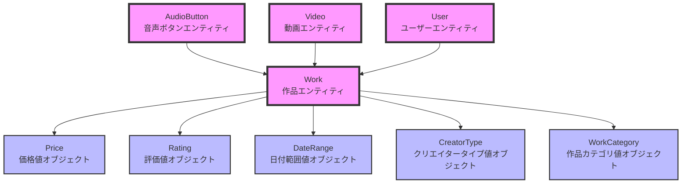

## エンティティ（Entities）

### 1. Work（作品）

作品は本システムの中核となるエンティティです。

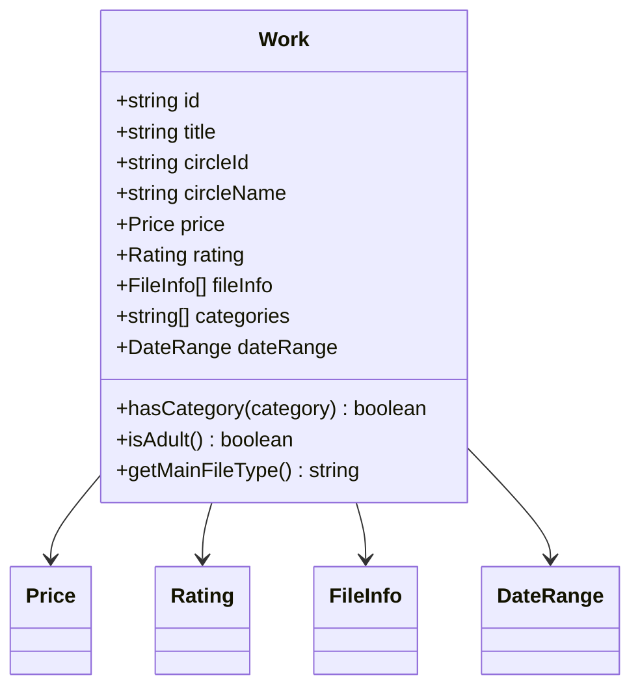

**責務:**
- DLsite作品の基本情報を保持
- 作品の分類判定（カテゴリ、成人向けなど）
- ファイル情報の管理

### 2. AudioButton（音声ボタン）

YouTube動画の特定タイムスタンプを参照する音声ボタンエンティティです。Entity/Value Objectアーキテクチャに基づく実装です。

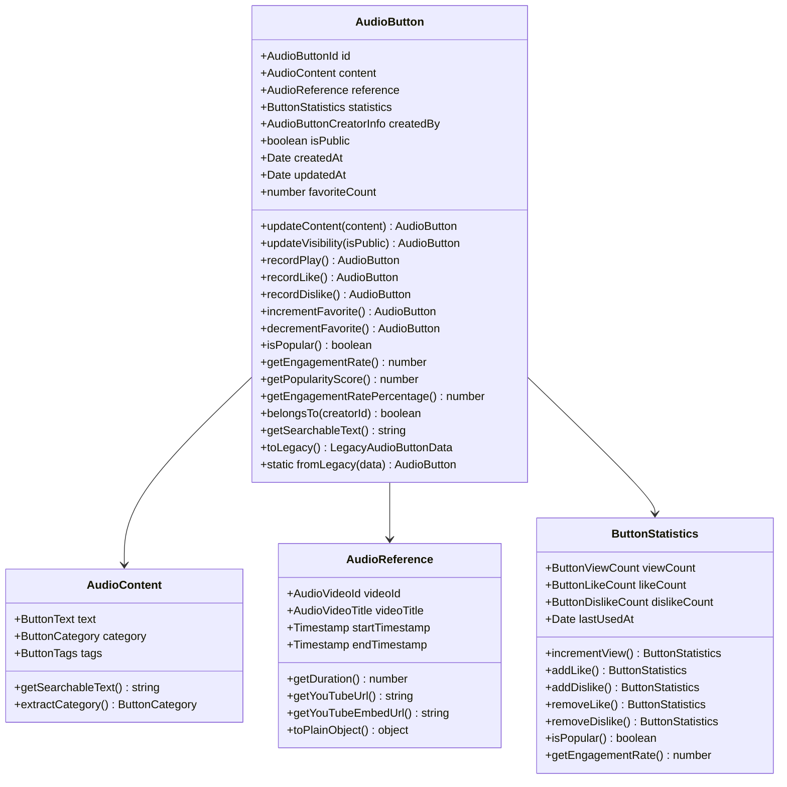

**責務:**
- YouTube動画の特定位置への参照管理（値オブジェクトによる構造化）
- 再生用URLの生成と埋め込みURL生成
- 統計情報の管理とエンゲージメント分析
- お気に入り機能のサポート
- ビジネスロジック（人気度スコア、エンゲージメント率）の計算
- レガシー形式との相互変換

### 3. Video（動画）

YouTube動画情報を管理するエンティティです。Entity/Value Objectアーキテクチャに基づく実装です。

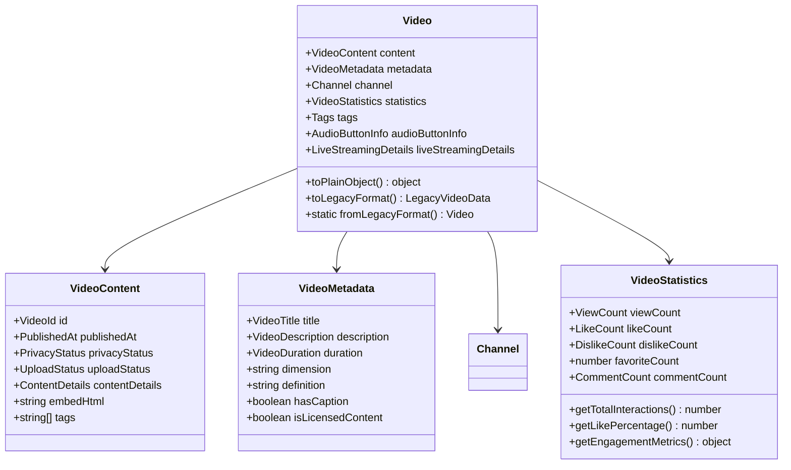

**責務:**
- YouTube動画メタデータの保持（値オブジェクトによる構造化）
- 統計情報の計算とエンゲージメント分析
- レガシー形式との相互変換
- 関連作品との紐付け

### 4. User（ユーザー）

認証されたユーザーを表すエンティティです。

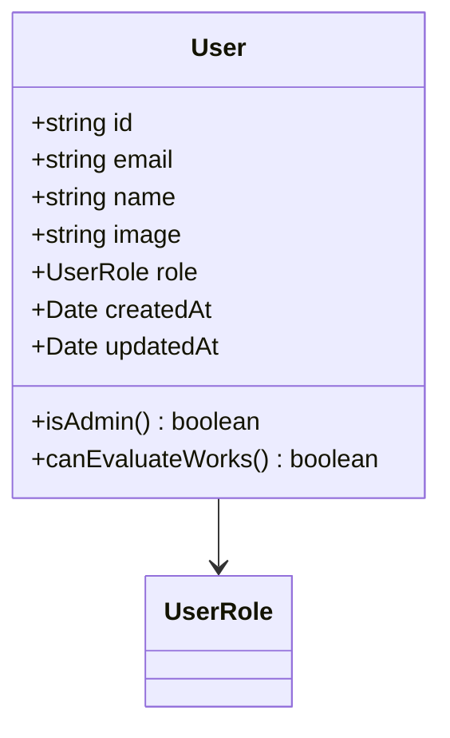

**責務:**
- ユーザー認証情報の管理
- 権限判定
- プロフィール情報の保持

## 値オブジェクト（Value Objects）

### 1. Price（価格）

作品の価格情報を表す値オブジェクトです。

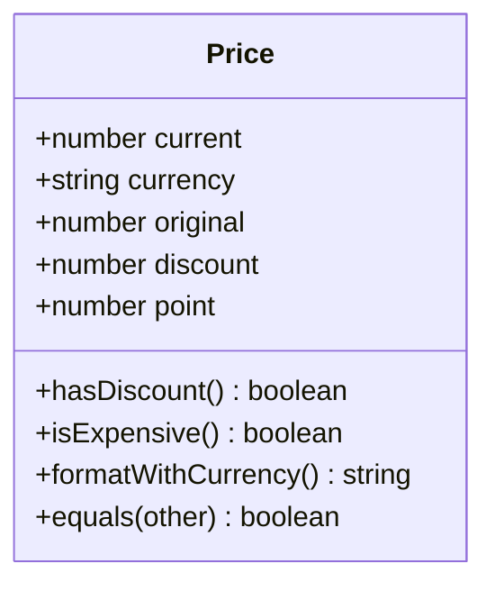

**特性:**
- 不変性（Immutable）
- 通貨を含む価格の完全な表現
- ビジネスロジックのカプセル化

### 2. Rating（評価）

作品の評価情報を表す値オブジェクトです。

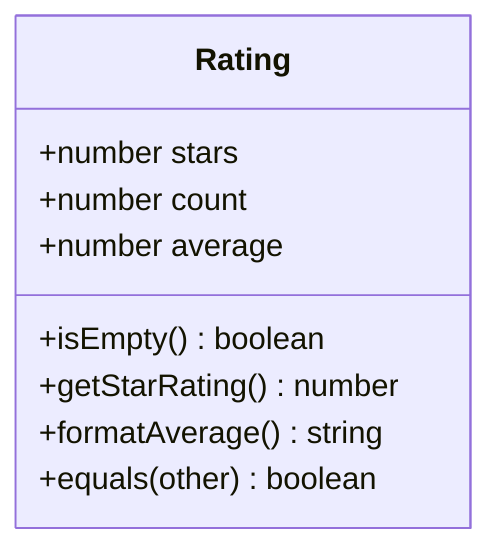

**特性:**
- 評価の統計情報を一元管理
- 星評価への変換ロジック
- 表示用フォーマット機能

### 3. DateRange（日付範囲）

作品の販売期間を表す値オブジェクトです。

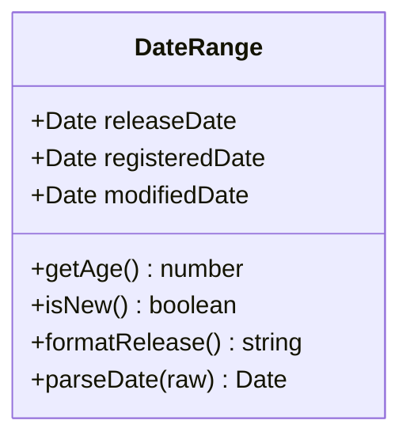

**特性:**
- 複数の日付を統合管理
- 日付解析ロジックの集約
- 経過期間の計算

### 4. CreatorType（クリエイタータイプ）

クリエイターの種別を表す値オブジェクトです。

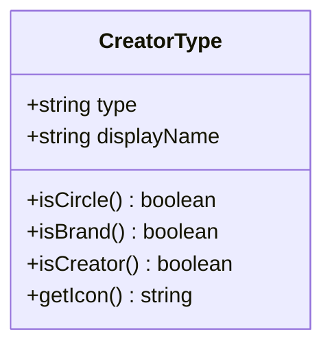

**特性:**
- クリエイター種別の厳密な定義
- 表示用情報の提供
- 種別判定メソッド

## ユーティリティ関数

ドメインオブジェクト全体で使用される共通のユーティリティ関数です。

### 日付解析ユーティリティ

```typescript
// packages/shared-types/src/utils/date-parser.ts

// 文字列を安全にDate型に変換
parseDate(dateString: string | null | undefined): Date | undefined

// 有効な日付文字列かを判定
isValidDateString(dateString: string): boolean
```

### 数値解析ユーティリティ

```typescript
// packages/shared-types/src/utils/number-parser.ts

// 文字列を安全に数値に変換（NaNの場合はundefined）
safeParseNumber(value: string | null | undefined): number | undefined

// 比率を計算（分母が0以下の場合は0を返す）
calculateRatio(numerator: number, denominator: number): number

// パーセンテージ表示文字列を生成
formatPercentage(numerator: number, denominator: number, decimals = 1): string
```

**特性:**
- 安全な型変換（エラーを投げずにundefinedを返す）
- 境界値の適切な処理（0除算、負の値など）
- 一貫性のある数値フォーマット

## Entity/Value Objectアーキテクチャ実装状況

### 完全実装済み
- ✅ **Video Entity** - YouTube動画エンティティ
  - VideoContent, VideoMetadata, VideoStatistics, Channel等の値オブジェクト
  - Plain Object変換パターン実装済み
  - レガシー形式との相互変換サポート
- ✅ **AudioButton Entity** - 音声ボタンエンティティ
  - AudioContent, AudioReference, ButtonStatistics等の値オブジェクト
  - ビジネスロジック（人気度、エンゲージメント率）実装済み
  - Plain Object変換パターン実装済み

### 未実装（今後の計画）
- ⏳ **Work Entity** - DLsite作品エンティティ
  - Price, Rating, DateRange等の値オブジェクトは実装済み
  - エンティティクラス自体は未実装
- ⏳ **User Entity** - ユーザーエンティティ
  - 現在は簡易実装のみ
- ⏳ **Evaluation Entity** - 評価エンティティ
  - 作品評価システム用

## 実装ガイドライン

新しいエンティティを実装する際は、以下のドキュメントを参照してください：
- `/docs/ENTITY_IMPLEMENTATION_GUIDELINES.md` - 実装ガイドライン
- `/docs/ENTITY_SERIALIZATION_PATTERN.md` - Server Component連携パターン

## ドメインサービス

### WorkAggregator

複数の作品を集計・分析するドメインサービスです。

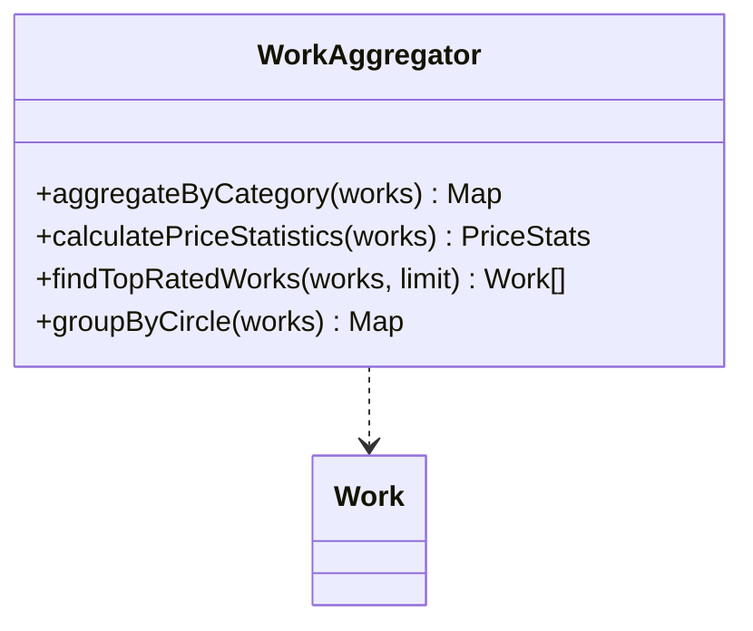

### PriceCalculator

価格計算に関するビジネスロジックを提供するドメインサービスです。

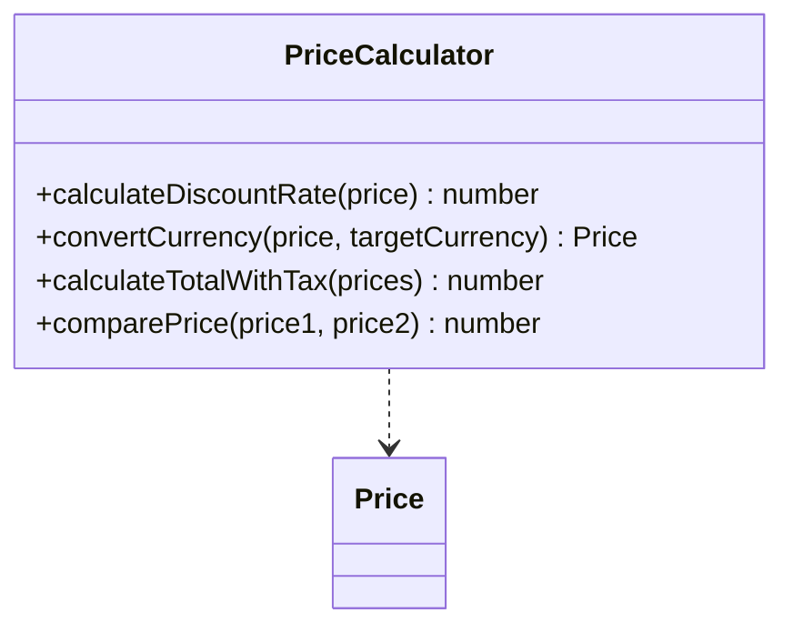

## 集約（Aggregate）

### Work集約

作品を中心とした集約です。

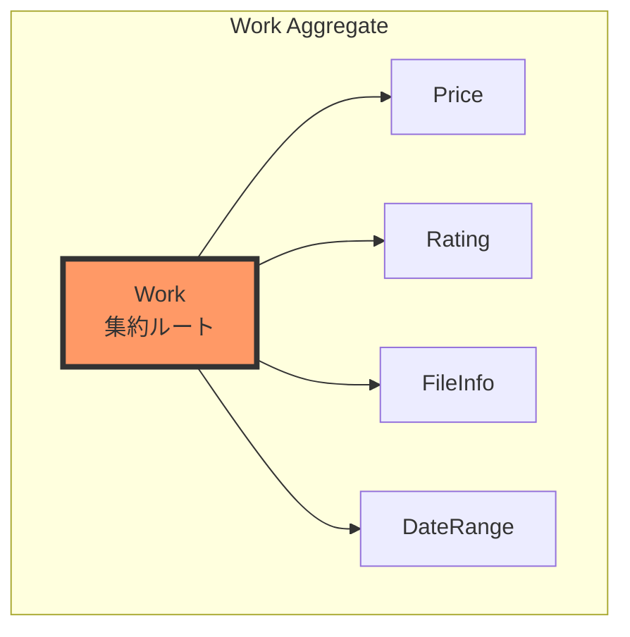

**集約の境界:**
- 作品とその属性情報は一貫性を保つ必要がある
- 価格、評価、ファイル情報は作品と共に更新される
- 作品IDを通じてのみ外部から参照可能

### User集約

ユーザーとその関連情報の集約です。

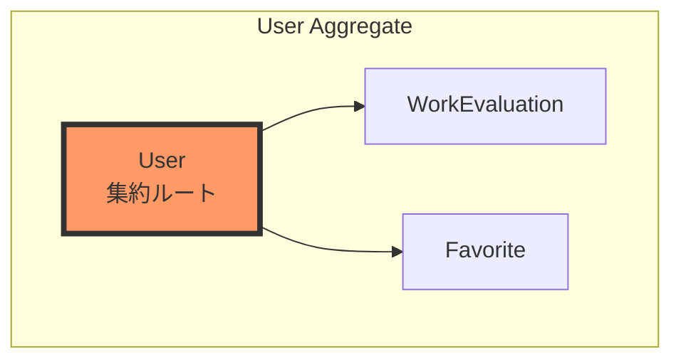

## リポジトリインターフェース

```typescript
// Work集約のリポジトリ
interface WorkRepository {
  findById(id: string): Promise<Work | null>
  findByIds(ids: string[]): Promise<Work[]>
  findByCircle(circleId: string): Promise<Work[]>
  save(work: Work): Promise<void>
  saveMany(works: Work[]): Promise<void>
}

// User集約のリポジトリ
interface UserRepository {
  findById(id: string): Promise<User | null>
  findByEmail(email: string): Promise<User | null>
  save(user: User): Promise<void>
}

// Video集約のリポジトリ
interface VideoRepository {
  findById(id: string): Promise<Video | null>
  findByIds(ids: string[]): Promise<Video[]>
  findByChannelId(channelId: string): Promise<Video[]>
  save(video: Video): Promise<void>
  saveMany(videos: Video[]): Promise<void>
}
```

## インフラストラクチャ層マッパー

### Video Mapper

YouTube API レスポンスをVideo Entityに変換するマッパーです。

```typescript
// apps/functions/src/services/mappers/video-mapper.ts

// YouTube API → Video Entity
mapYouTubeToVideoEntity(
  youtubeVideo: youtube_v3.Schema$Video,
  playlistTags?: string[],
  userTags?: string[]
): Video | null

// 複数動画の一括マッピング
mapYouTubeVideosToEntities(
  youtubeVideos: youtube_v3.Schema$Video[],
  playlistTagsMap?: Map<string, string[]>,
  userTagsMap?: Map<string, string[]>
): Video[]

// エラー詳細付きマッピング
mapYouTubeVideosWithErrors(
  youtubeVideos: youtube_v3.Schema$Video[],
  playlistTagsMap?: Map<string, string[]>,
  userTagsMap?: Map<string, string[]>
): BatchMappingResult

// レガシー形式との相互変換
mapVideoEntityToLegacy(video: Video): LegacyVideoData
mapLegacyToVideoEntity(legacyData: LegacyVideoData): Video
```

**特性:**
- 外部API形式からドメインモデルへの変換
- エラーハンドリングと詳細なロギング
- レガシーシステムとの互換性維持

### AudioButton Mapper

Firestore形式のデータをAudioButton Entityに変換するマッパーです。

```typescript
// apps/functions/src/services/mappers/audio-button-mapper.ts

// Firestore → AudioButton Entity
mapFirestoreToAudioButton(
  data: FirestoreAudioButtonData
): AudioButton

// 複数ボタンの一括マッピング
mapFirestoreToAudioButtons(
  documents: FirestoreAudioButtonData[]
): AudioButton[]

// AudioButton Entity → Firestore
mapAudioButtonToFirestore(
  audioButton: AudioButton
): FirestoreAudioButtonData

// エラー詳細付きマッピング
mapFirestoreToAudioButtonsWithErrors(
  documents: FirestoreAudioButtonData[]
): BatchMappingResult<AudioButton>

// レガシー形式との相互変換
mapLegacyToAudioButton(
  legacyData: LegacyAudioButtonData
): AudioButton

mapAudioButtonToLegacy(
  audioButton: AudioButton
): LegacyAudioButtonData
```

**特性:**
- Firestoreデータ形式からドメインモデルへの変換
- YouTube参照情報の検証
- 統計情報の正規化
- レガシーシステムとの互換性維持

## ドメインイベント

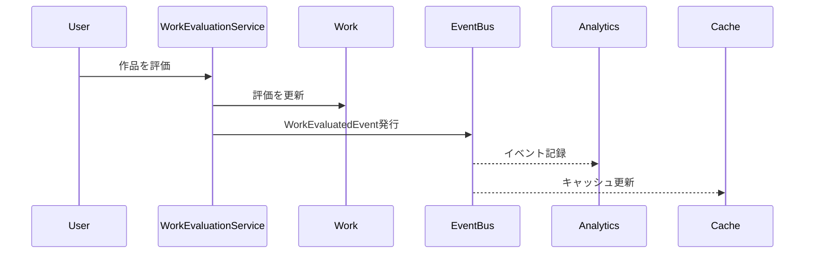

## 設計原則

### 1. 不変性（Immutability）
- すべての値オブジェクトは不変
- 変更が必要な場合は新しいインスタンスを作成

### 2. カプセル化
- ビジネスロジックは適切なドメインオブジェクトに配置
- データと振る舞いを一体化

### 3. 明示的な境界
- 集約の境界を明確に定義
- 集約間は識別子による参照のみ

### 4. ユビキタス言語
- ドメインエキスパートと同じ言語を使用
- コード内の名前はビジネス用語と一致

## 実装の配置

```
packages/shared-types/src/
├── entities/              # エンティティ定義
│   ├── work.ts
│   ├── audio-button.ts
│   ├── video.ts
│   └── user.ts
├── value-objects/         # 値オブジェクト定義
│   ├── price.ts
│   ├── rating.ts
│   ├── date-range.ts
│   └── creator-type.ts
└── domain-services/       # ドメインサービス（将来実装）
    ├── work-aggregator.ts
    └── price-calculator.ts
```

---

**最終更新**: 2025年7月26日  
**バージョン**: 1.2