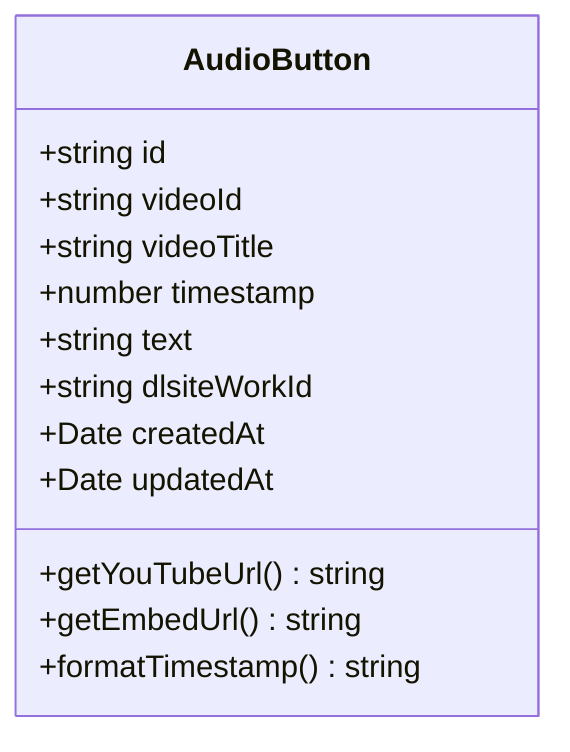
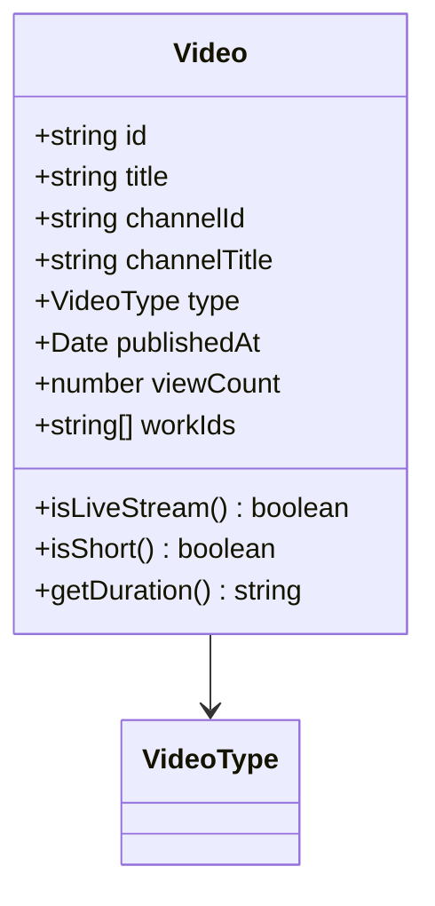

# ドメインモデル設計書

## 概要

suzumina.clickプロジェクトのドメイン駆動設計（DDD）に基づくドメインモデルの詳細な設計書です。エンティティ、値オブジェクト、およびそれらの関係性について記述します。

## ドメインモデル全体図


## エンティティ（Entities）

### 1. Work（作品）

作品は本システムの中核となるエンティティです。


**責務:**
- DLsite作品の基本情報を保持
- 作品の分類判定（カテゴリ、成人向けなど）
- ファイル情報の管理

### 2. AudioButton（音声ボタン）

YouTube動画の特定タイムスタンプを参照する音声ボタンエンティティです。



**責務:**
- YouTube動画の特定位置への参照管理
- 再生用URLの生成
- タイムスタンプのフォーマット

### 3. Video（動画）

YouTube動画情報を管理するエンティティです。



**責務:**
- YouTube動画メタデータの保持
- 動画種別の判定（ライブ配信、ショート動画など）
- 関連作品との紐付け

### 4. User（ユーザー）

認証されたユーザーを表すエンティティです。


**責務:**
- ユーザー認証情報の管理
- 権限判定
- プロフィール情報の保持

## 値オブジェクト（Value Objects）

### 1. Price（価格）

作品の価格情報を表す値オブジェクトです。


**特性:**
- 不変性（Immutable）
- 通貨を含む価格の完全な表現
- ビジネスロジックのカプセル化

### 2. Rating（評価）

作品の評価情報を表す値オブジェクトです。


**特性:**
- 評価の統計情報を一元管理
- 星評価への変換ロジック
- 表示用フォーマット機能

### 3. DateRange（日付範囲）

作品の販売期間を表す値オブジェクトです。


**特性:**
- 複数の日付を統合管理
- 日付解析ロジックの集約
- 経過期間の計算

### 4. CreatorType（クリエイタータイプ）

クリエイターの種別を表す値オブジェクトです。


**特性:**
- クリエイター種別の厳密な定義
- 表示用情報の提供
- 種別判定メソッド

## ドメインサービス

### WorkAggregator

複数の作品を集計・分析するドメインサービスです。


### PriceCalculator

価格計算に関するビジネスロジックを提供するドメインサービスです。


## 集約（Aggregate）

### Work集約

作品を中心とした集約です。


**集約の境界:**
- 作品とその属性情報は一貫性を保つ必要がある
- 価格、評価、ファイル情報は作品と共に更新される
- 作品IDを通じてのみ外部から参照可能

### User集約

ユーザーとその関連情報の集約です。


## リポジトリインターフェース

```typescript
// Work集約のリポジトリ
interface WorkRepository {
  findById(id: string): Promise<Work | null>
  findByIds(ids: string[]): Promise<Work[]>
  findByCircle(circleId: string): Promise<Work[]>
  save(work: Work): Promise<void>
  saveMany(works: Work[]): Promise<void>
}

// User集約のリポジトリ
interface UserRepository {
  findById(id: string): Promise<User | null>
  findByEmail(email: string): Promise<User | null>
  save(user: User): Promise<void>
}
```

## ドメインイベント


## 設計原則

### 1. 不変性（Immutability）
- すべての値オブジェクトは不変
- 変更が必要な場合は新しいインスタンスを作成

### 2. カプセル化
- ビジネスロジックは適切なドメインオブジェクトに配置
- データと振る舞いを一体化

### 3. 明示的な境界
- 集約の境界を明確に定義
- 集約間は識別子による参照のみ

### 4. ユビキタス言語
- ドメインエキスパートと同じ言語を使用
- コード内の名前はビジネス用語と一致

## 実装の配置

```
packages/shared-types/src/
├── entities/              # エンティティ定義
│   ├── work.ts
│   ├── audio-button.ts
│   ├── video.ts
│   └── user.ts
├── value-objects/         # 値オブジェクト定義
│   ├── price.ts
│   ├── rating.ts
│   ├── date-range.ts
│   └── creator-type.ts
└── domain-services/       # ドメインサービス（将来実装）
    ├── work-aggregator.ts
    └── price-calculator.ts
```

---

**最終更新**: 2025年7月24日  
**バージョン**: 1.0