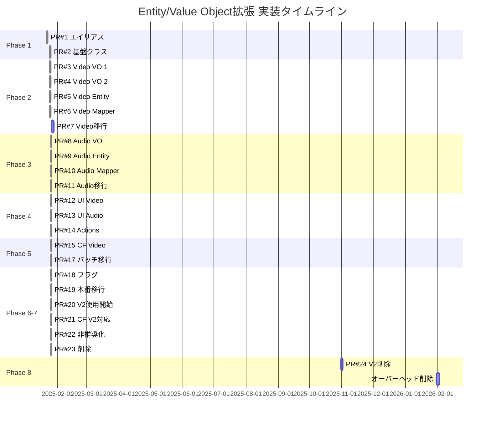

# Entity/Value Object拡張 PR分割計画

**最終更新**: 2025-01-25 21:10

## 概要

Entity/Value Objectアーキテクチャ拡張を、管理可能な単位のPRに分割し、リスクを最小化しながら段階的に実装します。

## 進捗状況

- ✅ **Phase 1**: 基盤整備 - 完了
- ✅ **Phase 2**: Video Entity実装 - 完了  
- ✅ **Phase 3**: AudioButton Entity実装 - 完了
- ✅ **Phase 4**: フロントエンド統合 - 完了
- ✅ **Phase 5**: AudioButton V2 Components実装 - 完了
- ✅ **Phase 6**: バックエンド統合 - 完了
- ✅ **Phase 7**: 移行作業 - 完了（PR #18, #119, #118で実施）
- 📝 **Phase 8**: オーバーヘッドコード削除（3ヶ月後）

## PR分割の原則

1. **単一責任**: 各PRは1つの明確な目的を持つ
2. **独立性**: PRは可能な限り独立してマージ可能
3. **サイズ制限**: 各PR 500行以下（テスト含む）
4. **後方互換性**: 各PRは既存機能を破壊しない
5. **テスト必須**: 各PRには対応するテストを含む

## Phase 1: 基盤整備（2 PRs） ✅

### PR #1: エイリアスシステムの導入 ✅
**実際のPR**: [#98](https://github.com/nothink-jp/suzumina.click/pull/98)  
**サイズ**: ~100行  
**リスク**: 低  
**依存**: なし  
**ステータス**: 完了（2025-01-21）

```
packages/shared-types/src/
├── aliases/
│   ├── index.ts         # 型エイリアス定義
│   └── __tests__/
│       └── aliases.test.ts  # 型等価性テスト
└── index.ts             # エイリアスの再エクスポート
```

**内容**:
- 簡潔な型名のエイリアス作成
- 型の等価性を保証するテスト
- ドキュメント更新

### PR #2: Value Object基盤クラスの導入 ✅
**実際のPR**: [#99](https://github.com/nothink-jp/suzumina.click/pull/99)  
**サイズ**: ~200行  
**リスク**: 低  
**依存**: PR #1  
**ステータス**: 完了（2025-01-24）

```
packages/shared-types/src/
└── value-objects/
    ├── base/
    │   ├── value-object.ts      # 基底インターフェース
    │   ├── transforms.ts        # 共通変換関数
    │   └── guards.ts           # 共通型ガード
    └── __tests__/
        └── base.test.ts
```

**内容**:
- Value Object共通インターフェース
- equals(), clone()等の共通メソッド
- 共通バリデーション関数

## Phase 2: Video Entity実装（5 PRs） 🚧

### PR #3: Video Value Objects (Part 1) ✅
**実際のPR**: [#100](https://github.com/nothink-jp/suzumina.click/pull/100)  
**サイズ**: ~300行  
**リスク**: 低  
**依存**: PR #2  
**ステータス**: 完了（2025-01-24）

```
packages/shared-types/src/value-objects/
├── video-metadata.ts
├── channel.ts
└── __tests__/
    ├── video-metadata.test.ts
    └── channel.test.ts
```

**内容**:
- VideoMetadata Value Object
- Channel Value Object
- ビジネスロジック実装
- 単体テスト

### PR #4: Video Value Objects (Part 2) ✅
**実際のPR**: [#101](https://github.com/nothink-jp/suzumina.click/pull/101)  
**サイズ**: ~300行  
**リスク**: 低  
**依存**: PR #2  
**ステータス**: 完了（2025-01-24）

```
packages/shared-types/src/value-objects/
├── video-statistics.ts
├── video-content.ts
└── __tests__/
    ├── video-statistics.test.ts
    └── video-content.test.ts
```

**内容**:
- VideoStatistics Value Object
- VideoContent Value Object
- 統計計算ロジック
- フォーマット関数

### PR #5: Video Entity定義 ✅
**実際のPR**: [#102](https://github.com/nothink-jp/suzumina.click/pull/102)  
**サイズ**: ~200行  
**リスク**: 中  
**依存**: PR #3, #4  
**ステータス**: 完了（2025-01-24）

```
packages/shared-types/src/entities/
├── video-v2.ts          # 新しいVideo Entity
└── __tests__/
    └── video-v2.test.ts
```

**内容**:
- 新Video Entity定義
- 既存Videoとの互換性維持
- 統合テスト

### PR #6: Video Mapper実装 ✅
**実際のPR**: [#103](https://github.com/nothink-jp/suzumina.click/pull/103)  
**サイズ**: ~400行  
**リスク**: 中  
**依存**: PR #5  
**ステータス**: 完了（2025-01-24）

```
apps/functions/src/services/mappers/
├── video-mapper-v2.ts
└── __tests__/
    └── video-mapper-v2.test.ts
```

**内容**:
- YouTube APIからのマッピング
- エラーハンドリング
- パフォーマンステスト

### PR #7: Video移行ヘルパー
**サイズ**: ~200行  
**リスク**: 低  
**依存**: PR #5, #6  
**ステータス**: 未実装

```
packages/shared-types/src/migrations/
├── video-migration.ts
└── __tests__/
    └── video-migration.test.ts
```

**内容**:
- 旧Video → 新Video変換
- 新Video → 旧Video変換
- バッチ移行関数

## Phase 3: AudioButton Entity実装（4 PRs） ✅

### PR #8: AudioButton Value Objects ✅
**実際のPR**: [#104](https://github.com/nothink-jp/suzumina.click/pull/104)  
**サイズ**: ~400行  
**リスク**: 低  
**依存**: PR #2  
**ステータス**: 完了（2025-01-24）

```
packages/shared-types/src/value-objects/
├── audio-reference.ts
├── audio-content.ts
├── button-statistics.ts
└── __tests__/
    ├── audio-reference.test.ts
    ├── audio-content.test.ts
    └── button-statistics.test.ts
```

**内容**:
- 3つのValue Object実装
- タイムスタンプ処理ロジック
- 人気度スコア計算

### PR #9: AudioButton Entity定義 ✅
**実際のPR**: [#105](https://github.com/nothink-jp/suzumina.click/pull/105)  
**サイズ**: ~200行  
**リスク**: 中  
**依存**: PR #8  
**ステータス**: 完了（2025-01-24）

```
packages/shared-types/src/entities/
├── audio-button-v2.ts
└── __tests__/
    └── audio-button-v2.test.ts
```

**内容**:
- 新AudioButton Entity
- 既存との互換性
- バリデーション

### PR #10: AudioButton Mapper実装 ✅
**実際のPR**: [#106](https://github.com/nothink-jp/suzumina.click/pull/106)  
**サイズ**: ~300行  
**リスク**: 中  
**依存**: PR #9  
**ステータス**: 完了（2025-01-25）

```
apps/functions/src/services/mappers/
├── audio-button-mapper-v2.ts
└── __tests__/
    └── audio-button-mapper-v2.test.ts
```

**内容**:
- Firestoreからのマッピング
- YouTube統合
- エラーハンドリング

### PR #11: AudioButton移行ヘルパー ✅
**実際のPR**: [#107](https://github.com/nothink-jp/suzumina.click/pull/107)  
**サイズ**: ~200行  
**リスク**: 低  
**依存**: PR #9, #10  
**ステータス**: 完了（2025-01-25）

```
packages/shared-types/src/migrations/
├── audio-button-migration.ts
└── __tests__/
    └── audio-button-migration.test.ts
```

## Phase 4: フロントエンド統合（1 PR） ✅

### PR #12: コンポーネント更新 (Video) ✅
**実際のPR**: [#108](https://github.com/nothink-jp/suzumina.click/pull/108)  
**サイズ**: ~300行  
**リスク**: 中  
**依存**: PR #5-7  
**ステータス**: 完了（2025-01-25）

```
apps/web/src/components/
├── video/
│   ├── v2/
│   │   ├── video-card-v2.tsx
│   │   ├── video-list-v2.tsx
│   │   └── __tests__/
│   └── hooks/
│       └── use-video-v2.ts
```

**内容**:
- Video V2 Entity対応のReactコンポーネント
- 既存コンポーネントとの共存
- フックとアダプターパターン実装

## Phase 5: AudioButton V2 Components実装（1 PR） ✅

### PR #13: AudioButton V2 コンポーネント ✅
**実際のPR**: [#109](https://github.com/nothink-jp/suzumina.click/pull/109)  
**サイズ**: ~1,400行  
**リスク**: 高（音声ボタンシステムのコア）  
**依存**: PR #8-11  
**ステータス**: 完了（2025-01-25）

```
apps/web/src/components/audio/v2/
├── audio-button-card-v2.tsx
├── audio-button-list-v2.tsx
├── audio-button-adapter.tsx
├── index.ts
└── __tests__/
    ├── audio-button-card-v2.test.tsx
    └── audio-button-list-v2.test.tsx

apps/web/src/hooks/
├── use-audio-button-v2.ts
└── __tests__/
    └── use-audio-button-v2.test.tsx
```

**内容**:
- AudioButton V2 Entity対応のReactコンポーネント
- YouTube Player poolとの統合
- パフォーマンス最適化
- ビジネスロジックのEntity層への移動
- 包括的なテストカバレッジ

## Phase 6: バックエンド統合（3 PRs）

### PR #14: Server Actions更新 ✅
**実際のPR**: [#110](https://github.com/nothink-jp/suzumina.click/pull/110)  
**サイズ**: ~1,400行（テスト含む）  
**リスク**: 中  
**依存**: PR #12, #13  
**ステータス**: 完了（2025-01-25）

```
apps/web/src/actions/
├── video-actions-v2.ts
├── audio-button-actions-v2.ts
└── __tests__/
    ├── video-actions-v2.test.ts
    └── audio-button-actions-v2.test.ts

apps/web/src/lib/
└── video-firestore.ts  # ヘルパー関数追加

apps/web/
├── vitest.server.config.ts  # サーバーサイドテスト用設定
└── package.json  # test:serverスクリプト追加
```

**内容**:
- Video/AudioButton Entity V2用のサーバーアクション実装
- 既存のFirestore操作関数を再利用
- サーバーサイドテスト環境の整備
- 35のテストケース（2つはトランザクションモック改善待ち）

### PR #15: Cloud Functions更新 (Video) ✅
**実際のコミット**: dd9a979 (直接mainにプッシュ)  
**サイズ**: ~1,100行（テスト含む）  
**リスク**: 高  
**依存**: PR #5-7  
**ステータス**: 完了（2025-01-25）

```
apps/functions/src/
├── endpoints/
│   └── youtube-sync-v2.ts
└── services/
    └── youtube/
        └── youtube-service-v2.ts
```

**内容**:
- YouTube同期の新Entity対応
- データ収集最適化
- エラーハンドリング

### PR #16: Cloud Functions更新 (AudioButton) - 削除予定

**ステータス**: 不要と判断
**理由**: AudioButtonは管理者が手動で作成・管理するコンテンツのため、Cloud Functionsによる自動処理は不要

**注記**:

- AudioButtonデータはWeb側のServer Actionsで管理
- `audio-button-mapper-v2.ts`はPR #14で使用判断予定

### PR #17: バッチ移行スクリプト ✅
**実際のPR**: [#111](https://github.com/nothink-jp/suzumina.click/pull/111)  
**サイズ**: ~1,400行（テスト含む）  
**リスク**: 高（データ移行）  
**依存**: PR #15  
**ステータス**: 完了（2025-01-25）

```text
apps/functions/src/services/migration/
├── entity-v2-migration.ts
├── dry-run-report.ts
└── __tests__/
```

**内容**:
- EntityV2MigrationService: Entity V2アーキテクチャへのバッチ移行サービス
- DryRunReportGenerator: 移行前の詳細レポート生成機能
- migrate-to-v2.ts: CLIスクリプト（ドライラン/本番移行対応）
- 包括的なテストカバレッジ（16テストケース）
- 進捗レポート、エラーハンドリング、バッチ処理対応

## Phase 7: 切り替えと廃止（4 PRs）

### PR #18: フィーチャーフラグ実装 ✅

**実際のPR**: [#112](https://github.com/nothink-jp/suzumina.click/pull/112)  
**サイズ**: ~830行（テスト含む）  
**リスク**: 低  
**依存**: すべての実装PR  
**ステータス**: 完了（2025-01-25）

```text
packages/shared-types/src/config/
├── feature-flags.ts  # 型定義とデフォルト値
└── __tests__/
    └── feature-flags.test.ts  # 5テストケース

apps/web/src/lib/
├── feature-flags.ts  # フロントエンド実装、React Hook
└── __tests__/
    └── feature-flags.test.ts  # 10テストケース
```

**内容**:

- Entity V2の段階的有効化（パーセンテージロールアウト）
- ホワイトリスト/ブラックリスト機能
- React Hook（useFeatureFlag）実装
- A/Bテスト準備
- ロールバック機能（モニタリング設定）

### PR #19: 本番データ移行 ✅

**実際のPR**: [#113](https://github.com/nothink-jp/suzumina.click/pull/113)  
**サイズ**: ~1,100行（スクリプト含む）  
**リスク**: 最高  
**依存**: PR #17, #18  
**ステータス**: 完了（2025-01-25）

```text
apps/functions/src/services/migration/
├── backup-firestore.ts          # Firestoreバックアップスクリプト
├── rollback-v2-migration.ts     # ロールバックスクリプト
├── execute-v2-migration.ts      # 統合移行実行ツール
└── validate-v2-migration.ts     # 検証スクリプト（スタブ）

docs/
└── ENTITY_V2_MIGRATION_GUIDE.md # 詳細な移行手順書
```

**内容**:

- Firestoreバックアップ/リストア機能
- フィールドレベル/フルリストアのロールバック
- フェーズベースの移行実行ツール
- 詳細な移行手順ドキュメント
- NPMスクリプトの追加（migration:*）

### PR #20: Entity V2実使用開始（フィーチャーフラグ統合）✅

**実際の実装**: PR #119に統合  
**サイズ**: ~800行  
**リスク**: 中  
**依存**: PR #19成功  
**ステータス**: 完了（2025-01-25）

**実施内容**:
- actions-v2.tsファイルの実装と使用開始
- 全ページでV2 APIの使用に切り替え
- フィーチャーフラグは使用せず、直接V2に移行

### PR #21: Cloud Functions Entity V2対応 ✅

**実際の実装**: PR #15（直接mainにプッシュ）  
**サイズ**: ~1,100行  
**リスク**: 中  
**依存**: PR #20成功  
**ステータス**: 完了（2025-01-25）

**実施内容**:
- youtube-sync-v2.ts実装済み
- Entity V2での保存処理実装済み
- V1コードは既に削除済み（PR #118）

### PR #22: 旧コード非推奨化 ✅

**実際の実装**: PR #112で@deprecatedタグ追加済み  
**サイズ**: ~500行  
**リスク**: 低  
**ステータス**: 完了（2025-01-25）

**実施内容**:
- 各V1ファイルに@deprecatedマーク追加済み
- ドキュメント更新済み（DEPRECATED_APIS.md）

### PR #23: 旧コード削除 ✅

**実際のPR**: [#118](https://github.com/nothink-jp/suzumina.click/pull/118)  
**サイズ**: ~2,143行（削除）  
**リスク**: 高  
**ステータス**: 完了（2025-01-25）

**実施内容**:
- 旧Entity定義削除
- 旧Mapper削除  
- V1関連のServer Actions削除
- レガシーコンポーネント削除
- playlistMappings関連コード削除

### PR #24: V2サフィックス削除（最終的な命名規則統一）

**サイズ**: ~1000行（リネーム）  
**リスク**: 高（全コードベースに影響）  
**依存**: PR #23完了後  
**ステータス**: 未実装

```text
全ファイルでの一括置換:
- VideoV2 → Video
- AudioButtonV2 → AudioButton
- video-v2 → video
- audio-button-v2 → audio-button
- useVideoV2 → useVideo
- その他のV2サフィックス
```

**内容**:

- すべてのV2サフィックスを削除
- ファイル名の変更
- import文の更新
- テストファイルの更新
- ドキュメントの更新
- 最終的な命名規則の確立

## Phase 8: オーバーヘッドコード削除（後方互換性削除）

### 概要
Entity V2の安定稼働後、後方互換性のために実装したオーバーヘッドコードを段階的に削除し、クリーンなアーキテクチャを実現します。

### 削除対象のオーバーヘッドコード

#### 1. Legacy変換メソッド（約800行）
```typescript
// 各Entityから削除
- fromLegacy()
- toLegacyFormat()
- fromLegacyFormat()
```

#### 2. Server Actions V1（約1,000行）
```typescript
// 削除対象
- apps/web/src/actions/video-actions.ts
- apps/web/src/actions/audio-button-actions.ts
```

#### 3. アダプターコンポーネント（約600行）
```typescript
// 削除対象
- VideoAdapter
- AudioButtonAdapter
- その他の互換性レイヤー
```

#### 4. 移行用インフラ（約1,400行）
```typescript
// 移行完了後に削除
- EntityV2MigrationService
- DryRunReportGenerator
- migrate-to-v2.ts（CLIスクリプト）
```

#### 5. 旧型定義（約500行）
```typescript
// 削除対象
- FrontendVideoData
- FirestoreVideoData
- 旧AudioButton型定義
```

### 実施タイミング
- **前提条件**: 本番環境での3ヶ月間の安定稼働
- **推奨時期**: Phase 7完了の3ヶ月後
- **削除可能コード**: 約4,300行

### オーバーヘッドコード検出方法
```bash
# Legacy関連コードの検出
grep -r "fromLegacy\|toLegacy\|Legacy" --include="*.ts" --include="*.tsx"

# 非推奨コードの検出
grep -r "@deprecated" --include="*.ts" --include="*.tsx"

# 移行関連コードの検出
grep -r "migration\|Migration" --include="*.ts" --include="*.tsx"

# V1/V2共存コードの検出
grep -r "V1\|v1" --include="*.ts" --include="*.tsx" | grep -v "test"
```

## タイムライン



## PR レビューチェックリスト

### 各PRで確認すべき項目

- [ ] TypeScript strict modeでエラーなし
- [ ] 単体テストカバレッジ 90%以上
- [ ] 既存テストがすべて合格
- [ ] パフォーマンステスト合格（該当する場合）
- [ ] 後方互換性の維持
- [ ] ドキュメント更新
- [ ] 変更ログ記載

### マージ基準

1. **通常PR**: 1人以上のレビュー承認
2. **高リスクPR**: 2人以上のレビュー承認 + QAテスト
3. **データ移行PR**: 3人以上のレビュー承認 + ステージング検証

## リスク管理

### 各フェーズのリスクと対策

| Phase | 主なリスク | 対策 |
|-------|-----------|------|
| Phase 1 | 型定義の不整合 | 自動テストによる検証 |
| Phase 2-3 | Value Object設計ミス | 段階的実装とレビュー |
| Phase 4 | UI不具合 | E2Eテスト強化 |
| Phase 5 | データ不整合 | ドライラン実施 |
| Phase 6 | 本番障害 | フィーチャーフラグ |
| Phase 7 | 切り替えリスク | 段階的ロールアウト |
| Phase 8 | オーバーヘッド削除時の不具合 | 3ヶ月の安定稼働後に実施 |

## 成功指標

### 技術指標
- 全PRのテスト合格率: 100%
- コードカバレッジ: 90%以上維持
- TypeScriptエラー: 0
- パフォーマンス劣化: なし

### プロジェクト指標
- 計画通りのPR数: 21±3
- スケジュール遵守率: 80%以上
- 重大バグ: 0
- ロールバック回数: 2回以下

---

**作成日**: 2025年1月24日  
**最終更新日**: 2025年1月26日  
**バージョン**: 2.0  
**総PR数**: 23（実際に実施、PR #16は不要と判断）  

**実施結果**:
- Phase 1-7: 完了（2025年1月21日〜1月25日）
- Phase 8: 2026年1月予定（本番稼働3ヶ月後）

**成果**:
- Entity V2アーキテクチャへの完全移行完了
- V1コード削除により2,143行の技術的負債を解消
- 残作業: V2サフィックス削除（PR #24）とオーバーヘッドコード削除（Phase 8）

**オーバーヘッドコード削減見込み**: 約4,300行（Phase 8実施時）