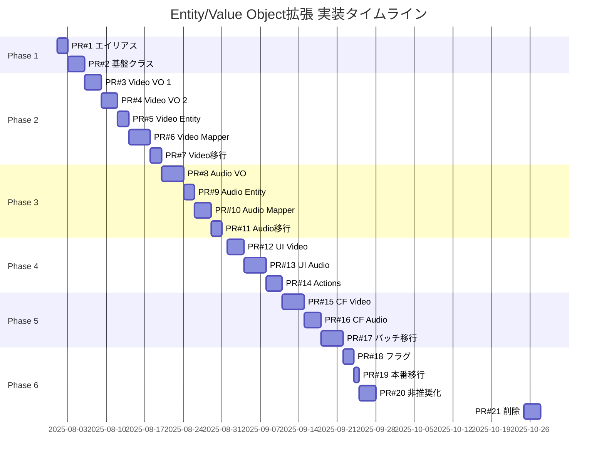

# Entity/Value Object拡張 PR分割計画

## 概要

Entity/Value Objectアーキテクチャ拡張を、管理可能な単位のPRに分割し、リスクを最小化しながら段階的に実装します。

## PR分割の原則

1. **単一責任**: 各PRは1つの明確な目的を持つ
2. **独立性**: PRは可能な限り独立してマージ可能
3. **サイズ制限**: 各PR 500行以下（テスト含む）
4. **後方互換性**: 各PRは既存機能を破壊しない
5. **テスト必須**: 各PRには対応するテストを含む

## Phase 1: 基盤整備（2 PRs）

### PR #1: エイリアスシステムの導入
**サイズ**: ~100行  
**リスク**: 低  
**依存**: なし

```
packages/shared-types/src/
├── aliases/
│   ├── index.ts         # 型エイリアス定義
│   └── __tests__/
│       └── aliases.test.ts  # 型等価性テスト
└── index.ts             # エイリアスの再エクスポート
```

**内容**:
- 簡潔な型名のエイリアス作成
- 型の等価性を保証するテスト
- ドキュメント更新

### PR #2: Value Object基盤クラスの導入
**サイズ**: ~200行  
**リスク**: 低  
**依存**: PR #1

```
packages/shared-types/src/
└── value-objects/
    ├── base/
    │   ├── value-object.ts      # 基底インターフェース
    │   ├── transforms.ts        # 共通変換関数
    │   └── guards.ts           # 共通型ガード
    └── __tests__/
        └── base.test.ts
```

**内容**:
- Value Object共通インターフェース
- equals(), clone()等の共通メソッド
- 共通バリデーション関数

## Phase 2: Video Entity実装（5 PRs）

### PR #3: Video Value Objects (Part 1)
**サイズ**: ~300行  
**リスク**: 低  
**依存**: PR #2

```
packages/shared-types/src/value-objects/
├── video-metadata.ts
├── channel.ts
└── __tests__/
    ├── video-metadata.test.ts
    └── channel.test.ts
```

**内容**:
- VideoMetadata Value Object
- Channel Value Object
- ビジネスロジック実装
- 単体テスト

### PR #4: Video Value Objects (Part 2)
**サイズ**: ~300行  
**リスク**: 低  
**依存**: PR #2

```
packages/shared-types/src/value-objects/
├── video-statistics.ts
├── video-content.ts
└── __tests__/
    ├── video-statistics.test.ts
    └── video-content.test.ts
```

**内容**:
- VideoStatistics Value Object
- VideoContent Value Object
- 統計計算ロジック
- フォーマット関数

### PR #5: Video Entity定義
**サイズ**: ~200行  
**リスク**: 中  
**依存**: PR #3, #4

```
packages/shared-types/src/entities/
├── video-v2.ts          # 新しいVideo Entity
└── __tests__/
    └── video-v2.test.ts
```

**内容**:
- 新Video Entity定義
- 既存Videoとの互換性維持
- 統合テスト

### PR #6: Video Mapper実装
**サイズ**: ~400行  
**リスク**: 中  
**依存**: PR #5

```
apps/functions/src/services/mappers/
├── video-mapper-v2.ts
└── __tests__/
    └── video-mapper-v2.test.ts
```

**内容**:
- YouTube APIからのマッピング
- エラーハンドリング
- パフォーマンステスト

### PR #7: Video移行ヘルパー
**サイズ**: ~200行  
**リスク**: 低  
**依存**: PR #5, #6

```
packages/shared-types/src/migrations/
├── video-migration.ts
└── __tests__/
    └── video-migration.test.ts
```

**内容**:
- 旧Video → 新Video変換
- 新Video → 旧Video変換
- バッチ移行関数

## Phase 3: AudioButton Entity実装（4 PRs）

### PR #8: AudioButton Value Objects
**サイズ**: ~400行  
**リスク**: 低  
**依存**: PR #2

```
packages/shared-types/src/value-objects/
├── audio-reference.ts
├── audio-content.ts
├── button-statistics.ts
└── __tests__/
    ├── audio-reference.test.ts
    ├── audio-content.test.ts
    └── button-statistics.test.ts
```

**内容**:
- 3つのValue Object実装
- タイムスタンプ処理ロジック
- 人気度スコア計算

### PR #9: AudioButton Entity定義
**サイズ**: ~200行  
**リスク**: 中  
**依存**: PR #8

```
packages/shared-types/src/entities/
├── audio-button-v2.ts
└── __tests__/
    └── audio-button-v2.test.ts
```

**内容**:
- 新AudioButton Entity
- 既存との互換性
- バリデーション

### PR #10: AudioButton Mapper実装
**サイズ**: ~300行  
**リスク**: 中  
**依存**: PR #9

```
apps/functions/src/services/mappers/
├── audio-button-mapper-v2.ts
└── __tests__/
    └── audio-button-mapper-v2.test.ts
```

**内容**:
- Firestoreからのマッピング
- YouTube統合
- エラーハンドリング

### PR #11: AudioButton移行ヘルパー
**サイズ**: ~200行  
**リスク**: 低  
**依存**: PR #9, #10

```
packages/shared-types/src/migrations/
├── audio-button-migration.ts
└── __tests__/
    └── audio-button-migration.test.ts
```

## Phase 4: フロントエンド統合（3 PRs）

### PR #12: コンポーネント更新 (Video)
**サイズ**: ~300行  
**リスク**: 中  
**依存**: PR #5-7

```
apps/web/src/components/
├── video/
│   ├── video-card-v2.tsx
│   ├── video-list-v2.tsx
│   └── __tests__/
└── hooks/
    └── use-video-v2.ts
```

**内容**:
- 新Video Entity対応コンポーネント
- 既存コンポーネントとの共存
- E2Eテスト

### PR #13: コンポーネント更新 (AudioButton)
**サイズ**: ~400行  
**リスク**: 高（音声ボタンシステムのコア）  
**依存**: PR #8-11

```
apps/web/src/components/audio/
├── audio-button-v2.tsx
├── audio-player-v2.tsx
└── __tests__/
```

**内容**:
- 新AudioButton対応
- プレイヤープール統合
- パフォーマンス最適化

### PR #14: Server Actions更新
**サイズ**: ~300行  
**リスク**: 中  
**依存**: PR #12, #13

```
apps/web/src/actions/
├── video-actions-v2.ts
├── audio-button-actions-v2.ts
└── __tests__/
```

## Phase 5: バックエンド統合（3 PRs）

### PR #15: Cloud Functions更新 (Video)
**サイズ**: ~400行  
**リスク**: 高  
**依存**: PR #5-7

```
apps/functions/src/
├── endpoints/
│   └── youtube-sync-v2.ts
└── services/
    └── youtube/
        └── youtube-service-v2.ts
```

**内容**:
- YouTube同期の新Entity対応
- データ収集最適化
- エラーハンドリング

### PR #16: Cloud Functions更新 (AudioButton)
**サイズ**: ~300行  
**リスク**: 中  
**依存**: PR #8-11

```
apps/functions/src/
├── endpoints/
│   └── audio-button-sync-v2.ts
└── services/
    └── audio/
        └── audio-button-service-v2.ts
```

### PR #17: バッチ移行スクリプト
**サイズ**: ~400行  
**リスク**: 高（データ移行）  
**依存**: PR #15, #16

```
apps/functions/src/services/migration/
├── entity-v2-migration.ts
├── dry-run-report.ts
└── __tests__/
```

## Phase 6: 切り替えと廃止（4 PRs）

### PR #18: フィーチャーフラグ実装
**サイズ**: ~200行  
**リスク**: 低  
**依存**: すべての実装PR

```
packages/shared-types/src/config/
└── feature-flags.ts

apps/web/src/lib/
└── feature-flags.ts
```

**内容**:
- Entity V2の段階的有効化
- A/Bテスト準備
- ロールバック機能

### PR #19: 本番データ移行
**サイズ**: ~100行（スクリプト実行）  
**リスク**: 最高  
**依存**: PR #17, #18

**内容**:
- バックアップ作成
- 移行スクリプト実行
- 検証とロールバック準備

### PR #20: 旧コード非推奨化
**サイズ**: ~500行  
**リスク**: 低  
**依存**: PR #19成功

```
各ファイルに@deprecatedマーク追加
ESLintルール更新
ドキュメント更新
```

### PR #21: 旧コード削除
**サイズ**: ~1000行（削除）  
**リスク**: 中  
**依存**: 1ヶ月の安定稼働後

**内容**:
- 旧Entity定義削除
- 旧Mapper削除
- 移行ヘルパー削除

## タイムライン



## PR レビューチェックリスト

### 各PRで確認すべき項目

- [ ] TypeScript strict modeでエラーなし
- [ ] 単体テストカバレッジ 90%以上
- [ ] 既存テストがすべて合格
- [ ] パフォーマンステスト合格（該当する場合）
- [ ] 後方互換性の維持
- [ ] ドキュメント更新
- [ ] 変更ログ記載

### マージ基準

1. **通常PR**: 1人以上のレビュー承認
2. **高リスクPR**: 2人以上のレビュー承認 + QAテスト
3. **データ移行PR**: 3人以上のレビュー承認 + ステージング検証

## リスク管理

### 各フェーズのリスクと対策

| Phase | 主なリスク | 対策 |
|-------|-----------|------|
| Phase 1 | 型定義の不整合 | 自動テストによる検証 |
| Phase 2-3 | Value Object設計ミス | 段階的実装とレビュー |
| Phase 4 | UI不具合 | E2Eテスト強化 |
| Phase 5 | データ不整合 | ドライラン実施 |
| Phase 6 | 本番障害 | フィーチャーフラグ |

## 成功指標

### 技術指標
- 全PRのテスト合格率: 100%
- コードカバレッジ: 90%以上維持
- TypeScriptエラー: 0
- パフォーマンス劣化: なし

### プロジェクト指標
- 計画通りのPR数: 21±3
- スケジュール遵守率: 80%以上
- 重大バグ: 0
- ロールバック回数: 2回以下

---

**作成日**: 2025年7月24日  
**バージョン**: 1.0  
**総PR数**: 21  
**推定期間**: 8-10週間