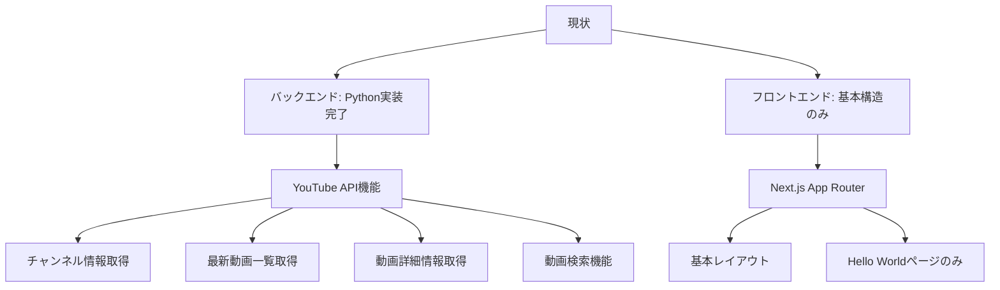
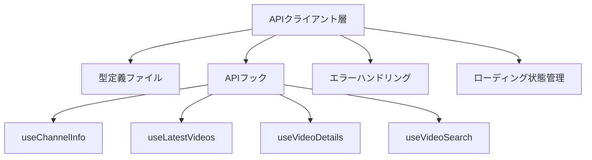
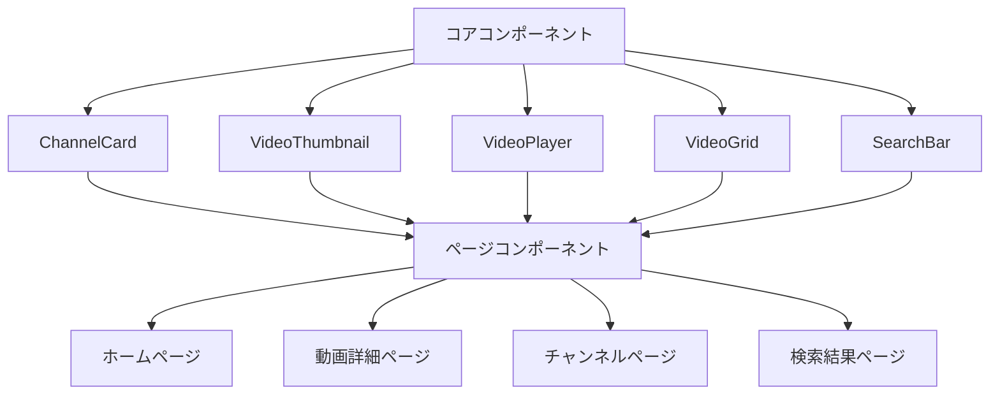

# フロントエンド（Next.js）とYouTube API連携実装計画

このドキュメントは、YouTube API統合を活用するフロントエンド開発の詳細な計画を記載します。

## 現状分析



## 実装計画

### 1. APIクライアント実装（フロントエンド）



#### 実装内容

- **型定義ファイル**: APIレスポンスの型定義
- **APIクライアント関数**: 各エンドポイントに対応する関数実装
- **Reactフック**: データ取得のための再利用可能なカスタムフック
- **エラー管理**: エラー状態の適切な処理とユーザーへの通知

### 2. UIコンポーネント開発



#### 実装内容

- **共通コンポーネント**: 再利用可能なUI要素の開発
- **ページレイアウト**: 各主要ページの構造設計
- **レスポンシブデザイン**: モバイル・タブレット・デスクトップ対応
- **アクセシビリティ対応**: セマンティックHTMLと適切なARIA属性

### 3. ルーティングとページ構造

- **`/`**: ホームページ（おすすめ動画・チャンネル）
- **`/channel/[channelId]`**: チャンネル詳細ページ
- **`/video/[videoId]`**: 動画詳細ページ
- **`/search`**: 検索結果ページ

### 4. 技術的実装詳細

#### APIクライアント実装

```typescript
// 型定義
interface VideoData {
  id: string;
  title: string;
  description: string;
  thumbnail: string;
  publishedAt: string;
  channelId: string;
  channelTitle: string;
}

// APIクライアント
async function fetchLatestVideos(channelId: string, maxResults: number = 10): Promise<VideoData[]> {
  const response = await fetch(`/api/youtube/videos?channel_id=${channelId}&max_results=${maxResults}`);
  
  if (!response.ok) {
    const error = await response.json();
    throw new Error(error.message || '動画の取得に失敗しました');
  }
  
  return response.json();
}

// Reactフック
function useLatestVideos(channelId: string, maxResults: number = 10) {
  const [videos, setVideos] = useState<VideoData[]>([]);
  const [isLoading, setIsLoading] = useState(true);
  const [error, setError] = useState<Error | null>(null);
  
  useEffect(() => {
    let isMounted = true;
    
    async function loadVideos() {
      try {
        setIsLoading(true);
        const data = await fetchLatestVideos(channelId, maxResults);
        if (isMounted) {
          setVideos(data);
          setError(null);
        }
      } catch (err) {
        if (isMounted) {
          setError(err instanceof Error ? err : new Error('不明なエラーが発生しました'));
        }
      } finally {
        if (isMounted) {
          setIsLoading(false);
        }
      }
    }
    
    loadVideos();
    
    return () => {
      isMounted = false;
    };
  }, [channelId, maxResults]);
  
  return { videos, isLoading, error };
}
```

#### UIコンポーネント例

```tsx
// VideoThumbnail.tsx
interface VideoThumbnailProps {
  video: VideoData;
  onClick?: () => void;
}

function VideoThumbnail({ video, onClick }: VideoThumbnailProps) {
  return (
    <div 
      className="video-thumbnail" 
      onClick={onClick}
    >
      <div className="thumbnail-container">
        
        {/* 再生時間表示などの追加情報 */}
      </div>
      <div className="video-info">
        <h3 className="video-title">{video.title}</h3>
        <p className="channel-name">{video.channelTitle}</p>
        {/* 公開日、視聴回数などの追加情報 */}
      </div>
    </div>
  );
}
```

### 5. 導入スケジュール

1. **フェーズ1** (1週目):
   - API型定義とクライアント実装
   - 基本UIコンポーネント開発

2. **フェーズ2** (2週目):
   - ページ構造実装
   - APIとUIの統合

3. **フェーズ3** (3週目):
   - テストとデバッグ
   - UI/UX改善

## テスト方針

- **単体テスト**: コンポーネントとフックのテスト
- **統合テスト**: APIクライアントとUIの連携テスト
- **E2Eテスト**: 主要ユーザーフローのテスト

## 考慮すべき課題

1. **パフォーマンス最適化**
   - サーバーコンポーネントとクライアントコンポーネントの適切な使い分け
   - 画像の遅延ロードと最適化

2. **エラーハンドリング**
   - オフライン状態への対応
   - API制限到達時の対応

3. **UX向上**
   - スケルトンローダーでの読み込み表示
   - 無限スクロールでの追加データ読み込み

## 最終更新日

2025年4月3日
