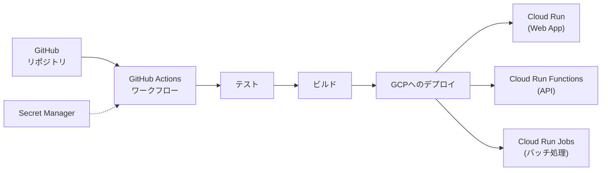

# Google Cloud Platform CI/CD設計

このドキュメントでは、suzumina.clickのCI/CD（継続的インテグレーション/継続的デリバリー）パイプラインの設計について説明します。

## 目次

- [アーキテクチャ概要](#アーキテクチャ概要)
- [GitHub Actions設定](#github-actions設定)
- [認証と権限](#認証と権限)
- [デプロイプロセス](#デプロイプロセス)
- [関連ドキュメント](#関連ドキュメント)

## アーキテクチャ概要

suzumina.clickのCI/CDパイプラインはGitHub Actionsを使用して実装します。このパイプラインは、コードのプッシュやプルリクエストをトリガーとして、自動的にテスト・ビルド・デプロイを行います。



## GitHub Actions設定

以下はGitHub Actionsのワークフロー設定です：

```yaml
name: CI/CD

on:
  push:
    branches: ["main"]
  pull_request:
    types: [opened, synchronize]

jobs:
  check:
    name: Check
    timeout-minutes: 15
    runs-on: ubuntu-latest

    steps:
      - name: Checkout code
        uses: actions/checkout@v4

      - name: Setup Bun
        uses: oven-sh/setup-bun@v1
        with:
          bun-version: latest

      - name: Install dependencies
        run: bun install --frozen-lockfile

      - name: Run CI Checks
        run: bun run ci:check

      - name: Type Check
        run: bun run check-types

      - name: Spell Check
        run: bun run spell-check

  deploy:
    name: Deploy
    needs: check
    if: github.ref == 'refs/heads/main' && github.event_name == 'push'
    runs-on: ubuntu-latest

    steps:
      - name: Checkout
        uses: actions/checkout@v4

      - name: Set up Google Cloud SDK
        uses: google-github-actions/setup-gcloud@v2
        with:
          project_id: suzumina-click-dev
          service_account_key: ${{ secrets.GCP_SA_KEY }}
          export_default_credentials: true

      - name: Authorize Docker push
        run: gcloud auth configure-docker asia-northeast1-docker.pkg.dev

      - name: Setup Bun
        uses: oven-sh/setup-bun@v1
        with:
          bun-version: latest

      - name: Install dependencies
        run: bun install --frozen-lockfile

      - name: Build
        run: bun run build

      # Web App (Cloud Run)
      - name: Build and Push Web Container
        run: |
          cd apps/web
          docker build -t asia-northeast1-docker.pkg.dev/suzumina-click-dev/suzumina/web:${{ github.sha }} \
            -f Dockerfile .
          docker push asia-northeast1-docker.pkg.dev/suzumina-click-dev/suzumina/web:${{ github.sha }}

      - name: Deploy to Cloud Run
        run: |
          gcloud run deploy web \
            --image asia-northeast1-docker.pkg.dev/suzumina-click-dev/suzumina/web:${{ github.sha }} \
            --platform managed \
            --region asia-northeast1 \
            --allow-unauthenticated

      # Functions (TypeScript)
      - name: Deploy TypeScript Functions
        run: |
          cd apps/functions
          gcloud functions deploy app \
           --gen2 \
           --runtime=nodejs22 \
           --region=asia-northeast1 \
           --source=. \
           --entry-point=app \
           --trigger-http \
           --allow-unauthenticated

      # Functions (Python)
      - name: Deploy Python Functions
        run: |
          cd apps/functions-python
          gcloud functions deploy hello-python \
           --gen2 \
           --runtime=python312 \
           --region=asia-northeast1 \
           --source=. \
           --entry-point=hello \
           --trigger-http \
           --allow-unauthenticated

      # Jobs (TypeScript)
      - name: Build and Push TypeScript Jobs Container
        run: |
          cd apps/jobs
          docker build -t asia-northeast1-docker.pkg.dev/suzumina-click-dev/suzumina/jobs:${{ github.sha }} \
            -f Dockerfile .
          docker push asia-northeast1-docker.pkg.dev/suzumina-click-dev/suzumina/jobs:${{ github.sha }}

      # Jobs (Python)
      - name: Build and Push Python Jobs Container
        run: |
          cd apps/jobs-python
          docker build -t asia-northeast1-docker.pkg.dev/suzumina-click-dev/suzumina/jobs-python:${{ github.sha }} \
            -f Dockerfile .
          docker push asia-northeast1-docker.pkg.dev/suzumina-click-dev/suzumina/jobs-python:${{ github.sha }}

      # TypeScript Jobs デプロイ
      - name: Deploy Data Sync Job
        run: |
          gcloud run jobs create data-sync-job \
            --image asia-northeast1-docker.pkg.dev/suzumina-click-dev/suzumina/jobs:${{ github.sha }} \
            --set-env-vars="JOB_TYPE=data-sync" \
            --region=asia-northeast1 \
            --tasks=1 \
            --max-retries=3 \
            --task-timeout=3600s

      - name: Deploy Report Job
        run: |
          gcloud run jobs create report-job \
            --image asia-northeast1-docker.pkg.dev/suzumina-click-dev/suzumina/jobs:${{ github.sha }} \
            --set-env-vars="JOB_TYPE=report" \
            --region=asia-northeast1 \
            --tasks=1 \
            --max-retries=3 \
            --task-timeout=3600s

      - name: Deploy Maintenance Job
        run: |
          gcloud run jobs create maintenance-job \
            --image asia-northeast1-docker.pkg.dev/suzumina-click-dev/suzumina/jobs:${{ github.sha }} \
            --set-env-vars="JOB_TYPE=maintenance" \
            --region=asia-northeast1 \
            --tasks=1 \
            --max-retries=3 \
            --task-timeout=3600s

      # ジョブスケジュールの設定
      - name: Set up Job Schedules
        run: |
          # データ同期ジョブ - 毎日午前2時
          gcloud scheduler jobs create http data-sync-scheduler \
            --schedule="0 2 * * *" \
            --uri="https://asia-northeast1-run.googleapis.com/apis/run.googleapis.com/v1/namespaces/suzumina-click-dev/jobs/data-sync-job:run" \
            --http-method=POST \
            --oauth-service-account-email=${{ secrets.GCP_SA_EMAIL }}
```

## 認証と権限

GitHub ActionsからGCPリソースにデプロイするために、以下の認証設定が必要です：

1. **GCPサービスアカウントの作成**：
   - CI/CD用のサービスアカウント（例：`github-actions-deployer@suzumina-click-dev.iam.gserviceaccount.com`）を作成
   - 必要な権限を付与：Cloud Run Admin、Cloud Functions Admin、Cloud Storage Admin、Artifact Registry Writerなど

2. **サービスアカウントキーの作成と保存**：
   - サービスアカウントキー（JSON形式）を生成
   - GitHub リポジトリのSecretsに保存：
     - `GCP_SA_KEY`: サービスアカウントキーのJSON内容
     - `GCP_SA_EMAIL`: サービスアカウントのメールアドレス
     - `GCP_PROJECT_ID`: GCPプロジェクトID

3. **GitHub Secretsの参照**：
   - GitHub Actionsワークフローファイル内で `${{ secrets.SECRET_NAME }}` の形式で参照

## デプロイプロセス

CI/CDパイプラインは以下のステップで構成されています：

1. **コード検証（CI）**：
   - コードのチェックアウト
   - 依存関係のインストール
   - リントチェック
   - 型チェック
   - ユニットテスト
   - スペルチェック

2. **デプロイ（CD）**：
   - GCPの認証設定
   - アプリケーションのビルド
   - Dockerイメージのビルドとプッシュ
   - Cloud Runサービスのデプロイ
   - Cloud Functionsのデプロイ
   - Cloud Run Jobsのデプロイ
   - Cloud Schedulerの設定

デプロイフェーズは、メインブランチへのプッシュ時のみ実行されます（`if: github.ref == 'refs/heads/main' && github.event_name == 'push'`）。

## 関連ドキュメント

- [全体概要](GCP_OVERVIEW.md)
- [プロジェクト設定](GCP_PROJECT_SETUP.md)
- [Webアプリケーション設計](GCP_WEB_APP.md)
- [API設計](GCP_FUNCTIONS.md)
- [バッチ処理設計](GCP_JOBS.md)
- [セキュリティ設計](GCP_SECURITY.md)

## 最終更新日

2025年4月2日
