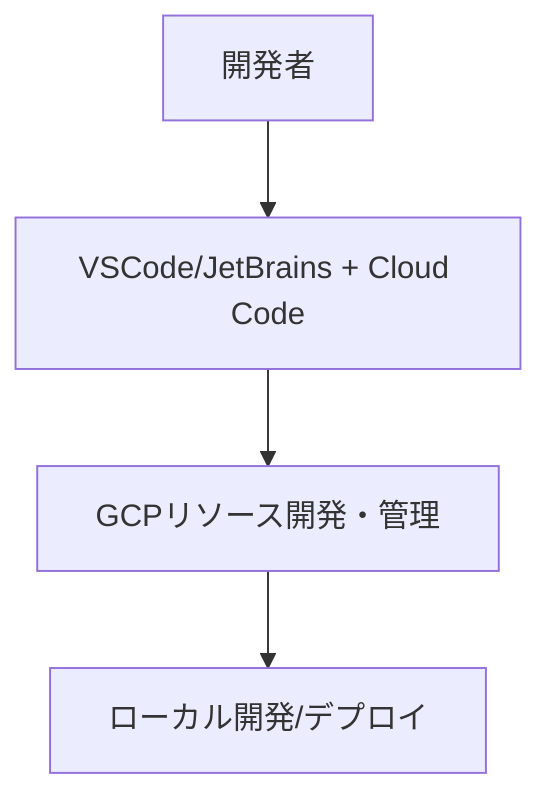

# Google Cloud Platform Cloud Code開発環境

このドキュメントでは、suzumina.clickの開発環境としてのCloud Codeの利用方法について説明します。

## Cloud Code概要

Cloud Codeは、GoogleがVSCodeとJetBrains IDEに提供する拡張機能で、GCPリソースの操作、Kubernetes/Cloud Run/Cloud Functionsなどの開発を支援します。



## 主な機能

- **Cloud Run開発**: アプリケーション作成、ローカル実行/デバッグ、デプロイ
- **Cloud Functions開発**: プロジェクト作成、ローカルエミュレーション、デプロイ
- **GCPリソース管理**: Cloud Explorer、ログ表示、Secret Manager操作

## セットアップ手順

### VSCode

1. 拡張機能マーケットプレイスから「Cloud Code」をインストール
2. Cloud Codeアイコンをクリックし「GCPにログイン」
3. プロジェクト「suzumina-click-dev」を選択

### JetBrains IDE

1. プラグイン検索から「Cloud Code」をインストール
2. 「Tools」→「Cloud Code」→「Sign in to Google Cloud」

## プロジェクト設定

```sh
.vscode/
  ├── launch.json     # デバッグ設定
  ├── settings.json   # VSCode設定
  └── cloudcode.json  # Cloud Code設定
```

## CI/CDとの連携

- ローカル開発とCI/CDの一貫性確保
- Cloud Build連携とトリガー実行
- GitHub Actionsワークフロー連携

## ベストプラクティス

- **効率的な開発**: ローカルエミュレーション活用、不要なデプロイ削減
- **デバッグとログ活用**: 早期問題発見、IDE内ログ確認
- **設定共有**: `.vscode`と`.cloudcode`ディレクトリの共有
- **パフォーマンス最適化**: キャッシュ活用、選択的リソース同期

## 関連ドキュメント

- [全体概要](GCP_OVERVIEW.md)
- [CI/CD設計](GCP_CICD.md)
- [開発環境セットアップ](DEVELOPMENT_SETUP.md)

## 最終更新日

2025年4月3日
