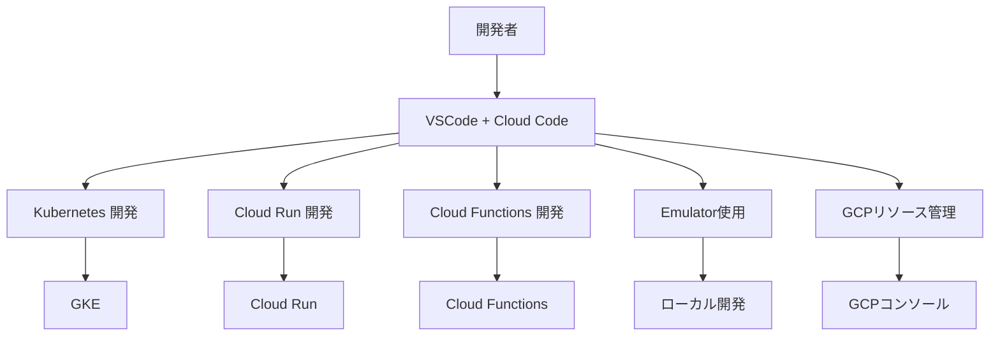

# Google Cloud Platform Cloud Code開発環境

このドキュメントでは、suzumina.clickの開発環境としてのCloud Codeの利用方法と設定について説明します。

## 目次

- [Cloud Code概要](#cloud-code概要)
- [インストールと設定](#インストールと設定)
- [主な機能](#主な機能)
- [プロジェクト固有の設定](#プロジェクト固有の設定)
- [CI/CDとの連携](#cicdとの連携)
- [ベストプラクティス](#ベストプラクティス)
- [関連ドキュメント](#関連ドキュメント)

## Cloud Code概要

Cloud Codeは、GoogleがVSCodeとJetBrains IDEに提供する拡張機能です。
GCPリソースの操作、Kubernetesアプリケーションの開発、Cloud Run・Cloud Functionsなどのサーバーレスアプリケーションの開発を支援します。
suzumina.clickプロジェクトでは、Cloud Codeを活用してGCP上での開発効率を高めます。



## インストールと設定

### VSCodeへのCloud Codeインストール

1. **拡張機能のインストール**:
   - VSCodeの拡張機能マーケットプレイスから「Cloud Code」を検索
   - 「インストール」をクリック

2. **認証設定**:
   - Cloud Code拡張機能がインストールされたら、VSCodeのステータスバーのCloud Codeアイコンをクリック
   - 「GCPにログイン」を選択し、ブラウザでGoogle認証を完了

3. **プロジェクトの選択**:
   - 認証完了後、使用するGCPプロジェクト「suzumina-click-dev」を選択

### JetBrains IDEへのCloud Codeインストール（代替IDE）

1. **プラグインのインストール**:
   - 「設定/環境設定」→「プラグイン」→「マーケットプレイスから検索」
   - 「Cloud Code」を検索してインストール

2. **認証設定**:
   - メインメニューから「Tools」→「Cloud Code」→「Sign in to Google Cloud」
   - ブラウザでGoogle認証を完了

## 主な機能

### Cloud Runの開発

Cloud Codeは、Cloud Runアプリケーションの開発、デプロイ、管理を支援します：

1. **新規Cloud Runアプリケーションの作成**:
   - Cloud Codeパレットを開き「Cloud Run: New Application」を選択
   - 言語とフレームワークを選択（Next.js用のテンプレートも利用可能）

2. **ローカルでの実行とデバッグ**:
   - 「Run/Debug」構成を使用してコンテナをローカルで実行
   - ブレークポイントを設定し、アプリケーションをデバッグ

3. **Cloud Runへのデプロイ**:
   - Cloud Codeパレットから「Deploy to Cloud Run」を選択
   - リージョン、サービス名などを指定してデプロイ

### Cloud Functionsの開発

Cloud FunctionsのTypeScriptとPython実装をサポート：

1. **新規Functionsプロジェクトの作成**:
   - Cloud Codeパレットから「Cloud Functions: New Function」を選択
   - ランタイム（Node.jsまたはPython）とトリガータイプを選択

2. **ローカルでのエミュレーション**:
   - Functions Frameworkを使用してローカルでFunctionsを実行
   - リアルタイムでの変更の反映とデバッグ

3. **Cloud Functionsへのデプロイ**:
   - Cloud Codeパレットから「Deploy to Cloud Functions」を選択
   - リージョン、メモリ、トリガー設定などを指定

### GCPリソースの管理

Cloud Codeを使用してIDEから直接GCPリソースにアクセス：

1. **Cloud Explorerの使用**:
   - VSCodeの「Cloud Code」セクションからGCPリソースを参照
   - Cloud Run、Cloud Functions、Cloud Storage、GKEなどのリソースを表示・管理

2. **ログの表示**:
   - デプロイされたサービスのログをIDEから直接確認
   - フィルターとクエリによるログ検索

3. **Secret Managerの操作**:
   - シークレットの作成、表示、更新をIDE内で実行
   - 開発中のアプリケーションにシークレットを安全に統合

## プロジェクト固有の設定

suzumina.clickプロジェクトでのCloud Codeの最適な使用方法：

### プロジェクト構成

```sh
.vscode/
  ├── launch.json        # デバッグ設定
  ├── settings.json      # VSCode設定
  └── cloudcode.json     # Cloud Code固有設定

.idea/
  └── cloudcode.xml      # JetBrains用Cloud Code設定

.cloudcode/
  └── skaffold.yaml      # スカフォールド設定（コンテナ開発用）
```

### VSCode向け設定例

.vscode/launch.jsonの例：

```json
{
  "version": "0.2.0",
  "configurations": [
    {
      "name": "Run/Debug on Cloud Run Emulator",
      "type": "cloudcode.cloudrun",
      "request": "launch",
      "build": {
        "docker": {
          "path": "apps/web/Dockerfile"
        }
      },
      "service": {
        "name": "web-local",
        "containerPort": 8080,
        "env": [
          {
            "name": "NODE_ENV",
            "value": "development"
          }
        ]
      }
    },
    {
      "name": "Run Cloud Functions (TS)",
      "type": "cloudcode.cloudfunction",
      "request": "launch",
      "functionName": "app",
      "gen": "2",
      "entryPoint": "app",
      "runtime": "nodejs22",
      "path": "apps/functions"
    },
    {
      "name": "Run Cloud Functions (Python)",
      "type": "cloudcode.cloudfunction",
      "request": "launch",
      "functionName": "hello-python",
      "gen": "2",
      "entryPoint": "hello",
      "runtime": "python312",
      "path": "apps/functions-python"
    }
  ]
}
```

## CI/CDとの連携

Cloud CodeとCI/CDパイプラインの統合方法：

1. **ローカル開発からCI/CDへのスムーズな移行**:
   - Cloud Codeでローカル検証したDockerfileとskaffold.yamlをCI/CDでも使用
   - 開発環境と本番環境の一貫性を確保

2. **Cloud Build連携**:
   - Cloud Codeから直接Cloud Buildトリガーを実行
   - ビルド結果とログをIDE内で確認

3. **GitHub Actions連携**:
   - Cloud Codeで作成したデプロイ設定をGitHub Actionsワークフローに反映
   - 共通のスクリプトとコマンドを使用して一貫性を確保

例：VSCodeからCloud Buildにプッシュする設定

```json
{
  "cloudcode.cloudbuild": {
    "project": "suzumina-click-dev",
    "repository": "github_nothink-jp_suzumina.click",
    "branch": "main",
    "trigger": "deploy-to-cloud-run"
  }
}
```

## ベストプラクティス

### 効率的な開発ワークフロー

1. **ローカルファーストの開発**:
   - エミュレーターとローカル実行を最大限活用
   - GCPリソースへの不必要なデプロイを減らす

2. **デバッグとログ活用**:
   - Cloud Codeのデバッグ機能を活用して問題を早期発見
   - IDE内ログビューアでサービスの動作を監視

3. **チームでの共有設定**:
   - `.vscode`ディレクトリと`.cloudcode`ディレクトリを共有
   - 初期設定をドキュメント化して新規メンバーの参加をスムーズに

### パフォーマンス最適化

1. **ローカルキャッシュの活用**:
   - コンテナビルドとイメージキャッシュを最適化
   - 依存関係のキャッシングによるビルド時間短縮

2. **選択的同期**:
   - 大規模プロジェクトでは、必要なGCPリソースのみを同期
   - Cloud Explorerのフィルターを活用

## 関連ドキュメント

- [全体概要](GCP_OVERVIEW.md)
- [プロジェクト設定](GCP_PROJECT_SETUP.md)
- [Webアプリケーション設計](GCP_WEB_APP.md)
- [API設計](GCP_FUNCTIONS.md)
- [CI/CD設計](GCP_CICD.md)
- [開発環境セットアップ](DEVELOPMENT_SETUP.md)

## 最終更新日

2025年4月2日
