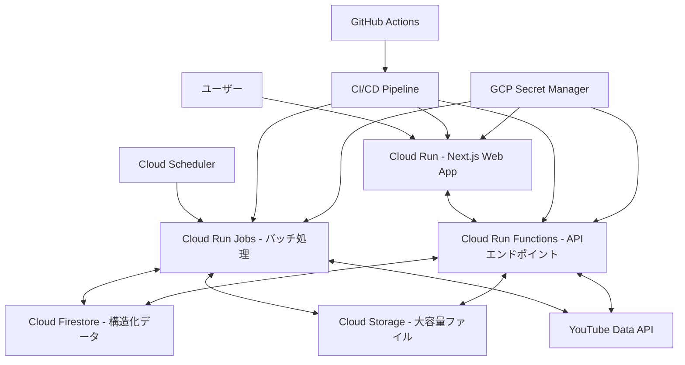

# Google Cloud Platform デプロイ設計書

## 1. 全体アーキテクチャ



## 2. インフラストラクチャの要件

### GCPプロジェクト設定

- プロジェクトID: `suzumina-click-dev`（検証環境用）
- リージョン: `asia-northeast1`（東京リージョン）
- 必要なAPIの有効化:
  - Cloud Run API
  - Cloud Functions API
  - Cloud Build API
  - Container Registry API
  - Secret Manager API
  - Artifact Registry API
  - Cloud Scheduler API
  - Cloud Tasks API
  - Firestore API
  - Cloud Storage API
  - YouTube Data API v3

## 3. Cloud Run (Web App) の設計

### Dockerfile (apps/web)

Next.jsアプリケーション用のDockerfileを作成する必要があります：

```dockerfile
# ビルドステージ
FROM node:22-alpine AS builder
WORKDIR /app

# Bunのインストール
RUN npm install -g bun

# 依存関係のインストールを最適化
COPY package.json bun.lock turbo.json ./
COPY apps/web/package.json ./apps/web/package.json
COPY packages/typescript-config/package.json ./packages/typescript-config/package.json

# 最初にパッケージをインストール
RUN bun install --frozen-lockfile

# ソースコードをコピー
COPY . .

# アプリをビルド
RUN bun run build

# 実行ステージ
FROM node:22-alpine AS runner
WORKDIR /app

ENV NODE_ENV=production
ENV PORT=8080

# 必要なファイルのみをコピー
COPY --from=builder /app/apps/web/.next/standalone ./
COPY --from=builder /app/apps/web/.next/static ./apps/web/.next/static
COPY --from=builder /app/apps/web/public ./apps/web/public

# コンテナ起動時のコマンド
CMD ["node", "apps/web/server.js"]

# Cloud Runのヘルスチェック用に8080ポートを公開
EXPOSE 8080
```

### Next.js設定変更

`next.config.js`に以下の設定を追加：

```javascript
/** @type {import('next').NextConfig} */
const nextConfig = {
  output: 'standalone', // Cloud Run用に最適化された出力
  experimental: {
    // 最新のNext.js機能を有効化
    serverActions: true,
  }
};

export default nextConfig;
```

### Cloud Run 設定

- インスタンス：最小1、最大2（検証環境のため低コスト設定）
- メモリ：1GB
- CPU：1
- リクエストタイムアウト：60秒
- HTTPSのみ許可
- 認証なし（検証環境のため）

## 4. Cloud Run Functions (APIエンドポイント) の設計

Cloud Run Functionsは、Node.js（TypeScript）とPython両方での実装をサポートします。

### TypeScript 実装（Cloud Run Functions）

#### プロジェクト構造 (apps/functions)

```text
apps/functions/
├── package.json
├── tsconfig.json
├── src/
│   ├── index.ts         # エントリーポイント
│   ├── api/             # API関数
│   │   ├── hello.ts     # サンプルAPI
│   │   └── ...
│   ├── lib/             # 共通ライブラリ
│   └── utils/           # ユーティリティ
└── test/                # テスト
```

#### package.json (apps/functions)

```json
{
  "name": "functions",
  "version": "0.1.0",
  "type": "module",
  "private": true,
  "scripts": {
    "dev": "functions-framework --target=app --port=3001",
    "build": "tsc",
    "deploy": "gcloud functions deploy app --gen2 --runtime=nodejs22 --region=asia-northeast1 " +
              "--source=. --entry-point=app --trigger-http --allow-unauthenticated",
    "lint": "biome lint .",
    "format": "biome format .",
    "check-types": "tsc --noEmit"
  },
  "dependencies": {
    "@google-cloud/functions-framework": "^3.3.0"
  },
  "devDependencies": {
    "@repo/typescript-config": "*",
    "@types/node": "^22.13.15",
    "typescript": "5.8.2"
  }
}
```

#### サンプル関数 (hello.ts)

```typescript
import { HttpFunction } from '@google-cloud/functions-framework';

export const hello: HttpFunction = async (req, res) => {
  res.send({ message: 'Hello from Cloud Functions!' });
};
```

#### エントリーポイント (index.ts)

```typescript
import { http } from '@google-cloud/functions-framework';
import { hello } from './api/hello';

// ルートハンドラ
http('app', async (req, res) => {
  // シンプルなルーティング
  const path = req.path.toLowerCase();
  
  if (path === '/api/hello') {
    return hello(req, res);
  }
  
  // 404 Not Found
  res.status(404).send({ error: 'Not Found' });
});
```

### Python 実装（Cloud Run Functions）

#### プロジェクト構造 (apps/functions-python)

```text
apps/functions-python/
├── pyproject.toml
├── requirements.txt
├── .python-version
├── src/
│   ├── main.py          # エントリーポイント
│   ├── api/             # API関数
│   │   ├── hello.py     # サンプルAPI
│   │   └── ...
│   ├── lib/             # 共通ライブラリ
│   └── utils/           # ユーティリティ
└── test/                # テスト
```

#### pyproject.toml (apps/functions-python)

```toml
[build-system]
requires = ["setuptools>=61.0"]
build-backend = "setuptools.build_meta"

[project]
name = "functions-python"
version = "0.1.0"
authors = [
    {name = "Your Name", email = "your.email@example.com"},
]
description = "Python Cloud Functions for suzumina.click"
requires-python = ">=3.12"
dependencies = [
    "functions-framework==3.5.0",
]

[project.optional-dependencies]
dev = [
    "ruff==0.4.3",
    "pytest==8.0.0",
]

[tool.ruff]
line-length = 88
target-version = "py312"
```

#### サンプル関数 (main.py)

```python
import functions_framework

@functions_framework.http
def hello(request):
    return {"message": "Hello from Python Cloud Functions!"}
```

## 5. Cloud Run Jobs (バッチ処理) の設計

Cloud Run Jobsは、HTTPリクエストではなく、スケジュールまたは手動で起動するバッチ処理タスクに最適です。定期的なデータ処理、レポート生成、メンテナンスタスクなどに使用できます。Node.js（TypeScript）とPython両方での実装をサポートします。

### TypeScript 実装（Cloud Run Jobs）

#### プロジェクト構造 (apps/jobs)

```text
apps/jobs/
├── package.json
├── tsconfig.json
├── Dockerfile
├── src/
│   ├── jobs/
│   │   ├── data-sync/
│   │   │   └── index.ts    # データ同期ジョブ
│   │   ├── report/
│   │   │   └── index.ts    # レポート生成ジョブ
│   │   └── maintenance/
│   │       └── index.ts    # メンテナンスジョブ
│   ├── lib/                # 共通ライブラリ
│   └── utils/              # ユーティリティ
└── test/                   # テスト
```

#### package.json (apps/jobs)

```json
{
  "name": "jobs",
  "version": "0.1.0",
  "type": "module",
  "private": true,
  "scripts": {
    "build": "tsc",
    "start:data-sync": "node dist/jobs/data-sync/index.js",
    "start:report": "node dist/jobs/report/index.js",
    "start:maintenance": "node dist/jobs/maintenance/index.js",
    "lint": "biome lint .",
    "format": "biome format .",
    "check-types": "tsc --noEmit"
  },
  "dependencies": {
    "@google-cloud/storage": "^7.0.0"
  },
  "devDependencies": {
    "@repo/typescript-config": "*",
    "@types/node": "^22.13.15",
    "typescript": "5.8.2"
  }
}
```

#### Dockerfile (apps/jobs)

```dockerfile
FROM node:22-alpine

WORKDIR /app

# Bunのインストール
RUN npm install -g bun

# 依存関係のインストールを最適化
COPY package.json bun.lock turbo.json ./
COPY apps/jobs/package.json ./apps/jobs/package.json
COPY packages/typescript-config/package.json ./packages/typescript-config/package.json

# 最初にパッケージをインストール
RUN bun install --frozen-lockfile

# ソースコードをコピー
COPY . .

# アプリをビルド
RUN cd apps/jobs && bun run build

# 環境変数
ENV NODE_ENV=production

# デフォルトのジョブを設定
ENV JOB_TYPE=data-sync

# エントリーポイント - ジョブタイプによって異なるスクリプトを実行
CMD if [ "$JOB_TYPE" = "data-sync" ]; then \
      node /app/apps/jobs/dist/jobs/data-sync/index.js; \
    elif [ "$JOB_TYPE" = "report" ]; then \
      node /app/apps/jobs/dist/jobs/report/index.js; \
    elif [ "$JOB_TYPE" = "maintenance" ]; then \
      node /app/apps/jobs/dist/jobs/maintenance/index.js; \
    else \
      echo "Unknown job type: $JOB_TYPE"; \
      exit 1; \
    fi
```

#### サンプルジョブ実装 (data-sync/index.ts)

```typescript
// データ同期ジョブの実装例
async function main() {
  console.log('Starting data sync job...');
  
  try {
    // ジョブロジックをここに実装
    console.log('Syncing data...');
    
    // 完了
    console.log('Data sync completed successfully');
    process.exit(0);
  } catch (error) {
    console.error('Error in data sync job:', error);
    process.exit(1);
  }
}

// ジョブ実行
main();
```

### Python 実装（Cloud Run Jobs）

#### プロジェクト構造 (apps/jobs-python)

```text
apps/jobs-python/
├── pyproject.toml
├── requirements.txt
├── Dockerfile
├── .python-version
├── src/
│   ├── jobs/
│   │   ├── data_sync/
│   │   │   └── main.py    # データ同期ジョブ
│   │   ├── report/
│   │   │   └── main.py    # レポート生成ジョブ
│   │   └── maintenance/
│   │       └── main.py    # メンテナンスジョブ
│   ├── lib/                # 共通ライブラリ
│   └── utils/              # ユーティリティ
└── test/                   # テスト
```

#### pyproject.toml (apps/jobs-python)

```toml
[build-system]
requires = ["setuptools>=61.0"]
build-backend = "setuptools.build_meta"

[project]
name = "jobs-python"
version = "0.1.0"
authors = [
    {name = "Your Name", email = "your.email@example.com"},
]
description = "Python Cloud Run Jobs for suzumina.click"
requires-python = ">=3.12"
dependencies = [
    "google-cloud-storage==2.15.0",
]

[project.optional-dependencies]
dev = [
    "ruff==0.4.3",
    "pytest==8.0.0",
]

[tool.ruff]
line-length = 88
target-version = "py312"
```

#### Dockerfile (apps/jobs-python)

```dockerfile
FROM python:3.12-slim

WORKDIR /app

# 依存関係のインストール
COPY apps/jobs-python/requirements.txt .
RUN pip install --no-cache-dir -r requirements.txt

# ソースコードをコピー
COPY apps/jobs-python/src/ ./src/

# 環境変数
ENV PYTHONUNBUFFERED=1

# デフォルトのジョブを設定
ENV JOB_TYPE=data_sync

# エントリーポイント - ジョブタイプによって異なるスクリプトを実行
CMD if [ "$JOB_TYPE" = "data_sync" ]; then \
      python -m src.jobs.data_sync.main; \
    elif [ "$JOB_TYPE" = "report" ]; then \
      python -m src.jobs.report.main; \
    elif [ "$JOB_TYPE" = "maintenance" ]; then \
      python -m src.jobs.maintenance.main; \
    else \
      echo "Unknown job type: $JOB_TYPE"; \
      exit 1; \
    fi
```

#### サンプルジョブ実装 (data_sync/main.py)

```python
def main():
    """データ同期ジョブのメインエントリーポイント"""
    print("Starting data sync job...")
    
    try:
        # ジョブロジックをここに実装
        print("Syncing data...")
        
        # 完了
        print("Data sync completed successfully")
        return 0
    except Exception as e:
        print(f"Error in data sync job: {e}")
        return 1

if __name__ == "__main__":
    exit_code = main()
    exit(exit_code)
```

### Cloud Run Jobs 設定

- メモリ：2GB
- CPU：1
- タスクタイムアウト：60分
- 最大再試行回数：3
- 実行パラレル化：10（同時に実行できるインスタンス数）

### Cloud Scheduler設定（ジョブトリガー）

- データ同期ジョブ：毎日午前2時（`0 2 * * *`）
- レポート生成ジョブ：毎週月曜日午前5時（`0 5 * * 1`）
- メンテナンスジョブ：毎月1日午前3時（`0 3 1 * *`）

## 6. CI/CD パイプラインの設計

GitHub Actionsワークフローを拡張して、デプロイステップを追加します。

```yaml
name: CI/CD

on:
  push:
    branches: ["main"]
  pull_request:
    types: [opened, synchronize]

jobs:
  check:
    name: Check
    timeout-minutes: 15
    runs-on: ubuntu-latest

    steps:
      - name: Checkout code
        uses: actions/checkout@v4

      - name: Setup Bun
        uses: oven-sh/setup-bun@v1
        with:
          bun-version: latest

      - name: Install dependencies
        run: bun install --frozen-lockfile

      - name: Run CI Checks
        run: bun run ci:check

      - name: Type Check
        run: bun run check-types

      - name: Spell Check
        run: bun run spell-check

  deploy:
    name: Deploy
    needs: check
    if: github.ref == 'refs/heads/main' && github.event_name == 'push'
    runs-on: ubuntu-latest

    steps:
      - name: Checkout
        uses: actions/checkout@v4

      - name: Set up Google Cloud SDK
        uses: google-github-actions/setup-gcloud@v2
        with:
          project_id: suzumina-click-dev
          service_account_key: ${{ secrets.GCP_SA_KEY }}
          export_default_credentials: true

      - name: Authorize Docker push
        run: gcloud auth configure-docker asia-northeast1-docker.pkg.dev

      - name: Setup Bun
        uses: oven-sh/setup-bun@v1
        with:
          bun-version: latest

      - name: Install dependencies
        run: bun install --frozen-lockfile

      - name: Build
        run: bun run build

      # Web App (Cloud Run)
      - name: Build and Push Web Container
        run: |
          cd apps/web
          docker build -t asia-northeast1-docker.pkg.dev/suzumina-click-dev/suzumina/web:${{ github.sha }} \
            -f ../../Dockerfile ../../
          docker push asia-northeast1-docker.pkg.dev/suzumina-click-dev/suzumina/web:${{ github.sha }}

      - name: Deploy to Cloud Run
        run: |
          gcloud run deploy web \
            --image asia-northeast1-docker.pkg.dev/suzumina-click-dev/suzumina/web:${{ github.sha }} \
            --platform managed \
            --region asia-northeast1 \
            --allow-unauthenticated

      # Functions (TypeScript)
      - name: Deploy TypeScript Functions
        run: |
          cd apps/functions
          gcloud functions deploy app \
           --gen2 \
           --runtime=nodejs22 \
           --region=asia-northeast1 \
           --source=. \
           --entry-point=app \
           --trigger-http \
           --allow-unauthenticated

      # Functions (Python)
      - name: Deploy Python Functions
        run: |
          cd apps/functions-python
          gcloud functions deploy hello-python \
           --gen2 \
           --runtime=python312 \
           --region=asia-northeast1 \
           --source=. \
           --entry-point=hello \
           --trigger-http \
           --allow-unauthenticated

      # Jobs (TypeScript)
      - name: Build and Push TypeScript Jobs Container
        run: |
          cd apps/jobs
          docker build -t asia-northeast1-docker.pkg.dev/suzumina-click-dev/suzumina/jobs:${{ github.sha }} \
            -f Dockerfile .
          docker push asia-northeast1-docker.pkg.dev/suzumina-click-dev/suzumina/jobs:${{ github.sha }}

      # Jobs (Python)
      - name: Build and Push Python Jobs Container
        run: |
          cd apps/jobs-python
          docker build -t asia-northeast1-docker.pkg.dev/suzumina-click-dev/suzumina/jobs-python:${{ github.sha }} \
            -f Dockerfile .
          docker push asia-northeast1-docker.pkg.dev/suzumina-click-dev/suzumina/jobs-python:${{ github.sha }}

      # TypeScript Jobs デプロイ
      - name: Deploy Data Sync Job
        run: |
          gcloud run jobs create data-sync-job \
            --image asia-northeast1-docker.pkg.dev/suzumina-click-dev/suzumina/jobs:${{ github.sha }} \
            --set-env-vars="JOB_TYPE=data-sync" \
            --region=asia-northeast1 \
            --tasks=1 \
            --max-retries=3 \
            --task-timeout=3600s

      - name: Deploy Report Job
        run: |
          gcloud run jobs create report-job \
            --image asia-northeast1-docker.pkg.dev/suzumina-click-dev/suzumina/jobs:${{ github.sha }} \
            --set-env-vars="JOB_TYPE=report" \
            --region=asia-northeast1 \
            --tasks=1 \
            --max-retries=3 \
            --task-timeout=3600s

      - name: Deploy Maintenance Job
        run: |
          gcloud run jobs create maintenance-job \
            --image asia-northeast1-docker.pkg.dev/suzumina-click-dev/suzumina/jobs:${{ github.sha }} \
            --set-env-vars="JOB_TYPE=maintenance" \
            --region=asia-northeast1 \
            --tasks=1 \
            --max-retries=3 \
            --task-timeout=3600s

      # Python Jobs デプロイ
      - name: Deploy Python Data Sync Job
        run: |
          gcloud run jobs create data-sync-job-python \
            --image asia-northeast1-docker.pkg.dev/suzumina-click-dev/suzumina/jobs-python:${{ github.sha }} \
            --set-env-vars="JOB_TYPE=data_sync" \
            --region=asia-northeast1 \
            --tasks=1 \
            --max-retries=3 \
            --task-timeout=3600s

      # ジョブスケジュールの設定
      - name: Set up Job Schedules
        run: |
          # データ同期ジョブ - 毎日午前2時
          gcloud scheduler jobs create http data-sync-scheduler \
            --schedule="0 2 * * *" \
            --uri="https://asia-northeast1-run.googleapis.com/apis/run.googleapis.com/v1/namespaces/\
suzumina-click-dev/jobs/data-sync-job:run" \
            --http-method=POST \
            --oauth-service-account-email=${{ secrets.GCP_SA_EMAIL }}

          # レポートジョブ - 毎週月曜日午前5時
          gcloud scheduler jobs create http report-scheduler \
            --schedule="0 5 * * 1" \
            --uri="https://asia-northeast1-run.googleapis.com/apis/run.googleapis.com/v1/namespaces/\
suzumina-click-dev/jobs/report-job:run" \
            --http-method=POST \
            --oauth-service-account-email=${{ secrets.GCP_SA_EMAIL }}

          # メンテナンスジョブ - 毎月1日午前3時
          gcloud scheduler jobs create http maintenance-scheduler \
            --schedule="0 3 1 * *" \
            --uri="https://asia-northeast1-run.googleapis.com/apis/run.googleapis.com/v1/namespaces/\
suzumina-click-dev/jobs/maintenance-job:run" \
            --http-method=POST \
            --oauth-service-account-email=${{ secrets.GCP_SA_EMAIL }}
```

## 7. 環境変数と機密情報の管理

- **環境変数**:
  - `.env.local`ファイルをアプリケーションの開発環境で使用
  - GCP Secret Managerで本番環境の機密情報を管理
  - CI/CDパイプラインからSecret Managerの値をCloud Run/Cloud Run Jobsの環境変数として設定

- **Secret Manager**:
  - APIキーやデータベース接続情報などの機密データを保存
  - 各サービス（Web、Functions、Jobs）に必要な機密情報を個別に管理

## 8. 監視とロギング

- Cloud Monitoringでパフォーマンス指標を監視
- Cloud Loggingでアプリケーションログを収集・分析
- エラー通知用のアラートポリシーを設定
- Cloud Run Jobsの実行結果を監視するための特別なダッシュボードを設定

## 9. Cloud Run Functions vs Cloud Run Jobs の選択指針

| 用途 | 推奨サービス | 理由 |
|------|------------|------|
| APIエンドポイント | Cloud Run Functions | HTTPリクエストに応答するためのサーバーレスサービスとして最適 |
| ウェブフック処理 | Cloud Run Functions | イベント駆動型の短時間処理に最適 |
| 定期的なデータ処理 | Cloud Run Jobs | スケジュールに基づいて実行され、長時間実行できる |
| リソース集約的な処理 | Cloud Run Jobs | より多くのリソースを割り当て可能で、長時間実行できる |
| レポート生成 | Cloud Run Jobs | 大量のデータ処理や計算を伴うタスクに適している |
| データバックアップ | Cloud Run Jobs | 大規模なデータ操作を行うバッチ処理に最適 |
| 機械学習モデルの実行 | Cloud Run Jobs (Python) | Pythonの豊富な機械学習ライブラリを活用可能 |
| YouTube APIとの連携 | Cloud Run Jobs (Python) | 長時間実行・大量データの処理が可能、Python用ライブラリが充実 |
| システムメンテナンス | Cloud Run Jobs | 定期的なクリーンアップやメンテナンス作業に適している |

## 10. 言語選択のガイドライン

| 用途 | 推奨言語 | 理由 |
|------|---------|------|
| APIエンドポイント (軽量) | TypeScript/Node.js | 軽量で高速な起動時間、非同期処理に強い |
| YouTube APIとの連携 | Python | google-api-python-clientが公式でサポートされ充実している |
| APIエンドポイント (複雑なビジネスロジック) | Python | 豊富なライブラリ、可読性の高いコード |
| データ処理ジョブ | Python | データ科学ライブラリ（pandas, numpy）が充実 |
| 機械学習関連ジョブ | Python | scikit-learn, TensorFlow, Pytorchなどの充実したエコシステム |
| スクレイピング | Python | BeautifulSoupやSeleniumなどのライブラリが充実 |
| クロールバッチ | Python | 非同期処理ライブラリが充実 |
| フロントエンドAPI | TypeScript/Node.js | フロントエンドとの型共有が容易 |

## 11. 外部APIの利用

### YouTube Data API

プロジェクトではYouTube Data APIを利用して、YouTubeチャンネルのデータを取得・管理します。

#### 主な用途

- チャンネル情報の取得（登録者数、総視聴回数など）
- 動画一覧の取得と管理
- 動画のメタデータ（タイトル、説明、サムネイル、再生回数など）の取得
- 新規アップロード動画の検知と通知
- コメントの取得と分析

#### 実装方針

1. **認証とセキュリティ**
   - OAuth 2.0またはAPIキーを使用
   - 認証情報はSecret Managerで安全に管理
   - 必要最小限の権限スコープを使用

2. **クォータ管理**
   - YouTube Data APIのクォータ制限（デフォルトで1日10,000ユニット）を考慮
   - バッチ処理で効率的にAPIコールをまとめる
   - キャッシュ戦略を実装してAPI呼び出しを最小化

3. **実装例（Python）**

```python
from googleapiclient.discovery import build
from google.cloud import secretmanager

def get_youtube_service():
    """YouTube Data API サービスを取得"""
    # Secret Managerから認証情報を取得
    client = secretmanager.SecretManagerServiceClient()
    name = f"projects/suzumina-click-dev/secrets/youtube-api-key/versions/latest"
    response = client.access_secret_version(request={"name": name})
    api_key = response.payload.data.decode("UTF-8")
    
    # YouTube APIサービスを構築
    return build('youtube', 'v3', developerKey=api_key)

def get_channel_info(channel_id):
    """チャンネル情報を取得"""
    youtube = get_youtube_service()
    
    request = youtube.channels().list(
        part="snippet,contentDetails,statistics",
        id=channel_id
    )
    response = request.execute()
    
    return response['items'][0] if response['items'] else None

def get_latest_videos(channel_id, max_results=10):
    """最新の動画を取得"""
    youtube = get_youtube_service()
    
    # まずチャンネルのアップロードプレイリストIDを取得
    channel_response = youtube.channels().list(
        part="contentDetails",
        id=channel_id
    ).execute()
    
    uploads_playlist_id = channel_response['items'][0]['contentDetails']['relatedPlaylists']['uploads']
    
    # プレイリストから動画を取得
    playlist_response = youtube.playlistItems().list(
        part="snippet,contentDetails",
        playlistId=uploads_playlist_id,
        maxResults=max_results
    ).execute()
    
    return playlist_response['items']
```

4. **実装例（TypeScript）**

```typescript
import { google, youtube_v3 } from 'googleapis';
import { SecretManagerServiceClient } from '@google-cloud/secret-manager';

async function getYoutubeService(): Promise<youtube_v3.Youtube> {
  // Secret Managerから認証情報を取得
  const secretClient = new SecretManagerServiceClient();
  const [version] = await secretClient.accessSecretVersion({
    name: 'projects/suzumina-click-dev/secrets/youtube-api-key/versions/latest',
  });
  
  const apiKey = version.payload?.data?.toString() || '';
  
  // YouTube APIサービスを構築
  return google.youtube({
    version: 'v3',
    auth: apiKey,
  });
}

async function getChannelInfo(channelId: string): Promise<any> {
  const youtube = await getYoutubeService();
  
  const response = await youtube.channels.list({
    part: ['snippet', 'contentDetails', 'statistics'],
    id: [channelId],
  });
  
  return response.data.items?.[0] || null;
}

async function getLatestVideos(channelId: string, maxResults = 10): Promise<any[]> {
  const youtube = await getYoutubeService();
  
  // まずチャンネルのアップロードプレイリストIDを取得
  const channelResponse = await youtube.channels.list({
    part: ['contentDetails'],
    id: [channelId],
  });
  
  const uploadsPlaylistId = channelResponse.data.items?.[0]?.contentDetails?.relatedPlaylists?.uploads;
  
  if (!uploadsPlaylistId) {
    return [];
  }
  
  // プレイリストから動画を取得
  const playlistResponse = await youtube.playlistItems.list({
    part: ['snippet', 'contentDetails'],
    playlistId: uploadsPlaylistId,
    maxResults,
  });
  
  return playlistResponse.data.items || [];
}
```

1. **バッチ処理での利用（Cloud Run Jobs）**

```python
# apps/jobs-python/src/jobs/youtube_sync/main.py

from google.cloud import firestore
import datetime

# 上記で定義したYouTube APIヘルパー関数をインポート
from lib.youtube_api import get_channel_info, get_latest_videos

def main():
    """YouTubeデータ同期ジョブ"""
    print("Starting YouTube data sync job...")
    
    try:
        # Firestoreクライアントを初期化
        db = firestore.Client()
        
        # 監視対象チャンネルIDを取得（設定から）
        channel_id = "UCxxxxxxxxxxxxxxxxxxxxxxx"  # 実際のチャンネルID
        
        # チャンネル情報を取得
        channel_info = get_channel_info(channel_id)
        if not channel_info:
            print(f"Channel {channel_id} not found")
            return 1
            
        # チャンネル情報をFirestoreに保存
        channel_ref = db.collection('youtube').document('channel_info')
        channel_ref.set({
            'title': channel_info['snippet']['title'],
            'description': channel_info['snippet']['description'],
            'thumbnail': channel_info['snippet']['thumbnails']['high']['url'],
            'subscriberCount': int(channel_info['statistics']['subscriberCount']),
            'viewCount': int(channel_info['statistics']['viewCount']),
            'videoCount': int(channel_info['statistics']['videoCount']),
            'lastUpdated': datetime.datetime.now()
        })
        
        # 最新の動画を取得（最大50件）
        videos = get_latest_videos(channel_id, 50)
        
        # 動画情報をFirestoreに保存
        for video in videos:
            video_id = video['contentDetails']['videoId']
            video_ref = db.collection('youtube').document('videos').collection('items').document(video_id)
            
            video_ref.set({
                'title': video['snippet']['title'],
                'description': video['snippet']['description'],
                'publishedAt': datetime.datetime.fromisoformat(video['snippet']['publishedAt'].replace('Z', '+00:00')),
                'thumbnail': video['snippet']['thumbnails']['high']['url'],
                'lastUpdated': datetime.datetime.now()
            })
        
        print(f"Successfully synced YouTube data - {len(videos)} videos updated")
        return 0
        
    except Exception as e:
        print(f"Error in YouTube data sync job: {e}")
        return 1

if __name__ == "__main__":
    exit_code = main()
    exit(exit_code)
```

2. **定期実行スケジュール**
   - YouTube APIのクォータを考慮して、1日1回もしくは数時間おきに実行
   - 重要なイベントの前後には頻度を上げるなど、柔軟に調整

## 12. ストレージ方針

プロジェクトでは、原則として以下の2種類のストレージサービスを使用します：

### Cloud Firestore

Cloud Firestoreは構造化データの保存に使用します。

#### Firestoreの使用目的

- ユーザー情報・プロファイル
- アプリケーション設定
- トランザクションデータ
- リアルタイム更新が必要なデータ
- 関係性のある構造化データ

#### Firestoreの設計原則

1. コレクション設計は浅く保つ（ネストは2～3階層まで）
2. インデックスを適切に設定しクエリのパフォーマンスを最適化
3. ドキュメントサイズは1MB以下に制限
4. 頻繁に変更されるカウンターなどには専用のドキュメントを使用
5. トランザクションを活用してデータの整合性を確保

### Cloud Storage

Cloud Storageは大容量ファイルやバイナリデータの保存に使用します。

#### Cloud Storageの使用目的

- ユーザーアップロードファイル（画像、動画、ドキュメント）
- バックアップデータ
- 静的アセット
- ログファイル
- 大量のデータエクスポート/インポートファイル

#### バケット構造

- `suzumina-click-dev-uploads` - ユーザーからのアップロードファイル
- `suzumina-click-dev-static` - 静的アセット
- `suzumina-click-dev-logs` - ログファイル
- `suzumina-click-dev-backups` - バックアップデータ

#### Cloud Storageの設計原則

1. 適切なストレージクラスを選択（Standard, Nearline, Coldline, Archive）
2. 署名付きURLを使用して直接アップロード/ダウンロードを有効化
3. Cloud CDNと組み合わせて静的アセットの配信を最適化
4. ライフサイクル管理を設定して古いファイルを自動的に削除または低コストのストレージクラスに移動
5. セキュリティを確保するため、適切なIAMポリシーを設定

### ストレージ選択の指針

| データの種類 | 推奨ストレージ | 理由 |
|------------|-------------|------|
| 構造化データ（ユーザー情報など） | Cloud Firestore | スキーマレス、リアルタイム更新、クエリ機能 |
| 小〜中規模のJSONデータ | Cloud Firestore | 階層化されたデータ構造のサポート |
| 大容量ファイル（1MB超） | Cloud Storage | 無制限のファイルサイズ、低コスト |
| 頻繁にアクセスされる静的ファイル | Cloud Storage + CDN | 高速配信、グローバルキャッシング |
| ログデータ | Cloud Storage | 低コスト、高耐久性 |
| バックアップ | Cloud Storage | 低コスト、ライフサイクル管理 |

### Firestoreのコレクション設計例

```text
users/                  # ユーザー情報
  {userId}/             # 個別ユーザーのドキュメント
    profiles/           # ユーザープロファイルのサブコレクション
    settings/           # ユーザー設定のサブコレクション

content/                # コンテンツ情報
  {contentId}/          # 個別コンテンツのドキュメント
    revisions/          # コンテンツのリビジョン履歴

logs/                   # システムログ（短期保存用）
  {logId}/              # 個別ログエントリ
```

### Cloud Storageのパス設計例

```text
uploads/{userId}/{contentId}/{filename}  # ユーザーアップロードファイル
static/images/{category}/{filename}      # 静的画像
static/js/{version}/{filename}           # 静的JavaScriptファイル
static/css/{version}/{filename}          # 静的CSSファイル
logs/{date}/{service}/{filename}         # サービスログ
backups/{service}/{date}/{filename}      # バックアップファイル
```

## 13. 実装ロードマップ

### フェーズ1: 基本環境整備

1. GCPプロジェクト作成とAPI有効化
2. サービスアカウント作成とGitHub Secretsの設定
3. Artifact Registryリポジトリの作成

### フェーズ2: Webアプリケーション（Cloud Run）

1. Dockerfile作成
2. next.config.js更新
3. GitHub Actionsワークフロー更新

### フェーズ3: バックエンドAPI（Cloud Run Functions）

1. functionsディレクトリの基本構造作成（TypeScript & Python）
2. サンプルAPI関数実装
3. デプロイスクリプト作成

### フェーズ4: バッチ処理（Cloud Run Jobs）

1. jobsディレクトリの基本構造作成（TypeScript & Python）
2. サンプルジョブ実装
3. 各言語用Dockerfileとデプロイスクリプト作成
4. Cloud Scheduler設定

### フェーズ5: CI/CD整備

1. GitHub Actionsワークフローの完成
2. テスト・デプロイの自動化

### フェーズ6: 動作検証とデバッグ

1. エンドツーエンドテスト
2. パフォーマンス最適化
3. ログ・モニタリング確認
