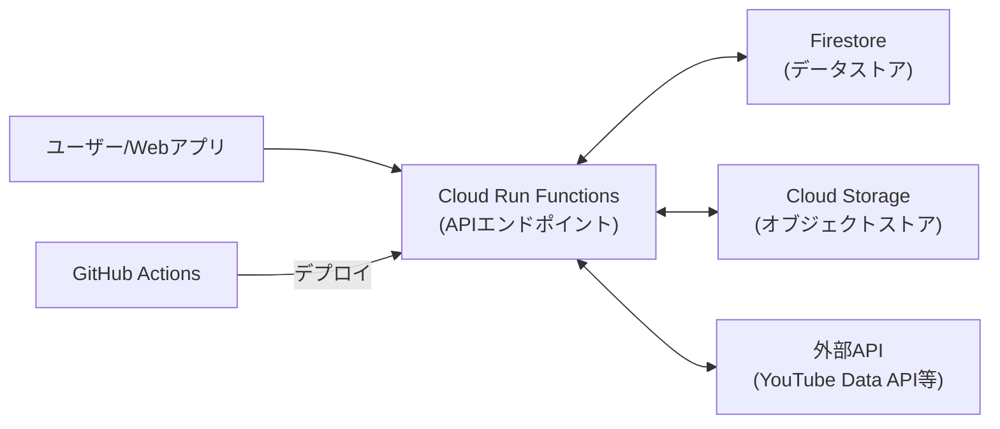

# Google Cloud Platform APIエンドポイント設計

このドキュメントでは、suzumina.clickのAPIエンドポイントをCloud Run Functionsで実装するための設計について説明します。

## 目次

- [アーキテクチャ概要](#アーキテクチャ概要)
- [TypeScript実装](#typescript実装)
- [Python実装](#python実装)
- [デプロイ設定](#デプロイ設定)
- [関連ドキュメント](#関連ドキュメント)

## アーキテクチャ概要

suzumina.clickのバックエンドAPIはCloud Run Functions（第2世代）を使用し、必要に応じてTypeScriptまたはPythonで実装します。このアプローチにより、サーバーレスで拡張性の高いAPIを低コストで運用できます。



## TypeScript実装

### プロジェクト構造

TypeScriptでのCloud Run Functions実装は以下のディレクトリ構造に従います：

```text
apps/functions/
├── package.json
├── tsconfig.json
├── src/
│   ├── index.ts         # エントリーポイント
│   ├── api/             # API関数
│   │   ├── hello.ts     # サンプルAPI
│   │   └── ...
│   ├── lib/             # 共通ライブラリ
│   └── utils/           # ユーティリティ
└── test/                # テスト
```

### package.json

```json
{
  "name": "functions",
  "version": "0.1.0",
  "type": "module",
  "private": true,
  "scripts": {
    "dev": "functions-framework --target=app --port=3001",
    "build": "tsc",
    "deploy": "gcloud functions deploy app --gen2 --runtime=nodejs22 --region=asia-northeast1 --source=. --entry-point=app --trigger-http --allow-unauthenticated",
    "lint": "biome lint .",
    "format": "biome format .",
    "check-types": "tsc --noEmit"
  },
  "dependencies": {
    "@google-cloud/functions-framework": "^3.3.0"
  },
  "devDependencies": {
    "@repo/typescript-config": "*",
    "@types/node": "^22.13.15",
    "typescript": "5.8.2"
  }
}
```

### サンプルAPI実装

#### エントリーポイント (index.ts)

```typescript
import { http } from '@google-cloud/functions-framework';
import { hello } from './api/hello';

// ルートハンドラ
http('app', async (req, res) => {
  // シンプルなルーティング
  const path = req.path.toLowerCase();
  
  if (path === '/api/hello') {
    return hello(req, res);
  }
  
  // 404 Not Found
  res.status(404).send({ error: 'Not Found' });
});
```

#### サンプル関数 (hello.ts)

```typescript
import { HttpFunction } from '@google-cloud/functions-framework';

export const hello: HttpFunction = async (req, res) => {
  res.send({ message: 'Hello from Cloud Functions!' });
};
```

## Python実装

### プロジェクト構造

Pythonの実装では、以下のようなディレクトリ構造を使用します：

```text
apps/functions-python/
├── pyproject.toml
├── requirements.txt
├── .python-version
├── src/
│   ├── main.py          # エントリーポイント
│   ├── api/             # API関数
│   │   ├── hello.py     # サンプルAPI
│   │   └── ...
│   ├── lib/             # 共通ライブラリ
│   └── utils/           # ユーティリティ
└── test/                # テスト
```

### pyproject.toml

```toml
[build-system]
requires = ["setuptools>=61.0"]
build-backend = "setuptools.build_meta"

[project]
name = "functions-python"
version = "0.1.0"
authors = [
    {name = "Your Name", email = "your.email@example.com"},
]
description = "Python Cloud Functions for suzumina.click"
requires-python = ">=3.12"
dependencies = [
    "functions-framework==3.5.0",
]

[project.optional-dependencies]
dev = [
    "ruff==0.4.3",
    "pytest==8.0.0",
]

[tool.ruff]
line-length = 88
target-version = "py312"
```

### サンプルAPI実装 (main.py)

```python
import functions_framework

@functions_framework.http
def hello(request):
    return {"message": "Hello from Python Cloud Functions!"}
```

## デプロイ設定

Cloud Run Functionsのデプロイ設定は以下の通りです：

| 設定項目 | 値 | 説明 |
|---------|-----|------|
| ランタイム | Node.js 22 / Python 3.12 | 最新の安定バージョンを使用 |
| メモリ | 512MB | 標準的なAPIの要件 |
| インスタンス数 | 最小0、最大自動 | コスト最適化のため使用時のみスケール |
| タイムアウト | 60秒 | 標準的なAPI処理時間 |
| 認証 | なし（検証環境） | 本番環境では認証を追加予定 |
| 環境変数 | Secret Managerから取得 | 機密情報はSecret Managerで管理 |

### TypeScript関数のデプロイ

```bash
cd apps/functions
gcloud functions deploy app \
  --gen2 \
  --runtime=nodejs22 \
  --region=asia-northeast1 \
  --source=. \
  --entry-point=app \
  --trigger-http \
  --allow-unauthenticated
```

### Python関数のデプロイ

```bash
cd apps/functions-python
gcloud functions deploy hello-python \
  --gen2 \
  --runtime=python312 \
  --region=asia-northeast1 \
  --source=. \
  --entry-point=hello \
  --trigger-http \
  --allow-unauthenticated
```

## 関連ドキュメント

- [全体概要](GCP_OVERVIEW.md)
- [プロジェクト設定](GCP_PROJECT_SETUP.md)
- [Webアプリケーション設計](GCP_WEB_APP.md)
- [バッチ処理設計](GCP_JOBS.md)
- [外部API連携設計](GCP_EXTERNAL_APIS.md)

## 最終更新日

2025年4月2日
