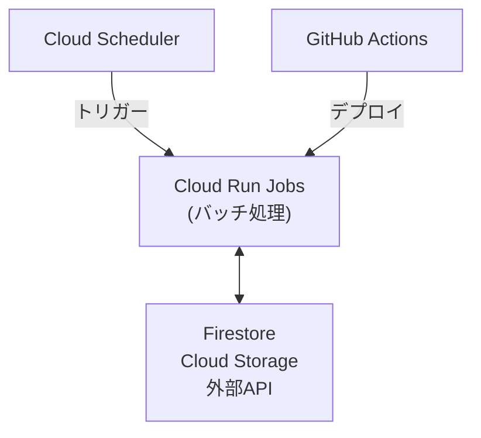

# Google Cloud Platform バッチ処理設計

このドキュメントでは、suzumina.clickのバッチ処理をCloud Run Jobsで実装する概要を説明します。

## アーキテクチャ概要

suzumina.clickのバッチ処理はCloud Run Jobsを使用し、Cloud Schedulerでスケジュール実行します。



## 実装アプローチ

### 言語別プロジェクト構造

#### TypeScript

```
apps/jobs/
├── package.json
├── tsconfig.json
├── Dockerfile
└── src/
    ├── jobs/          # ジョブタイプ別実装
    ├── lib/           # 共通ライブラリ
    └── utils/         # ユーティリティ
```

#### Python

```
apps/jobs-python/
├── pyproject.toml
├── requirements.txt
├── Dockerfile
└── src/
    ├── jobs/          # ジョブタイプ別実装
    ├── lib/           # 共通ライブラリ
    └── utils/         # ユーティリティ
```

### ジョブタイプと環境変数

- データ同期ジョブ、レポート生成ジョブ、メンテナンスジョブ
- `JOB_TYPE`環境変数で実行するジョブを決定

## Cloud Run Jobs設定

| 設定項目 | 値 | 説明 |
|---------|-----|------|
| メモリ | 2GB | バッチ処理用 |
| CPU | 1 | 標準設定 |
| タイムアウト | 60分 | 長時間実行対応 |
| 最大再試行 | 3回 | 一時的障害対応 |

## スケジュール設定

| ジョブ名 | スケジュール | cron式 |
|---------|------------|-------|
| データ同期 | 毎日午前2時 | `0 2 * * *` |
| レポート生成 | 毎週月曜午前5時 | `0 5 * * 1` |
| メンテナンス | 毎月1日午前3時 | `0 3 1 * *` |

## 関連ドキュメント

- [全体概要](GCP_OVERVIEW.md)
- [API設計](GCP_FUNCTIONS.md)
- [外部API連携設計](GCP_EXTERNAL_APIS.md)

最終更新日: 2025年4月3日
