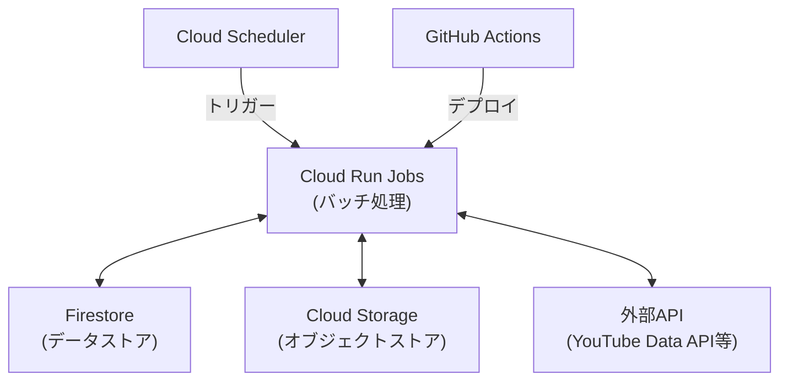

# Google Cloud Platform バッチ処理設計

このドキュメントでは、suzumina.clickのバッチ処理をCloud Run Jobsで実装するための設計について説明します。

## 目次

- [アーキテクチャ概要](#アーキテクチャ概要)
- [TypeScript実装](#typescript実装)
- [Python実装](#python実装)
- [Cloud Run Jobs設定](#cloud-run-jobs設定)
- [Cloud Scheduler設定](#cloud-scheduler設定)
- [関連ドキュメント](#関連ドキュメント)

## アーキテクチャ概要

suzumina.clickのバッチ処理はCloud Run Jobsを使用して実装します。Cloud Run Jobsは、HTTPリクエストではなく、スケジュールまたは手動で起動するバッチ処理タスクに最適です。定期的なデータ処理、レポート生成、メンテナンスタスクなどに使用できます。



## TypeScript実装

### プロジェクト構造

TypeScript実装のディレクトリ構造は以下の通りです：

```text
apps/jobs/
├── package.json
├── tsconfig.json
├── Dockerfile
├── src/
│   ├── jobs/
│   │   ├── data-sync/
│   │   │   └── index.ts    # データ同期ジョブ
│   │   ├── report/
│   │   │   └── index.ts    # レポート生成ジョブ
│   │   └── maintenance/
│   │       └── index.ts    # メンテナンスジョブ
│   ├── lib/                # 共通ライブラリ
│   └── utils/              # ユーティリティ
└── test/                   # テスト
```

### package.json

```json
{
  "name": "jobs",
  "version": "0.1.0",
  "type": "module",
  "private": true,
  "scripts": {
    "build": "tsc",
    "start:data-sync": "node dist/jobs/data-sync/index.js",
    "start:report": "node dist/jobs/report/index.js",
    "start:maintenance": "node dist/jobs/maintenance/index.js",
    "lint": "biome lint .",
    "format": "biome format .",
    "check-types": "tsc --noEmit"
  },
  "dependencies": {
    "@google-cloud/storage": "^7.0.0"
  },
  "devDependencies": {
    "@repo/typescript-config": "*",
    "@types/node": "^22.13.15",
    "typescript": "5.8.2"
  }
}
```

### Dockerfile

```dockerfile
FROM node:22-alpine

WORKDIR /app

# Bunのインストール
RUN npm install -g bun

# 依存関係のインストールを最適化
COPY package.json bun.lock turbo.json ./
COPY apps/jobs/package.json ./apps/jobs/package.json
COPY packages/typescript-config/package.json ./packages/typescript-config/package.json

# 最初にパッケージをインストール
RUN bun install --frozen-lockfile

# ソースコードをコピー
COPY . .

# アプリをビルド
RUN cd apps/jobs && bun run build

# 環境変数
ENV NODE_ENV=production

# デフォルトのジョブを設定
ENV JOB_TYPE=data-sync

# エントリーポイント - ジョブタイプによって異なるスクリプトを実行
CMD if [ "$JOB_TYPE" = "data-sync" ]; then \
      node /app/apps/jobs/dist/jobs/data-sync/index.js; \
    elif [ "$JOB_TYPE" = "report" ]; then \
      node /app/apps/jobs/dist/jobs/report/index.js; \
    elif [ "$JOB_TYPE" = "maintenance" ]; then \
      node /app/apps/jobs/dist/jobs/maintenance/index.js; \
    else \
      echo "Unknown job type: $JOB_TYPE"; \
      exit 1; \
    fi
```

### サンプルジョブ実装 (data-sync/index.ts)

```typescript
// データ同期ジョブの実装例
async function main() {
  console.log('Starting data sync job...');
  
  try {
    // ジョブロジックをここに実装
    console.log('Syncing data...');
    
    // 完了
    console.log('Data sync completed successfully');
    process.exit(0);
  } catch (error) {
    console.error('Error in data sync job:', error);
    process.exit(1);
  }
}

// ジョブ実行
main();
```

## Python実装

### プロジェクト構造

Python実装のディレクトリ構造は以下の通りです：

```text
apps/jobs-python/
├── pyproject.toml
├── requirements.txt
├── Dockerfile
├── .python-version
├── src/
│   ├── jobs/
│   │   ├── data_sync/
│   │   │   └── main.py    # データ同期ジョブ
│   │   ├── report/
│   │   │   └── main.py    # レポート生成ジョブ
│   │   └── maintenance/
│   │       └── main.py    # メンテナンスジョブ
│   ├── lib/                # 共通ライブラリ
│   └── utils/              # ユーティリティ
└── test/                   # テスト
```

### pyproject.toml

```toml
[build-system]
requires = ["setuptools>=61.0"]
build-backend = "setuptools.build_meta"

[project]
name = "jobs-python"
version = "0.1.0"
authors = [
    {name = "Your Name", email = "your.email@example.com"},
]
description = "Python Cloud Run Jobs for suzumina.click"
requires-python = ">=3.12"
dependencies = [
    "google-cloud-storage==2.15.0",
]

[project.optional-dependencies]
dev = [
    "ruff==0.4.3",
    "pytest==8.0.0",
]

[tool.ruff]
line-length = 88
target-version = "py312"
```

### Dockerfile

```dockerfile
FROM python:3.12-slim

WORKDIR /app

# 依存関係のインストール
COPY apps/jobs-python/requirements.txt .
RUN pip install --no-cache-dir -r requirements.txt

# ソースコードをコピー
COPY apps/jobs-python/src/ ./src/

# 環境変数
ENV PYTHONUNBUFFERED=1

# デフォルトのジョブを設定
ENV JOB_TYPE=data_sync

# エントリーポイント - ジョブタイプによって異なるスクリプトを実行
CMD if [ "$JOB_TYPE" = "data_sync" ]; then \
      python -m src.jobs.data_sync.main; \
    elif [ "$JOB_TYPE" = "report" ]; then \
      python -m src.jobs.report.main; \
    elif [ "$JOB_TYPE" = "maintenance" ]; then \
      python -m src.jobs.maintenance.main; \
    else \
      echo "Unknown job type: $JOB_TYPE"; \
      exit 1; \
    fi
```

### サンプルジョブ実装 (data_sync/main.py)

```python
def main():
    """データ同期ジョブのメインエントリーポイント"""
    print("Starting data sync job...")
    
    try:
        # ジョブロジックをここに実装
        print("Syncing data...")
        
        # 完了
        print("Data sync completed successfully")
        return 0
    except Exception as e:
        print(f"Error in data sync job: {e}")
        return 1

if __name__ == "__main__":
    exit_code = main()
    exit(exit_code)
```

## Cloud Run Jobs設定

Cloud Run Jobsの設定は以下の通りです：

| 設定項目 | 値 | 説明 |
|---------|-----|------|
| メモリ | 2GB | バッチ処理のための十分なメモリ |
| CPU | 1 | 標準的なバッチ処理の要件 |
| タイムアウト | 60分 | 長時間実行可能なバッチ処理 |
| 最大再試行回数 | 3 | 一時的な障害に対する耐性 |
| 実行パラレル化 | 10 | 同時に実行できるインスタンス数 |
| 環境変数 | `JOB_TYPE` | 実行するジョブの種類を指定 |

各ジョブタイプのデプロイコマンド例：

```bash
# データ同期ジョブ
gcloud run jobs create data-sync-job \
  --image asia-northeast1-docker.pkg.dev/suzumina-click-dev/suzumina/jobs:latest \
  --set-env-vars="JOB_TYPE=data-sync" \
  --region=asia-northeast1 \
  --tasks=1 \
  --max-retries=3 \
  --task-timeout=3600s
```

## Cloud Scheduler設定

以下のスケジュールでCloud Run Jobsを定期的に実行します：

| ジョブ名 | スケジュール | cron式 | 説明 |
|---------|------------|-------|------|
| データ同期ジョブ | 毎日午前2時 | `0 2 * * *` | 日次データ同期処理 |
| レポート生成ジョブ | 毎週月曜日午前5時 | `0 5 * * 1` | 週次レポート生成 |
| メンテナンスジョブ | 毎月1日午前3時 | `0 3 1 * *` | 月次メンテナンス処理 |

Cloud Schedulerの設定例：

```bash
# データ同期ジョブのスケジューラ設定
gcloud scheduler jobs create http data-sync-scheduler \
  --schedule="0 2 * * *" \
  --uri="https://asia-northeast1-run.googleapis.com/apis/run.googleapis.com/v1/namespaces/suzumina-click-dev/jobs/data-sync-job:run" \
  --http-method=POST \
  --oauth-service-account-email=scheduler-sa@suzumina-click-dev.iam.gserviceaccount.com
```

## 関連ドキュメント

- [全体概要](GCP_OVERVIEW.md)
- [プロジェクト設定](GCP_PROJECT_SETUP.md)
- [API設計](GCP_FUNCTIONS.md)
- [外部API連携設計](GCP_EXTERNAL_APIS.md)
- [ストレージ設計](GCP_STORAGE.md)

## 最終更新日

2025年4月2日
