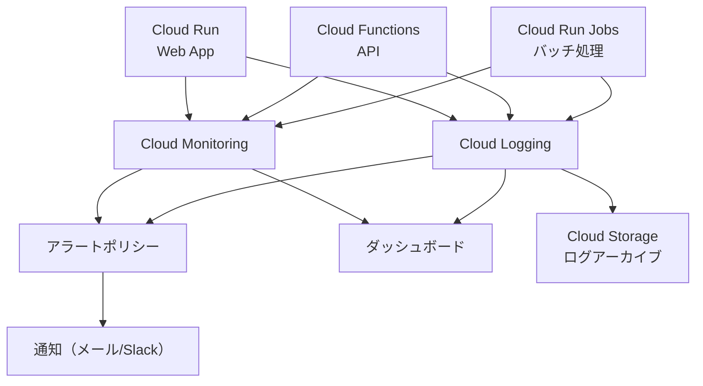

# Google Cloud Platform 監視設計

このドキュメントでは、suzumina.clickの監視とロギングの設計の概要を説明します。

## 監視概要

suzumina.clickの監視システムは、GCPのCloud MonitoringとCloud Loggingを中心に構築し、アプリケーションの健全性、パフォーマンス、エラー状況をリアルタイムで監視します。

## 主要監視指標

### 共通指標

- **可用性**: サービスのアップタイム
- **レイテンシ**: リクエスト応答時間
- **スループット**: リクエスト数/分
- **エラー率**: エラー数とレート
- **リソース使用率**: CPU・メモリ使用率

### サービス固有指標

- **Cloud Run**: インスタンス数、リスタート回数、レスポンスコード分布
- **Functions**: 実行回数、実行時間、コールドスタート時間
- **Jobs**: 成功/失敗回数、実行時間、再試行回数

## ログ管理

### ログカテゴリ

- **アプリケーションログ**: 情報、警告、エラー
- **アクセスログ**: リクエスト情報、ステータスコード
- **バッチジョブログ**: 開始/終了、処理アイテム数、エラー

### ログ保持ポリシー

- **標準ログ**: 30日間 (Cloud Logging)
- **重要ログ**: 1年間 (Cloud Storage)
- **監査ログ**: 5年間 (Cloud Storage)

## アラートポリシー

### 重大度別アラート

- **高（即時対応）**: サービス停止、高エラーレート、メモリ枯渇
- **中（当日対応）**: レイテンシ増加、ジョブ失敗、コールドスタート増加
- **低（定期レビュー）**: リソース使用傾向、ログボリューム増加

## ダッシュボード

- **運用オーバービュー**: 全サービスの健全性、エラー状況
- **Webアプリパフォーマンス**: リクエスト、レイテンシ、エラー率
- **APIパフォーマンス**: エンドポイント別指標、関数実行時間
- **バッチジョブ**: 実行結果、時間推移、エラーパターン
- **ログ分析**: エラー頻度、ユーザーアクティビティ

## ベストプラクティス

- **プロアクティブ監視**: 早期の問題検知と傾向分析
- **構造化インシデント対応**: 明確な対応手順と文書化
- **継続的改善**: アラートポリシーの定期的見直しとノイズ排除
- **コスト最適化**: 必要な指標のみ収集、優先度に応じたリソース配分

## 関連ドキュメント

- [全体概要](GCP_OVERVIEW.md)
- [セキュリティ設計](GCP_SECURITY.md)
- [ストレージ設計](GCP_STORAGE.md)

## 最終更新日

2025年4月3日
