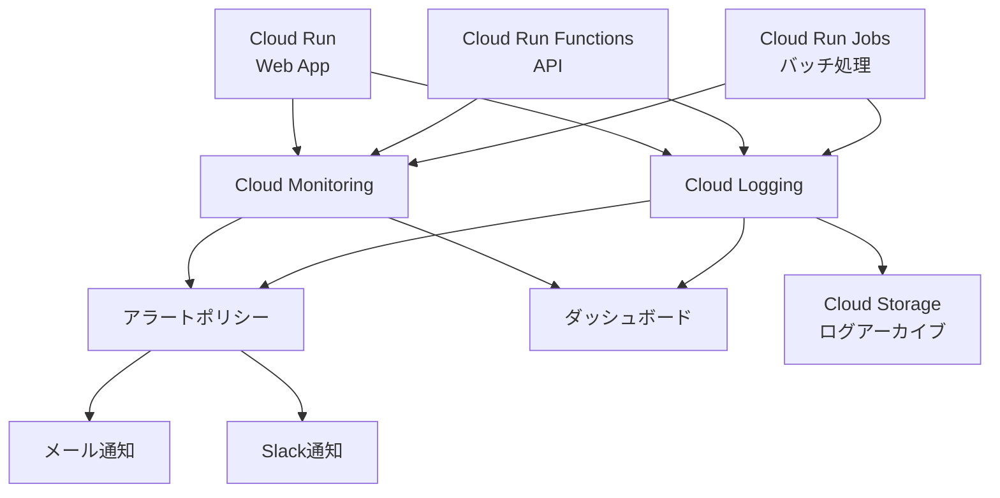

# Google Cloud Platform 監視設計

このドキュメントでは、suzumina.clickの監視とロギングの設計について説明します。

## 目次

- [監視概要](#監視概要)
- [Cloud Monitoring設定](#cloud-monitoring設定)
- [Cloud Logging設定](#cloud-logging設定)
- [アラートポリシー](#アラートポリシー)
- [ダッシュボード設定](#ダッシュボード設定)
- [運用監視のベストプラクティス](#運用監視のベストプラクティス)
- [関連ドキュメント](#関連ドキュメント)

## 監視概要

suzumina.clickの監視システムは、GCPのCloud MonitoringとCloud Loggingを中心に構築されています。これにより、アプリケーションの健全性、パフォーマンス、エラー状況をリアルタイムで監視し、問題の早期発見と解決が可能になります。



## Cloud Monitoring設定

Cloud Monitoringでは以下の指標を監視します：

### サービス共通の監視指標

| 指標カテゴリ | 指標名 | 説明 |
|------------|------|------|
| 可用性 | uptime_check | 各サービスのアップタイム |
| レイテンシ | request_latencies | リクエスト応答時間分布 |
| スループット | request_count | 1分あたりのリクエスト数 |
| エラー | error_count | エラー数とエラーレート |
| リソース使用率 | cpu_utilization | CPU使用率 |
| リソース使用率 | memory_utilization | メモリ使用率 |

### サービス固有の監視指標

#### Cloud Run（Webアプリ）

- インスタンス数
- コンテナリスタート回数
- リクエストレスポンスコード分布（200/300/400/500）

#### Cloud Run Functions（API）

- 関数の実行回数
- 関数の実行時間
- コールドスタート時間
- メモリ使用量

#### Cloud Run Jobs（バッチ処理）

- ジョブ実行成功/失敗回数
- ジョブ実行時間
- ジョブのメモリ使用量
- 再試行回数

## Cloud Logging設定

アプリケーションログは構造化ログ形式で出力し、効率的な分析と検索を可能にします：

### ログカテゴリ

1. **アプリケーションログ**
   - 情報ログ：アプリケーションの通常の動作情報
   - 警告ログ：潜在的な問題や注意が必要な事項
   - エラーログ：アプリケーションエラーや例外

2. **アクセスログ**
   - リクエスト元IPアドレス
   - リクエストパス
   - ステータスコード
   - レスポンス時間
   - ユーザーエージェント

3. **バッチジョブログ**
   - ジョブの開始/終了
   - 処理されたアイテム数
   - エラーおよび例外

### ログの構造化形式

```json
{
  "timestamp": "2025-04-02T00:00:00.000Z",
  "severity": "INFO|WARNING|ERROR",
  "service": "web|api|job-name",
  "message": "ログメッセージ",
  "context": {
    "requestId": "uuid",
    "userId": "user-id",
    "path": "/api/endpoint",
    "additionalData": {}
  }
}
```

### ログ保持ポリシー

- **標準ログ**: 30日間Cloud Loggingに保持
- **重要ログ**: 1年間Cloud Storageにエクスポート
- **監査ログ**: 5年間Cloud Storageにエクスポート

## アラートポリシー

以下のアラートポリシーを設定して、問題が発生した際に迅速に対応できるようにします：

### 重大度：高（即時対応必要）

1. **サービス停止アラート**
   - 条件: サービス可用性が95%以下
   - 通知: Slack + メール
   - 評価期間: 5分

2. **高エラーレートアラート**
   - 条件: エラー率が5%以上
   - 通知: Slack + メール
   - 評価期間: 10分

3. **メモリ枯渇アラート**
   - 条件: メモリ使用率が90%以上
   - 通知: Slack + メール
   - 評価期間: 5分

### 重大度：中（当日対応必要）

1. **レイテンシ増加アラート**
   - 条件: レイテンシが平均の50%増
   - 通知: Slack
   - 評価期間: 15分

2. **バッチジョブ失敗アラート**
   - 条件: ジョブの失敗またはタイムアウト
   - 通知: Slack
   - 評価期間: ジョブ完了時

3. **コールドスタート増加アラート**
   - 条件: コールドスタート率が30%以上
   - 通知: Slack
   - 評価期間: 30分

### 重大度：低（定期レビュー）

1. **リソース使用量傾向アラート**
   - 条件: 週間平均が前週比20%増
   - 通知: メール（週次レポート）
   - 評価期間: 1週間

2. **ログボリューム増加アラート**
   - 条件: ログ生成量が平均の100%増
   - 通知: メール
   - 評価期間: 1日

## ダッシュボード設定

効果的な監視のために、以下のダッシュボードを設定します：

### 1. 運用オーバービューダッシュボード

- すべてのサービスの可用性と健全性
- エラー発生状況
- リソース使用状況

### 2. Webアプリパフォーマンスダッシュボード

- リクエスト数とレイテンシ
- エラーレート
- インスタンス数の推移
- リソース使用率

### 3. APIパフォーマンスダッシュボード

- エンドポイント別のリクエスト数
- 関数実行時間分布
- エラーレート
- コールドスタート頻度

### 4. バッチジョブダッシュボード

- ジョブ別の実行結果
- 実行時間の推移
- エラー発生パターン
- スケジュール遵守率

### 5. ログ分析ダッシュボード

- エラー頻度とパターン
- ユーザーアクティビティ
- リソース使用量との相関

## 運用監視のベストプラクティス

1. **プロアクティブな監視**
   - 問題が大きくなる前に兆候を検知
   - 傾向分析で将来の問題を予測

2. **構造化されたインシデント対応**
   - アラート受信後の明確な対応手順
   - インシデントの文書化と振り返り

3. **継続的な改善**
   - 定期的なアラートポリシーの見直し
   - 不要なアラート（ノイズ）の排除
   - 監視対象の見直しと追加

4. **コスト最適化**
   - 必要なログと指標のみを収集
   - 高コストな監視は重要なサービスに集中

## 関連ドキュメント

- [全体概要](GCP_OVERVIEW.md)
- [プロジェクト設定](GCP_PROJECT_SETUP.md)
- [セキュリティ設計](GCP_SECURITY.md)
- [ストレージ設計](GCP_STORAGE.md)

## 最終更新日

2025年4月2日
