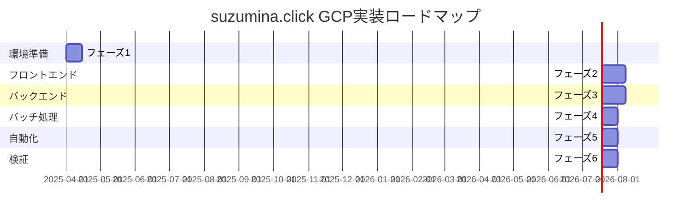

# Google Cloud Platform 実装ロードマップ

このドキュメントでは、suzumina.clickのGCP環境の実装計画を段階的に説明します。各フェーズの目標、タスク、優先順位を明確にし、プロジェクトのロードマップを示します。

## 目次

- [全体実装スケジュール](#全体実装スケジュール)
- [フェーズ1: 基本環境整備](#フェーズ1-基本環境整備)
- [フェーズ2: Webアプリケーション](#フェーズ2-webアプリケーション)
- [フェーズ3: バックエンドAPI](#フェーズ3-バックエンドapi)
- [フェーズ4: バッチ処理](#フェーズ4-バッチ処理)
- [フェーズ5: CI/CD整備](#フェーズ5-cicd整備)
- [フェーズ6: 最適化とテスト](#フェーズ6-最適化とテスト)
- [リスクと対策](#リスクと対策)
- [関連ドキュメント](#関連ドキュメント)

## 全体実装スケジュール

以下の図は、各フェーズの実装スケジュールと相互依存関係を示しています：

## フェーズ1: 基本環境整備

**期間**: 2週間（2025-04-01 〜 2025-04-14）

### 目標

- GCPプロジェクトの作成と基本設定
- 必要なリソースとAPIの有効化
- 認証と権限の設定
- 開発環境の準備

### タスク

| # | タスク | 優先度 | 担当 | 所要時間 |
|---|-------|-------|-----|---------|
| 1.1 | GCPプロジェクト作成 | 高 | インフラチーム | 1日 |
| 1.2 | 必要なAPIの有効化 | 高 | インフラチーム | 1日 |
| 1.3 | サービスアカウント作成 | 高 | インフラチーム | 2日 |
| 1.4 | IAMロールと権限設定 | 高 | インフラチーム | 2日 |
| 1.5 | Artifact Registryリポジトリ作成 | 中 | インフラチーム | 1日 |
| 1.6 | ストレージバケット作成 | 中 | インフラチーム | 1日 |
| 1.7 | Firestore初期設定 | 中 | バックエンドチーム | 2日 |
| 1.8 | Secret Manager設定と初期シークレット作成 | 高 | インフラチーム | 1日 |
| 1.9 | YouTubeデータAPIのプロジェクト連携設定 | 中 | バックエンドチーム | 1日 |
| 1.10 | 開発環境のローカル設定ドキュメント作成 | 低 | インフラチーム | 2日 |

### マイルストーン

- ✅ GCPプロジェクトが作成され、必要なAPIが有効化されている
- ✅ サービスアカウントが作成され、適切な権限が設定されている
- ✅ ストレージサービス（Firestore、Cloud Storage）が設定されている
- ✅ 開発環境の準備が完了している

## フェーズ2: Webアプリケーション

**期間**: 3週間（2025-04-15 〜 2025-05-05）

### 目標

- Next.jsアプリケーションのCloud Run対応
- Dockerfileの作成と最適化
- Webアプリケーションのデプロイと動作確認

### タスク

| # | タスク | 優先度 | 担当 | 所要時間 |
|---|-------|-------|-----|---------|
| 2.1 | Dockerfileの作成 | 高 | フロントエンドチーム | 2日 |
| 2.2 | Cloud Run用のNext.js設定の最適化 | 高 | フロントエンドチーム | 3日 |
| 2.3 | 環境変数の設定 | 中 | フロントエンドチーム | 1日 |
| 2.4 | コンテナビルドとプッシュの自動化スクリプト作成 | 中 | インフラチーム | 2日 |
| 2.5 | Cloud Runへの手動デプロイと検証 | 高 | フロントエンドチーム | 2日 |
| 2.6 | エラーハンドリングとロギングの実装 | 中 | フロントエンドチーム | 3日 |
| 2.7 | パフォーマンス最適化 | 低 | フロントエンドチーム | 4日 |
| 2.8 | CDN連携の設定 | 低 | インフラチーム | 2日 |
| 2.9 | カスタムドメイン設定 | 中 | インフラチーム | 1日 |

### マイルストーン

- ✅ Next.jsアプリケーションがDockerコンテナ化されている
- ✅ アプリケーションがCloud Runにデプロイされ、正常に動作している
- ✅ 環境変数とシークレットが適切に管理されている
- ✅ カスタムドメインでアクセス可能になっている

## フェーズ3: バックエンドAPI

**期間**: 3週間（2025-04-15 〜 2025-05-05）※Webアプリケーションと並行

### 目標

- Cloud Run FunctionsによるAPIエンドポイントの実装
- Firestoreとの連携
- YouTube Data APIとの連携

### タスク

| # | タスク | 優先度 | 担当 | 所要時間 |
|---|-------|-------|-----|---------|
| 3.1 | TypeScript FunctionsのベースプロジェクトセットアップDev環境 | 高 | バックエンドチーム | 2日 |
| 3.2 | Python FunctionsのベースプロジェクトセットアップDev環境 | 高 | バックエンドチーム | 2日 |
| 3.3 | 基本的なAPIエンドポイント実装（TypeScript） | 高 | バックエンドチーム | 4日 |
| 3.4 | YouTubeデータAPI連携実装（Python） | 高 | バックエンドチーム | 5日 |
| 3.5 | Firestoreとの連携実装 | 高 | バックエンドチーム | 3日 |
| 3.6 | APIテスト自動化 | 中 | QAチーム | 3日 |
| 3.7 | エラーハンドリングと例外処理の実装 | 中 | バックエンドチーム | 2日 |
| 3.8 | レート制限と使用量監視の実装 | 低 | バックエンドチーム | 2日 |
| 3.9 | APIドキュメントの作成 | 低 | バックエンドチーム | 2日 |

### マイルストーン

- ✅ TypeScriptとPythonのCloud Functionsが実装されている
- ✅ APIエンドポイントがCloud Functionsにデプロイされている
- ✅ YouTube Data APIと連携が正常に動作している
- ✅ Firestoreへのデータ保存と取得が正常に動作している

## フェーズ4: バッチ処理

**期間**: 2週間（2025-05-06 〜 2025-05-19）

### 目標

- Cloud Run Jobsの実装
- YouTubeデータの定期的な同期処理
- レポート生成ジョブの実装
- Cloud Schedulerによるジョブのスケジューリング

### タスク

| # | タスク | 優先度 | 担当 | 所要時間 |
|---|-------|-------|-----|---------|
| 4.1 | TypeScript Jobsのベースプロジェクトセットアップ | 高 | バックエンドチーム | 2日 |
| 4.2 | Python Jobsのベースプロジェクトセットアップ | 高 | バックエンドチーム | 2日 |
| 4.3 | YouTubeデータ同期ジョブの実装 | 高 | バックエンドチーム | 3日 |
| 4.4 | レポート生成ジョブの実装 | 中 | バックエンドチーム | 3日 |
| 4.5 | メンテナンスジョブの実装 | 低 | バックエンドチーム | 2日 |
| 4.6 | ジョブのDockerfile作成とテスト | 高 | インフラチーム | 2日 |
| 4.7 | Cloud Schedulerの設定 | 高 | インフラチーム | 1日 |
| 4.8 | ジョブの監視とアラート設定 | 中 | インフラチーム | 2日 |
| 4.9 | エラーリカバリーとリトライメカニズムの実装 | 中 | バックエンドチーム | 2日 |

### マイルストーン

- ✅ Cloud Run Jobsがコンテナ化され、デプロイされている
- ✅ YouTubeデータ同期ジョブが正常に動作している
- ✅ Cloud Schedulerによるジョブ実行スケジュールが設定されている
- ✅ ジョブの実行結果が監視され、エラー通知が設定されている

## フェーズ5: CI/CD整備

**期間**: 2週間（2025-05-06 〜 2025-05-19）※バッチ処理と並行

### 目標

- GitHub Actionsによる継続的インテグレーション/デリバリーパイプラインの構築
- 自動テスト、ビルド、デプロイの実装
- デプロイプロセスの標準化

### タスク

| # | タスク | 優先度 | 担当 | 所要時間 |
|---|-------|-------|-----|---------|
| 5.1 | GitHub Secretsの設定 | 高 | インフラチーム | 1日 |
| 5.2 | CIワークフローの実装（リント、テスト、ビルド） | 高 | インフラチーム | 3日 |
| 5.3 | Webアプリケーションデプロイワークフローの実装 | 高 | インフラチーム | 2日 |
| 5.4 | Cloud Functionsデプロイワークフローの実装 | 高 | インフラチーム | 2日 |
| 5.5 | Cloud Run Jobsデプロイワークフローの実装 | 高 | インフラチーム | 2日 |
| 5.6 | Cloud Schedulerの設定自動化 | 中 | インフラチーム | 2日 |
| 5.7 | デプロイ後の自動テストの実装 | 中 | QAチーム | 3日 |
| 5.8 | ロールバックメカニズムの実装 | 中 | インフラチーム | 2日 |

### マイルストーン

- ✅ GitHub ActionsのCI/CDパイプラインが実装されている
- ✅ コードのプッシュでテスト、ビルド、デプロイが自動実行される
- ✅ デプロイプロセスが標準化され、ドキュメント化されている
- ✅ デプロイ後の検証が自動化されている

## フェーズ6: 最適化とテスト

**期間**: 2週間（2025-05-20 〜 2025-06-02）

### 目標

- パフォーマンスの最適化
- セキュリティの強化
- 総合テストとバグ修正
- 監視とアラートの設定
- ドキュメントの完成

### タスク

| # | タスク | 優先度 | 担当 | 所要時間 |
|---|-------|-------|-----|---------|
| 6.1 | Webアプリケーションのパフォーマンス最適化 | 中 | フロントエンドチーム | 3日 |
| 6.2 | APIエンドポイントのパフォーマンス最適化 | 中 | バックエンドチーム | 3日 |
| 6.3 | セキュリティスキャンと脆弱性対応 | 高 | セキュリティチーム | 3日 |
| 6.4 | 負荷テストと容量計画 | 中 | QAチーム | 3日 |
| 6.5 | 監視ダッシュボードの作成 | 中 | インフラチーム | 2日 |
| 6.6 | アラートポリシーの設定 | 高 | インフラチーム | 1日 |
| 6.7 | 総合テストとバグ修正 | 高 | 全チーム | 5日 |
| 6.8 | 運用ドキュメントの作成と完成 | 中 | ドキュメントチーム | 3日 |
| 6.9 | 最終レビューと本番環境準備 | 高 | プロジェクトマネージャー | 2日 |

### マイルストーン

- ✅ パフォーマンスが最適化され、テスト済みである
- ✅ セキュリティが強化され、脆弱性が対応されている
- ✅ 監視とアラートが設定され、動作確認済みである
- ✅ 運用ドキュメントが完成している
- ✅ 本番環境への移行準備が完了している

## リスクと対策

以下は、実装中に発生する可能性のある主なリスクと、その対策です：

| リスク | 影響度 | 発生確率 | 対策 |
|-------|--------|---------|------|
| APIクォータ制限 | 高 | 中 | 早期のクォータ管理実装、段階的な利用拡大、バックアッププラン |
| コスト超過 | 中 | 低 | 予算アラート設定、定期的なコストレビュー、リソース使用量の最適化 |
| セキュリティ脆弱性 | 高 | 低 | 定期的なセキュリティスキャン、最小権限の原則遵守、自動アップデート |
| パフォーマンス問題 | 中 | 中 | 早期からのパフォーマンステスト、段階的なスケーリング計画、最適化の優先度付け |
| 依存サービス停止 | 高 | 低 | 冗長性の確保、グレースフルデグラデーション設計、障害時の対応計画 |
| スキル不足 | 中 | 中 | 早期のトレーニング、外部リソースの確保、ナレッジシェアリング |

## 関連ドキュメント

- [全体概要](GCP_OVERVIEW.md)
- [プロジェクト設定](GCP_PROJECT_SETUP.md)
- [Webアプリケーション設計](GCP_WEB_APP.md)
- [API設計](GCP_FUNCTIONS.md)
- [バッチ処理設計](GCP_JOBS.md)
- [CI/CD設計](GCP_CICD.md)

## 最終更新日

2025年4月2日
