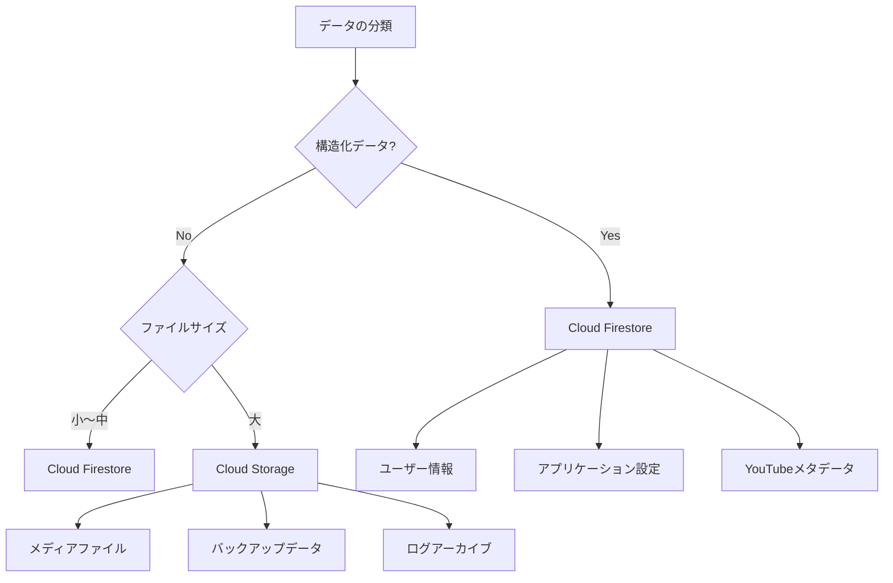

# Google Cloud Platform ストレージ設計

このドキュメントでは、suzumina.clickのデータストレージ設計について説明します。構造化データの保存にはCloud Firestoreを、大容量ファイルやバイナリデータの保存にはCloud Storageを使用します。

## 目次

- [ストレージ戦略概要](#ストレージ戦略概要)
- [Cloud Firestore設計](#cloud-firestore設計)
- [Cloud Storage設計](#cloud-storage設計)
- [ストレージ選択の指針](#ストレージ選択の指針)
- [データバックアップ戦略](#データバックアップ戦略)
- [関連ドキュメント](#関連ドキュメント)

## ストレージ戦略概要

suzumina.clickでは、データの性質に応じて最適なストレージサービスを選択します。



## Cloud Firestore設計

Cloud Firestoreは構造化データの保存に使用します。スキーマレスで柔軟なNoSQLデータベースであり、リアルタイム更新をサポートしています。

### 使用目的

- ユーザー情報・プロファイル
- アプリケーション設定
- YouTubeチャンネルと動画のメタデータ
- トランザクションデータ
- リアルタイム更新が必要なデータ
- 関係性のある構造化データ

### コレクション設計

```text
users/                  # ユーザー情報
  {userId}/             # 個別ユーザーのドキュメント
    profiles/           # ユーザープロファイルのサブコレクション
    settings/           # ユーザー設定のサブコレクション

youtube/                # YouTubeデータ
  channel_info/         # チャンネル情報
  videos/               # 動画コレクション
    items/              # 個別動画のサブコレクション
      {videoId}/        # 動画メタデータ
        comments/       # コメントのサブコレクション
        statistics/     # 統計データのサブコレクション

content/                # コンテンツ情報
  {contentId}/          # 個別コンテンツのドキュメント
    revisions/          # コンテンツのリビジョン履歴

app_settings/           # アプリケーション設定
  {settingId}/          # 個別設定値

logs/                   # システムログ（短期保存用）
  {logId}/              # 個別ログエントリ
```

### データモデル例

#### ユーザードキュメント

```json
{
  "id": "user123",
  "email": "user@example.com",
  "displayName": "ユーザー名",
  "createdAt": "2025-04-01T00:00:00Z",
  "lastLogin": "2025-04-02T00:00:00Z",
  "role": "viewer"
}
```

#### YouTubeチャンネル情報

```json
{
  "id": "UCxxxxxxxxxxxxxxxxxxxxxxx",
  "title": "チャンネル名",
  "description": "チャンネル説明",
  "thumbnail": "https://example.com/thumbnail.jpg",
  "subscriberCount": 10000,
  "viewCount": 1000000,
  "videoCount": 100,
  "lastUpdated": "2025-04-02T00:00:00Z"
}
```

#### 動画メタデータ

```json
{
  "id": "video123",
  "title": "動画タイトル",
  "description": "動画説明",
  "publishedAt": "2025-04-01T00:00:00Z",
  "thumbnail": "https://example.com/video-thumbnail.jpg",
  "duration": "PT10M30S",
  "viewCount": 5000,
  "likeCount": 500,
  "commentCount": 50,
  "tags": ["tag1", "tag2", "tag3"],
  "lastUpdated": "2025-04-02T00:00:00Z"
}
```

### Firestore設計原則

1. **コレクション設計は浅く保つ**
   - ネストは2〜3階層までに制限
   - 深すぎる階層構造は検索とメンテナンスが困難になる

2. **インデックスの最適化**
   - 頻繁に使用されるクエリにはカスタムインデックスを作成
   - 複合インデックスを適切に設定してクエリのパフォーマンスを最適化

3. **ドキュメントサイズの制限**
   - 1MBの上限を考慮してドキュメント設計
   - 大きなデータは複数のドキュメントに分割

4. **参照整合性の管理**
   - トランザクションを活用してデータの整合性を確保
   - バッチ処理による一括更新の実装

5. **効率的なデータアクセス**
   - 読み取りパターンに合わせたデータ構造の設計
   - 頻繁にアクセスされるデータは非正規化して複製

## Cloud Storage設計

Cloud Storageは大容量ファイルやバイナリデータの保存に使用します。高可用性、耐久性、セキュアなオブジェクトストレージサービスです。

### 使用目的

- ユーザーアップロードファイル（画像、動画、ドキュメント）
- バックアップデータ
- 静的アセット
- ログファイル
- 大量のデータエクスポート/インポートファイル

### バケット構造

| バケット名 | 用途 | ストレージクラス | ライフサイクルポリシー |
|----------|------|--------------|------------------|
| `suzumina-click-dev-uploads` | ユーザーアップロードファイル | Standard | 30日後にNearlineに移動 |
| `suzumina-click-dev-static` | 静的アセット | Standard | なし（長期保存） |
| `suzumina-click-dev-logs` | ログファイル | Standard | 7日後にNearline、30日後にColdline、90日後にArchive |
| `suzumina-click-dev-backups` | バックアップデータ | Nearline | 30日後にColdline、90日後にArchive |

### パス設計

```text
uploads/{userId}/{contentId}/{filename}  # ユーザーアップロードファイル
static/images/{category}/{filename}      # 静的画像
static/js/{version}/{filename}           # 静的JavaScriptファイル
static/css/{version}/{filename}          # 静的CSSファイル
logs/{date}/{service}/{filename}         # サービスログ
backups/{service}/{date}/{filename}      # バックアップファイル
```

### Cloud Storage設計原則

1. **適切なストレージクラスの選択**
   - Standard: 頻繁にアクセスされるデータ
   - Nearline: 月に数回程度アクセスされるデータ
   - Coldline: 四半期に数回程度アクセスされるデータ
   - Archive: めったにアクセスされないバックアップデータ

2. **ライフサイクル管理の活用**
   - データのアクセス頻度に基づいて自動的にストレージクラスを変更
   - 古いデータを自動的に低コストのストレージクラスに移動
   - 不要になったデータの自動削除ポリシーを設定

3. **効率的なアクセス制御**
   - IAMポリシーとバケットACLの適切な設定
   - 署名付きURLを使用して直接アップロード/ダウンロードを有効化
   - サービスアカウントを使用した最小権限アクセス

4. **コンテンツ配信の最適化**
   - Cloud CDNと組み合わせて静的アセットの配信を最適化
   - キャッシュ制御ヘッダーの設定
   - 地理的に分散したアクセスの高速化

5. **セキュリティとコンプライアンス**
   - デフォルトの暗号化を有効化
   - VPCサービスコントロールでのアクセス制限
   - データの監査ログ記録と保持

## ストレージ選択の指針

データの種類に応じて最適なストレージサービスを選択するための指針：

| データの種類 | 推奨ストレージ | 理由 |
|------------|-------------|------|
| 構造化データ（ユーザー情報など） | Cloud Firestore | スキーマレス、リアルタイム更新、クエリ機能 |
| 小〜中規模のJSONデータ | Cloud Firestore | 階層化されたデータ構造のサポート |
| 大容量ファイル（1MB超） | Cloud Storage | 無制限のファイルサイズ、低コスト |
| 頻繁にアクセスされる静的ファイル | Cloud Storage + CDN | 高速配信、グローバルキャッシング |
| ログデータ | Cloud Storage | 低コスト、高耐久性 |
| バックアップ | Cloud Storage | 低コスト、ライフサイクル管理 |

## データバックアップ戦略

データの重要性に応じて、以下のバックアップ戦略を実装します：

### Firestore データバックアップ

1. **定期的なエクスポート**
   - スケジュールされたCloud Run Jobsを使用
   - 毎日の増分バックアップと週次の完全バックアップ
   - バックアップはCloud Storageに保存

2. **バックアップジョブの実装例**

```python
from google.cloud import firestore
from google.cloud import storage
import datetime
import json

def backup_firestore_collection(collection_name):
    """Firestoreコレクションをバックアップ"""
    today = datetime.datetime.now().strftime('%Y-%m-%d')
    
    # Firestoreクライアントを初期化
    db = firestore.Client()
    
    # コレクションの全ドキュメントを取得
    docs = db.collection(collection_name).stream()
    
    # バックアップデータを構築
    backup_data = {}
    for doc in docs:
        backup_data[doc.id] = doc.to_dict()
    
    # Cloud Storageにバックアップを保存
    storage_client = storage.Client()
    bucket = storage_client.bucket('suzumina-click-dev-backups')
    blob = bucket.blob(f'backups/firestore/{collection_name}/{today}.json')
    blob.upload_from_string(json.dumps(backup_data))
    
    return f'Backed up {len(backup_data)} documents from {collection_name}'
```

### Cloud Storage データバックアップ

1. **重要データの地域間コピー**
   - 複数リージョンストレージの使用または別リージョンへの定期的なコピー
   - 災害復旧とデータ冗長性の確保

2. **オブジェクトのバージョニング**
   - 重要なバケットでオブジェクトのバージョニングを有効化
   - 誤削除や上書きからの復旧を可能に

3. **ロック設定とリテンションポリシー**
   - 法的要件のあるデータに対してリテンションポリシーを設定
   - 指定期間内のデータ削除や変更を防止

## 関連ドキュメント

- [全体概要](GCP_OVERVIEW.md)
- [バッチ処理設計](GCP_JOBS.md)
- [外部API連携設計](GCP_EXTERNAL_APIS.md)
- [セキュリティ設計](GCP_SECURITY.md)

## 最終更新日

2025年4月2日
