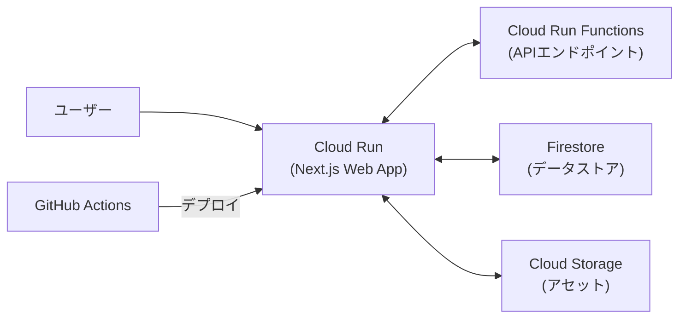

# Google Cloud Platform Webアプリケーション設計

このドキュメントでは、suzumina.clickのWebアプリケーションをCloud Runにデプロイするための設計について説明します。

## 目次

- [アーキテクチャ概要](#アーキテクチャ概要)
- [Dockerfileの設計](#dockerfileの設計)
- [Next.js設定](#nextjs設定)
- [Cloud Run設定](#cloud-run設定)
- [関連ドキュメント](#関連ドキュメント)

## アーキテクチャ概要

suzumina.clickのフロントエンドは、Next.jsで構築されたWebアプリケーションをCloud Runでホスティングします。このアプローチにより、サーバーレスでありながらもフルスタックなReactアプリケーションを実行できます。



## Dockerfileの設計

Next.jsアプリケーション用のDockerfileを以下のように設計します。このDockerfileは、ビルドステージと実行ステージの2段階に分かれており、最終的なイメージサイズを最小化します。

```dockerfile
# ビルドステージ
FROM node:22-alpine AS builder
WORKDIR /app

# Bunのインストール
RUN npm install -g bun

# 依存関係のインストールを最適化
COPY package.json bun.lock turbo.json ./
COPY apps/web/package.json ./apps/web/package.json
COPY packages/typescript-config/package.json ./packages/typescript-config/package.json

# 最初にパッケージをインストール
RUN bun install --frozen-lockfile

# ソースコードをコピー
COPY . .

# アプリをビルド
RUN bun run build

# 実行ステージ
FROM node:22-alpine AS runner
WORKDIR /app

ENV NODE_ENV=production
ENV PORT=8080

# 必要なファイルのみをコピー
COPY --from=builder /app/apps/web/.next/standalone ./
COPY --from=builder /app/apps/web/.next/static ./apps/web/.next/static
COPY --from=builder /app/apps/web/public ./apps/web/public

# コンテナ起動時のコマンド
CMD ["node", "apps/web/server.js"]

# Cloud Runのヘルスチェック用に8080ポートを公開
EXPOSE 8080
```

## Next.js設定

`next.config.js`に以下の設定を追加して、Cloud Run環境での最適な実行を確保します：

```javascript
/** @type {import('next').NextConfig} */
const nextConfig = {
  output: 'standalone', // Cloud Run用に最適化された出力
  experimental: {
    // 最新のNext.js機能を有効化
    serverActions: true,
  }
};

export default nextConfig;
```

`output: 'standalone'`設定は、Next.jsのビルド出力を独立した実行可能なNodeアプリケーションとして生成します。これにより、依存関係をすべて含んだ自己完結型のアプリケーションが作成され、Cloud Runで効率的に実行できます。

## Cloud Run設定

Webアプリケーションに対する Cloud Run の設定は以下の通りです：

| 設定項目 | 値 | 説明 |
|---------|-----|------|
| サービス名 | `web` | Webフロントエンドのサービス名 |
| インスタンス数 | 最小1、最大2 | 検証環境のため低コスト設定 |
| メモリ | 1GB | 標準的なNext.jsアプリの要件 |
| CPU | 1 | 標準的な設定 |
| リクエストタイムアウト | 60秒 | 長時間処理の可能性に対応 |
| 認証 | なし（検証環境） | 本番環境では認証を追加予定 |
| VPC接続 | なし | 将来的には内部サービスとの連携のために検討 |
| HTTPS | 必須 | セキュリティ確保のため |
| 環境変数 | Secret Managerから取得 | 機密情報はSecret Managerで管理 |

Cloud Runのデプロイには以下のgcloudコマンドを使用します（CI/CDパイプラインで自動化）：

```bash
gcloud run deploy web \
  --image asia-northeast1-docker.pkg.dev/suzumina-click-dev/suzumina/web:${VERSION} \
  --platform managed \
  --region asia-northeast1 \
  --min-instances 1 \
  --max-instances 2 \
  --memory 1Gi \
  --cpu 1 \
  --timeout 60s \
  --allow-unauthenticated
```

## 関連ドキュメント

- [全体概要](GCP_OVERVIEW.md)
- [プロジェクト設定](GCP_PROJECT_SETUP.md)
- [API設計](GCP_FUNCTIONS.md)
- [CI/CD設計](GCP_CICD.md)
- [セキュリティ設計](GCP_SECURITY.md)

## 最終更新日

2025年4月2日
