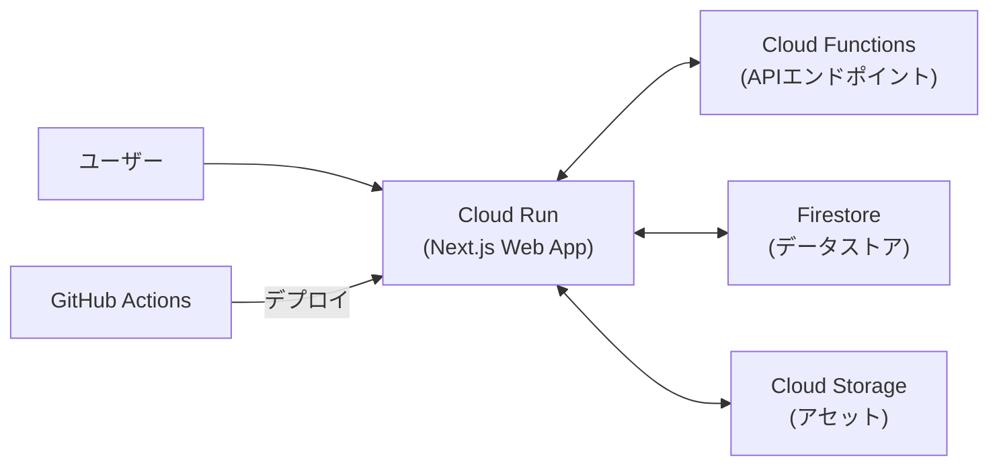

# Google Cloud Platform Webアプリケーション設計

suzumina.clickのWebアプリケーション（Next.js）をCloud Runにデプロイするための設計概要です。

## アーキテクチャ概要

Next.jsアプリケーションをCloud Runでホスティングし、サーバーレスでフルスタックなReactアプリケーションを実現します。



## Dockerfile設計要点

- マルチステージビルド（ビルドステージと実行ステージ）
- Node.js 22 Alpine をベースイメージに使用
- Bun パッケージマネージャーでの依存関係管理
- 依存関係キャッシュを最適化する階層構造
- Next.js のスタンドアロン出力を使用
- 最小限の実行環境へのファイルコピー

## Next.js設定要点

```javascript
const nextConfig = {
  output: 'standalone', // Cloud Run用に最適化された出力
  experimental: {
    serverActions: true,
  }
};
```

## Cloud Run設定

| 設定項目 | 値 |
|---------|-----|
| サービス名 | `web` |
| インスタンス数 | 最小1、最大2 |
| メモリ | 1GB |
| CPU | 1 |
| タイムアウト | 60秒 |
| 認証 | なし（検証環境） |
| HTTPS | 必須 |

## セットアップとデプロイ手順

具体的なDockerfileの作成、テスト手順、デプロイコマンドについては、[Webアプリケーション セットアップ手順](WEB_APP_SETUP.md)を参照してください。

## 関連ドキュメント

- [全体概要](GCP_OVERVIEW.md) | [API設計](GCP_FUNCTIONS.md)
- [プロジェクト設定](GCP_PROJECT_SETUP.md) | [CI/CD設計](GCP_CICD.md)

最終更新日: 2025年4月2日
