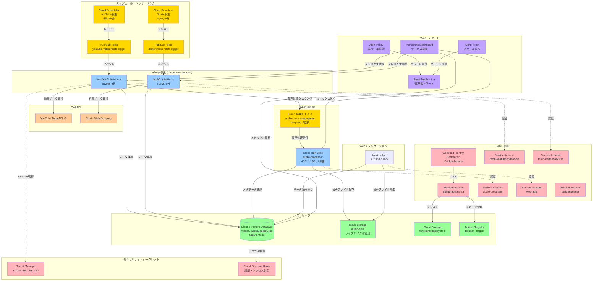

# suzumina.click インフラストラクチャアーキテクチャ

## 概要

suzumina.clickは、声優「涼花みなせ」のファンサイトとして、YouTubeビデオとDLsite作品情報を自動収集し、音声ボタン機能を提供するWebプラットフォームです。このドキュメントでは、Terraformで管理されているGoogle Cloud Platform (GCP) インフラストラクチャの全体像を図解します。

## システム全体アーキテクチャ図



## データフロー詳細

### 1. 自動データ収集フロー
```
Cloud Scheduler → Pub/Sub → Cloud Functions → External APIs → Cloud Firestore
```

**YouTube動画収集 (毎時19分実行)**
1. Cloud Scheduler が Pub/Sub トピックにメッセージ送信
2. fetchYouTubeVideos 関数が Pub/Sub イベントで起動
3. YouTube Data API v3 から最新動画情報を取得
4. Cloud Firestore の videos コレクションに保存
5. 音声処理が必要な動画は Cloud Tasks キューにタスク送信

**DLsite作品収集 (1時間に3回実行: 6,26,46分)**
1. Cloud Scheduler が Pub/Sub トピックにメッセージ送信
2. fetchDLsiteWorks 関数が Pub/Sub イベントで起動
3. DLsite からWebスクレイピングで作品情報取得
4. Cloud Firestore の works コレクションに保存

### 2. 音声処理フロー
```
YouTube Function → Cloud Tasks → Cloud Run Jobs → Cloud Storage + Cloud Firestore
```

1. YouTube動画収集時に音声処理タスクを Cloud Tasks キューに送信
2. Cloud Run Jobs (audio-processor) が Cloud Tasks からタスクを受信
3. YouTube動画から音声を抽出・処理（複数形式で生成）
4. 生成した音声ファイルを Cloud Storage に保存
5. 音声ボタンのメタデータを Cloud Firestore に保存

### 3. Webアプリケーションアクセスフロー
```
ユーザー → Next.js App → Cloud Firestore (データ) + Cloud Storage (音声ファイル)
```

1. Next.js アプリが Cloud Firestore から動画・作品データを取得
2. 音声ボタン再生時は Cloud Storage から音声ファイルを配信
3. Cloud Firestore Rules により適切なアクセス制御を実施

## リソース詳細分析

### Google Cloud Platform API

#### 有効化されたAPIサービス
| API | 用途 | 管理 |
|-----|------|------|
| **Cloud Functions API** | サーバーレス関数実行 | api_services.tf |
| **Cloud Build API** | Functions デプロイ | api_services.tf |
| **Secret Manager API** | APIキー・シークレット管理 | api_services.tf |
| **Cloud Run API** | Functions v2 実行基盤 | api_services.tf |
| **Artifact Registry API** | Functions v2 イメージ保存 | api_services.tf |
| **Cloud Firestore API** | NoSQLデータベース | api_services.tf |
| **Cloud Tasks API** | 音声処理キュー管理 | api_services.tf |
| **Cloud Scheduler API** | 定期実行管理 | api_services.tf |
| **Pub/Sub API** | メッセージング基盤 | api_services.tf |

**設計原則**: 
- すべてのAPI有効化は `api_services.tf` で一元管理
- `disable_on_destroy = false` でインフラ削除時もAPI無効化を防止
- 既存サービスへの影響を最小化

### コンピュートリソース

| リソース | 目的 | 仕様 | 実行トリガー |
|----------|------|------|-------------|
| **fetchYouTubeVideos** | YouTube動画データ収集 | 512Mi, 9分タイムアウト | Pub/Sub (毎時19分) |
| **fetchDLsiteWorks** | DLsite作品データ収集 | 512Mi, 9分タイムアウト | Pub/Sub (6,26,46分) |
| **audio-processor** | 音声ボタン生成処理 | 4CPU, 16Gi, 1時間タイムアウト | Cloud Tasks キュー |

### ストレージシステム

| ストレージ | 用途 | 特徴 | ライフサイクル |
|-----------|------|------|---------------|
| **Cloud Firestore Database** | アプリケーションデータ | ネイティブモード, 複合インデックス | 永続保存 |
| **audio-files bucket** | 音声ファイル保存 | CORS設定, 地域最適化 | 30日→Nearline, 90日→Coldline, 365日→削除 |
| **functions-deployment** | デプロイパッケージ | GitHub Actions連携 | 30日保持 |
| **Artifact Registry** | Dockerイメージ | 音声処理・Webアプリ用 | タグベース保持ポリシー |

### セキュリティ・IAMアーキテクチャ

#### サービスアカウント設計（最小権限の原則）

| サービスアカウント | 用途 | 主要権限 | 使用場所 |
|------------------|------|----------|----------|
| **github-actions-sa** | CI/CDパイプライン | Cloud Build, Artifact Registry, Cloud Run | GitHub Actions |
| **fetch-youtube-videos-sa** | YouTube データ収集 | Cloud Firestore User, Secret Manager, Cloud Tasks Enqueuer | YouTube関数 |
| **fetch-dlsite-works-sa** | DLsite データ収集 | Cloud Firestore User, Logging Writer | DLsite関数 |
| **audio-processor** | 音声処理 | Storage Admin, Cloud Firestore User, Monitoring Writer | Cloud Run Jobs |
| **web-app** | Webアプリケーション | Storage Object Viewer | Next.js アプリ |
| **task-enqueuer** | タスク管理 | Cloud Tasks Enqueuer, Cloud Run Invoker | タスクキュー管理 |

#### Workload Identity Federation
- **GitHub Actions認証**: リポジトリ制限付きOIDC認証
- **セキュアなCI/CD**: サービスアカウントキー不要の認証

#### アクセス制御
- **Cloud Firestore Rules**: 動画は公開読み取り、音声クリップは認証ベース、ユーザーデータ分離
- **Storage IAM**: バケット単位の厳密なアクセス制御
- **Secret Manager**: 最小権限でのAPIキー管理

### 監視・アラート体系

#### ダッシュボード監視項目
- Cloud Functions 実行状況・エラー率・レスポンス時間
- Cloud Run Jobs パフォーマンス・リソース使用率
- Cloud Firestore オペレーション・読み書きパフォーマンス
- Cloud Storage アクセスパターン・転送量

#### アラートポリシー
- **エラー率監視**: 5xx エラー > 5% でアラート
- **スケール監視**: インスタンス数 > 5 でアラート
- **通知先**: 管理者メールアドレス

## 運用設計

### スケジューリング戦略
- **YouTube収集**: 毎時19分（新着動画の一般的な投稿時間を考慮）
- **DLsite収集**: 1時間3回（6,26,46分）で更新頻度と負荷分散を両立
- **音声処理**: イベント駆動でオンデマンド実行

### コスト最適化
- **適切なリソースサイジング**: 用途別の最適な CPU・メモリ配分
- **ライフサイクルポリシー**: 自動的なストレージクラス変更と削除
- **スケーリング設定**: 需要に応じた自動スケールアップ・ダウン

### 可用性・拡張性
- **マルチリージョン対応**: プライマリ asia-northeast1（東京）
- **イベント駆動アーキテクチャ**: 高い可用性と拡張性
- **適切な分離**: データ収集・処理・配信の責任分離

## セキュリティ考慮事項

### データ保護
- **転送中暗号化**: HTTPS/TLS によるすべての通信暗号化
- **保存時暗号化**: Google Cloud デフォルト暗号化
- **アクセスログ**: Cloud Audit Logs による操作追跡

### 認証・認可
- **多層防御**: Workload Identity, IAM, Cloud Firestore Rules
- **最小権限**: 各コンポーネントに必要最小限の権限のみ付与
- **シークレット管理**: Secret Manager による安全なAPIキー管理

### ネットワークセキュリティ
- **CORS設定**: 音声ファイルアクセス用の適切なCORS設定
- **VPC設定**: 必要に応じてプライベートネットワーク構成可能

## 今後の拡張予定

### 短期拡張
- **リアルタイム更新**: Cloud Firestore リアルタイムリスナーによる即時UI更新
- **音声品質向上**: より高品質な音声処理アルゴリズムの実装
- **検索・フィルター機能**: 高度な検索・フィルター機能の追加

### 長期拡張
- **CDN統合**: Cloud CDN による配信パフォーマンス向上
- **機械学習統合**: 音声分析・推薦システム
- **マルチリージョン展開**: グローバル展開に向けた地理的分散

## Terraformファイル構成

### 主要なファイル構成変更（2025年）

#### 削除されたファイル・機能
- **Firebase関連**: `google_firebase_project` リソースの削除（Firebase → 純粋なCloud Firestore構成）
- **Discord認証**: 全Discord関連リソースと変数の削除
- **random provider**: 不要になったランダムID生成の削除

#### 追加・統合されたファイル
- **api_services.tf**: 全API有効化の一元管理（9つのGCP API）
- **cloud_tasks.tf**: 音声処理用Cloud Tasksキューの追加
- **audio_storage.tf**: 音声ファイル用Cloud Storage（ライフサイクル管理付き）
- **firestore_database.tf**: Firebase依存のないCloud Firestoreデータベース（`firebase.tf` から名称変更）

#### 設定の統一化
- **地域設定**: 全リソースで `var.region` (asia-northeast1) を使用
- **変数管理**: 必要最小限の変数のみ（YouTube API、GCPプロジェクト設定）
- **依存関係**: 適切なクロスファイル依存関係の整理

このインフラストラクチャは、**Firebase依存の排除**と**純粋なGCPサービス構成**により、自動化・拡張性・セキュリティを重視し、suzumina.clickアプリケーションの安定稼働と将来の成長をサポートする設計となっています。