# suzumina.click インフラストラクチャアーキテクチャ

## 概要

suzumina.clickは、声優「涼花みなせ」のファンサイトとして、YouTubeビデオとDLsite作品情報を自動収集し、音声ボタン機能を提供するWebプラットフォームです。このドキュメントでは、Terraformで管理されているGoogle Cloud Platform (GCP) インフラストラクチャの全体像を図解します。

## システム全体アーキテクチャ図

```mermaid
graph TD
    %% External APIs
    subgraph "外部API"
        YT[YouTube Data API v3]
        DL[DLsite Web Scraping]
    end

    %% Scheduling & Messaging
    subgraph "スケジュール・メッセージング"
        CS1[Cloud Scheduler<br/>YouTube収集<br/>毎時19分]
        CS2[Cloud Scheduler<br/>DLsite収集<br/>6,26,46分]
        PS1[Pub/Sub Topic<br/>youtube-video-fetch-trigger]
        PS2[Pub/Sub Topic<br/>dlsite-works-fetch-trigger]
    end

    %% Cloud Functions
    subgraph "データ収集 (Cloud Functions v2)"
        CF1[fetchYouTubeVideos<br/>512Mi, 9分]
        CF2[fetchDLsiteWorks<br/>512Mi, 9分]
    end

    %% User Audio Creation
    subgraph "音声ボタン作成"
        WEB_AUDIO[Web Audio API<br/>ブラウザ内音声処理]
        FILE_UPLOAD[Next.js Server Actions<br/>ファイルアップロード]
    end

    %% Storage
    subgraph "ストレージ"
        FS[(Cloud Firestore Database<br/>videos, works, audioButtons<br/>Native Mode)]
        CS_AUDIO[Cloud Storage<br/>user-audio-files<br/>ユーザー作成音声]
        CS_DEPLOY[Cloud Storage<br/>functions-deployment]
    end

    %% Web Application
    subgraph "Webアプリケーション"
        WEB[Next.js App<br/>suzumina.click]
    end

    %% Security & Secrets
    subgraph "セキュリティ・シークレット"
        SM[Secret Manager<br/>YOUTUBE_API_KEY]
        FR[Cloud Firestore Rules<br/>認証・アクセス制御]
    end

    %% Monitoring
    subgraph "監視・アラート"
        MD[Monitoring Dashboard<br/>サービス概要]
        AP1[Alert Policy<br/>エラー率監視]
        AP2[Alert Policy<br/>スケール監視]
        NC[Email Notification<br/>管理者アラート]
    end

    %% Identity & Access Management
    subgraph "IAM・認証"
        WIF[Workload Identity Federation<br/>GitHub Actions]
        SA1[Service Account<br/>github-actions-sa]
        SA2[Service Account<br/>fetch-youtube-videos-sa]
        SA3[Service Account<br/>fetch-dlsite-works-sa]
        SA4[Service Account<br/>web-app]
        SA5[Service Account<br/>user-content]
    end

    %% Connections
    CS1 -->|トリガー| PS1
    CS2 -->|トリガー| PS2
    PS1 -->|イベント| CF1
    PS2 -->|イベント| CF2
    
    CF1 -->|動画データ取得| YT
    CF1 -->|データ保存| FS
    CF2 -->|作品データ取得| DL
    CF2 -->|データ保存| FS
    
    WEB -->|データ読み取り| FS
    WEB -->|音声ファイル再生| CS_AUDIO
    WEB_AUDIO -->|音声処理| FILE_UPLOAD
    FILE_UPLOAD -->|音声ファイル保存| CS_AUDIO
    FILE_UPLOAD -->|メタデータ保存| FS
    
    CF1 -.->|APIキー取得| SM
    CF1 -.->|認証| SA2
    CF2 -.->|認証| SA3
    WEB -.->|認証| SA4
    FILE_UPLOAD -.->|認証| SA5
    
    WIF -.->|CI/CD| SA1
    SA1 -->|デプロイ| CS_DEPLOY
    
    MD -->|メトリクス監視| CF1
    MD -->|メトリクス監視| CF2
    MD -->|メトリクス監視| FS
    MD -->|メトリクス監視| WEB
    
    AP1 -->|アラート送信| NC
    AP2 -->|アラート送信| NC
    
    FS -.->|アクセス制御| FR

    %% Styling
    classDef external fill:#ffcc99
    classDef compute fill:#99ccff
    classDef storage fill:#99ff99
    classDef security fill:#ffb3ba
    classDef monitoring fill:#bfa3ff
    classDef messaging fill:#ffd700
    
    class YT,DL external
    class CF1,CF2,WEB compute
    class FS,CS_AUDIO,CS_DEPLOY storage
    class SM,FR,WIF,SA1,SA2,SA3,SA4,SA5 security
    class MD,AP1,AP2,NC monitoring
    class CS1,CS2,PS1,PS2 messaging
    class WEB_AUDIO,FILE_UPLOAD compute
```



## データフロー詳細

### 1. 自動データ収集フロー
```
Cloud Scheduler → Pub/Sub → Cloud Functions → External APIs → Cloud Firestore
```

**YouTube動画収集 (毎時19分実行)**
1. Cloud Scheduler が Pub/Sub トピックにメッセージ送信
2. fetchYouTubeVideos 関数が Pub/Sub イベントで起動
3. YouTube Data API v3 から最新動画情報を取得
4. Cloud Firestore の videos コレクションに保存

**DLsite作品収集 (1時間に3回実行: 6,26,46分)**
1. Cloud Scheduler が Pub/Sub トピックにメッセージ送信
2. fetchDLsiteWorks 関数が Pub/Sub イベントで起動
3. DLsite からWebスクレイピングで作品情報取得
4. Cloud Firestore の works コレクションに保存

### 2. ユーザー音声ボタン作成フロー
```
ユーザー → Web Audio API → Next.js Server Actions → Cloud Storage + Cloud Firestore
```

1. ユーザーがWebブラウザ上で音声ファイルをアップロード・編集
2. Web Audio APIによるブラウザ内音声処理（トリミング、フェード等）
3. Next.js Server Actionsによる処理済み音声ファイルの受信
4. 音声ファイルをCloud Storageに保存
5. 音声ボタンのメタデータをCloud Firestoreに保存

### 3. Webアプリケーションアクセスフロー
```
ユーザー → Next.js App → Cloud Firestore (データ) + Cloud Storage (音声ファイル)
```

1. Next.js アプリが Cloud Firestore から動画・作品データを取得
2. 音声ボタン再生時はCloud Storageから音声ファイルを配信
3. ユーザー作成音声ボタンのアップロード・管理機能
3. Cloud Firestore Rules により適切なアクセス制御を実施

## リソース詳細分析

### Google Cloud Platform API

#### 有効化されたAPIサービス
| API | 用途 | 管理 |
|-----|------|------|
| **Cloud Functions API** | サーバーレス関数実行 | api_services.tf |
| **Cloud Build API** | Functions デプロイ | api_services.tf |
| **Secret Manager API** | APIキー・シークレット管理 | api_services.tf |
| **Cloud Run API** | Functions v2 実行基盤 | api_services.tf |
| **Artifact Registry API** | Functions v2 イメージ保存 | api_services.tf |
| **Cloud Firestore API** | NoSQLデータベース | api_services.tf |
| **Cloud Scheduler API** | 定期実行管理 | api_services.tf |
| **Pub/Sub API** | メッセージング基盤 | api_services.tf |

**設計原則**: 
- すべてのAPI有効化は `api_services.tf` で一元管理
- `disable_on_destroy = false` でインフラ削除時もAPI無効化を防止
- 既存サービスへの影響を最小化

### コンピュートリソース

| リソース | 目的 | 仕様 | 実行トリガー |
|----------|------|------|-------------|
| **fetchYouTubeVideos** | YouTube動画データ収集 | 512Mi, 9分タイムアウト | Pub/Sub (毎時19分) |
| **fetchDLsiteWorks** | DLsite作品データ収集 | 512Mi, 9分タイムアウト | Pub/Sub (6,26,46分) |

### ストレージシステム

| ストレージ | 用途 | 特徴 | ライフサイクル |
|-----------|------|------|---------------|
| **Cloud Firestore Database** | アプリケーションデータ | ネイティブモード, 複合インデックス | 永続保存 |
| **user-audio-files bucket** | ユーザー音声ファイル保存 | CORS設定, 地域最適化 | 1年保持, サイズ制限 |
| **functions-deployment** | デプロイパッケージ | GitHub Actions連携 | 30日保持 |

### セキュリティ・IAMアーキテクチャ

#### サービスアカウント設計（最小権限の原則）

| サービスアカウント | 用途 | 主要権限 | 使用場所 |
|------------------|------|----------|----------|
| **github-actions-sa** | CI/CDパイプライン | Cloud Build, Artifact Registry, Cloud Run | GitHub Actions |
| **fetch-youtube-videos-sa** | YouTube データ収集 | Cloud Firestore User, Secret Manager | YouTube関数 |
| **fetch-dlsite-works-sa** | DLsite データ収集 | Cloud Firestore User, Logging Writer | DLsite関数 |
| **web-app** | Webアプリケーション | Storage Object Viewer, Cloud Firestore User | Next.js アプリ |
| **user-content** | ユーザーコンテンツ管理 | Storage Admin, Cloud Firestore User | 音声アップロード |

#### Workload Identity Federation
- **GitHub Actions認証**: リポジトリ制限付きOIDC認証
- **セキュアなCI/CD**: サービスアカウントキー不要の認証

#### アクセス制御
- **Cloud Firestore Rules**: 動画は公開読み取り、音声ボタンはユーザー認証ベース、ユーザーデータ分離
- **Storage IAM**: バケット単位の厳密なアクセス制御
- **Secret Manager**: 最小権限でのAPIキー管理

### 監視・アラート体系

#### ダッシュボード監視項目
- Cloud Functions 実行状況・エラー率・レスポンス時間
- Next.js アプリケーションパフォーマンス・レスポンス時間
- Cloud Firestore オペレーション・読み書きパフォーマンス
- Cloud Storage アクセスパターン・転送量

#### アラートポリシー
- **エラー率監視**: 5xx エラー > 5% でアラート
- **スケール監視**: インスタンス数 > 5 でアラート
- **通知先**: 管理者メールアドレス

## 運用設計

### スケジューリング戦略
- **YouTube収集**: 毎時19分（新着動画の一般的な投稿時間を考慮）
- **DLsite収集**: 1時間3回（6,26,46分）で更新頻度と負荷分散を両立
- **音声ボタン作成**: ユーザー駆動のオンデマンド処理

### コスト最適化
- **適切なリソースサイジング**: 用途別の最適な CPU・メモリ配分
- **ライフサイクルポリシー**: 自動的なストレージクラス変更と削除
- **スケーリング設定**: 需要に応じた自動スケールアップ・ダウン

### 可用性・拡張性
- **マルチリージョン対応**: プライマリ asia-northeast1（東京）
- **イベント駆動アーキテクチャ**: 高い可用性と拡張性
- **適切な分離**: データ収集・処理・配信の責任分離

## セキュリティ考慮事項

### データ保護
- **転送中暗号化**: HTTPS/TLS によるすべての通信暗号化
- **保存時暗号化**: Google Cloud デフォルト暗号化
- **アクセスログ**: Cloud Audit Logs による操作追跡

### 認証・認可
- **多層防御**: Workload Identity, IAM, Cloud Firestore Rules
- **最小権限**: 各コンポーネントに必要最小限の権限のみ付与
- **シークレット管理**: Secret Manager による安全なAPIキー管理

### ネットワークセキュリティ
- **CORS設定**: 音声ファイルアクセス用の適切なCORS設定
- **VPC設定**: 必要に応じてプライベートネットワーク構成可能

## 今後の拡張予定

### 短期拡張
- **リアルタイム更新**: Cloud Firestore リアルタイムリスナーによる即時UI更新
- **音声編集機能強化**: Web Audio APIによる高度な音声編集機能
- **検索・フィルター機能**: 高度な検索・フィルター機能の追加

### 長期拡張
- **CDN統合**: Cloud CDN による配信パフォーマンス向上
- **機械学習統合**: 音声分析・推薦システム
- **マルチリージョン展開**: グローバル展開に向けた地理的分散

## Terraformファイル構成

### 主要なファイル構成変更（2025年）

#### 削除されたファイル・機能
- **Firebase関連**: `google_firebase_project` リソースの削除（Firebase → 純粋なCloud Firestore構成）
- **Discord認証**: 全Discord関連リソースと変数の削除
- **random provider**: 不要になったランダムID生成の削除

#### 追加・統合されたファイル
- **api_services.tf**: 全API有効化の一元管理（9つのGCP API）
- **user_audio_storage.tf**: ユーザー音声ファイル用Cloud Storage（サイズ制限・保持期間付き）
- **firestore_database.tf**: Firebase依存のないCloud Firestoreデータベース（`firebase.tf` から名称変更）

#### 設定の統一化
- **地域設定**: 全リソースで `var.region` (asia-northeast1) を使用
- **変数管理**: 必要最小限の変数のみ（YouTube API、GCPプロジェクト設定）
- **依存関係**: 適切なクロスファイル依存関係の整理

このインフラストラクチャは、**Firebase依存の排除**と**純粋なGCPサービス構成**により、自動化・拡張性・セキュリティを重視し、suzumina.clickアプリケーションの安定稼働と将来の成長をサポートする設計となっています。