# suzumina.click インフラストラクチャアーキテクチャ

## 概要

suzumina.clickは、声優「涼花みなせ」のファンサイトとして、YouTubeビデオとDLsite作品情報を自動収集し、音声ボタン機能を提供するWebプラットフォームです。このドキュメントでは、Terraformで管理されているGoogle Cloud Platform (GCP) インフラストラクチャの全体像を図解します。

## システム全体アーキテクチャ図

```mermaid
graph TD
    subgraph "開発・CI/CD フロー"
        DEV[ローカル開発<br/>feature/* ブランチ]
        MAIN[main ブランチ<br/>開発統合]
        GHA[GitHub Actions<br/>CI/CDパイプライン]
        STAGING[Staging環境<br/>自動テスト・QA]
        TAG[Git Tag<br/>v1.x.x リリース]
        PROD[Production環境<br/>本番サービス]
    end

    subgraph "外部API"
        YT[YouTube Data API v3]
        DL[DLsite Web Scraping]
    end

    subgraph "スケジュール・メッセージング"
        CS1[Cloud Scheduler<br/>YouTube収集]
        CS2[Cloud Scheduler<br/>DLsite収集]
        PS1[Pub/Sub Topic<br/>youtube-video-fetch-trigger]
        PS2[Pub/Sub Topic<br/>dlsite-works-fetch-trigger]
        PS3[Pub/Sub Topic<br/>budget-alerts]
    end

    subgraph "データ収集 (Cloud Functions v2)"
        CF1[fetchYouTubeVideos<br/>本番のみ有効]
        CF2[fetchDLsiteWorks<br/>本番のみ有効]
    end

    subgraph "Webアプリケーション"
        WEB_STAGING[Cloud Run<br/>Staging環境<br/>軽量構成]
        WEB_PROD[Cloud Run<br/>Production環境<br/>本番構成]
    end

    subgraph "ネットワーク (VPC)"
        VPC[VPC<br/>suzumina-click-vpc]
        SUBNET[Subnet<br/>suzumina-click-subnet]
        NAT[Cloud NAT]
        DNS[Cloud DNS<br/>suzumina.click]
    end

    subgraph "ストレージ"
        FS[(Cloud Firestore<br/>Native Mode)]
        CS_AUDIO[Cloud Storage<br/>user-audio-files]
        CS_TFSTATE[Cloud Storage<br/>suzumina-click-tfstate]
        AR[Artifact Registry<br/>Docker Images]
    end

    subgraph "セキュリティ・シークレット"
        SM[Secret Manager<br/>YOUTUBE_API_KEY]
        FR[Cloud Firestore Rules]
        WIF[Workload Identity Federation]
    end

    subgraph "監視・アラート・予算管理"
        MD[Monitoring Dashboard]
        AP[Alert Policies]
        NC[Email Notification]
        BUDGET[Budget Alerts<br/>月5000円制限]
    end

    %% Development Flow
    DEV --> MAIN
    MAIN --> GHA
    GHA -->|自動デプロイ| STAGING
    GHA -->|自動テスト| STAGING
    STAGING -->|QA完了| TAG
    TAG --> GHA
    GHA -->|手動承認| PROD

    %% Data Collection Flow (Production only)
    CS1 -->|トリガー| PS1
    CS2 -->|トリガー| PS2
    PS1 -->|イベント| CF1
    PS2 -->|イベント| CF2

    CF1 -->|データ取得| YT
    CF1 -->|データ保存| FS
    CF2 -->|データ取得| DL
    CF2 -->|データ保存| FS

    %% Application Data Flow
    WEB_STAGING -->|データ読み書き| FS
    WEB_STAGING -->|音声ファイル| CS_AUDIO
    WEB_PROD -->|データ読み書き| FS
    WEB_PROD -->|音声ファイル| CS_AUDIO

    %% Network Flow
    CF1 -- VPC --> SUBNET
    CF2 -- VPC --> SUBNET
    WEB_STAGING -- VPC --> SUBNET
    WEB_PROD -- VPC --> SUBNET
    SUBNET -- VPC --> VPC
    VPC --> NAT
    DNS --> WEB_PROD

    %% Security & CI/CD
    CF1 -.->|APIキー| SM
    WIF -.->|CI/CD| AR
    GHA -.->|認証| WIF

    %% Monitoring & Budget
    MD -->|メトリクス| CF1
    MD -->|メトリクス| CF2
    MD -->|メトリクス| WEB_STAGING
    MD -->|メトリクス| WEB_PROD
    AP -->|アラート| NC
    BUDGET -->|予算アラート| PS3
    PS3 -->|通知| NC

    classDef external fill:#ffcc99
    classDef compute fill:#99ccff
    classDef storage fill:#99ff99
    classDef security fill:#ffb3ba
    classDef monitoring fill:#bfa3ff
    classDef messaging fill:#ffd700
    classDef network fill:#e6e6fa
    classDef cicd fill:#f0f4ff

    class YT,DL external
    class CF1,CF2,WEB_STAGING,WEB_PROD compute
    class FS,CS_AUDIO,CS_TFSTATE,AR storage
    class SM,FR,WIF security
    class MD,AP,NC,BUDGET monitoring
    class CS1,CS2,PS1,PS2,PS3 messaging
    class VPC,SUBNET,NAT,DNS network
    class DEV,MAIN,GHA,STAGING,TAG,PROD cicd
```



## データフロー詳細

### 1. 開発・CI/CDフロー（新設計）
`ローカル開発 → main統合 → Staging自動デプロイ・テスト → Git Tag → Production手動承認デプロイ`

**開発統合フロー:**
1. **feature/* ブランチ開発**: ローカル環境（pnpm dev + Firestore Emulator）で機能開発
2. **main ブランチ統合**: Pull Request承認後、mainブランチにマージ
3. **Staging自動デプロイ**: GitHub Actionsが即座にStaging環境にデプロイ
4. **自動テスト実行**: Unit/E2E/Performance/Security テストの包括実行
5. **手動QA**: Staging環境での機能・UI/UX確認
6. **Git Tag作成**: セマンティックバージョニング（v1.x.x）でリリースタグ作成
7. **Production承認デプロイ**: 手動承認後、Production環境に安全デプロイ

### 2. 自動データ収集フロー（Production環境のみ）
`Cloud Scheduler → Pub/Sub → Cloud Functions → External APIs → Cloud Firestore`
- **YouTube動画収集**: Production環境でのみ有効。Cloud Schedulerが定刻にPub/Subトピックへメッセージを送信し、`fetchYouTubeVideos`関数をトリガーします。関数はYouTube Data APIから動画情報を取得し、Cloud Firestoreに保存します。
- **DLsite作品収集**: 同様に、`fetchDLsiteWorks`関数がトリガーされ、DLsiteから作品情報を取得し、Cloud Firestoreに保存します。
- **コスト最適化**: Staging環境ではCloud Functions無効化により、データ収集コストを削減します。

### 3. 2環境構成Webアプリケーションフロー

**Staging環境:**
`GitHub Actions → Cloud Run (軽量) → Cloud Firestore / Cloud Storage`
- **目的**: 自動テスト・QA・プレビュー確認
- **構成**: 最小インスタンス、512MBメモリ、Functions無効
- **アクセス**: Staging専用URL（https://staging-suzumina-click.run.app）

**Production環境:**
`ユーザー → Cloud DNS → Cloud Run (本番) → Cloud Firestore / Cloud Storage`
1. ユーザーが `suzumina.click` にアクセスすると、Cloud DNSがリクエストをCloud RunでホストされているNext.jsアプリケーションにルーティングします。
2. アプリケーションはCloud Firestoreから必要なデータを取得し、ユーザーに表示します。
3. 音声ファイルの再生やアップロードは、Cloud Storageとの間で直接行われます。
4. 外部へのアウトバウンド通信は、VPC内のCloud NATを経由して行われます。

### 4. 予算管理・監視フロー
`リソース使用量 → Budget Alerts → Pub/Sub → Email通知`
- **予算監視**: 月次予算（Staging: 1000円、Production: 4000円）を設定
- **自動アラート**: 予算の50%、80%、100%時点でアラート発信
- **通知システム**: 予算超過時のPub/Sub経由での即座通知

## リソース詳細分析

### ネットワーク（共通インフラ）
| リソース | 用途 | 管理ファイル | 両環境共有 |
|---|---|---|---|
| **VPC** | プロジェクト専用の仮想ネットワーク | `network.tf` | ✅ |
| **Subnet** | Cloud RunやFunctionsが配置されるサブネットワーク | `network.tf` | ✅ |
| **Cloud NAT** | プライベートなリソースからのアウトバウンド通信を許可 | `network.tf` | ✅ |
| **Cloud DNS** | `suzumina.click`ドメインの名前解決（Production のみ） | `dns.tf` | ❌ |

### コンピュートリソース（環境別構成）
| リソース | Staging環境 | Production環境 | 実行トリガー |
|---|---|---|---|
| **fetchYouTubeVideos** | ❌ 無効（コスト削減） | ✅ 有効 | Pub/Sub |
| **fetchDLsiteWorks** | ❌ 無効（コスト削減） | ✅ 有効 | Pub/Sub |
| **Cloud Run (Web App)** | 軽量構成（512MB/1インスタンス） | 本番構成（1GB/2インスタンス） | HTTP リクエスト |

### ストレージシステム（共有リソース）
| ストレージ | 用途 | 特徴 | 管理ファイル | 両環境共有 |
|---|---|---|---|---|
| **Cloud Firestore** | アプリケーションデータ | ネイティブモード, 複合インデックス | `firestore_database.tf` | ✅ |
| **Cloud Storage (user-audio)** | ユーザー作成の音声ファイル | CORS設定, ライフサイクル管理 | `storage.tf` | ✅ |
| **Cloud Storage (tfstate)** | Terraformの状態ファイル | バージョニング有効, 削除保護 | `gcs.tf` | ✅ |
| **Artifact Registry** | Dockerコンテナイメージ | GitHub Actions連携 | `artifact_registry.tf` | ✅ |

### CI/CD・デプロイメント
| コンポーネント | 役割 | トリガー | 対象環境 |
|---|---|---|---|
| **GitHub Actions (Staging)** | 自動デプロイ・テスト | main ブランチ push | Staging |
| **GitHub Actions (Production)** | 本番デプロイ | Git Tag push (v*) | Production |
| **Workload Identity Federation** | 安全なGCP認証 | CI/CD実行時 | 両環境 |
| **Terraform Workspace** | 環境分離管理 | Manual/CI/CD | 両環境 |

### 予算・監視システム
| リソース | Staging | Production | 管理ファイル |
|---|---|---|---|
| **予算アラート** | 月1000円制限 | 月4000円制限 | `billing.tf` |
| **監視ダッシュボード** | 基本監視 | 完全監視 | `monitoring*.tf` |
| **アラートポリシー** | 重要アラートのみ | 包括的アラート | `monitoring.tf` |
| **ログ集約** | 基本ログ | 詳細ログ | `logging.tf` |

### セキュリティ・IAMアーキテクチャ
- **Workload Identity Federation**: サービスアカウントキーを使わずに、GitHub ActionsからGCPリソースを安全に認証します。
- **最小権限の原則**: 各サービスアカウントには、その役割に必要な最小限の権限のみが付与されています。
- **ネットワークセキュリティ**: すべてのコンピュートリソースは専用VPC内に配置され、外部との通信はCloud NATを経由することでセキュリティを強化しています。

## Terraformファイル構成（個人開発最適化）

### **環境管理の簡素化**
個人開発・個人運用向けに2環境構成（Staging + Production）を採用し、以下のファイル構成で管理します：

**コア設定ファイル:**
- **`variables.tf`**: 環境別変数定義（staging/production バリデーション付き）
- **`locals.tf`**: 環境別リソース設定（コスト最適化パラメータ）
- **`backend.tf`**: Terraform状態管理（GCS バックエンド）
- **`providers.tf`**: GCP プロバイダー設定

**インフラリソースファイル:**
- **`network.tf`**: 共有VPC・サブネット・Cloud NAT
- **`dns.tf`**: Production専用カスタムドメイン（条件付き作成）
- **`cloud_run.tf`**: 環境別Cloud Run設定（軽量 vs 本番構成）
- **`function_*.tf`**: Production専用Cloud Functions（Staging無効化）
- **`storage.tf`**: 共有ストレージ（Firestore・Cloud Storage）
- **`billing.tf`**: 環境別予算管理（1000円 vs 4000円制限）

**セキュリティ・監視ファイル:**
- **`iam.tf`**: 最小権限IAM・Workload Identity Federation
- **`secrets.tf`**: Secret Manager・APIキー管理
- **`monitoring*.tf`**: 環境別監視・アラート設定

### **個人開発向け設計原則**

**1. コスト最適化:**
```hcl
# Staging: 超軽量構成
staging = {
  cloud_run_max_instances = 1
  cloud_run_memory       = "512Mi"  
  functions_enabled      = false    # コスト削減
  budget_amount         = 1000     # 月1000円制限
}

# Production: 個人利用レベル
production = {
  cloud_run_max_instances = 2
  cloud_run_memory       = "1Gi"
  functions_enabled      = true
  budget_amount         = 4000     # 月4000円制限
}
```

**2. 環境分離:**
- 同一GCPプロジェクト内での論理分離
- Terraform workspace による状態管理分離
- 環境別リソース名プレフィックス

**3. CI/CD統合:**
- GitHub Actions によるTerraform自動実行
- 環境変数による動的設定切り替え
- Workload Identity Federation による安全認証

**4. 運用性重視:**
- 予算アラートによる自動コスト管理
- 環境別監視・ログ設定
- 緊急時対応のための柔軟な設定

### **デプロイ戦略との統合**

このTerraform構成は、[リリースプロセス](./RELEASE_PROCESS.md)と[デプロイ戦略](./DEPLOYMENT_STRATEGY.md)と完全に統合されており、以下の自動化を実現します：

1. **main ブランチ統合** → Staging環境自動デプロイ
2. **Git Tag作成** → Production環境手動承認デプロイ  
3. **環境別設定自動適用** → コスト・パフォーマンス最適化
4. **予算監視自動実行** → コスト超過時の即座アラート

このインフラストラクチャは、**個人開発・個人運用に最適化**された、**コスト効率と運用性を両立**した設計となっています。純粋なGCPサービスで構成され、**自動化、品質担保、セキュリティ**を重視した堅牢な基盤を提供します。

## 🔧 環境設定・認証ガイド

### **Application Default Credentials (ADC) 設定**

**開発環境セットアップ:**
```bash
# Google Cloud SDK インストール
brew install google-cloud-sdk

# ADC 設定
gcloud auth application-default login

# プロジェクト設定
gcloud config set project suzumina-click

# 設定確認
gcloud auth application-default print-access-token
gcloud config get-value project
```

**本番環境:**
- Cloud Run/Cloud Functions: サービスアカウント自動認証
- GitHub Actions: Workload Identity Federation による安全認証

### **環境変数設定**

**Next.js Application (環境別):**
```bash
# Staging環境
NEXT_PUBLIC_ENVIRONMENT=staging
GOOGLE_CLOUD_PROJECT=suzumina-click

# Production環境  
NEXT_PUBLIC_ENVIRONMENT=production
GOOGLE_CLOUD_PROJECT=suzumina-click
```

**Cloud Functions:**
```bash
# 環境変数は Secret Manager から自動注入
# YOUTUBE_API_KEY: Secret Manager で管理
NODE_ENV=production
FUNCTION_TARGET=fetchYouTubeVideos
```

### **セキュリティ設定**

**Firestore Security Rules:**
```javascript
rules_version = '2';
service cloud.firestore {
  match /databases/{database}/documents {
    // 音声ボタン - 公開分のみ読み取り可能
    match /audioButtons/{buttonId} {
      allow read: if resource.data.isPublic == true;
      allow write: if false; // 将来的にユーザー認証実装予定
    }
    
    // 動画・作品データ - 読み取りのみ
    match /{collection}/{document} {
      allow read: if collection in ['videos', 'dlsiteWorks'];
      allow write: if false;
    }
  }
}
```

**Cloud Storage IAM:**
- `allUsers`: objectViewer (音声ファイル再生用)
- Service Account: objectAdmin (アップロード用)

### **本番環境確認コマンド**

```bash
# Cloud Run サービス確認
gcloud run services list --region=asia-northeast1

# Cloud Functions 確認  
gcloud functions list --region=asia-northeast1

# Firestore データベース確認
gcloud firestore databases list

# 予算アラート確認
gcloud billing budgets list
```