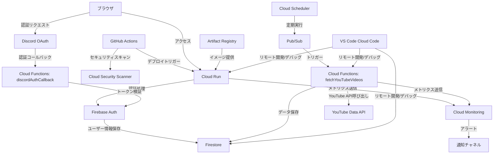

# インフラ構成監査レポート

**最終更新日: 2025年5月3日**

このドキュメントは、suzumina.clickプロジェクトの現在のインフラ構成を記録し、監査目的で参照できるようにしたものです。

## 1. リソース構成一覧

| リソース種別 | 管理方法 | 設定ファイル | 備考 |
|------------|---------|------------|------|
| **Cloud Run** | Terraform | `terraform/cloudrun.tf` | Next.jsアプリケーションのホスティング |
| **Firebase Auth** | Terraform | `terraform/firebase.tf` | **認証機能のみ使用** |
| **Cloud Functions** | Terraform | `terraform/function_*.tf` | Discord認証コールバックとYouTube情報取得 |
| **Firestore** | Terraform | `terraform/firebase.tf` | 認証情報とYouTubeデータ保存 |
| **Firestore Security Rules** | Terraform | `terraform/firebase.tf` | セキュリティルールの一元管理 |
| **Firestore Indexes** | Terraform | `terraform/firestore_indexes.tf` | インデックス設定の一元管理 |
| **Secret Manager** | Terraform | `terraform/secrets.tf` | 環境変数・APIキー管理 |
| **Pub/Sub** | Terraform | `terraform/pubsub.tf` | バッチ処理トリガー |
| **Cloud Scheduler** | Terraform | `terraform/scheduler.tf` | 定期実行ジョブ |
| **IAM** | Terraform | `terraform/iam.tf` | サービスアカウント・権限管理 |
| **Storage** | Terraform | `terraform/storage.tf` | 静的アセット保存（現在は未使用） |
| **API Services** | Terraform | `terraform/api_services.tf` | 必要なAPIの有効化管理 |
| **Monitoring** | Terraform | `terraform/monitoring.tf` | ダッシュボードとアラート設定 |
| **Artifact Registry** | Terraform | `terraform/artifact_registry.tf` | Dockerイメージ保存 |

**注意**: 2025年5月の環境整理により、`firebase.json`と`firestore.rules`ファイルは廃止されました。これらの設定はすべてTerraformで一元管理されています。

## 2. ネットワークとサービス連携図

## 3. 最適化された運用方針

### 3.1 Firebase利用ポリシー

- **Firebase Authentication**: Discord OAuth連携による認証のみ使用
- **Firebase Hosting**: 完全に廃止（Cloud Runに移行済み）
- **Firebase Storage**: 現在未使用
- **Firestore**: 認証情報とYouTube動画情報の保存
- **Firestore Rules & Indexes**: ローカルファイルではなくTerraformで一元管理

### 3.2 環境管理ポリシー

- **ステージング環境のみ**: 現在はステージング環境のみを運用
- **プレビュー環境**: 廃止（今後使用予定なし）
- **プロジェクト名**: `suzumina-click-firebase`
- **開発方法**: Cloud Codeを使ったリモート開発とデバッグ（ローカルエミュレータ不要）

### 3.3 リソース管理ポリシー

- **Terraform一元管理**: 全てのGCPリソースはTerraformで管理
- **手動変更禁止**: コンソールでの手動変更は原則禁止
- **デプロイ権限**: 限定されたメンバーのみがデプロイ権限を持つ
- **設定ファイル**: CLIツール固有の設定ファイル（firebase.json等）は廃止し、Terraformに統合

## 4. セキュリティ設定と監視体制

- **GitHub Actions**: Workload Identity Federation使用
- **Secret Manager**: 全ての機密情報はSecret Managerで管理
- **IAM**: 最小権限の原則に基づくサービスアカウント設定
- **YouTube API鍵**: Secret Managerでの安全な管理
- **セキュリティスキャン**: GitHub Actions内で依存関係とDockerイメージの自動スキャン（毎日実行）
- **脆弱性通知**: Dependabotによる自動脆弱性通知

## 5. 監視とコスト管理

- **Cloud Monitoring**: Terraformによるメトリクスダッシュボードとアラートポリシー管理
- **自動通知**: エラー率、高レイテンシ、リソース枯渇時の自動通知
- **コスト管理**: 予算アラートの設定（`terraform/budget.tf`）
- **自動スケーリング最適化**: 負荷に応じた適切なリソース割り当て

## 6. CI/CD最適化

- **ビルドキャッシュ**: GitHub Actionsでのキャッシュ戦略最適化（pnpmおよびNext.js）
- **デプロイ自動化**: パスベースの選択的デプロイによる重複の排除
- **自動ロールバック**: デプロイ後のヘルスチェックに基づく自動ロールバック機能
- **ゼロダウンタイム**: トラフィック制御による無停止デプロイ

## 7. Cloud Code開発環境の導入

2025年5月にプロジェクトはCloud Code開発環境への完全移行を行い、以下の利点を得ました：

- **リモート環境での直接開発**: ローカルエミュレータ不要でCloud Run環境を直接操作
- **設定ファイル削減**: `firebase.json`と`firestore.rules`の廃止によるコード管理の簡素化
- **一貫した開発環境**: 全開発者がリモート環境で同一条件での開発が可能
- **リアルタイムデバッグ**: 本番環境に近い状態でのリアルタイムデバッグ機能

### 7.1 環境設定ファイルの置き換え

| 削除されたファイル | 代替管理方法 | 備考 |
|--------------|----------|------|
| `firebase.json` | Terraform + Cloud Code | エミュレータ設定は不要に |
| `firestore.rules` | `terraform/firebase.tf` | セキュリティルールをTerraformで一元管理 |
| `firestore.indexes.json` | `terraform/firestore_indexes.tf` | インデックス設定をTerraformで一元管理 |

## 参照ドキュメント

- **[デプロイ手順マニュアル](./DEPLOYMENT.md)**: デプロイの詳細な手順
- **[環境変数設定ガイド](./ENVIRONMENT_VARIABLES.md)**: 環境変数とシークレットの設定方法
- **[開発環境セットアップ](./DEVELOPMENT_SETUP.md)**: 開発環境の構築手順
- **[YouTube動画情報取得バッチ実装](./archive/2025-04-21_completed_youtube_batch_implementation.md)**: YouTube動画情報取得機能の詳細
- **[Cloud Code統合レポート](./CLOUD_CODE_INTEGRATION.md)**: VS Code Cloud Codeの設定と利用方法
