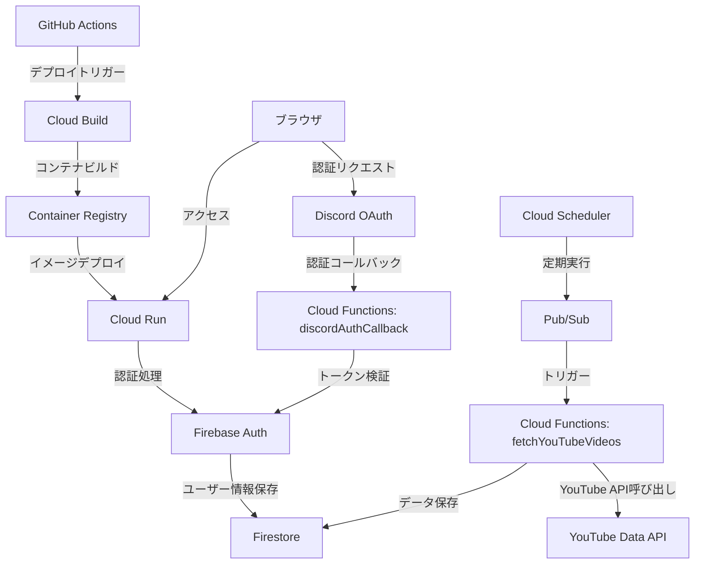

# インフラ構成監査レポート

**最終更新日: 2025年4月22日**

このドキュメントは、suzumina.clickプロジェクトの現在のインフラ構成を記録し、監査目的で参照できるようにしたものです。

## 1. リソース構成一覧

| リソース種別 | 管理方法 | 設定ファイル | 備考 |
|------------|---------|------------|------|
| **Cloud Run** | Terraform | `terraform/cloudrun.tf` | Next.jsアプリケーションのホスティング |
| **Cloud Build** | Terraform | `terraform/cloudbuild.tf` | コンテナビルド・デプロイパイプライン |
| **Firebase Auth** | Terraform | `terraform/firebase.tf` | **認証機能のみ使用** |
| **Cloud Functions** | Terraform | `terraform/functions.tf` | Discord認証コールバックとYouTube情報取得 |
| **Firestore** | Terraform | `terraform/firebase.tf` | 認証情報とYouTubeデータ保存 |
| **Secret Manager** | Terraform | `terraform/secrets.tf` | 環境変数・APIキー管理 |
| **Pub/Sub** | Terraform | `terraform/pubsub.tf` | バッチ処理トリガー |
| **Cloud Scheduler** | Terraform | `terraform/scheduler.tf` | 定期実行ジョブ |
| **IAM** | Terraform | `terraform/iam.tf` | サービスアカウント・権限管理 |
| **Storage** | Terraform | `terraform/storage.tf` | 静的アセット保存（現在は未使用） |

## 2. ネットワークとサービス連携図

## 3. 現在の運用方針

### 3.1 Firebase利用ポリシー

- **Firebase Authentication**: Discord OAuth連携による認証のみ使用
- **Firebase Hosting**: 完全に廃止（Cloud Runに移行済み）
- **Firebase Storage**: 現在未使用
- **Firestore**: 認証情報とYouTube動画情報の保存

### 3.2 環境管理ポリシー

- **ステージング環境のみ**: 現在はステージング環境のみを運用
- **プレビュー環境**: 廃止（今後使用予定なし）
- **プロジェクト名**: `suzumina-click-firebase`

### 3.3 リソース管理ポリシー

- **Terraform一元管理**: 全てのGCPリソースはTerraformで管理
- **手動変更禁止**: コンソールでの手動変更は原則禁止
- **デプロイ権限**: 限定されたメンバーのみがデプロイ権限を持つ

## 4. セキュリティ設定

- **GitHub Actions**: Workload Identity Federation使用
- **Secret Manager**: 全ての機密情報はSecret Managerで管理
- **IAM**: 最小権限の原則に基づくサービスアカウント設定

## 5. 監視とコスト管理

- **今後の課題**: Cloud Runメトリクス監視とアラート設定
- **コスト管理**: 予算アラートの設定（検討中）

## 参照ドキュメント

- **[デプロイ手順マニュアル](./DEPLOYMENT.md)**: デプロイの詳細な手順
- **[モノレポ移行レポート](./MONOREPO_MIGRATION.md)**: モノレポ構成とCloud Run移行の背景
- **[環境変数設定ガイド](./ENVIRONMENT_VARIABLES.md)**: 環境変数とシークレットの設定方法
- **[開発環境セットアップ](./DEVELOPMENT_SETUP.md)**: 開発環境の構築手順