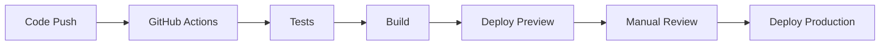

# 開発ポリシー・設計原則

## 📋 概要

本ドキュメントでは、suzumina.clickプロジェクトの開発ポリシー、設計原則、コーディング規約、および品質基準を定義します。

## 🎯 設計原則

### 1. 型安全性の確保

**原則**: すべてのデータ構造は型安全であること

- **TypeScript**: strict モードを使用し、`any` 型の使用を原則禁止
- **Zod Schema**: 実行時の型検証を実装
- **共有型定義**: packages/shared-types による一元管理

```typescript
// ✅ 良い例: Zodスキーマによる型定義
export const VideoSchema = z.object({
  id: z.string().min(1),
  title: z.string().min(1),
  publishedAt: z.string().datetime()
});

// ❌ 悪い例: any型の使用
function processData(data: any) { ... }
```

### 2. 関数設計原則

**原則**: 純粋関数を優先し、副作用を最小化する

- **純粋関数**: 同じ入力に対して常に同じ出力を返す
- **短い関数**: 1つの関数は1つの責任のみを持つ
- **単一責任原則**: 明確で理解しやすい関数名

```typescript
// ✅ 良い例: 純粋関数
export function formatPrice(price: number, currency = 'JPY'): string {
  return `${price.toLocaleString()}円`;
}

// ❌ 悪い例: 副作用のある関数
function updateAndLog(data: any) {
  updateDatabase(data); // 副作用
  console.log(data);    // 副作用
  return data;
}
```

### 3. コードコロケーション

**原則**: 関連するコードは近接して配置する

```
components/
├── voice-button/
│   ├── voice-button.tsx      # メインコンポーネント
│   ├── voice-button.test.tsx # テスト
│   ├── voice-button.types.ts # 型定義
│   └── index.ts              # エクスポート
```

### 4. 可読性優先

**原則**: パフォーマンスよりも可読性を優先する

- 明確な変数名・関数名を使用
- 適切なコメントの追加
- 複雑なロジックの分割

### 5. サーバーサイド優先設計

**原則**: データ取得・操作はサーバーサイドで実行する

- **Server Actions**: Next.js 15 Server Actions によるデータ操作
- **Firestore接続制限**: `@google-cloud/firestore` をサーバーサイドのみで使用
- **クライアント最小化**: クライアントサイドの状態管理を必要最小限に

```typescript
// ✅ 良い例: Server Action (ページと同じディレクトリに配置)
// app/works/actions.ts
'use server';

import { firestore } from '@/lib/firestore';

export async function getWorks() {
  const snapshot = await firestore.collection('works').get();
  return snapshot.docs.map(doc => ({ id: doc.id, ...doc.data() }));
}

// ❌ 悪い例: クライアントサイドFirebase
// import { initializeApp } from 'firebase/app';
// import { getFirestore } from 'firebase/firestore';
```

### 6. Vercel準拠のアーキテクチャ設計

**原則**: Next.js/Vercelの公式推奨事項に準拠する

- **コロケーション原則**: Server Actionsをページと同じディレクトリに配置、単体テストを実装と同じディレクトリに配置
- **App Router最適化**: `app/`内での標準ファイル構成
- **標準命名規則**: `globals.css` など公式推奨命名

```typescript
// ✅ 良い例: コロケーション設計
app/
├── works/
│   ├── page.tsx          # 作品一覧ページ
│   ├── actions.ts        # 作品関連Server Actions
│   └── [id]/
│       ├── page.tsx      # 作品詳細ページ
│       └── actions.ts    # 作品詳細用Actions

// ❌ 悪い例: 分離設計 (非推奨)
src/
├── lib/actions/          # Server Actionsの集約配置
└── app/works/            # ページのみ
```

**ディレクトリ設計原則**:
- **機能別グループ化**: 関連するコンポーネント・Actions・ページをまとめる
- **最小限のlib/**: 共通ユーティリティのみを配置
- **標準構造準拠**: Vercel公式推奨のプロジェクト構造

## 🧪 テスト戦略

### テストアプローチ

**Red-Green-Refactor サイクル**

1. **Red**: 失敗するテストを書く
2. **Green**: テストを通すための最小限のコードを書く
3. **Refactor**: コードを改善する

**Arrange-Act-Assert パターン**

```typescript
describe('formatPrice', () => {
  it('should format price with comma separators', () => {
    // Arrange
    const price = 1000;
    
    // Act
    const result = formatPrice(price);
    
    // Assert
    expect(result).toBe('1,000円');
  });
});
```

### カバレッジ目標

- **最小カバレッジ**: 80%
- **重要な関数**: 100%カバレッジ
- **エッジケース**: 必ずテストする

### テスト種別

- **Unit Tests**: 個別関数のテスト
- **Integration Tests**: API連携テスト
- **E2E Tests**: ユーザーシナリオテスト (将来実装)

## 🔧 開発ワークフロー

### 1. ブランチ戦略

**Trunk-based Development + GitHub Flow**

```
main (production)
├── feature/add-voice-button-filter
├── feature/improve-dlsite-parser
└── hotfix/fix-youtube-api-error
```

### 2. コミット規約

**Conventional Commits**

```bash
feat: 新機能の追加
fix: バグ修正
docs: ドキュメント更新
style: フォーマット変更
refactor: リファクタリング
test: テスト追加・修正
chore: その他の変更

# 例
feat: add voice button filtering by tags
fix: resolve youtube api quota exceeded error
docs: update api documentation
```

### 3. 実装後チェックリスト

**必須項目**

- [ ] テスト実行: `pnpm test`
- [ ] コードフォーマット: `pnpm format`
- [ ] Lint実行: `pnpm lint`
- [ ] ビルド確認: `pnpm build`
- [ ] 型チェック: `tsc --noEmit`

**推奨項目**

- [ ] カバレッジ確認: `pnpm test:coverage`
- [ ] パフォーマンステスト
- [ ] セキュリティチェック
- [ ] アクセシビリティ確認

## 🏗️ アーキテクチャ原則

### 1. 責任分離

**レイヤー構造**

```
apps/v0-suzumina.click/
├── app/              # Next.js App Router (UI層)
├── components/       # 再利用可能コンポーネント
├── lib/             # ビジネスロジック
└── hooks/           # カスタムフック

apps/functions/
├── src/
│   ├── dlsite.ts    # エントリーポイント
│   ├── youtube.ts   # エントリーポイント  
│   └── utils/       # ドメインロジック
```

### 2. 依存関係管理

**依存関係の方向**

```
UI層 → ビジネスロジック層 → データアクセス層
```

- 上位層は下位層に依存する
- 下位層は上位層に依存しない
- 循環依存を禁止

### 3. エラーハンドリング

**階層別エラー処理**

```typescript
// Cloud Functions
export async function fetchYouTubeVideos(event: CloudEvent) {
  try {
    const result = await fetchYouTubeVideosLogic();
    if (result.error) {
      logger.warn(`YouTube動画取得処理でエラー: ${result.error}`);
    }
  } catch (error) {
    logger.error('予期しないエラー:', error);
    await updateMetadata({ 
      isInProgress: false,
      lastError: error instanceof Error ? error.message : String(error)
    });
  }
}

// Frontend
export function VideoCard({ video }: { video: VideoData }) {
  if (!video) {
    return <ErrorAlert message="動画データが見つかりません" />;
  }
  // ...
}
```

## 📦 依存関係管理

### パッケージ選定基準

1. **アクティブメンテナンス**: 定期的な更新があること
2. **型安全性**: TypeScript サポートがあること
3. **軽量性**: バンドルサイズへの影響を考慮
4. **セキュリティ**: 既知の脆弱性がないこと

### 依存関係の更新

```bash
# 定期的な依存関係チェック
pnpm outdated

# 更新実行
pnpm update

# セキュリティ監査
pnpm audit
```

## 🔒 セキュリティガイドライン

### 1. 機密情報管理

- **環境変数**: すべての機密情報は環境変数で管理
- **Secret Manager**: Google Cloud Secret Manager を使用
- **ログ出力**: 機密情報をログに出力しない

```typescript
// ✅ 良い例
const apiKey = process.env.YOUTUBE_API_KEY;
if (!apiKey) {
  logger.error('YouTube API Keyが設定されていません');
  return;
}

// ❌ 悪い例
logger.info(`API Key: ${process.env.YOUTUBE_API_KEY}`);
```

### 2. 入力検証

- **Zod Schema**: すべての外部入力を検証
- **サニタイゼーション**: HTMLエスケープの実施
- **CSRFトークン**: 状態変更APIでのトークン検証

### 3. アクセス制御

- **最小権限原則**: 必要最小限の権限のみ付与
- **サービスアカウント**: 機能別に専用アカウントを作成
- **Firestore Rules**: データアクセス制御を実装

## 📊 パフォーマンス基準

### 1. フロントエンド

- **Core Web Vitals**
  - LCP (Largest Contentful Paint): < 2.5s
  - FID (First Input Delay): < 100ms
  - CLS (Cumulative Layout Shift): < 0.1

- **バンドルサイズ**: 初期ロードは500KB以下

### 2. バックエンド

- **Cloud Functions**
  - コールドスタート: < 5秒
  - レスポンス時間: < 3秒
  - メモリ使用量: 512MB以下

- **データベース**
  - クエリレスポンス: < 1秒
  - インデックス最適化の実施

## 📝 ドキュメンテーション

### 1. コメント規約

**JSDoc形式**

```typescript
/**
 * DLsiteから作品情報を取得する
 * 
 * @param page - 取得するページ番号
 * @returns 作品データの配列
 * @throws {Error} APIエラーまたはパースエラー
 */
export async function fetchDLsiteWorks(page: number): Promise<WorkData[]> {
  // 実装...
}
```

### 2. README更新

- 新機能追加時はREADMEを更新
- 破壊的変更は移行ガイドを作成
- API変更はCHANGELOG.mdに記録

## 🚀 デプロイメント原則

### 1. 環境分離

- **production**: 本番環境
- **preview**: プルリクエスト確認用

### 2. デプロイフロー



### 3. ロールバック戦略

- **即座にロールバック**: 重大なバグ発見時
- **段階的デプロイ**: 新機能の段階的公開
- **モニタリング**: デプロイ後の継続監視

## 🔍 品質保証

### 1. 自動化チェック

- **Pre-commit hooks**: Lefthook による自動チェック
- **CI/CD**: GitHub Actions による継続的テスト
- **依存関係**: Dependabot による自動更新

### 2. コードレビュー

- **必須レビュー**: すべてのPRに1名以上のレビュー
- **チェック項目**:
  - 設計原則への準拠
  - テストカバレッジ
  - セキュリティ考慮
  - パフォーマンス影響

### 3. 定期監査

- **月次**: 依存関係の脆弱性チェック
- **四半期**: アーキテクチャレビュー
- **年次**: 技術スタック見直し

## 📚 参考資料

- [TypeScript Handbook](https://www.typescriptlang.org/docs/)
- [Next.js Documentation](https://nextjs.org/docs)
- [Google Cloud Functions Best Practices](https://cloud.google.com/functions/docs/bestpractices)
- [Conventional Commits](https://www.conventionalcommits.org/)
- [Clean Code](https://www.amazon.com/Clean-Code-Handbook-Software-Craftsmanship/dp/0132350884)

---

**最終更新**: 2025年6月10日  
**次回レビュー予定**: 2025年9月10日