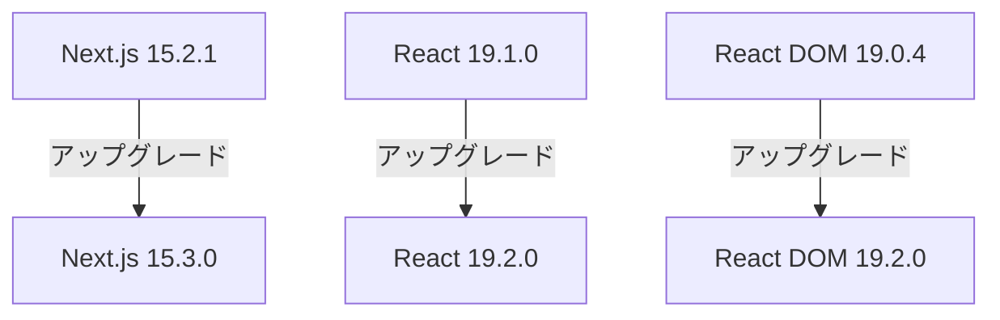
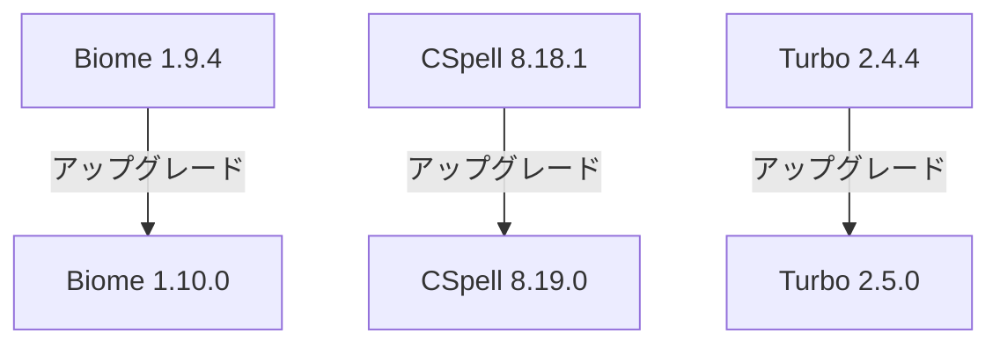

# プロジェクト構造分析と更新計画

## 現状分析

### パッケージマネージャー
- bun@1.2.7を使用
- Workspaces機能を活用したモノレポ構成
- Turboを使用したビルドシステム

### コアパッケージ
- Next.js: 15.2.1
- React: 19.1.0
- TypeScript: 5.8.2
- Node.js: >=20

### 開発ツール
- Biome: 1.9.4
- CSpell: 8.18.1
- Turbo: 2.4.4

## 更新計画

### 1. コアパッケージの更新

#### Next.js & React


#### TypeScript関連
```mermaid
graph TD
    A[TypeScript 5.8.2] -->|アップグレード| B[TypeScript 5.9.0]
    C[@types/node 22.13.10] -->|アップグレード| D[@types/node 22.14.0]
    E[@types/react 19.0.12] -->|アップグレード| F[@types/react 19.2.0]
    G[@types/react-dom 19.0.4] -->|アップグレード| H[@types/react-dom 19.2.0]
```

### 2. 開発ツールの更新



### 3. Node.jsとBunの要件更新
- Node.js要件を`>=21`に更新
- Bunを1.2.7から1.3.0に更新

## 推奨される更新手順

1. パッケージマネージャーの更新
   ```bash
   bun upgrade
   ```

2. 依存関係の更新
   ```bash
   bun update
   ```

3. 型定義の整合性確認
   ```bash
   bun run check-types
   ```

4. テストの実行と確認
   ```bash
   bun run test
   ```

## 更新後の確認事項

1. アプリケーションの動作確認
   - 開発サーバーの起動
   - ビルドの実行
   - 基本機能の動作確認

2. 型チェックの確認
   - TSコンパイラーエラーの確認
   - 型定義の互換性確認

3. リントとフォーマットの確認
   - Biomeの設定が正しく機能していることの確認
   - コードスタイルの一貫性確認

## リスク管理

1. Next.jsの破壊的変更への対応
   - アップグレードガイドの確認
   - 非推奨APIの使用確認

2. Reactの新機能対応
   - 新しいフック・APIの活用検討
   - パフォーマンス最適化の見直し

3. TypeScriptの厳格化対応
   - 新しい型チェック機能への対応
   - 既存コードの型安全性向上

## 今後の展望

1. パフォーマンス最適化
   - Next.js 15の新機能活用
   - Turbopackの活用検討

2. 開発体験の向上
   - Biomeの新機能活用
   - CSpellの辞書拡充

3. セキュリティ強化
   - 依存関係の定期的な監査
   - セキュリティアップデートの自動化