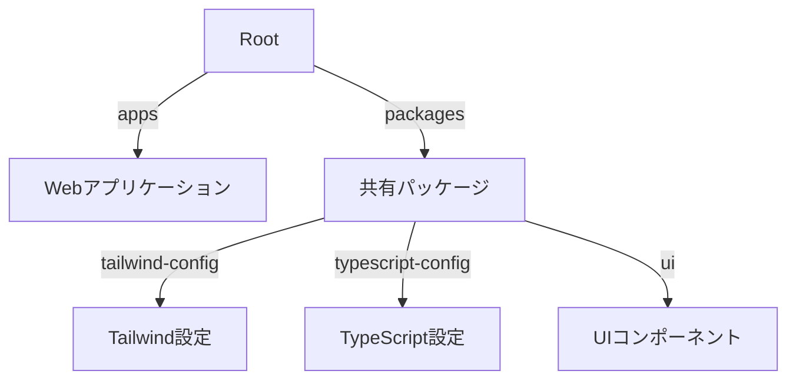

# プロジェクトアーキテクチャと設計方針

## モノレポ構造

## 技術スタック

- **パッケージマネージャー**: bun（高速実行、効率的依存管理、Workspaces機能）
- **フレームワーク**: Next.js（App Router）、React、TypeScript
- **開発ツール**: Biome（リンター・フォーマッター）、CSpell、Turbo
- **データベース**: PostgreSQL（開発・本番共通）
- **ORM**: Drizzle（型安全なクエリビルダー）

## アーキテクチャ設計

### データ層

- **データベース設計**:
  - PostgreSQLを全環境で使用
  - マイグレーション管理（Drizzle）
  - 型安全なクエリビルダー

- **認証システム**:
  - NextAuth.js + Discord OAuth2
  - カスタムDrizzleアダプター
  - セッション管理の最適化

### フロントエンド

- **コンポーネント分離**:
  - プレゼンテーションコンポーネント
  - コンテナコンポーネント
  - 共有UIライブラリ（HeroUI）

- **状態管理**:
  - サーバーコンポーネント優先
  - クライアント状態の最小化
  - React Server Components活用

### インフラストラクチャ

- **デプロイメント**:
  - Cloud Run（コンテナ実行環境）
  - Cloud SQL（PostgreSQLサービス）
  - Secret Manager（機密情報管理）

## テスト戦略

### ユニットテスト

- **コンポーネントテスト**:
  - レンダリングの検証
  - イベントハンドリング
  - 条件分岐の網羅
  - エッジケースの検証

- **ユーティリティテスト**:
  - 環境変数処理
  - データ変換処理
  - エラーハンドリング

### 統合テスト

- **APIテスト**:
  - エンドポイントの動作確認
  - データフローの検証
  - エラー応答の確認

- **認証フロー**:
  - ログインプロセス
  - セッション管理
  - 権限制御

### E2Eテスト（計画中）

- Playwrightを使用
- ユーザーフロー全体の検証
- クロスブラウザテスト

## 品質管理

### コード品質

- **静的解析**:
  - Biomeによるリント
  - DeepSourceによる解析
  - 型チェック（TypeScript）

- **テストカバレッジ**:
  - ユニットテスト網羅
  - 統合テスト拡充
  - カバレッジレポート自動生成

### パフォーマンス

- **メトリクス**:
  - Webバイタル測定
  - バンドルサイズ監視
  - レスポンス時間計測

- **最適化**:
  - 画像最適化
  - コード分割
  - キャッシュ戦略

## セキュリティ

### 認証・認可

- OAuth2.0による認証
- セッションベースの状態管理
- CSRF対策実装

### データ保護

- 環境変数の厳格な管理
- データベースアクセス制御
- セキュアな通信（HTTPS）

## 継続的インテグレーション

### GitHub Actions

- **ビルド検証**:
  - 依存関係インストール
  - TypeScriptコンパイル
  - ビルド成功確認

- **テスト実行**:
  - ユニットテスト
  - 統合テスト
  - カバレッジレポート

- **品質チェック**:
  - Biomeによる検証
  - DeepSource解析
  - セキュリティスキャン

## 監視・モニタリング（計画中）

- エラートラッキング
- パフォーマンスモニタリング
- ユーザー行動分析

## 今後の課題

1. E2Eテスト環境の構築
2. APIドキュメント自動生成
3. モニタリング基盤の整備
4. セキュリティ対策の強化

最終更新日: 2025年4月12日
