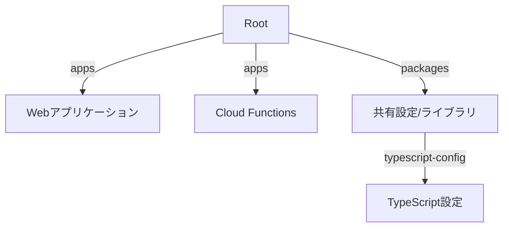

# プロジェクトアーキテクチャと設計方針

## プロジェクト構成

### モノレポ構造

### 技術スタック選択理由

#### パッケージマネージャー

- bunを採用：高速な実行速度と依存関係の管理効率化
- Workspaces機能：モノレポ構成の効率的な管理
- Turbo：ビルドシステムの最適化と並列処理

#### フレームワークとコア技術

- Next.js: App Routerによるサーバーコンポーネントの活用
- React: 堅牢なUIコンポーネント管理
- TypeScript: 型安全性の確保と開発体験の向上

#### 開発ツールチェーン

- Biome: 高速な統合開発ツール
  - リンター・フォーマッターの統合
  - TypeScriptのサポート
- CSpell: 一貫した命名規則の維持
- markdownlint-cli2: Markdownの一貫性確保
  - 標準化されたMarkdownスタイル
- Turbo: モノレポのビルド最適化

## アーキテクチャ設計

### フロントエンド設計原則

1. **コンポーネントの分離**
   - 純粋なプレゼンテーションコンポーネント
   - ビジネスロジックを含むコンテナコンポーネント
   - 共有可能なUIコンポーネント

2. **状態管理**
   - サーバーコンポーネントの優先使用
   - クライアント状態の最小化
   - 必要な場合のみのクライアントコンポーネント化

3. **パフォーマンス最適化**
   - 適切なキャッシュ戦略
   - 動的インポートの活用
   - 画像最適化の徹底

### バックエンド設計原則

1. **クラウドファースト**
   - サーバーレスアーキテクチャの採用
   - マイクロサービス指向の設計
   - 環境に応じた柔軟なスケーリング

2. **セキュリティ設計**
   - ゼロトラストアーキテクチャの採用
   - 最小権限の原則
   - 定期的なセキュリティ監査

### データ設計

1. **データモデル**
   - 明確な型定義
   - 効率的なデータ構造
   - スキーマ駆動開発

2. **API設計**
   - RESTful原則の遵守
   - 型安全なAPI通信
   - 適切なエラーハンドリング

## コード品質管理

### テスト戦略

1. **ユニットテスト**
   - コンポーネントの単体テスト
   - ビジネスロジックのテスト
   - 高いカバレッジの維持

2. **統合テスト**
   - APIエンドポイントのテスト
   - データフローの検証
   - エッジケースの確認

3. **E2Eテスト**
   - 重要なユーザーフローのテスト
   - クロスブラウザテスト
   - パフォーマンステスト

### コード品質メトリクス

1. **静的解析**
   - Biomeによる一貫したコードスタイル
   - 複雑度の管理
   - markdownlintによるドキュメント品質の確保
   - 技術的負債の監視

2. **パフォーマンス指標**
   - Webバイタルの監視
   - バンドルサイズの管理
   - レンダリングパフォーマンス

## 継続的改善

### モニタリング

1. **アプリケーション監視**
   - エラー追跡
   - パフォーマンスメトリクス
   - ユーザー行動分析

2. **インフラ監視**
   - リソース使用率
   - コスト最適化
   - セキュリティアラート

### 最適化計画

1. **技術的負債の管理**
   - 定期的なコードレビュー
   - リファクタリング計画
   - アーキテクチャの見直し

2. **開発者体験の向上**
   - ツールチェーンの最適化
   - ドキュメントの継続的な改善
   - フィードバックループの確立
