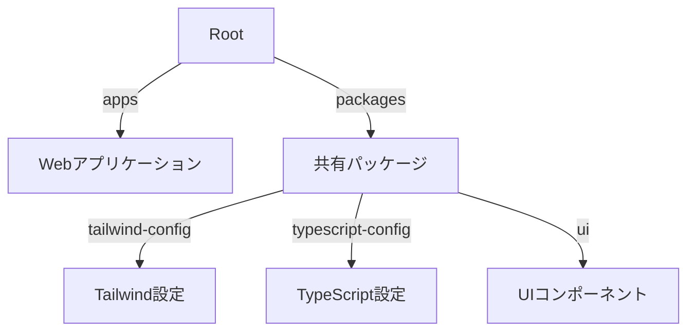

# プロジェクトアーキテクチャと設計方針

## モノレポ構造

## 技術スタック

- **パッケージマネージャー**: bun（高速実行、効率的依存管理、Workspaces機能）
- **フレームワーク**: Next.js（App Router活用）、React、TypeScript
- **開発ツール**: Biome（リンター・フォーマッター統合）、CSpell、Turbo

## 設計原則

### フロントエンド

- コンポーネント分離（プレゼンテーション/コンテナ/共有UI）
  - **共有UI**: shadcn/ui をベースに構築し、Storybook でカタログ化・テストを行う。
- サーバーコンポーネント優先、クライアント状態最小化
- パフォーマンス最適化（キャッシュ戦略、動的インポート、画像最適化）

### バックエンド

- クラウドファースト（サーバーレス、マイクロサービス指向）
- セキュリティ設計（ゼロトラスト、最小権限原則、定期監査）
- データ設計（明確な型定義、効率的なデータ構造）
- API設計（RESTful原則、型安全、適切なエラーハンドリング）

## コード品質管理

- **テスト戦略**: ユニットテスト（コンポーネント単体、ビジネスロジック）、統合テスト（API、データフロー）、E2Eテスト（ユーザーフロー、クロスブラウザ）
- **品質メトリクス**: 静的解析（Biome、複雑度管理、技術的負債監視）、パフォーマンス指標（Webバイタル、バンドルサイズ）

## 継続的改善

- **モニタリング**: アプリケーション監視（エラー追跡、パフォーマンス、ユーザー行動）、インフラ監視（リソース使用率、コスト、セキュリティ）
- **最適化計画**: 技術的負債管理（定期レビュー、リファクタリング）、開発者体験向上（ツール最適化、ドキュメント改善）

## 開発プロセス

- **GitHub Flow採用**: メインブランチは`main`、機能開発・バグ修正は専用ブランチ
- **ブランチ命名規則**: `feature/機能名`、`fix/バグ名`、`docs/内容`、`refactor/内容`

最終更新日: 2025年4月7日
