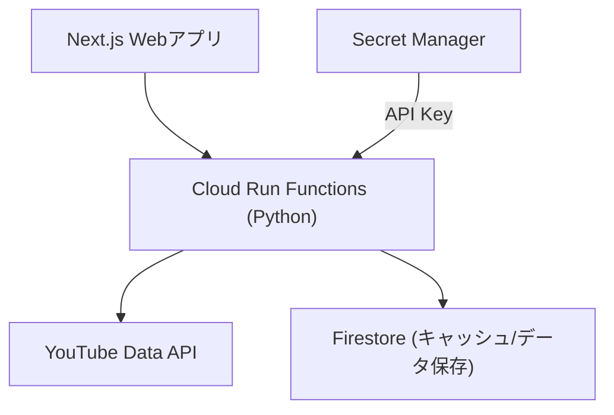

# YouTube Data API連携用Cloud Run Functions実装計画

このドキュメントは、YouTube Data API連携のためのPython版Cloud Run Functionsを実装するプルリクエストの計画を記載します。

## 目的

GCP設計書に基づき、YouTube Data APIにアクセスするCloud Run Functions (Python)を実装し、Webアプリケーションから利用可能なAPIエンドポイントを提供します。

## 実装概要



## ディレクトリ構造

以下のディレクトリとファイル構造を作成します：

```
apps/functions-python/
├── pyproject.toml           # プロジェクト設定
├── requirements.txt         # 依存パッケージ一覧
├── .python-version          # Python 3.12を指定
├── src/
│   ├── main.py              # エントリーポイント
│   ├── api/                 # API関数
│   │   ├── youtube.py       # YouTube関連API
│   │   └── hello.py         # 動作確認用サンプルAPI
│   ├── lib/                 # ライブラリ
│   │   └── youtube_api.py   # YouTube API操作用ライブラリ
│   └── utils/               # ユーティリティ
│       └── error_handler.py # エラーハンドリング
└── test/                    # テスト
    └── test_youtube_api.py  # テストコード
```

## 主要ファイルの内容

### pyproject.toml

```toml
[build-system]
requires = ["setuptools>=61.0"]
build-backend = "setuptools.build_meta"

[project]
name = "functions-python"
version = "0.1.0"
authors = [
    {name = "suzumina.click Team", email = "your.email@example.com"},
]
description = "Python Cloud Functions for suzumina.click - YouTube API integration"
requires-python = ">=3.12"
dependencies = [
    "functions-framework==3.5.0",
    "google-api-python-client==2.124.0",
    "google-auth==2.34.0",
    "google-cloud-secret-manager==2.22.0",
    "google-cloud-firestore==2.15.0",
]

[project.optional-dependencies]
dev = [
    "ruff==0.4.3",
    "pytest==8.0.0",
]

[tool.ruff]
line-length = 88
target-version = "py312"
```

### requirements.txt

```
functions-framework==3.5.0
google-api-python-client==2.124.0
google-auth==2.34.0
google-cloud-secret-manager==2.22.0
google-cloud-firestore==2.15.0
```

### .python-version

```
3.12.0
```

### main.py

```python
import functions_framework
import json
from src.api.youtube import get_channel_info, get_latest_videos, get_video_details, search_videos
from src.api.hello import hello
from src.utils.error_handler import handle_error

@functions_framework.http
def main(request):
    """Cloud Function entry point that routes to the appropriate API function."""
    try:
        path = request.path.strip('/').lower()
        
        # API ルーティング
        if path == 'api/hello' or path == 'hello':
            return hello(request)
            
        elif path == 'api/youtube/channel':
            return get_channel_info(request)
            
        elif path == 'api/youtube/videos':
            return get_latest_videos(request)
            
        elif path.startswith('api/youtube/video/'):
            video_id = path.split('/')[-1]
            return get_video_details(request, video_id)
            
        elif path == 'api/youtube/search':
            return search_videos(request)
            
        else:
            return json.dumps({
                'error': 'Not Found',
                'message': f'No API endpoint found for path: {path}'
            }), 404, {'Content-Type': 'application/json'}
            
    except Exception as e:
        return handle_error(e)
```

### api/youtube.py

```python
import json
from flask import Request
from google.cloud import firestore
import datetime
from src.lib.youtube_api import YouTubeAPI

# Firestoreクライアント
db = firestore.Client()

def get_channel_info(request: Request):
    """
    チャンネル情報を取得するAPIエンドポイント
    
    クエリパラメータ:
        channel_id: YouTubeチャンネルID
    """
    channel_id = request.args.get('channel_id')
    if not channel_id:
        return json.dumps({
            'error': 'Bad Request',
            'message': 'Missing required parameter: channel_id'
        }), 400, {'Content-Type': 'application/json'}
    
    # Firestoreからキャッシュを確認
    cache_ref = db.collection('cache').document(f'channel_{channel_id}')
    cache_doc = cache_ref.get()
    
    # 24時間以内のキャッシュがあれば、それを返す
    if cache_doc.exists:
        cache_data = cache_doc.to_dict()
        cache_time = cache_data.get('timestamp', None)
        if cache_time and (datetime.datetime.now() - cache_time).total_seconds() < 86400:  # 24時間
            return json.dumps(cache_data['data']), 200, {'Content-Type': 'application/json'}
    
    # キャッシュがないか古い場合はAPIから取得
    youtube = YouTubeAPI()
    try:
        channel_info = youtube.get_channel_info(channel_id)
        
        # Firestoreにキャッシュを保存
        cache_ref.set({
            'data': channel_info,
            'timestamp': datetime.datetime.now()
        })
        
        return json.dumps(channel_info), 200, {'Content-Type': 'application/json'}
    except Exception as e:
        return json.dumps({
            'error': 'API Error',
            'message': str(e)
        }), 500, {'Content-Type': 'application/json'}

def get_latest_videos(request: Request):
    """
    最新の動画一覧を取得するAPIエンドポイント
    
    クエリパラメータ:
        channel_id: YouTubeチャンネルID
        max_results: 取得する動画の最大数（デフォルト10、最大50）
    """
    channel_id = request.args.get('channel_id')
    if not channel_id:
        return json.dumps({
            'error': 'Bad Request',
            'message': 'Missing required parameter: channel_id'
        }), 400, {'Content-Type': 'application/json'}
    
    max_results = request.args.get('max_results', '10')
    try:
        max_results = int(max_results)
        max_results = min(max(1, max_results), 50)  # 1～50の範囲に制限
    except ValueError:
        max_results = 10
    
    # Firestoreからキャッシュを確認
    cache_ref = db.collection('cache').document(f'videos_{channel_id}')
    cache_doc = cache_ref.get()
    
    # 1時間以内のキャッシュがあれば、それを返す
    if cache_doc.exists:
        cache_data = cache_doc.to_dict()
        cache_time = cache_data.get('timestamp', None)
        if cache_time and (datetime.datetime.now() - cache_time).total_seconds() < 3600:  # 1時間
            videos = cache_data.get('data', [])
            return json.dumps(videos[:max_results]), 200, {'Content-Type': 'application/json'}
    
    # キャッシュがないか古い場合はAPIから取得
    youtube = YouTubeAPI()
    try:
        videos = youtube.get_latest_videos(channel_id, max_results)
        
        # Firestoreにキャッシュを保存
        cache_ref.set({
            'data': videos,
            'timestamp': datetime.datetime.now()
        })
        
        return json.dumps(videos), 200, {'Content-Type': 'application/json'}
    except Exception as e:
        return json.dumps({
            'error': 'API Error',
            'message': str(e)
        }), 500, {'Content-Type': 'application/json'}

def get_video_details(request: Request, video_id: str):
    """
    特定の動画の詳細情報を取得するAPIエンドポイント
    
    パスパラメータ:
        video_id: YouTube動画ID
    """
    if not video_id:
        return json.dumps({
            'error': 'Bad Request',
            'message': 'Missing required parameter: video_id'
        }), 400, {'Content-Type': 'application/json'}
    
    # Firestoreからキャッシュを確認
    cache_ref = db.collection('cache').document(f'video_{video_id}')
    cache_doc = cache_ref.get()
    
    # 1時間以内のキャッシュがあれば、それを返す
    if cache_doc.exists:
        cache_data = cache_doc.to_dict()
        cache_time = cache_data.get('timestamp', None)
        if cache_time and (datetime.datetime.now() - cache_time).total_seconds() < 3600:  # 1時間
            return json.dumps(cache_data['data']), 200, {'Content-Type': 'application/json'}
    
    # キャッシュがないか古い場合はAPIから取得
    youtube = YouTubeAPI()
    try:
        video_details = youtube.get_video_details(video_id)
        
        # Firestoreにキャッシュを保存
        cache_ref.set({
            'data': video_details,
            'timestamp': datetime.datetime.now()
        })
        
        return json.dumps(video_details), 200, {'Content-Type': 'application/json'}
    except Exception as e:
        return json.dumps({
            'error': 'API Error',
            'message': str(e)
        }), 500, {'Content-Type': 'application/json'}

def search_videos(request: Request):
    """
    動画を検索するAPIエンドポイント
    
    クエリパラメータ:
        query: 検索キーワード
        max_results: 取得する動画の最大数（デフォルト10、最大50）
    """
    query = request.args.get('query')
    if not query:
        return json.dumps({
            'error': 'Bad Request',
            'message': 'Missing required parameter: query'
        }), 400, {'Content-Type': 'application/json'}
    
    max_results = request.args.get('max_results', '10')
    try:
        max_results = int(max_results)
        max_results = min(max(1, max_results), 50)  # 1～50の範囲に制限
    except ValueError:
        max_results = 10
    
    # Firestoreからキャッシュを確認（検索はクエリごとにキャッシュ）
    cache_ref = db.collection('cache').document(f'search_{query.replace(" ", "_")}')
    cache_doc = cache_ref.get()
    
    # 30分以内のキャッシュがあれば、それを返す
    if cache_doc.exists:
        cache_data = cache_doc.to_dict()
        cache_time = cache_data.get('timestamp', None)
        if cache_time and (datetime.datetime.now() - cache_time).total_seconds() < 1800:  # 30分
            videos = cache_data.get('data', [])
            return json.dumps(videos[:max_results]), 200, {'Content-Type': 'application/json'}
    
    # キャッシュがないか古い場合はAPIから取得
    youtube = YouTubeAPI()
    try:
        search_results = youtube.search_videos(query, max_results)
        
        # Firestoreにキャッシュを保存
        cache_ref.set({
            'data': search_results,
            'timestamp': datetime.datetime.now()
        })
        
        return json.dumps(search_results), 200, {'Content-Type': 'application/json'}
    except Exception as e:
        return json.dumps({
            'error': 'API Error',
            'message': str(e)
        }), 500, {'Content-Type': 'application/json'}
```

### api/hello.py

```python
import json
from flask import Request

def hello(request: Request):
    """
    シンプルな動作確認用APIエンドポイント
    """
    return json.dumps({
        'message': 'Hello from Python Cloud Functions!',
        'service': 'suzumina.click YouTube API'
    }), 200, {'Content-Type': 'application/json'}
```

### lib/youtube_api.py

```python
from googleapiclient.discovery import build
from google.cloud import secretmanager
import datetime

class YouTubeAPI:
    """YouTube Data API v3へのアクセスを管理するクラス"""
    
    def __init__(self):
        """
        YouTubeAPI クライアントを初期化
        Secret Managerから認証情報を取得して接続を確立
        """
        self.youtube = self._get_youtube_service()
    
    def _get_youtube_service(self):
        """YouTube Data API サービスを取得"""
        # Secret Managerから認証情報を取得
        client = secretmanager.SecretManagerServiceClient()
        name = f"projects/suzumina-click-dev/secrets/youtube-api-key/versions/latest"
        response = client.access_secret_version(request={"name": name})
        api_key = response.payload.data.decode("UTF-8")
        
        # YouTube APIサービスを構築
        return build('youtube', 'v3', developerKey=api_key)
    
    def get_channel_info(self, channel_id):
        """
        指定されたチャンネルIDの情報を取得
        
        Args:
            channel_id (str): YouTubeチャンネルID
            
        Returns:
            dict: チャンネル情報
        """
        request = self.youtube.channels().list(
            part="snippet,contentDetails,statistics",
            id=channel_id
        )
        response = request.execute()
        
        if not response.get('items'):
            raise ValueError(f"Channel not found: {channel_id}")
        
        channel = response['items'][0]
        return {
            'id': channel['id'],
            'title': channel['snippet']['title'],
            'description': channel['snippet']['description'],
            'thumbnail': channel['snippet']['thumbnails']['high']['url'],
            'subscriberCount': int(channel['statistics'].get('subscriberCount', 0)),
            'viewCount': int(channel['statistics'].get('viewCount', 0)),
            'videoCount': int(channel['statistics'].get('videoCount', 0)),
            'uploadsPlaylistId': channel['contentDetails']['relatedPlaylists']['uploads']
        }
    
    def get_latest_videos(self, channel_id, max_results=10):
        """
        指定されたチャンネルIDの最新動画を取得
        
        Args:
            channel_id (str): YouTubeチャンネルID
            max_results (int): 取得する動画の最大数（最大50）
            
        Returns:
            list: 動画情報のリスト
        """
        # まずチャンネルのアップロードプレイリストIDを取得
        channel_response = self.youtube.channels().list(
            part="contentDetails",
            id=channel_id
        ).execute()
        
        if not channel_response.get('items'):
            raise ValueError(f"Channel not found: {channel_id}")
        
        uploads_playlist_id = channel_response['items'][0]['contentDetails']['relatedPlaylists']['uploads']
        
        # プレイリストから動画を取得
        playlist_response = self.youtube.playlistItems().list(
            part="snippet,contentDetails",
            playlistId=uploads_playlist_id,
            maxResults=max_results
        ).execute()
        
        return [self._format_video_info(item) for item in playlist_response.get('items', [])]
    
    def get_video_details(self, video_id):
        """
        指定された動画IDの詳細情報を取得
        
        Args:
            video_id (str): YouTube動画ID
            
        Returns:
            dict: 動画の詳細情報
        """
        video_response = self.youtube.videos().list(
            part="snippet,contentDetails,statistics",
            id=video_id
        ).execute()
        
        if not video_response.get('items'):
            raise ValueError(f"Video not found: {video_id}")
        
        video = video_response['items'][0]
        return {
            'id': video['id'],
            'title': video['snippet']['title'],
            'description': video['snippet']['description'],
            'publishedAt': video['snippet']['publishedAt'],
            'channelId': video['snippet']['channelId'],
            'channelTitle': video['snippet']['channelTitle'],
            'thumbnail': video['snippet']['thumbnails']['high']['url'],
            'duration': video['contentDetails']['duration'],
            'viewCount': int(video['statistics'].get('viewCount', 0)),
            'likeCount': int(video['statistics'].get('likeCount', 0)),
            'commentCount': int(video['statistics'].get('commentCount', 0)),
        }
    
    def search_videos(self, query, max_results=10):
        """
        キーワードに基づいて動画を検索
        
        Args:
            query (str): 検索キーワード
            max_results (int): 取得する検索結果の最大数（最大50）
            
        Returns:
            list: 検索結果のリスト
        """
        search_response = self.youtube.search().list(
            q=query,
            part="snippet",
            type="video",
            maxResults=max_results
        ).execute()
        
        return [self._format_search_result(item) for item in search_response.get('items', [])]
    
    def _format_video_info(self, item):
        """プレイリストアイテムを標準フォーマットに変換"""
        snippet = item['snippet']
        return {
            'id': item['contentDetails']['videoId'],
            'title': snippet['title'],
            'description': snippet['description'],
            'publishedAt': snippet['publishedAt'],
            'thumbnail': snippet['thumbnails']['high']['url'],
            'channelId': snippet['channelId'],
            'channelTitle': snippet['channelTitle'],
        }
    
    def _format_search_result(self, item):
        """検索結果を標準フォーマットに変換"""
        snippet = item['snippet']
        return {
            'id': item['id']['videoId'],
            'title': snippet['title'],
            'description': snippet['description'],
            'publishedAt': snippet['publishedAt'],
            'thumbnail': snippet['thumbnails']['high']['url'],
            'channelId': snippet['channelId'],
            'channelTitle': snippet['channelTitle'],
        }
```

### utils/error_handler.py

```python
import json
import traceback
import logging

def handle_error(error):
    """
    APIエラーの標準ハンドラー
    
    Args:
        error: 発生した例外
        
    Returns:
        tuple: (レスポンス本文, ステータスコード, ヘッダー)
    """
    logging.error(f"Error: {str(error)}")
    logging.error(traceback.format_exc())
    
    if isinstance(error, ValueError):
        return json.dumps({
            'error': 'Bad Request',
            'message': str(error)
        }), 400, {'Content-Type': 'application/json'}
    
    return json.dumps({
        'error': 'Internal Server Error',
        'message': str(error)
    }), 500, {'Content-Type': 'application/json'}
```

### test/test_youtube_api.py

```python
import unittest
from unittest.mock import patch, MagicMock
import sys
import os

# テスト対象のモジュールへのパスを追加
sys.path.append(os.path.abspath(os.path.join(os.path.dirname(__file__), '..')))

from src.lib.youtube_api import YouTubeAPI

class TestYoutubeAPI(unittest.TestCase):
    
    @patch('src.lib.youtube_api.build')
    @patch('src.lib.youtube_api.secretmanager.SecretManagerServiceClient')
    def setUp(self, mock_secret_manager, mock_build):
        # Secret Managerからの応答をモック
        mock_secret_version = MagicMock()
        mock_secret_version.payload.data.decode.return_value = "test-api-key"
        mock_secret_client = MagicMock()
        mock_secret_client.access_secret_version.return_value = mock_secret_version
        mock_secret_manager.return_value = mock_secret_client
        
        # YouTube API buildをモック
        self.mock_youtube = MagicMock()
        mock_build.return_value = self.mock_youtube
        
        # テスト対象のインスタンスを作成
        self.api = YouTubeAPI()
    
    def test_get_channel_info(self):
        # YouTube API応答のモック
        mock_list = MagicMock()
        mock_execute = MagicMock()
        mock_execute.execute.return_value = {
            'items': [{
                'id': 'test-channel-id',
                'snippet': {
                    'title': 'Test Channel',
                    'description': 'A test channel',
                    'thumbnails': {'high': {'url': 'http://example.com/thumb.jpg'}}
                },
                'statistics': {
                    'subscriberCount': '1000',
                    'viewCount': '10000',
                    'videoCount': '100'
                },
                'contentDetails': {
                    'relatedPlaylists': {'uploads': 'test-playlist-id'}
                }
            }]
        }
        mock_list.list.return_value = mock_execute
        self.mock_youtube.channels.return_value = mock_list
        
        # メソッドを実行
        result = self.api.get_channel_info('test-channel-id')
        
        # アサーション
        self.assertEqual(result['id'], 'test-channel-id')
        self.assertEqual(result['title'], 'Test Channel')
        self.assertEqual(result['subscriberCount'], 1000)
        self.assertEqual(result['uploadsPlaylistId'], 'test-playlist-id')
        
        # API呼び出しパラメータの確認
        self.mock_youtube.channels.return_value.list.assert_called_once_with(
            part="snippet,contentDetails,statistics",
            id='test-channel-id'
        )
    
    def test_get_latest_videos(self):
        # Channel API応答のモック
        mock_channel_list = MagicMock()
        mock_channel_execute = MagicMock()
        mock_channel_execute.execute.return_value = {
            'items': [{
                'contentDetails': {
                    'relatedPlaylists': {'uploads': 'test-playlist-id'}
                }
            }]
        }
        mock_channel_list.list.return_value = mock_channel_execute
        self.mock_youtube.channels.return_value = mock_channel_list
        
        # PlaylistItems API応答のモック
        mock_playlist_list = MagicMock()
        mock_playlist_execute = MagicMock()
        mock_playlist_execute.execute.return_value = {
            'items': [
                {
                    'snippet': {
                        'title': 'Test Video 1',
                        'description': 'Description 1',
                        'publishedAt': '2024-04-01T00:00:00Z',
                        'thumbnails': {'high': {'url': 'http://example.com/thumb1.jpg'}},
                        'channelId': 'test-channel-id',
                        'channelTitle': 'Test Channel'
                    },
                    'contentDetails': {'videoId': 'test-video-id-1'}
                }
            ]
        }
        mock_playlist_list.list.return_value = mock_playlist_execute
        self.mock_youtube.playlistItems.return_value = mock_playlist_list
        
        # メソッドを実行
        result = self.api.get_latest_videos('test-channel-id', 1)
        
        # アサーション
        self.assertEqual(len(result), 1)
        self.assertEqual(result[0]['id'], 'test-video-id-1')
        self.assertEqual(result[0]['title'], 'Test Video 1')
        
        # API呼び出しパラメータの確認
        self.mock_youtube.playlistItems.return_value.list.assert_called_once_with(
            part="snippet,contentDetails",
            playlistId='test-playlist-id',
            maxResults=1
        )

if __name__ == '__main__':
    unittest.main()
```

## テスト方法

ローカル開発環境では以下のコマンドでテストを実行します：

```bash
cd apps/functions-python
python -m pytest
```

ローカルでの実行には、以下のコマンドを使用します：

```bash
cd apps/functions-python
functions-framework --target=main --debug
```

## デプロイ方法

GitHub Actions CI/CDパイプラインで自動デプロイするか、以下のコマンドで手動デプロイできます：

```bash
cd apps/functions-python
gcloud functions deploy youtube-api \
  --gen2 \
  --runtime=python312 \
  --region=asia-northeast1 \
  --source=. \
  --entry-point=main \
  --trigger-http \
  --allow-unauthenticated
```

## 今後の展望

1. 認証機能の追加 - 本番環境ではアクセス制限を実装
2. キャッシュ戦略の最適化 - アクセスパターンに基づいて調整
3. モニタリングとロギングの強化 - 追加のメトリクスを収集
4. コメント取得APIの追加 - 動画コメントを取得・分析する機能
