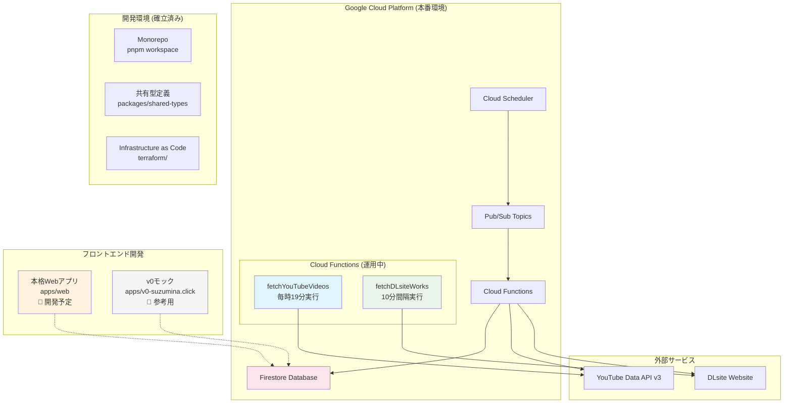
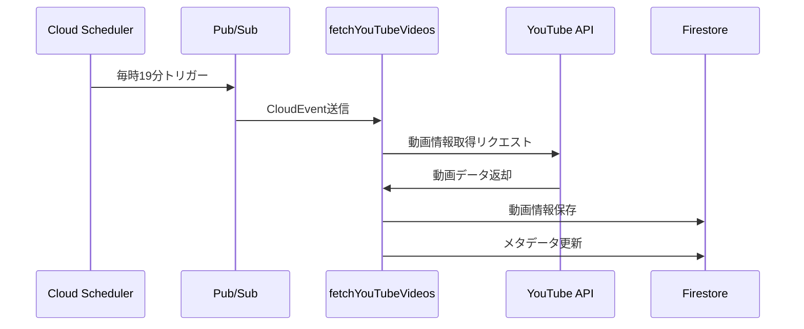
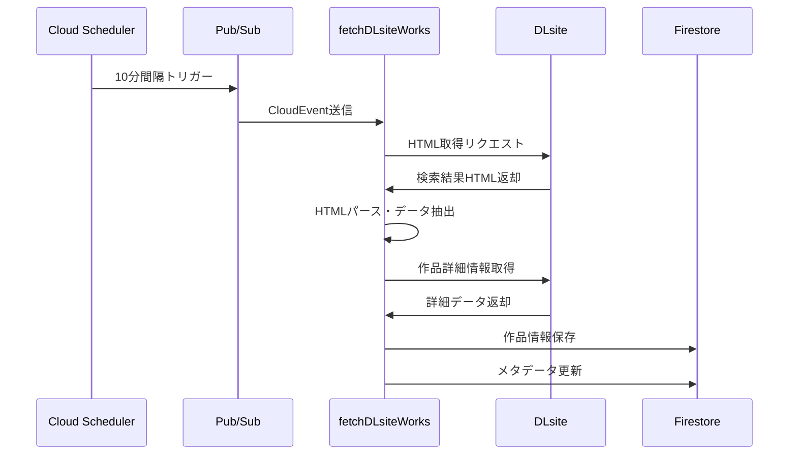

# suzumina.click

涼花みなせファンサイト - YouTube動画から音声ボタンを作成し、DLsite作品情報を表示するWebアプリケーション

## 🎯 プロジェクト概要

suzumina.clickは、VTuber「涼花みなせ」のファンコミュニティ向けWebサイトです。YouTube動画から音声ボタンを作成・共有し、DLsiteでの最新作品情報を確認できるプラットフォームを提供します。

### 現在の開発状況

**✅ 完了済み**
- **データ収集基盤**: YouTube動画・DLsite作品情報の自動取得システム
- **インフラ基盤**: Terraform によるGCPリソース管理
- **共有型定義**: Zodスキーマベースの型安全なデータ構造
- **開発環境**: Monorepo + 開発ツール整備

**🚧 開発中 (最重要)**
- **本格Webアプリケーション** (`apps/web`): 実用的なフロントエンド開発

**📝 参考**
- **v0モック** (`apps/v0-suzumina.click`): v0 by Vercelで作成した参考UI

### 計画中の主要機能

- **音声ボタン作成**: YouTube動画から特定の音声を切り出してボタン化
- **作品情報表示**: DLsiteの最新作品情報を自動取得・表示
- **検索・フィルタリング**: 音声ボタンと作品の詳細検索
- **レスポンシブUI**: デスクトップ・モバイル対応

## 🏗️ システムアーキテクチャ



## 🛠️ 技術スタック

### フロントエンド

- **Next.js 15.2.4** - React フレームワーク (App Router + Server Actions)
- **TypeScript 5.8.3** - 型安全性
- **Tailwind CSS** - UIスタイリング
- **Radix UI** - アクセシブルUIコンポーネント
- **React Hook Form + Zod** - フォーム管理と検証

### バックエンド

- **Google Cloud Functions (Node.js 22)** - サーバーレス関数
- **Google Cloud Firestore** - NoSQLデータベース
- **@google-cloud/firestore** - サーバーサイドFirestore接続 (apps/web用)
- **Google Cloud Pub/Sub** - 非同期メッセージング
- **Google Cloud Scheduler** - 定期実行タスク

### インフラ・DevOps

- **Terraform** - Infrastructure as Code
- **GitHub Actions** - CI/CD
- **pnpm** - パッケージマネージャ
- **Biome** - Linter/Formatter
- **Lefthook** - Git Hooks
- **Vitest** - テストフレームワーク

### 外部API

- **YouTube Data API v3** - 動画情報取得
- **DLsite** - Webスクレイピングによる作品情報取得

## 🏗️ 設計原則

### **Vercel準拠アーキテクチャ**
- **App Router**: Next.js 15 App Router による最新の構成
- **Server Actions**: ページと同じディレクトリに配置（コロケーション原則）
- **サーバーサイド優先**: `@google-cloud/firestore` による安全なデータアクセス

### **コロケーション設計**
```
app/works/
├── page.tsx          # 作品一覧ページ
├── actions.ts        # 作品関連Server Actions
├── loading.tsx       # ローディングUI
└── [id]/
    ├── page.tsx      # 作品詳細ページ
    └── actions.ts    # 詳細ページ用Actions
```

### **セキュリティ優先**
- **クライアント制限**: Firestore接続はサーバーサイドのみ
- **型安全性**: 共有型定義とZodスキーマによる検証
- **最小権限**: 必要最小限のクライアント状態管理

## 📁 プロジェクト構成

```
suzumina.click/
├── apps/
│   ├── functions/                 # Cloud Functions (バックエンド)
│   │   ├── src/
│   │   │   ├── dlsite.ts         # DLsite作品取得
│   │   │   ├── youtube.ts        # YouTube動画取得
│   │   │   ├── index.ts          # エントリーポイント
│   │   │   └── utils/            # 共通ユーティリティ
│   │   └── package.json
│   ├── web/                      # 本格Webアプリケーション (開発予定)
│   │   ├── src/
│   │   │   ├── app/             # Next.js App Router (Vercel準拠)
│   │   │   │   ├── globals.css  # グローバルスタイル
│   │   │   │   ├── layout.tsx   # ルートレイアウト
│   │   │   │   ├── works/       # 作品関連ページ・Actions
│   │   │   │   ├── videos/      # 動画関連ページ・Actions
│   │   │   │   └── search/      # 検索ページ・Actions
│   │   │   ├── components/      # 再利用可能コンポーネント
│   │   │   └── lib/             # 最小限のユーティリティ
│   │   ├── __tests__/           # テストファイル (Vercel推奨命名)
│   │   └── package.json
│   └── v0-suzumina.click/        # v0 by Vercel モック (参考用)
│       ├── app/                  # App Router (モック)
│       ├── components/           # モックコンポーネント
│       └── package.json
├── packages/
│   └── shared-types/             # 共有型定義
│       └── src/
│           ├── work.ts           # DLsite作品型
│           ├── video.ts          # YouTube動画型
│           └── common.ts         # 共通型
├── terraform/                    # インフラ定義
│   ├── function_*.tf             # Cloud Functions設定
│   ├── scheduler.tf              # 定期実行設定
│   └── variables.tf              # 変数定義
├── docs/                         # プロジェクトドキュメント
└── package.json                  # ワークスペース設定
```

## 🚀 クイックスタート

### 前提条件

- **Node.js 22+** (mise推奨)
- **pnpm 10+**
- **Google Cloud SDK**
- **Terraform 1.0+**

### セットアップ

```bash
# 1. リポジトリクローン
git clone https://github.com/your-org/suzumina.click.git
cd suzumina.click

# 2. 依存関係インストール
pnpm install

# 3. 共有型定義ビルド
pnpm --filter @suzumina.click/shared-types build

# 4. 環境変数設定
cp terraform/terraform.tfvars.example terraform/terraform.tfvars
# terraform.tfvars を編集してAPIキーなどを設定

# 5. インフラデプロイ (初回のみ)
cd terraform
terraform init
terraform apply

# 6. フロントエンド開発サーバー起動
cd ../apps/v0-suzumina.click
pnpm dev
```

### 開発コマンド

```bash
# テスト実行
pnpm test

# Lint + Format
pnpm check

# 全体ビルド
pnpm build

# Functions準備 (デプロイ前)
pnpm prepare:functions
```

## 🔄 データフロー

### 1. 動画情報取得フロー



### 2. 作品情報取得フロー



## 📊 主要データ構造

### YouTube動画データ

```typescript
interface FirestoreYouTubeVideoData {
  id: string;                    // 動画ID
  title: string;                 // タイトル
  description: string;           // 説明
  publishedAt: string;           // 公開日時
  thumbnailUrl: string;          // サムネイルURL
  duration: string;              // 再生時間
  viewCount: number;             // 再生回数
  likeCount?: number;            // 高評価数
  commentCount?: number;         // コメント数
  tags: string[];                // タグ
  channelId: string;             // チャンネルID
  lastFetchedAt: string;         // 最終取得日時
  createdAt: string;             // 作成日時
  updatedAt: string;             // 更新日時
}
```

### DLsite作品データ

```typescript
interface FirestoreDLsiteWorkData {
  id: string;                    // ドキュメントID
  productId: string;             // DLsite商品ID (RJ123456)
  title: string;                 // 作品タイトル
  circle: string;                // サークル名
  author: string[];              // 声優名
  category: WorkCategory;        // カテゴリ (SOU, ADV, etc.)
  workUrl: string;               // 作品ページURL
  thumbnailUrl: string;          // サムネイルURL
  price: PriceInfo;              // 価格情報
  rating?: RatingInfo;           // 評価情報
  salesCount?: number;           // 販売数
  tags: string[];                // タグ
  lastFetchedAt: string;         // 最終取得日時
  createdAt: string;             // 作成日時
  updatedAt: string;             // 更新日時
}
```

## 🔒 セキュリティ

- **Secret Manager**: APIキーやシークレットの安全な管理
- **IAM権限**: 最小権限原則に基づく権限設定
- **Firestore Rules**: データアクセス制御
- **CORS設定**: クロスオリジンリクエスト制御

## 📈 パフォーマンス最適化

- **Firestore インデックス**: クエリ最適化
- **Cloud Functions**: コールドスタート対策
- **Next.js**: SSG/ISR による高速レンダリング  
- **画像最適化**: Next.js Image コンポーネント

## 📝 開発ガイドライン

詳細な開発ガイドラインは以下を参照してください：

- [POLICY.md](./POLICY.md) - 開発ポリシーと設計原則
- [TODO.md](./TODO.md) - タスク管理とロードマップ
- [CHANGELOG.md](./CHANGELOG.md) - 変更履歴

## 🤝 コントリビューション

1. Issue作成またはDiscussionで提案
2. フォーク後、feature ブランチ作成
3. コード実装とテスト追加
4. Pull Request作成

## 📄 ライセンス

このプロジェクトはMITライセンスの下で公開されています。

## 🔗 関連リンク

- [涼花みなせ YouTubeチャンネル](https://www.youtube.com/@SuzukaMinase)
- [DLsite作品一覧](https://www.dlsite.com/maniax/fsr/=/language/jp/keyword_creater/涼花みなせ)
- [プロジェクトロードマップ](./TODO.md)
