# suzumina.click

涼花みなせファンサイト - YouTube動画から音声ボタンを作成し、DLsite作品情報を表示するWebアプリケーション

## 🎯 プロジェクト概要

suzumina.clickは、VTuber「涼花みなせ」のファンコミュニティ向けWebサイトです。YouTube動画から音声ボタンを作成・共有し、DLsiteでの最新作品情報を確認できるプラットフォームを提供します。

### 現在の開発状況

**✅ 完了済み**
- **データ収集基盤**: YouTube動画・DLsite作品情報の自動取得システム
- **インフラ基盤**: Terraform によるGCPリソース管理
- **共有型定義**: Zodスキーマベースの型安全なデータ構造
- **開発環境**: Monorepo + 開発ツール整備

**✅ 完了済み**
- **本格Webアプリケーション** (`apps/web`): Server Component + Client Component アーキテクチャ
- **ページネーション対応動画一覧**: 管理画面での動画表示機能
- **Storybook環境**: UIコンポーネント開発・テスト環境

**🚧 開発中**
- **音声ボタン機能**: YouTube動画からの音声抽出
- **DLsite作品表示**: 作品一覧・詳細ページ

**📝 参考**
- **v0モック** (`apps/v0-suzumina.click`): v0 by Vercelで作成した参考UI

### 計画中の主要機能

- **音声ボタン作成**: YouTube動画から特定の音声を切り出してボタン化
- **作品情報表示**: DLsiteの最新作品情報を自動取得・表示
- **検索・フィルタリング**: 音声ボタンと作品の詳細検索
- **レスポンシブUI**: デスクトップ・モバイル対応

## 🏗️ システムアーキテクチャ

```mermaid
graph TB
    subgraph "外部サービス"
        YT[YouTube Data API v3]
        DL[DLsite Website]
    end
    
    subgraph "Google Cloud Platform (本番環境)"
        CS[Cloud Scheduler<br/>定期実行] --> PS[Pub/Sub Topics<br/>非同期メッセージング]
        PS --> CF[Cloud Functions v2<br/>Node.js 22]
        CF --> FS[Firestore Database<br/>Native mode + 複合インデックス]
        CF --> YT
        CF --> DL
        
        subgraph "データ収集 (運用中)"
            CF1[fetchYouTubeVideos<br/>毎時19分実行<br/>512MB, 9分タイムアウト]
            CF2[fetchDLsiteWorks<br/>6,26,46分/時間実行<br/>512MB, 9分タイムアウト]
        end
        
        subgraph "音声処理 (将来実装)"
            CT[Cloud Tasks<br/>音声処理キュー] --> CRJ[Cloud Run Jobs<br/>Audio Processor<br/>4CPU, 16GB, 1時間]
            CRJ --> GCS[Cloud Storage<br/>音声ファイル保存<br/>ライフサイクル管理]
        end
        
        CF1 --> YT
        CF2 --> DL
        CF1 -.-> CT
        
        subgraph "セキュリティ・管理"
            SM[Secret Manager<br/>APIキー管理]
            IAM[IAM<br/>最小権限原則]
            MON[Cloud Monitoring<br/>ダッシュボード・アラート]
        end
        
        CF --> SM
    end
    
    subgraph "フロントエンド (本番運用中)"
        WEB[本格Webアプリ<br/>apps/web<br/>✅ Next.js 15 App Router]
        MOCK[v0モック<br/>apps/v0-suzumina.click<br/>📝 UIリファレンス]
        
        WEB --> FS
        WEB -.-> GCS
        MOCK -.-> FS
    end
    
    subgraph "開発・デプロイ環境"
        GA[GitHub Actions<br/>CI/CD + Workload Identity]
        AR[Artifact Registry<br/>Dockerコンテナ]
        TF[Terraform<br/>Infrastructure as Code]
        
        GA --> AR
        GA --> CF
        GA --> CRJ
    end
    
    style CF1 fill:#e1f5fe
    style CF2 fill:#e8f5e8
    style WEB fill:#e8f5e8
    style MOCK fill:#f5f5f5
    style FS fill:#fce4ec
    style CRJ fill:#fff3e0
    style CT fill:#f3e5f5
    style GCS fill:#e3f2fd
```



## 🛠️ 技術スタック

### フロントエンド

- **Next.js 15.3.3** - React フレームワーク (App Router)
- **React 19.1.0** - 最新React機能
- **TypeScript 5.8.3** - 型安全性
- **Tailwind CSS v4** - UIスタイリング (PostCSS設定)
- **Storybook 9.0.10** - UIコンポーネント開発・テスト
- **Radix UI** - アクセシブルUIコンポーネント (`packages/ui`)

### バックエンド・インフラ

- **Google Cloud Functions v2 (Node.js 22)** - サーバーレス関数 (YouTube/DLsite データ収集)
- **Google Cloud Run Jobs** - 重い計算処理 (音声抽出: 4CPU/16GB)
- **Google Cloud Firestore** - NoSQLデータベース (Native mode + 複合インデックス)
- **Google Cloud Storage** - ファイルストレージ (音声ファイル、デプロイアーティファクト)
- **Google Cloud Tasks** - タスクキューイング (音声処理の非同期実行)
- **Google Cloud Pub/Sub** - 非同期メッセージング (Scheduler → Functions)
- **Google Cloud Scheduler** - 定期実行タスク (毎時/20分間隔)
- **Google Secret Manager** - APIキー・シークレット管理
- **Google Artifact Registry** - Dockerコンテナレジストリ
- **Google Cloud Monitoring** - 監視ダッシュボード・アラート
- **@google-cloud/firestore** - サーバーサイドFirestore接続 (apps/web用)

### インフラ・DevOps

- **Terraform** - Infrastructure as Code (GCPリソース管理)
- **GitHub Actions** - CI/CDパイプライン (Workload Identity連携)
- **Google Cloud Build** - コンテナビルド・デプロイ
- **pnpm** - パッケージマネージャ (Workspaceサポート)
- **Biome** - Linter/Formatter
- **Lefthook** - Git Hooks
- **Vitest** - テストフレームワーク

### 外部API

- **YouTube Data API v3** - 動画情報取得
- **DLsite** - Webスクレイピングによる作品情報取得

## 🏗️ 設計原則

### **Next.js 15準拠アーキテクチャ**
- **App Router**: Next.js 15 App Router による最新の構成
- **Server Components**: データ取得・表示ロジック
- **Client Components**: インタラクション・ブラウザAPI使用
- **Server Actions**: ページと同じディレクトリに配置（コロケーション原則）
- **サーバーサイド優先**: `@google-cloud/firestore` による安全なデータアクセス

### **コロケーション設計**
```
app/works/
├── page.tsx          # 作品一覧ページ
├── actions.ts        # 作品関連Server Actions
├── loading.tsx       # ローディングUI
└── [id]/
    ├── page.tsx      # 作品詳細ページ
    └── actions.ts    # 詳細ページ用Actions
```

### **セキュリティ優先**
- **クライアント制限**: Firestore接続はサーバーサイドのみ
- **型安全性**: 共有型定義とZodスキーマによる検証
- **最小権限**: 必要最小限のクライアント状態管理

## 📁 プロジェクト構成

```
suzumina.click/
├── apps/
│   ├── functions/                 # Cloud Functions (バックエンド)
│   │   ├── src/
│   │   │   ├── dlsite.ts         # DLsite作品取得
│   │   │   ├── youtube.ts        # YouTube動画取得
│   │   │   ├── index.ts          # エントリーポイント
│   │   │   └── utils/            # 共通ユーティリティ
│   │   └── package.json
│   ├── web/                      # 本格Webアプリケーション (開発完了)
│   │   ├── src/
│   │   │   ├── app/             # Next.js App Router (Next.js 15準拠)
│   │   │   │   ├── globals.css  # グローバルスタイル
│   │   │   │   ├── layout.tsx   # ルートレイアウト
│   │   │   │   ├── page.tsx     # ホームページ
│   │   │   │   ├── actions.ts   # Server Actions
│   │   │   │   └── admin/videos/# 動画管理ページ (実装済み)
│   │   │   ├── components/      # UIコンポーネント
│   │   │   │   ├── VideoList.tsx    # 動画一覧 (Server Component)
│   │   │   │   ├── Pagination.tsx   # ページネーション (Client Component)
│   │   │   │   └── ThumbnailImage.tsx # サムネイル画像
│   │   │   └── lib/             # ユーティリティ
│   │   ├── .storybook/          # Web専用Storybook設定
│   │   └── package.json
│   └── v0-suzumina.click/        # v0 by Vercel モック (参考用)
│       ├── app/                  # App Router (モック)
│       ├── components/           # モックコンポーネント
│       └── package.json
├── packages/
│   ├── shared-types/             # 共有型定義
│   │   └── src/
│   │       ├── work.ts           # DLsite作品型
│   │       ├── video.ts          # YouTube動画型
│   │       └── common.ts         # 共通型
│   └── ui/                       # 共有UIコンポーネント
│       ├── src/components/       # Radix UIベースコンポーネント
│       ├── src/styles/           # Tailwind CSS v4設定
│       └── .storybook/           # UI専用Storybook設定
├── terraform/                    # インフラ定義
│   ├── function_*.tf             # Cloud Functions設定
│   ├── scheduler.tf              # 定期実行設定
│   └── variables.tf              # 変数定義
├── docs/                         # プロジェクトドキュメント
└── package.json                  # ワークスペース設定
```

## 🚀 クイックスタート

### 前提条件

- **Node.js 22+** (mise推奨)
- **pnpm 10+**
- **Google Cloud SDK**
- **Terraform 1.0+**

### セットアップ

```bash
# 1. リポジトリクローン
git clone https://github.com/your-org/suzumina.click.git
cd suzumina.click

# 2. 依存関係インストール
pnpm install

# 3. 共有型定義ビルド
pnpm --filter @suzumina.click/shared-types build

# 4. 環境変数設定
cp terraform/terraform.tfvars.example terraform/terraform.tfvars
# terraform.tfvars を編集してAPIキーなどを設定

# 5. インフラデプロイ (初回のみ)
cd terraform
terraform init
terraform apply

# 6. フロントエンド開発サーバー起動
cd ../apps/web
pnpm dev

# Storybook起動 (UIコンポーネント開発)
pnpm storybook
```

### 開発コマンド

```bash
# テスト実行
pnpm test

# Lint + Format
pnpm check

# 全体ビルド
pnpm build

# Functions準備 (デプロイ前)
pnpm prepare:functions
```

## 🔄 データフロー

### 1. 動画情報取得フロー

```mermaid
sequenceDiagram
    participant CS as Cloud Scheduler
    participant PS as Pub/Sub
    participant CF as fetchYouTubeVideos
    participant YT as YouTube API
    participant FS as Firestore
    
    CS->>PS: 毎時19分トリガー
    PS->>CF: CloudEvent送信
    CF->>YT: 動画情報取得リクエスト
    YT->>CF: 動画データ返却
    CF->>FS: 動画情報保存
    CF->>FS: メタデータ更新
```



### 2. 作品情報取得フロー

```mermaid
sequenceDiagram
    participant CS as Cloud Scheduler  
    participant PS as Pub/Sub
    participant CF as fetchDLsiteWorks
    participant DL as DLsite
    participant FS as Firestore
    
    CS->>PS: 10分間隔トリガー
    PS->>CF: CloudEvent送信
    CF->>DL: HTML取得リクエスト
    DL->>CF: 検索結果HTML返却
    CF->>CF: HTMLパース・データ抽出
    CF->>DL: 作品詳細情報取得
    DL->>CF: 詳細データ返却
    CF->>FS: 作品情報保存
    CF->>FS: メタデータ更新
```



## 📊 主要データ構造

### YouTube動画データ

```typescript
interface FirestoreYouTubeVideoData {
  id: string;                    // 動画ID
  title: string;                 // タイトル
  description: string;           // 説明
  publishedAt: string;           // 公開日時
  thumbnailUrl: string;          // サムネイルURL
  duration: string;              // 再生時間
  viewCount: number;             // 再生回数
  likeCount?: number;            // 高評価数
  commentCount?: number;         // コメント数
  tags: string[];                // タグ
  channelId: string;             // チャンネルID
  lastFetchedAt: string;         // 最終取得日時
  createdAt: string;             // 作成日時
  updatedAt: string;             // 更新日時
}
```

### DLsite作品データ

```typescript
interface FirestoreDLsiteWorkData {
  id: string;                    // ドキュメントID
  productId: string;             // DLsite商品ID (RJ123456)
  title: string;                 // 作品タイトル
  circle: string;                // サークル名
  author: string[];              // 声優名
  category: WorkCategory;        // カテゴリ (SOU, ADV, etc.)
  workUrl: string;               // 作品ページURL
  thumbnailUrl: string;          // サムネイルURL
  price: PriceInfo;              // 価格情報
  rating?: RatingInfo;           // 評価情報
  salesCount?: number;           // 販売数
  tags: string[];                // タグ
  lastFetchedAt: string;         // 最終取得日時
  createdAt: string;             // 作成日時
  updatedAt: string;             // 更新日時
}
```

## 🔒 セキュリティ

- **Secret Manager**: APIキーやシークレットの安全な管理
- **IAM権限**: 最小権限原則に基づく権限設定
- **Firestore Rules**: データアクセス制御
- **CORS設定**: クロスオリジンリクエスト制御

## 📈 パフォーマンス最適化

- **Firestore インデックス**: クエリ最適化
- **Cloud Functions**: コールドスタート対策
- **Next.js**: SSG/ISR による高速レンダリング  
- **画像最適化**: Next.js Image コンポーネント

## 📝 開発ガイドライン

詳細な開発ガイドラインは以下を参照してください：

- [POLICY.md](./POLICY.md) - 開発ポリシーと設計原則
- [TODO.md](./TODO.md) - タスク管理とロードマップ
- [CHANGELOG.md](./CHANGELOG.md) - 変更履歴

## 🤝 コントリビューション

1. Issue作成またはDiscussionで提案
2. フォーク後、feature ブランチ作成
3. コード実装とテスト追加
4. Pull Request作成

## 📄 ライセンス

このプロジェクトはMITライセンスの下で公開されています。

## 🔗 関連リンク

- [涼花みなせ YouTubeチャンネル](https://www.youtube.com/@SuzukaMinase)
- [DLsite作品一覧](https://www.dlsite.com/maniax/fsr/=/language/jp/keyword_creater/涼花みなせ)
- [プロジェクトロードマップ](./TODO.md)
